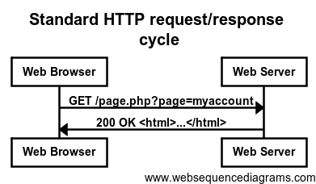

:slug: division-respuesta-http/
:description: Esta vulnerabilidad ocurre cuando la aplicación permite el envío de caracteres maliciosos, como los caracteres CRLF. Si aplicación permite la inserción de caracteres %0A y %0D, un atacante puede intentar engañar al navegador, enviando a través de la cabecera http múltiples respuestas falsificadas.
:keywords: Http, Inyección, Exploit, División de respuesta, Crlf, Encabezados
:subtitle: Dividiendo una respuesta usando CRLF
:date: 2019-03-04
:category: ataques
:tags: http, inyección, exploit, división de respuesta, crlf, encabezados
:image: cover.png
:alt: En la división de respuesta http, engañamos al navegador!
:author: Diana Osorio
:writer: dosorio
:name: Diana Osorio Quiroga
:about1: Estudiante de sistematización de datos U Distrital
:about2: Aprender cada día

= Divide y vencerás!

Para entender mejor el concepto de división de respuesta,
es necesario que entendamos,
qué es lo que ocurre cuando iniciamos una transacción +http+.
Al iniciar, el cliente enviará un petición a través del método +GET+ o +POST+
con la dirección +URL+ del objeto requerido.
Posteriormente el servidor devuelve un respuesta,
que consiste en un código de estado indicando
si la petición ha sido exitosa
y dependiendo de esto se muestra o no el objeto solicitado y
por ultimo la conexión es cerrada.

.Transacción http

Por ejemplo, cuando queremos elegir el lenguaje de un página web,
podemos encontrar un formulario que nos permite
seleccionar el lenguaje de nuestra preferencia.
Enviando a través de un parámetro el valor del lenguaje seleccionado
y realizando el procedimiento anteriormente descrito.

parámetro del lenguaje +lang+:

----
https://ejemplo.com/index.php?lang

----

Cuando el servidor nos responda con un código de estado correcto,
la pagina web nos redireccionará y
nos mostrara el contenido con el lenguaje seleccionado

+URL+ de direccionamiento:
----
https://ejemplo.com/index.php?lang=es

----

=== Vulnerabilidad:

Si notamos que la pagina web no limpia correctamente
los caracteres enviados, podemos cambiar el valor del
parámetro +lang+ de la anterior +URL+
y por ejemplo agregar caracteres
+CRLF+ (_carriage return_ y _line break_) que nos permitirán
manipular aspectos de la petición. Pero, ¿esto para qué?.
Debido a que +CRLF+ permite que un servidor pueda reconocer
cuando comienza y cuando termina un encabezado;
un atacante puede falsificar este proceso y agregar
encabezados de respuesta al +URL+, para engañar al navegador
y que trate las respuestas falsificadas como si fueran legítimas.

Para entender mejor este proceso, veamos un ejemplo.

A continuación se muestra un ejemplo de división de respuesta,
en el que un atacante engaña a la aplicación web
falsificando una respuesta y haciendo que el navegador
las tome como dos respuestas y muestre el contenido
de la segunda respuesta.

----
Content-Length: 0  // indica el final de una respuesta

HTTP/1.1 200 OK    // inicio de una nueva respuesta
Content-Type: text/html
Content-Length: 34
<html>></html>
----

Ahora se deben ingresar estos datos en el parámetro +lang+

----
https://ejemplo.com/index.php?lang=es%0AContent-Length%3A%200%0AHTTP%2F1.
1%20200%20OK%0AContent-Type%3A%20text%2Fhtml%0AContent-Length%3A%2034%
0A%3Chtml%3E%3Cscript%3Ealert(%22Test%22)%3C%2Fscript%3E%3E%3C%2Fhtml%3E
----

Y de esta manera el navegador nos mostrará una ventana de alerta
con el mensaje +Test+, dando por finalizada la explotación de
esta vulnerabilidad.

=== Consecuencias:

Como el lector habrá podido suponer, este tipo de vulnerabilidad
provee un medio para que se puedan realizar diferentes ataques,
lo que quiere decir es que la correcta explotación de esta vulnerabilidad
puede llevar a la explotación de otras vulnerabilidades,
como: +xss+, +envenenamiento de caché+, +divulgación de usuarios+, etc.

=== ¿Cómo nos protegemos?

Para evitar ser víctimas de este ataque
es importante que no se confíe en los datos de entrada
de los usuarios, se deben validar todos los datos
de entrada y de salida. La aplicación debe verificar que no se
incluyan los caracteres +%0A+ +%0D+ y ninguna de sus codificaciones.

=== Referencias

. [[r1]] link:https://blog.elevenpaths.com/2014/11/http-response-splitting.html/[HTTP response splitting].
. [[r2]] link:http://neo.lcc.uma.es/evirtual/cdd/tutorial/aplicacion/http.html[Protocolo http]
. [[r3]] link:https://www.owasp.org/index.php/HTTP_Response_Splitting[OWASP http response splitting]
. [[r4]] link:https://www.netsparker.com/blog/web-security/crlf-http-header/[Injection CRLF]
