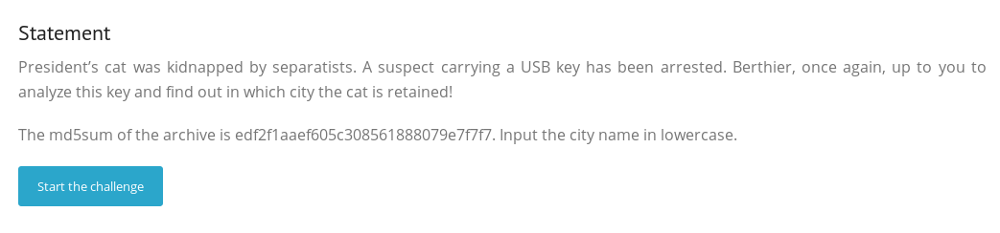
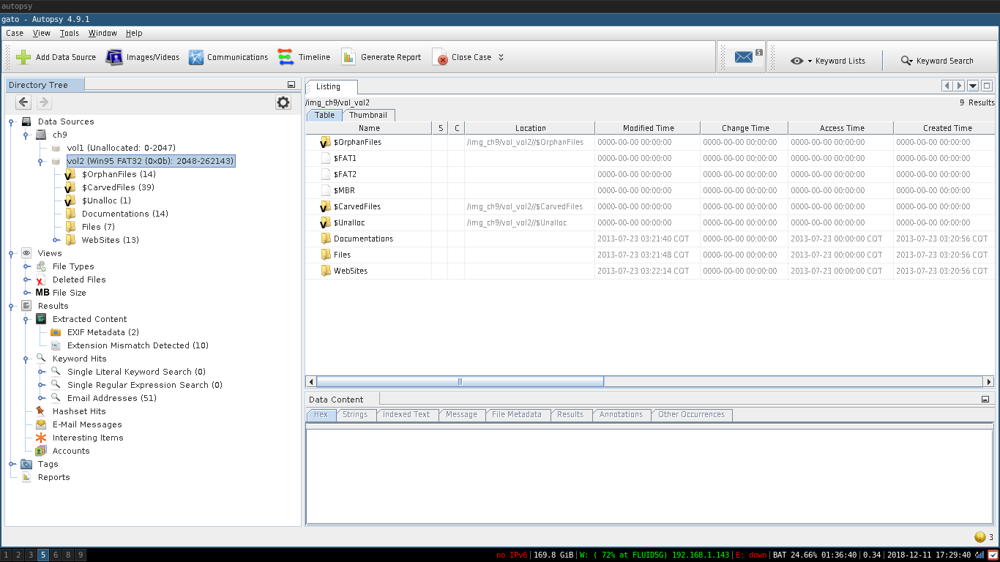
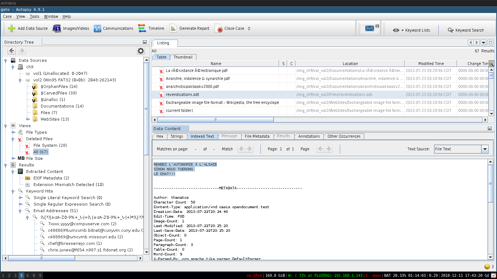
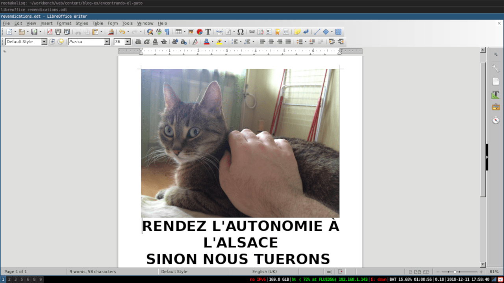
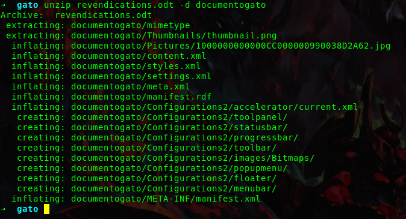
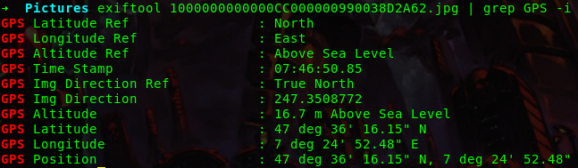
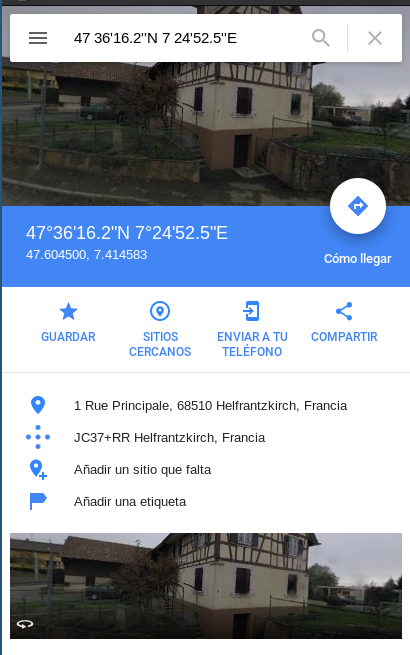

:slug: encontrando-el-gato/
:date: 2018-12-12
:category: retos
:subtitle: Cómputo Forense 101 - Solución al reto de root-me.org
:tags: solucionar, reto, herramienta, forense, investigación, digital, carving
:image: csi-cyber.png
:alt: Imagen de CSI Cyber
:description: Los archivos con los que trabajamos día a día son mucho más de lo que parecen a simple vista. En éste artículo veremos algunas técnicas y herramientas que nos permitirán extraer de ellos información útil que difícilmente habríamos imaginado, y resolveremos el reto Find the Cat de root-me.org
:keywords: Herramientas, Autopsy, Forense, Imagen, Reto, Metadatos
:author: Simon Gomez
:writer: sgomezatfluid
:name: Simon Gomez Uribe
:about1: Ingeniero de Sistemas, Universidad EAFIT
:about2: Desarrollo, seguridad, videojuegos y música.

= Encontrando al gato

En los círculos tecnológicos
es recurrente burlarse de las clásicas escenas
en shows de detectives como +CSI+ o +Law and Order+,
donde se puede ver como por arte de magia
se hace zoom a una imagen de bajísima resolución
para observar con extrema nitidez un detalle en la lejanía.
Todos sabemos que ésto no es posible en el mundo real
(al menos no al nivel que se muestra en éstas series... por ahora);
pero, ¿cuánto podemos acercar una imagen en realidad
para encontrar información?
O mejor, ¿qué tan de cerca podemos observarla?

A continuación estudiaremos varias herramientas de cómputo forense
que pueden ayudarnos a encontrar información útil
en archivos que a simple vista pueden parecer inocuos,
y de paso rescataremos
al gato secuestrado del presidente,
resolviendo el reto +Find the Cat+ de link:http://root-me.org[Root-me].

.Ampliar y mejorar!
image::https://media.giphy.com/media/65Lb2FhmbuMGpt28QZ/giphy.gif[CSI]

== Find the Cat

Comenzamos el reto con un poco de contexto.
El gato del presidente ha sido secuestrado por separatistas,
y se arrestó a un sospechoso
con una memoria +USB+ en su posesión.
Nuestro trabajo es analizar ésta memoria
para, con un poco de suerte y un poco más de astucia y recursividad,
encontrar el paradero del minino presidencial.

.Enunciado del reto

Se nos proporciona un archivo comprimido,
que al descomprimir
nos arroja un archivo
llamado +ch9+ a secas,
sin extensión que nos de una pista
sobre con qué programa abrirlo
para comenzar nuestra investigación.

Es aquí donde viene nuestra primera herramienta forense.
+file+ es un comando incluido en la gran mayoría de distribuciones +GNU/Linux+
y +MacOS+ que nos mostrará el tipo del archivo que le pasemos,
además de alguna información extra
sobre éste si está disponible.
Para usarlo basta con escribir en nuestra terminal el comando

.Averiguando tipo de archivo
[source, bash, linenums]
----
file nombre_de_archivo
----

.Corriendo file sobre el archivo del reto
image::file.png[File]

Como podemos ver,
el archivo resulta ser una imagen de disco
con una tabla de particiones tipo +MBR+.
Podríamos montarlo directamente en nuestro filesystem
para empezar a hurgar en su interior,
pero en ésta ocasión haremos algo mejor.

Entra link:http://www.sleuthkit.org[+TSK - The Sleuth Kit+],
una suite de herramientas forense
que nos facilitará enormemente la vida
como detectives digitales.
El proyecto +TSK+ incluye link:http://www.sleuthkit.org/autopsy/[+Autopsy+],
una interfaz gráfica
que permite usar todas sus herramientas fácilmente
en una presentación organizada y optimizada
para que lo único que nos ocupe
sea la investigación que nos concierne,
seamos técnicos o no.

.Pantalla principal de Autopsy, al abrir nuestra imagen

Después de abrir un nuevo caso y
añadir nuestra imagen como fuente de datos,
+Autopsy+ nos presentará los archivos que encontró,
y nos dará la posibilidad de filtrarlos por carpetas, tipo de archivo, archivos
eliminados, archivos que contienen direcciones de email, emails en sí,
entre muchas otras.
Además podemos crear nuestros propios filtros
para buscar información específica para nuestro caso.

== Tras las huellas: Data carving

Rebuscando un poco en los archivos recuperados,
vemos entre los eliminados uno que llama la atención.
Un documento llamado +revendications.odt+
que contiene un texto muy particular
que traducido reza:

[quote]
____
AUTONOMÍA EN L'ALSACE

DE LO CONTRARIO, MATAREMOS

EL GATO!!!!!!!!!
____

.Vaya mensaje

Suena como una nota escrita por los secuestradores.
¿Podrá ser ésta una pista
que nos acerque a nuestro maullante objetivo?

Para averiguarlo, vamos a extraer el archivo
para verlo en su formato original.
Para ésto le daremos +click derecho > extraer+,
lo guardaremos en la carpeta que +Autopsy+ creó para nuestro caso,
y lo abriremos con +LibreOffice+
(un programa de ofimática
con el que usualmente se abren los archivos +.odt+)

.El gato

El documento contiene nada menos que una foto del gato!
Ésta es una excelente noticia para nosotros,
no solo porque ahora sabemos que está vivo
sino porque, con un poco de suerte,
en ella está todo lo que necesitamos;
pero para poder examinarla minuciosamente
necesitaremos aislarla.
Para ésto nos aprovecharemos
de una característica del formato +.odt+,
que internamente es un archivo comprimido en +zip+.
Vamos a extraerlo para conseguir nuestra foto.

.Descomprimiendo el documento

Y ahí la tenemos.
Nuestro siguiente paso podría ser
tratar de identificar el entorno de la fotografía,
pero al ser un espacio cerrado
nuestras posibilidades de dar con él
serían extremadamente reducidas.
Así que usaremos otra estrategia.

Los metadatos +EXIF+ son datos que se guardan
junto con la mayoría de imágenes;
contienen información como fecha de la toma, velocidad del obturador,
balance de blancos, modelo de la cámara,
y en ocasiones,
la ubicación donde fue tomada.
Ésto último nos sería muy útil ahora mismo.

Nuestra siguiente herramienta será +exiftool+,
que nos servirá para extraer los metadatos EXIF de una imagen.
Para utilizarla y buscar sus datos de ubicación escribiremos

.Extrayendo EXIF
[source, bash, linenums]
----
exiftool nombredelarchivo | grep GPS.
----

.Eureka!

Lo logramos!
Por suerte, los secuestradores no fueron lo suficientemente cuidadosos
para limpiar los metadatos
de su prueba de vida.
Ahora sólo queda usar un servicio de geocoding inverso
para encontrar la dirección de éstas coordenadas.
Ésta vez usaremos link:https://maps.google.com[+Google Maps+].

.La ubicación de nuestro objetivo

Es así como logramos
obtener la ciudad donde tienen al gato
y resolver el reto.

Espero que éste artículo haya sido enriquecedor,
y que además de aprender algo de cómputo forense
haya servido como prueba
de que hay que ser siempre muy cuidadoso
con cómo disponemos de nuestros datos...
no vaya a ser que por un descuido
te encuentre quien menos quieres que lo haga.

== Referencias

. [[r1]] link:https://www.hackers-arise.com/single-post/2016/10/10/Digital-Forensics-Part-3-Recovering-Deleted-Files[Digital Forensics, Part 3: Recovering Deleted Files]
