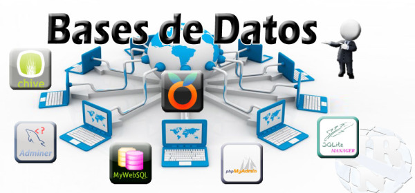
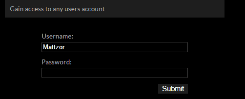
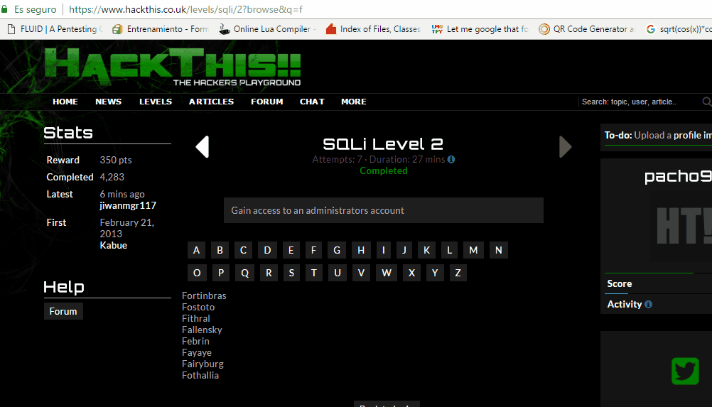
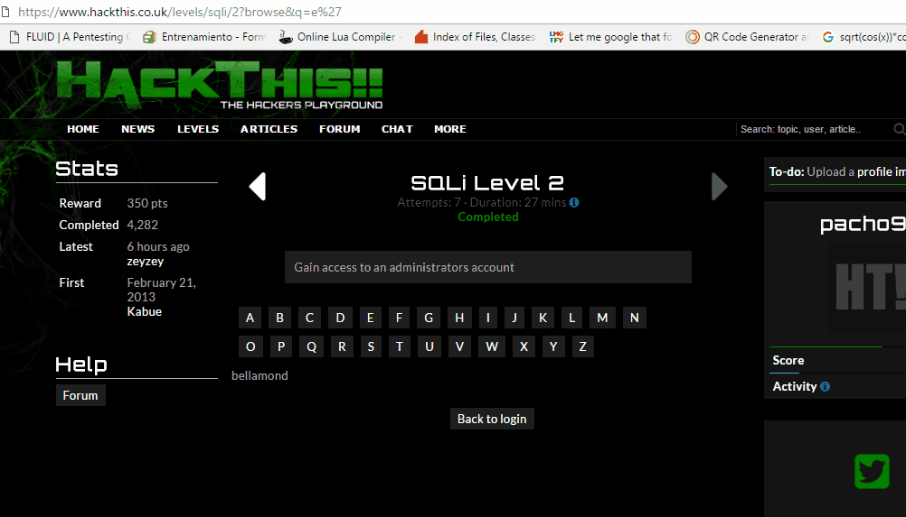

:slug: evitar-entrada-datos/
:date: 2017-03-07
:category: retos
:subtitle: La amenaza de SQLi y cómo evitarla
:tags: sqli, database, reto, solucionar
:image: database.png
:alt: Red de computadores usando diferentes bases de datos conectadas al mundo
:description: Las bases de datos son fuentes de información sensible y como tal deben estar protegidas. El principal medio para vulnerar una base de datos es a través de una inyección SQL. En el siguiente artículo se abordan y detallan las inyecciones SQL, así como la forma de reconocerlas y evitarlas.
:keywords: Seguridad, Bases de datos, Inyección SQL, Información, SQL, Protección.
:author: Francisco Bernal
:writer: pacho
:name: Francisco Bernal Baquero
:about1: Ingeniero Electrónico.
:about2: Programador en Python y Ruby, siempre dispuesto a aprender.

= ¿Cómo proteger mis datos?

Una base de datos es un +software+ capaz de organizar información,
con el objetivo que un computador pueda seleccionar, de una forma rápida,
los elementos que necesite.

Generalmente, las bases de datos se organizan por campos, registros y archivos.
Un campo es una pieza única de información;
un registro es un sistema completo de campos;
y un archivo es una colección de registros.
Por ejemplo, una libreta de direcciones es análoga a un archivo.
Contiene una lista de registros, cada uno de los cuales consiste en tres campos:
nombre, dirección, y número de teléfono.

Las bases de datos son herramientas que recopilan y organizan la información,
éstas pueden almacenar datos de personas, productos, precios,
o datos más sensibles, como direcciones de nuestros clientes,
tarjetas de crédito y sus contraseñas.
Teniendo esto en mente, el tema a tratar es la inyección +SQL+.

.Bases de datos [Imagen tomada de link:http://www.tecniplanet.net[+Tecniplanet+]]

== ¿Qué es una inyección SQL?

Un ataque por inyección +SQL+, como su nombre lo indica,
consiste en la “inyección” de una consulta +SQL+
por medio de los datos, desde el cliente hacia un servidor.
Como dijimos anteriormente, una base de datos
puede contener información sensible de un usuario,
y un ataque exitoso puede indicarle al servidor que revele esta información
a un atacante.
O no solo revelarla, podría editar, insertar o eliminar datos.

La inyección +SQL+ es común en aplicaciones +PHP+ y +ASP+.
Ésto debido a interfaces con funcionalidades obsoletas.
La gravedad de un ataque depende en gran medida de la creatividad del atacante,
y en menor medida de las contramedidas tomadas para repeler el ataque.

== ¿Cómo explotar estas características?

Este tipo de ataque se puede realizar de dos formas,
ya sea desde un campo de formulario, o desde una +URL+,
y puede realizar varias acciones,
desde un ingreso por contraseña, hasta revelar información.

== ¿Cómo ingresar por medio de un ataque?

En este ejemplo vamos por, medio de un ataque de inyección +SQL+,
a ingresar con un usuario:

.Inyección a un formulario

== ¿Qué pasó?

El código usado para realizar este ingreso, sin tener acceso a su contraseña,
es +or 1 = 1+, y lo que le está indicando a la base de datos
es, básicamente, una sentencia que siempre es verdadera.
El problema para la explotación de este ataque +Blind SQL Injection+
es que realiza la búsqueda de usuarios, carácter por carácter así,
si la contraseña es ``Hola'', el código ingresado prueba letra por letra
y acumula en caso de obtener un resultado positivo.
De esta manera, va guardando la `H', luego la `o',
hasta dar con la palabra completa.

Otro tipo de ataque puede darse
por inyección en las +URL+, mostrado a continuación:

.Inyección a una +URL+

El código a usar es
+'UNION ALL SELECT username, password FROM members WHERE admin=1--+.
Como se puede observar, es una petición pidiendo al servidor
que revele quiénes tienen permisos de administrador,
en otras palabras, +administrador=1+.
Directamente, el servidor interpreta que debe mostrar al(los)
usuario(s) que son administradores, pero además del usuario,
necesitamos la contraseña, que se puede obtener de la siguiente manera:

.Buscando la clave del administrador

El código a usar es similar al de detectar al administrador,
+’UNION ALL SELECT password, 2 FROM members WHERE username=’bellamond’--+.
Al igual que el anterior, es simplemente indicarle al servidor
que me muestre la contraseña del administrador
para lograr entrar a su cuenta.
Aunque la contraseña esté en +SHA1+,
lo grave es que el servidor permitió ver la contraseña de un administrador

== ¿Cómo evitar este tipo de ataque?

El principal punto débil de estos ataques
es que si dejamos que un usuario ingrese cualquier tipo de carácter sin control
- para realizar el ataque usamos comilla sencilla +'+ -,
un atacante podría aprovecharse de las comillas
para declarar cadenas de texto que interprete el servidor.

Por lo tanto, la solución estándar para evitar
que un atacante realice una consulta, es transformar las comillas
antes de que ingresen al servidor, por ejemplo,
una comilla doble debe transformarse a +\”+,
y así el servidor interpretarś esto como una comilla doble,
y no como una solicitud para iniciar una consulta.
Para hacer esto se programa según el lenguaje.

== En Perl

El método +quote+ filtra los caracteres especiales.
Esto asumiendo que una variable +$sql+ hace referencia a un objeto +DBI+.

.test.py
[source,perl,linenums]
----
$query = $sql->prepare
   (
         "SELECT * FROM usuarios WHERE nombre = "
     .
         $sql->quote($nombre_usuario)
    );
----

== En PHP

La manera más utilizada para evitar este ataque, si se está usando +MYSQL+,
es con la función +_mysql_real_escape_string_+,
la cual coloca barras invertidas ante los siguientes caracteres:
+\x00+, +\n+, +\r+, +\'+, +\"+ y +\x1a+.
Con lo cual garantiza que los datos sean seguros
antes de enviar una consulta a +MySQL+.

[source, shell, linenums]
----
<?php
$enlace = mysql_connect('mysql_host', 'mysql_usuario', 'mysql_contrasenya')
    OR die(mysql_error());
$query = sprintf("SELECT * FROM usuarios WHERE usuario='%s' AND
     password='%s'",
            mysql_real_escape_string($usuario),
            mysql_real_escape_string($password));
?>
----

Y, en caso de usar +MySQLi+,

[source,php,linenums]
----
$conexion = mysqli_connect("host", "usuario", "clave", "bdd");
$query = mysqli_query($conexion, "SELECT * FROM usuarios WHERE nombre = '" . mysqli_real_escape_string($conexion, $nombre) . "'");
$query = $this->query("SELECT * FROM usuarios WHERE nombre = '" . $this->real_escape_string( $nombre ) . "'");
$query = $this->mysqli->query("SELECT * FROM usuarios WHERE nombre = '" . $this->mysqli->real_escape_string($nombre) . "'");
----

Sin embargo, se recomienda utilizar +P.D.O.+ (+PHP Data Object+),
que ya ofrecen consultas preparadas.

[source,php,linenums]
----
$statement = $pdo->prepare("SELECT * FROM usuarios WHERE nombre = :nombre");
$statement->bindParam(':nombre', $nombre_usuario);
$statement->execute();
$result = $statement->fetch();
----

== Ruby on Rails (RoR)

En +RoR+, las consultas son verificadas automáticamente
por cualquiera de los métodos de búsqueda incluidos.

[source,ruby,linenums]
----
Project.find consulta := "SELECT * FROM usuarios WHERE nombre = '" + nombreUsuario + "';"
----

Estos ataques se pueden evitar en muchos lenguajes distintos,
e incluso hay lenguajes que, por defecto, aumentan la dificultad al atacante
para explotar esta vulnerabilidad.
Lo que se debe tener en cuenta es que donde hay una consulta +SQL+,
existe una vulnerabilidad a nuestro sistema.

== Referencia

. [[r1]] link:http://php.net/manual/es/security.database.sql-injection.php[PHP]
. [[r2]] link:https://technet.microsoft.com/es-es/library/ms161953(v=sql.105).aspx[Microsoft Technet]
