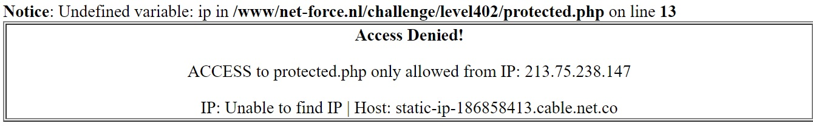
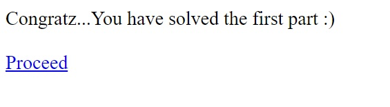
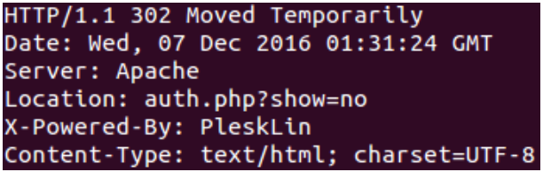

:slug: explotando-error-php/
:date: 2016-12-24
:category: retos
:subtitle: Solución al reto 402 de NetForce
:tags: php, atacar, reto, solucionar
:image: php-exploitation.png
:alt: Datos hexadecimales con un candado y las letras PHP
:description: PHP es un lenguaje de programación web ampliamente conocido y utilizado, sin embargo posee algunos inconvenientes de seguridad que pueden ser explotados. En el siguiente artículo presentamos una forma de explotar una vulnerabilidad común de PHP, causada por una mala práctica de programación.
:keywords: Seguridad, Explotación, Ataque, PHP, Reto, Web.
:author: Alejandro Aguirre
:writer: alejoa
:name: Alejandro Aguirre Soto
:about1: Ingeniero mecatrónico, Escuela de Ingeniería de Antioquia, Maestría en Simulación de sistemas fluidos, Arts et Métiers Paristech, Francia, Java programming specialization, Duke University , USA
:about2: Apasionado por el conocimiento, el arte y la ciencia.

= Explotando un simple error de PHP

El lenguaje de programación link:https://es.wikipedia.org/wiki/PHP[PHP] nace en el
año 1995 con el objetivo de hacer mas interactivas las páginas web
incorporándose directamente en un documento HTML. Fue uno de los primeros
lenguajes de programación implementado en el lado del servidor y puede ser
utilizado por la mayoría de tipos de servidores web y de sistemas operativos
de forma gratuita.

== Seguridad y PHP

PHP tiene ciertos inconvenientes en temas de seguridad informática por lo que
muchos programadores web están migrando a nuevas tecnologías y otros tipos de
lenguaje o de plataformas como lo son: Node.JS, Golang y ASP.NET. En este
artículo veremos una de las vulnerabilidades mas comunes que existe en PHP y
empieza con las palabras: *Notice: Undefined*…

== NetForce 402

Este reto consiste en dos pasos:

El primer paso consiste en detectar la vulnerabilidad y explotarla, la página
web del reto se nos presenta de la siguiente manera:

.Vulnerabilidad detectada

[quote]
Notice: Undefined variable: ip in /www/net-force.nl/challenge/level402/protected.php on line 13.

Como decía más atrás, cuando aparece la notificación *Notice* es porque existe
un error en la programación del sitio web, en este caso se ve claramente que la
variable *ip* tiene mucho que ver acá.

Como se puede ver también en la Figura 1, la única ip válida para ingresar es
213.75.238.147, entonces se procede a explotar esta vulnerabilidad adjuntando
lo siguiente a la url del reto : el interrogante ? que es una petición GET
(sólo si este no está presente), seguido de la variable en cuestión, en este
caso la variable se llama ip, seguida del igual = seguido del número de ip que
tiene acceso 213.75.238.147.

* la petición quedaría: ?ip=213.75.238.147.
* si la url del reto es +https://www.net-force.nl/challenge/level402/protected.php+
* La url con el exploit quedaría +https://www.net-force.nl/challenge/level402/protected.php?ip=213.75.238.147+.

Y efectivamente penetramos el sitio web y pasamos al segundo paso de este reto.

.Segundo paso del reto

Como se ve en la Figura 2 se da click en link Proceed para proceder, pero
sorpresivamente se muestra otra página web con Acceso denegado. Para resolver
este segundo paso es necesario tener curl instalado en el ordenador y estudiar
la url en cuestión: +https://net-force.nl/challenge/level402/auth.php+.

.challenge.sh
[source, bash, linenums]
----
curl -I https://net-force.nl/challenge/level402/auth.php
----

.Utilizando curl

En la Figura3 se ve claramente el protocolo, tipo de servidor, tipo de
contenido, como esta cifrado, etc.. Pero lo más importante es la variable
*Location: auth.php?show=no*, esta indica la existencia de otra petición web
llamada show cuyo parámetro es no, si se ingresa a la url con esta información
no pasa nada, entonces suponemos que se debe cambiar el no por yes para
acceder.

La url quede de la siguiente manera:
* +https://net-force.nl/challenge/level402/auth.php?show=yes+

=== Éxito: este reto ha sido resuelto!

PHP ha sido un lenguaje muy utilizado en internet, actualmente grandes sitios
como wikipedia o facebook utilizan este tipo de lenguaje en sus plataformas
web. La seguridad informática de las más de 20 millones de sitios web
configurados con este lenguaje depende netamente de la buena implementación de
protocolos y esquemas de seguridad en la programación PHP, hemos visto como es
de fácil "explotar" una página web en PHP que tiene errores en su programación.
