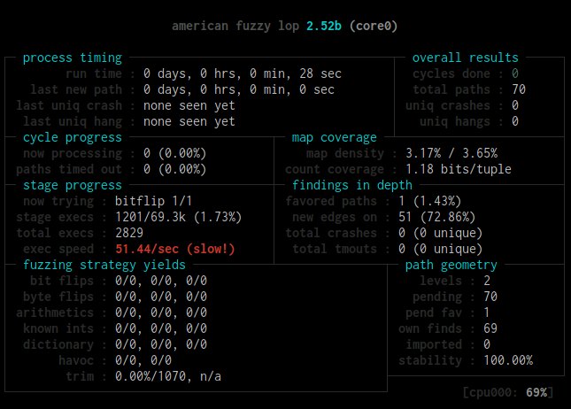
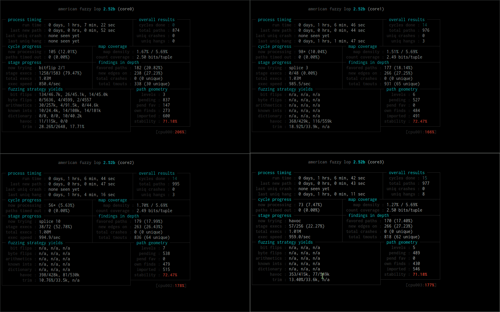

:slug: fuzzer-mono-infinito/
:date: 2018-02-12
:category: ataques
:subtitle: Fuzz testing utilizando el American Fuzzy Lop
:tags: fuzzing, aplicación, probar
:image: inf-monkey.png
:alt: Teorema del mono infinito
:description: Cómo ejecutar ataques básicos de fuzz en aplicaciones de escritorio en C de Linux utilizando el American Fuzzy Lop. Discutimos los pros y contras del fuzzing en C, reproducimos el hallazgo del bug libpng donde optipng colapsa con un archivo png de baja profundidad de bit y alto número de paleta.
:keywords: Fuzzing, Ataque, Vulnerabilidad, Seguridad, Aplicación, Hacking
:author: Rafael Ballestas
:writer: raballestasr
:name: Rafael Ballestas
:about1: Matemático
:about2: Con interés por CS
:source-highlighter: pygments
:translate: infinite-monkey-fuzzer/

= El fuzzer del mono infinito

En nuestro link:../fuzzy-bugs-enlinea/[último artículo]
discutimos acerca de que el +fuzzing+ es tanto "tonto" como sorprendente.
En este artículo, continuaremos explorando las posibilidades del +fuzzing+.
En esta ocasión, nos enfocaremos en el +fuzzing+ de aplicaciones de escritorio,
específicamente las aplicaciones +UNIX+ escritas en +C+.

Cuando desarrollamos en +C+,
usualmente tenemos que manejar los problemas de la memoria nosotros mismos.
Esto hace a nuestro programa muy rápido,
comparado con lenguajes como +Java+.
Pero al mismo tiempo puede llevar a varias clases de errores
en el acceso a la memoria, por ejemplo,
+heap+ o +stack+ +overflows+. <<r1, ^[1]^>>

== Los problemas del fuzzing

Recuerda que en nuestro último artículo
corrimos un tipo de +fuzzing+ muy simple:
darle al +fuzzer+ una lista de entradas
e invocará el programa con cada una de esas entradas, una a la vez.
Como la lista era muy genérica,
sólo las entradas más triviales era exitosas;
porque no era para nada aleatorio,
no podrían haber sorpresas.

Otro tipo de +fuzzing+ consistiría en inyectar entradas aleatorias:
Esto podría no llegar a ninguna parte,
pero también podría mostrar sorpresas,
como lo discutimos en nuestra última entrada.
Algunos van tan lejos como para decir que
link:https://blog.hboeck.de/archives/868-How-Heartbleed-couldve-been-found.html[+Heartbleed+ pudo haberse encontrado con +fuzzing+]

Pero el +fuzzing+ aleatorio, y a ciegas usualmente es muy superficial,
como lo fue nuestro intento de inyección +SQL+ con +fuzzing+.
Con dichos métodos es
"muy improbable alcanzar ciertas rutas del código en el código probado"
Entre los métodos para resolver este problema podemos contar:

* Destilación +corpus+
* Análisis de flujo del programa
* link:../../../en/blog/symbolic-execution-mortals[Ejecución simbólica], y
* Análisis estático.

Sin embargo, a pesar de que estos métodos parecen ser muy prometedores,
tienden a ser poco prácticos en usos reales <<r2, ^[2]^>>.

== Bajo la madriguera del conejo

link:http://lcamtuf.coredump.cx/afl/[American Fuzzy Lop (+AFL+)]
es un '+fuzzer+ de fuerza bruta orientado a la seguridad'
que intenta resolver estos problemas
con 'instrumentación en tiempo de compilación' y 'algoritmos genéticos'.
Pero ¿Qué demonios significa todo eso?

Un enfoque diferente sería hacer a tu +fuzzer+
consciente del formato del archivo tomado por el programa probado como entrada,
pero esto es bastante inconveniente.
En su lugar, lo que +AFL+ hace es, en pocas palabras:

. Tomar el código fuente de tu aplicación.
. Compilarlo de forma engañosa.
. Ejecutarlo con una entrada válida.
. Modificar continuamente esa entrada hasta obtener un error.

Por ejemplo, podrías iniciar +AFL+ en un programa
con una imagen de un conejo como entrada.
Entonces el +fuzzer+ modifica la entrada poco a poco,
realimentándola al programa hasta que se cuelgue o colapse,
u ocurra algún otro comportamiento inesperado.
A continuación puedes ver la secuencia de imágenes
con las que fue alimentado el programa probado:

.Logo de +AFL+ modificado. Via link:https://en.wikipedia.org/wiki/File:AFL_Fuzz_Logo.gif[Wikimedia]
image::afl-fuzz-logo.gif["Imágenes de entrada modificadas"]

== Corriendo el AFL

El +American Fuzzy Lop+ es principalmente
una herramienta para pruebas de caja blanca,
por lo que debes tener el código para la aplicación que quieres probar.
Esto es debido a que +AFL+ necesita engañar a la aplicación
durante la compilación en un proceso llamado "instrumentación"
lo que permitirá el proceso de +fuzzing+.
De esta forma debes compilar utilizando los +afl-gcc+ incluidos
los cuales son una versión modificada de la colección de compiladores +GNU+.

Luego, deberías ejecutar tu programa con una entrada válida y simple:
+Entrada al *programa*+.
Si eso funciona bien,
pon ese archivo de entrada en su propia carpeta.
Lo llamaré +in+.
Crea otra carpeta vacía para los resultados llamada +out+.
Voy a asumir que todo tu contenido está en la carpeta
en la que estás en este momento.
Ahora estás preparado para ejecutar el +AFL+:

.Invocando el fuzzer +AFL+
[source,bash]
----
$ afl-fuzz -i in -o out program input @@
----

Si todo salió bien, deberías ver esto:

.+AFL+ main interface

No es muy emocionante, verdad?
Pero mientras el indicador +total paths+
no se quede atorado en +1+, créeme, está haciendo lo suyo.
+AFL+ continuará corriendo hasta que lo detengas presionando +<Ctrl-C>+.

Cuando +last uniq crash+ o +last uniq hang+
dejen de mostrar +none seen yet+,
habrás hecho colapsar a tu programa.
+AFL+ guardará las entradas que provocaron
el colapso en la carpeta de salida que especificamos.

== Haciendo fuzzing de libpng - detalles

+libpng+ es la librería de referencia oficial de PNG.
Si alguna vez has visto una imagen en un navegador web,
la has estado utilizando indirectamente.
Es utilizado por +ghostscript+, +imagemagick+, entre muchos otros.

Como se menciona en su link:http://libpng.org/pub/png/libpng.html[website],
ha tenido muchos +bugs+ a través de su historia.
Aquí estamos interesados en mostrar como encontrar
link:http://cve.mitre.org/cgi-bin/cvename.cgi?name=CVE-2015-8126[CVE-2015-8126]
el cual es un +overflow/underflow+ potencial de punteros
utilizando +American Fuzzy Lop+
(forma en la cual lo encontraron en primer lugar).

Como resultado,
no se trata solo de seguir las instrucciones genéricas anteriores,
porque si lo haces:

* El +fuzzer+ te dirá que la velocidad de ejecución es lenta.

* Una sola instancia de +afl-fuzz+ en un solo núcleo
tomará mucho más tiempo.

* De cualquier forma no encontrará nada,
porque necesitar reparar +libpng+.

* Necesitas el ejecutable adecuado utilizando +libpng+,
es decir, +optipng+.

Así que intentemos arreglar estos problemas en el orden correcto.
Aquí el crédito va para
link:https://groups.google.com/forum/#!topic/afl-users/4p3UmkpWWR0[Jakub Wilk]
quien originalmente reportó el +bug+.

. Aplica
link:https://github.com/mirrorer/afl/blob/master/experimental/libpng_no_checksum/libpng-nocrc.patch[este parche]
a +pngrutil.c+ y +libpng-1.5.1+.

. Necesitas instrumentar +libpng+ y +optipng-0.7.5+
utilizando +afl-clang+ en lugar del +afl-gcc+ por defecto.
También instala +libpng+ con +make clean all+
para que no genere conflicto con tu instalación local
(la cual seguramente tiene):
+
[source,make]
----
CC="afl-clang" CXX="afl-clang++" ./configure --disable-shared
make clean all
CC="afl-clang" CXX="afl-clang++" ./configure -without-system-libpng
make install
----

. Para utilizar todos los +n+ núcleos disponibles,
crea +n+ subdirectorios en tu carpeta de salida.
Ahora, es posuble ejecutar +afl-fuzz+ como antes
con la opción +-M folder1+ para el primer núcleo,
y +-S folderx+ para los demás.
Ejemplo con dos núcleos:
+
[source,bash]
----
$ afl-fuzz -i in -o out -M core0 program input @@
$ afl-fuzz -i in -o out -S core1 program input @@
----

. Utilice un pequeño archivo +PNG+ como entrada,
por ejemplo +not_kitty.png+ incluido en +AFL+.

. Puedes agilizar más el proceso al "hacer trampa"
utilizando un conjunto de imágenes sometidas al proceso de +fuzzing+
previamente producidas, las cuales están disponibles
link:http://www.google.com/url?q=http%3A%2F%2Flcamtuf.coredump.cx%2Fafl%2Fdemo%2Fafl_testcases.tgz&sa=D&sntz=1&usg=AFQjCNEbj_y8FGgGRqdx4zOXWtAdaUA-bw[aquí].

Siguiendo los pasos anteriores,
aquí esta una implementación de +afl-fuzz+ optimizado
en +libpng+ y +optipng+ con +4+ núcleos:

.Ejecución exitosa de +AFL+ (link:anim-afl-4-cores.gif[click] para aumentar)

Vemos que, en unos pocos minutos,
los procesos esclavos han hecho colgar la aplicación,
pero no el maestro.
La razón de esto se sale del alcance de este artículo,
sin embargo puedes revisar los
link:http://lcamtuf.coredump.cx/afl/technical_details.txt[tips de desdempeño de +AFL+]
para mayor información.

== Entonces ¿Cuál es el bug?

Ok, hemos hecho colgar la aplicación.
¿Ahora qué?
No me corresponde a mí explicarlo,
pero voy a citar lo esencial,
para completar la información.

Anteriormente, si llamabas a +optipng+
con este link:https://bugs.debian.org/cgi-bin/bugreport.cgi?att=1;bug=787647;filename=crash.png;msg=3[archivo]
lo colapsarías:

....
$ optipng crash.png
** Processing: crash.png
Warning: Can't read the input file or unexpected end of file
24x32 pixels, 1 bit/pixel, 4 colors in palette, interlaced
optipng: opngreduc.c:697: opng_reduce_palette_bits:
Assertion `src_bit_depth == dest_bit_depth' failed.
Aborted
....

El problema ocurre cuando una aplicación
utiliza una paleta de baja profundidad de bits mapeados a datos +PNG+
debido a que cuando retorna la paleta,
ésta debe ser copiada de vuelta al formato específico del +SO+
de una forma potencialmente vulnerable:

[source,c]
----
    for (i=0; i<num_palette; ++i) {
        bmh.palette[i][0] = tmp_palette[i].red;
        bmh.palette[i][1] = tmp_palette[i].green;
        bmh.palette[i][2] = tmp_palette[i].blue;
    }
----

Y aquí está el problema con ese código:

"Este es un código válido, de acuerdo a las especificaciones de +PNG+
debido a que +num_palette+ no puede mayor a +16+ en un +PNG+ válido.
Desafortunadamente en +libpng+ antes del +fix+
+num_palette+ podía tomar valores hasta de +256+
con un +PNG+ modificado apropiadamente.
La sobreescritura anterior se encuentra
en el extremo de la dirección alta de +bmh+,
por lo tanto, sobrescribe la pila (en una máquina típica)
en el marco de llamada
y prácticamente le da al atacante control total
sobre el programa de aplicación."
<<r3, ^[3]^>>

Este +bug+ fue descubierto utilizando +AFL+
y reportado en ese momento en
link:https://bugs.debian.org/cgi-bin/bugreport.cgi?bug=787647[+Debian Sid+],
como ha sido el caso
de muchas otras aplicaciones en +C+ del mundo real,
e incluso algunas de alto perfil como +bash+, +X server+, +curl+
y el +kernel+ de +Linux+.

''''

Así que ahí lo tienes:
Como prometí, un seguimiento más profundo a nuestra
link:../fuzzy-bugs-enlinea/[invitación inicial al +fuzzing+].
De acuerdo al padre de +AFL+,
esta técnica es muy poderosa
y al mismo tiempo menospreciada:

[quote,Michal Zalewski]

El +fuzzing+ es una de las estrategias más poderosas y utilizadas
para identificar problemas de seguridad en software del mundo real;
a la fecha es responsable de la detección de la gran mayoría de bugs
de ejecución remota de código y escalamiento de privilegios
en software de seguridad crítica .<<r2, ^[2]^>>.

Espero que este artículo haya ayudado
a despertar algo de curiosidad
y convencerte un poco de ello

== Referencias

. [[r1]] link:https://fuzzing-project.org/[The Fuzzing Project]
. [[r2]] link:http://lcamtuf.coredump.cx/afl/README.txt[American Fuzzy Lop README]
. [[r3]] link:https://sourceforge.net/p/png-mng/mailman/message/34626800/[PNG/MNG formats forum at Sourceforge]
