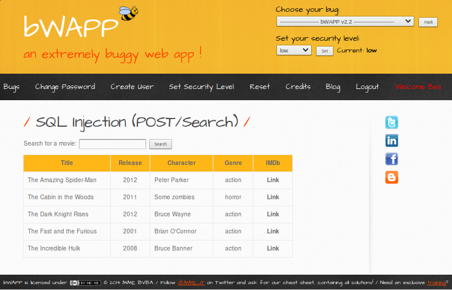
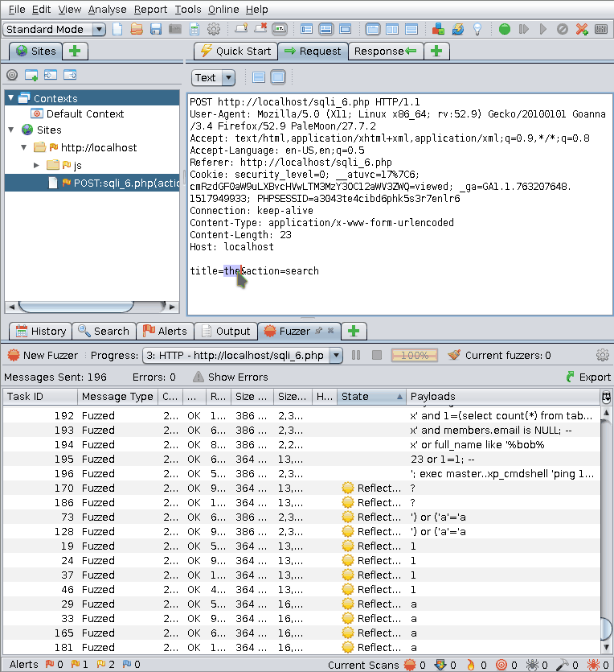
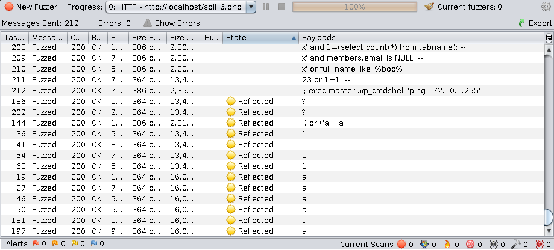
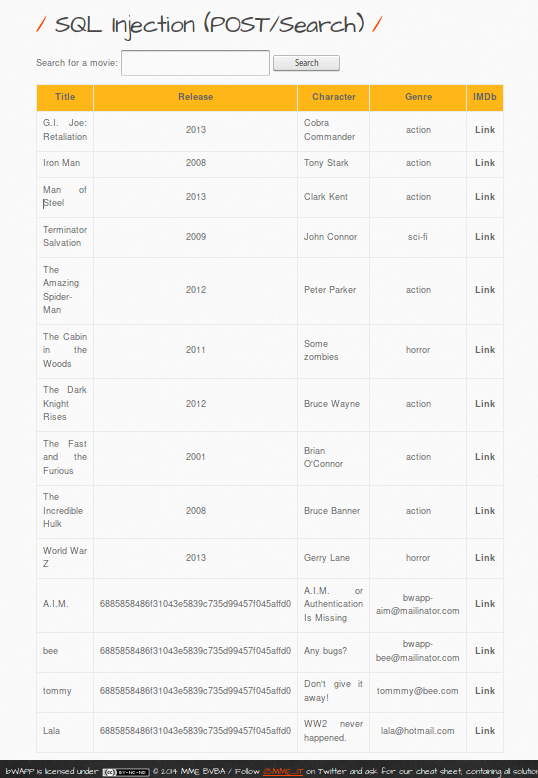

:slug: fuzzy-bugs-online/
:date: 2018-02-09
:category: ataques
:subtitle: Técnicas Fuzz para probar aplicaciones Web
:tags: sql, fuzzing, inyección
:image: cover.png
:alt: Fuzzy caterpillar
:description: Cómo ejecutar pruebas fuzz en aplicaciones web. Específicamente aplicaremos fuzz para SQLi en una base de datos vulnerable de una página de búsqueda de bWAPP con el ZAProxy de OWASP, obteniendo resultados variados. También mostramos un ejemplo de una inyección no factible con fuzzing.
:keywords: SQLi, Fuzzing, Ataque, Vulnerabilidad, Seguridad, Aplicación.
:author: Rafael Ballestas
:writer: raballestasr
:name: Rafael Ballestas
:about1: Matemático
:about2: Con interés por CS
:source-highlighter: pygments
:translate: fuzzy-bugs-online/

= Fuzzy bugs online

El +fuzzing+ web es una técnica automática computarizada
para encontrar +bugs+ y vulnerabilidades
en un sistema de computación.
Si piensas que proteger tu sitio,
simplemente es cuestión de bloquear
las peticiones maliciosas más comunes,
piénsalo de nuevo, y continúa leyendo este artículo.

== Inyectando SQL en un sitio vulnerable

Una situación bastante común consiste en que un sitio web
permita la búsqueda, adición y eliminación de información
de una base de datos.
Pero introducir este tipo de características
requiere de gran cuidado
en cómo configurar y acceder a esa base de datos.

Echemos un vistazo a link:http://itsecgames.com/[+bWAPP+],
la cual tiene una base de datos de películas,
y nos permite buscar el título dado:

.Sitio de búsqueda de +bWAPP+

Parece que el sitio toma la entrada del usuario
como una petición +POST+,
luego busca en la base de datos esa petición,
y finalmente imprime de vuelta el resultado en forma de tabla.
Podemos asumir que es una petición +POST+
debido a que no hay nada en la dirección +URL+
que indique la presencia de una petición +GET+
(ten en cuenta que el gran título +POST+
no estará allí en una aplicación real).

Revisemos la página utilizando ahora el proxy +ZAP+ de +OWASP+.
Sin duda, podemos ver y confirmar que la petición es de tipo +POST+:

.Petición +POST+ cuando buscas una película
....
POST /sqli_6.php HTTP/1.1
Host: localhost
User-Agent: Mozilla/5.0 (X11; Linux x86_64; rv:52.9) Gecko/20100101
Goanna/3.4 Firefox/52.9 PaleMoon/27.7.2
...
Content-Length: 24
title=the&action=search
....

Ahora podemos interceptar esta petición utilizando +ZAP+
y editar la sección +title=the+ anterior,
cambiando +the+ por una petición +SQL+.
Por ejemplo, si lo cambiamos a:

.Inyección SQL ingenua
[source,sql]
----
Iron Man' OR 1=1;
----

Debido a que +1=1+ siempre es verdadero,
haciendo la condición general verdadera,
obtendríamos todas las entradas en la tabla.

Pero eso no sucede, obtenemos un error:
....
Error: You have an error in your SQL syntax; check the manual
that corresponds to your MySQL server version for the right
syntax to use near '%'' at line 1
....

Bien, al menos ahora comprobamos
que están usando +MySQL+,
porque lo podemos observar en el mensaje de error.

Existen innumerables cadenas
(secuencia de caracteres)
que podríamos intentar utilizar
para completar la consulta +SQL+ desconocida
que el servidor le está pidiendo a la base de datos.

¿Qué tal si intentamos algunas de ellas
al mismo tiempo, de forma automática?

Bueno, Eso es precisamente de lo que se trata el +fuzzing+.

== Fuzzing de aplicaciones Web

Existen otros tipos de +fuzzing+:
+fuzzing+ de aplicaciones de escritorio
utilizando lineas de comandos o interfaces gráficas
(probar combinaciones de botones, entradas, etc.),
+fuzzing+ de protocolos, +fuzzing+ de formatos de archivo, y más <<r1, ^[1]^>>.

En este artículo nos enfocaremos únicamente
en el +fuzzing+ de aplicaciones web el cual es semi-automatizado,
con manipulación pseudo-aleatoria de +URLs+, formularios,
contenido generado por el usuario <<r1, ^[1]^>>, peticiones, etc.
Podemos abordar otros tipos de +fuzzing+ en artículos futuros.

A la hora de realizar un ataque de +fuzzing+,
la forma más completa y segura de tener éxito
sería intentar cada entrada posible.
Por ejemplo, si estamos aplicando el +fuzzing+ a una cadena de entrada,
deberíamos intentar cada cadena posible,
iniciando con una cadena vacía.
Esto se debe al hecho de que a veces
los programas presentan reacciones inesperadas
a entradas extrañas,
como el +bug+ encontrado en +Mac OS+ el año pasado,
donde podías iniciar sesión como +root+
al presionar el botón +login+ las veces suficientes
(visita link:https://nvd.nist.gov/vuln/detail/CVE-2017-13872#vulnDescriptionTitle[CVE-2017-13872]
para más información).

Pero este enfoque de "intentar todo"
no es realmente factible o práctico:
La complejidad espacial de dicho intento sería enorme.
Por lo que debemos limitarnos al llamado
"espacio de soluciones explorables".
Esto es alcanzado normalmente al limitar los intentos de entrada
a los valores que estadísticamente
tienen mayor probabilidad de generar un +bug+.
Estos son conocidos como +vectores fuzz+.
En nuestro caso, serían consultas +SQL+.
Algunos ejemplos de +OWASP+ <<r2, ^[2]^>>:

[source,sql]
----
' OR 1=1;--
' OR 'a'='a
%22+OR+isnull%281%2F0%29+%2F*
Admin' OR '
'%20SELECT%20*%20FROM%20INFORMATION_SCHEMA.TABLES--
HAVING 1=1--
' OR username LIKE char(37);
' ; DROP TABLE temp --
GRANT CONNECT TO name; GRANT RESOURCE TO name;
----

Tu +fuzzer+ de elección probablemente proporcionará
una buena dosis de +vectores fuzz+,
como lo hace el nuestro,
el +fuzzer+ +ZAP+ de +OWASP+.
Todo lo que necesitamos hacer es:

. Seleccionar la cadena a la que le queremos aplicar el +fuzz+,

. Invocar el +fuzzer+,

. Seleccionar las "cargas", es decir los +vectores fuzz+, y

. Correr el +fuzzer+

+ZAP+ incluye muchas de estas por defecto;
utilizaremos el vector de inyecciónes +SQL+ de +jbrofuzz+:

.Cómo ejecutar un +fuzzer+ +ZAP+

Las consultas +SQL+ inyectadas exitosamente
son marcadas con el estado +reflected+ en la lista:

.Inyecciones SQL reflejadas en la prueba fuzz

Aquí podemos ver que un test +fuzz+ es tan bueno
como sus cargas o vectores +fuzz+.
Sólo las inyecciones más triviales tuvieron éxito,
es decir, aquellas con la forma:

[source,sql]
----
whatever' OR (something truthy)
----

Lo cual simplemente muestra todas las entradas en la tabla +movies+.

Cuando aplicamos +fuzzing+,
ésto es tanto una bendición como una maldición.
Usualmente no ocurre, pero en ciertas ocasiones,
las inyecciones más simples revelan salidas inesperadas,
y cuando lo hacen son sorpresas reales,
como es el caso del +bug+ de +Apple+ mencionado anteriormente.

== Comparación con la inyección manual

Con la información sobre la aplicación
y la estructura de la base de datos,
podemos inyectar consultas más efectivas.
Por ejemplo, supongamos que has descubierto
que existe otra tabla llamada +users+
y queremos ver lo que hay alli.

Si intentamos inyectar la siguiente consulta:

[source,sql]
----
%'; SELECT * FROM users;
----

obtenemos un error,
porque el sistema de administración de la base de datos
no permite concatenación de consultas.

Si lo volvemos a intentar con +union+ en su lugar:

[source,sql]
----
%' UNION SELECT * FROM users;#
----

Aún obtenemos un error,
porque las tablas no coinciden en tamaño.

Supongamos que, por ejemplo,
también sabemos (o suponemos) los nombres de las columnas
y seleccionamos las más interesantes:

[source,sql]
----
%' UNION SELECT id, login, password, email, secret,
activated, admin FROM users;#
----

Entonces obtendríamos la mayoría de la información de los usuarios
(las contraseñas estarán encriptadas, pero pueden ser
link:../../../en/blog/storing-password-safely/[recuperadas])

.Inyección SQL manual exitosa

''''
Pos si mismas las pruebas +fuzz+
no pueden reemplazar la experticia humana en la ecuación
pero agrega un punto de vista adicional importante.
Como se observó en el ejemplo de +Mac OS+,
su mayor debilidad puede ser
una fuente potencial de grandes sorpresas.
Apenas hemos vislumbrado la punta del iceberg aquí,
pero espero que hayas encontrado útil esta corta introducción.

== Referencias

. [[r1]] link:https://www.owasp.org/index.php/Fuzzing[OWASP wiki article on Fuzzing]
. [[r2]] link:https://www.owasp.org/index.php/OWASP_Testing_Guide_Appendix_C:_Fuzz_Vectors[OWASP Testing Guide appendix - Fuzz vectors]
