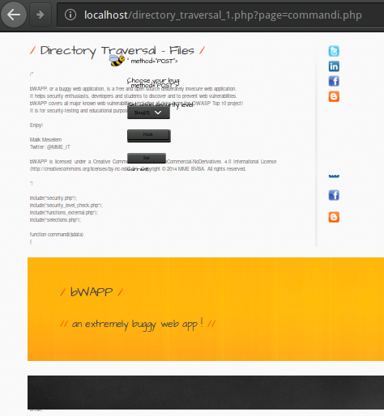
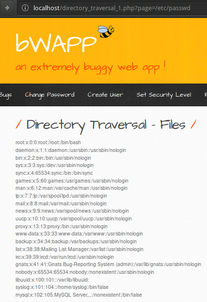

:slug: gherkin-esteroides/
:date: 2018-03-13
:subtitle: Cómo documentar vectores de ataque detallados
:category: documentación
:tags: documentación, vector, software
:image: cover.png
:alt: Pepinillos en un frasco
:description: Cómo utilizar Gherkin para documentar vectores de ataque en aplicaciones vulnerables utilizando palabras clave más avanzadas de la sintaxis de Gherkin. Proponemos utilizar una plantilla para la detección estática y dinámica, así como la explotación de aplicaciones vulnerables.
:keywords: Gherkin, Vector de ataque, Documentación, Reporte, Vulnerabilidad, Inclusión.
:author: Rafael Ballestas
:writer: raballestasr
:name: Rafael Ballestas
:about1: Matemático
:about2: Con interés por CS
:source-highlighter: pygments
:translate: gherkin-steroids/

= Gherkin con esteroides

En el campo de la seguridad informática y el +ethical hacking+
encontrar *todas las vulnerabilidades* es tan importante
como *reportarlas lo más rápido posible*.
Para ello, necesitamos un medio efectivo para comunicarnos
con todos los interesados en el proyecto.
link:../../../en/blog/app-pickle/[Anteriormente] habíamos propuesto utilizar
el link:https://martinfowler.com/bliki/BusinessReadableDSL.html[lenguaje de dominio específico] +Gherkin+.
En esa ocasión, mostramos cómo utilizar la sintaxis de +Gherkin+
para documentar vectores de ataque, es decir,
encontrar y explotar vulnerabilidades en una aplicación.
También mostramos los fundamentos del lenguaje,
así que, si aún no los conoces,
te recomendamos revisar el artículo anterior.

== Resumen de la sintaxis

En el artículo anterior mencionamos los argumentos multi-líneas
sin entrar en detalles.
A veces es necesario especificar fragmentos más grandes de texto
como entrada o salida a un programa
los cuales se ajusten a una
link:https://en.wikipedia.org/wiki/Characters_per_line#In_programming[longitud de línea fija]
la cual adicionalmente, incluye más texto.
Si necesita documentar tal cosa en +Gherkin+
podría utilizar +docstrings+ similares a las de +Python+ (+"""+):

.Especificando la longitud de la entrada
[source,gherkin]
----
When I inject the following SQL query in the input field:
  """
  INSERT INTO mysql.user (user, host, password)
         VALUES ('name', 'localhost', PASSWORD('pass123'))
  """
Then I have granted myself access to the database
----

Puede escribir cualquier cosa entre las +docstrings+
pero deben estar dentro de sus propias líneas
y la indentación debe ser relativa a ellas.
Son particularmente útiles para citar código,
salidas de programas +CLI+,
y texto plano no estructurado.

Para el texto plano "estructurado"
+Gherkin+ tiene el elemento sintáctico +Data Table+
(No debe confundirse con las tablas de los esquemas de escenarios)

//.Tabular data with tables
[source,gherkin]
----
Given the database is populated with the species:
| Common Name    | Genus  | Species  | Family       |
| Lion     | Panthera   | Leo      | Felidae      |
| GNU      | Connochaetes | Gnou     | Bovidae      |
| Gentoo Penguin | Pygoscelis   | Papua    | Spheniscidae   |
| Burr gherkin   | Cucumis  | Anguria  | Cucurbitaceae  |
----

No es necesario alinear las barras verticales (+|+) como en el ejemplo anterior,
pero hace que tu archivo +.feature+ se vea mucho mejor.
A +Gherkin+ no le interesa eso,
únicamente que el número de columnas coincida.

Hablando de los esquemas de escenarios,
como fue visto en las entregas anteriores,
éstos son muy útiles para especificar muchas relaciones causa-efecto:

//.Scenario Outlines
[source,gherkin]
----
When I do <action>
Then I get a <result>

Examples:
  |    <action>     |      <result>      |
  | Drink coffee    | Be more alert  |
  | Take a cab      | Get there faster   |
  | Open the window | Ventilate the room |
----

== Documentación de vectores de ataque más específicos

Para cada vulnerabilidad encontrada,
es importante explicar cómo fue encontrada y cómo puede ser reproducida.
En nuestro artículo anterior hicimos eso,
a pesar de que la mayoría de las explicaciones
yacen más en el artículo que en el archivo +.feature+.
En esta ocasión, vamos a enriquecer nuestro +Gherkin+
con más información.

Considere esta página de nuestro viejo amigo
link:http://itsecgames.blogspot.com.co/[bWAPP],
la cual simplemente nos da un mensaje críptico:

.Un mensaje misterioso
image::default-file.png["Page with mysterious message"]

Sin importar que tan tonto pueda parecer,
ésto es lo primero que debemos documentar:
Cómo la página, aplicación, o lo que sea que estemos probando
funciona en el momento de la prueba.
Podemos utilizar un escenario de "caso de uso normal" separado
tal y como lo hicimos antes.

=== Trasfondo (Background)

Sin embargo, dado que en esta ocasión el caso de uso es tan sencillo,
podemos simplemente conectar ese comportamiento al +Background+.
Esto debe incluir, en detalle, todo lo necesario para correr la aplicación.
Nuestro objetivo +bWAPP+ es un servidor web +PHP+;
¿Quizás lo estés corriendo dentro de una máquina virtual
link:http://itsecgames.blogspot.com.co/2013/07/bee-box-hack-and-deface-bwapp.html[+bee-box+]?
O ¿Configuraste el servidor
link:https://en.wikipedia.org/wiki/LAMP_%28software_bundle%29[+LAMP+] tu mismo?
¿En qué sistema operativo?
Todo esto debe estar en el +background+
para permitir reproducir las condiciones iniciales.

Yo, por ejemplo, estoy corriendo +bWAPP+ dentro de un contenedor
link:https://www.docker.com/[+Docker+]
hecho por link:https://hub.docker.com/r/raesene/bwapp/[+raesene+],
así que dejemos un registro de eso en nuestra función de ataque:

[source,gherkin]
----
  Background:
    Given I am running Manjaro GNU/Linux kernel 4.9.86
    And I am running bWAPP 2.2 in Docker container raesene/bwapp:
    """
    ubuntu 14.04 LTS, kernel=host(4.9), MySQL 5.5, Apache 2.4.7, PHP 5.5
    """
    Given a PHP site showing a message:
    """
    URL: bwapp/directory_traversal1.php?page=message.txt
    Message: Try to climb higher Spidy...
    Evidence: default-file.png
    """
----

Nótese como todas las versiones de todos los programas utilizados
son listadas explícitamente,
al igual que el +URL+ donde la vulnerabilidad fue encontrada.
Resumimos el comportamiento de la página en una sola línea
porque en este caso era bastante sencillo,
sin embargo, también mencionamos un archivo externo llamado +default-file.png+
cuya captura de pantalla se muestra arriba.

=== Detección y explotación dinámica

Ahora, el mensaje críptico en la página
puede tratar de decirnos algo.
las +Spiders+ o link:https://en.wikipedia.org/wiki/Web_crawler[+crawlers+]
son partes de software
que tratan de navegar sistemáticamente dentro de un sitio web,
lo cual es consistente con la parte "trata de llegar más alto".
Sin embargo, esta página ya está en la raíz del servidor
ya que la página está justo después de la dirección +http://localhost/+.
¿Qué tan alto podemos llegar entonces?

La repuesta es, tanto como queramos.
No solo más alto, sino también más profundo,
en (casi) cualquier dirección.
La siguiente pista está en el +URL+.
La página toma un parámetro +GET+ +page=message.txt+.
Así que el archivo +message.txt+ es un archivo de texto simple
que contiene las palabras anteriores,
y lo que hace la página  es mostrarlo.
¿Que pasaría si lo cambiamos por otro archivo de texto?
Recuerda que los archivos +HTML+ y +PHP+ también son archivos de texto,
solo que son renderizados de una forma particular
cuando son abiertos por un navegador web.
Intentemos utilizar el archivo de nuestra última página atacada,
cuyo +URL+ era +http://localhost/commandi.php/+.
El cual también habita en la raíz del servidor,
por lo que debería ser mostrado si cambiamos +message.txt+ a +commandi.php+:

.Atacando el sitio

Notemos dos cosas:
Primero, el código +PHP+ y los comentarios de texto son mostrados.
Por lo tanto, teóricamente podríamos acceder al código fuente +PHP+
de cualquier página en este servidor.
Segundo, la parte +HTML+ en realidad es renderizada en el navegador,
lo cual podría provocar a ataques de tipo
link:../../../en/blog/xss-protection/[+XSS+] o
link:https://www.owasp.org/index.php/Cross-Site_Request_Forgery_(CSRF)[+CSRF+].

Pero espera.
Este servidor no solo está "flotando" en el espacio:
habita dentro de una máquina +GNU/Linux+
Y "todo" en ese sistema operativo es un archivo,
muchos de los cuales son archivos de texto plano.
Particularmente uno de ellos es de vital importancia:
link:https://www.cyberciti.biz/faq/understanding-etcpasswd-file-format/[+/etc/passwd+],
el cual almacena información sobre los usuarios.
Así que intentemos mostrarlo en esta página,
al configurar +page=/etc/passwd+:

.Listando los usuarios en los servidores de +bWAPP

Podemos documentar eso, utilizando las tablas de datos de +Gherkin+
en un escenario propio,
dada la importancia del hallazgo:

.Documentando una explotación en particular
[source,gherkin]
----
  Scenario: Users record extraction
    When I change the page=message.txt parameter to page=/etc/passwd
    Then we retrieve the following user records:

    # Records extracted
    | username | pw? | UID | GID | info | home | shell |
    | root     | x | 0 | 0 | root | /root | /bin/bash |
    | daemon   | x | 1 | 1 | daemon | /usr/sbin | /usr/sbin/nologin |
    | bin      | x | 2 | 2 | bin | /bin | /usr/sbin/nologin |
    | sys      | x | 3 | 3 | sys | /dev | /usr/sbin/nologin |
    | sync     | x | 4 | 65534 | sync | /bin | /bin/sync |
    | games    | x | 5 | 60 | games | /usr/games | /usr/sbin/nologin |
    | man      | x | 6 | 12 | man | /var/cache/man | /usr/sbin/nologin |
    | lp       | x | 7 | 7 | lp | /var/spool/lpd | /usr/sbin/nologin |
    | mail     | x | 8 | 8 | mail | /var/mail | /usr/sbin/nologin |
    | news     | x | 9 | 9 | news | /var/spool/news | /usr/sbin/nologin |
    | uucp     | x | 10 | 10 | uucp | /var/spool/uucp | /usr/sbin/nologin |
    | proxy    | x | 13 | 13 | proxy | /bin | /usr/sbin/nologin |
    | www-data | x | 33 | 33 | www-data | /var/www | /usr/sbin/nologin |
    | backup   | x | 34 | 34 | backup | /var/backups | /usr/sbin/nologin |
    | list     | x | 38 | 38 | Mailing List Manager | /var/list | /usr/sbin/nologin |
    | irc      | x | 39 | 39 | ircd | /var/run/ircd | /usr/sbin/nologin |
    | gnats    | x | 41 | 41 | Gnats Bug-Reporting System (admin) | /var/lib/gnats | /usr/sbin/nologin |
----

Ahora sabemos cuantos usuarios hay en el servidor,
y cuales de ellos tienen contraseñas.
Éstas son almacenadas en
link:https://www.cyberciti.biz/faq/understanding-etcshadow-file/[+/etc/shadow+]
en forma de +hashes+,
los cuales pueden ser
link:../../../en/blog/storing-password-safely[descifrados si la contraseña es débil].
Sin embargo, el archivo +shadow+,
a diferencia del archivo +passwd+ está protegido:

.Un fallo
image::protected.png["foo bar"]

'Rayos!' Bueno, encontraremos una forma
de solucionarlo tarde o temprano.
Ahora que lo entendimos podemos intentarlo con otros archivos.
Ya que siempre hacemos lo mismo:
Cambiar +page=message.txt+ a +page=archivo-deseado.txt+
podemos utilizar un esquema de escenario para ello,
utilizando una columna para el archivo de entrada
y otra para el resultado:

.Documentando muchos casos en un solo esquema
[source,gherkin]
----
  Scenario Outline: Dynamic detection and exploitation
    Given the message and the page=message.txt GET parameter in the URL
    When I change the GET parameter page=message.txt to another page=<path>
    Then I see the file <printed> in the page, if it is a text file:

    Examples:
      |        <path>        |             <printed>             | <evidence>    |
      | /etc/passwd      | User accounts info          | passwd.png    |
      | /etc/group       | User groups info                |               |
      | /etc/shadow      | Couldn't open       | protected.png |
      | /etc/hosts       | Hosts file        |     |
      | commandi.php         | PHP source code and rendered HTML | source.png  |
      | passwords/heroes.xml | Heroes' passwords and secrets     |     |
      | admin/settings.php   | No output, but file exists        |     |
----

Es natural realizar varios intentos,
algunos de los cuales pueden fallar,
mientras que otros tendrán éxito.
Todos ellos deben ser reportados con el espíritu más científico

=== Detección estática y posibles arreglos

Veamos porqué +passwd+ pudo ser leído y +shadow+ no.
Desde el 'interior' del servidor, digamos
----
$ ls -l /etc/{passwd,shadow}
-rw-r--r-- 1 root root   1012 Feb 15  2016 /etc/passwd
-rw-r----- 1 root shadow  559 Feb 15  2016 /etc/shadow
----

Notemos que +passwd+ tiene +3+ +r+s:
una por el propietario (el usuario +root+),
una por el propietario del grupo (de nuevo, solo +root+)
y la última es para todos los demás usuarios.
Sin embargo, +shadow+ no tiene esa última +r+,
por lo que sólo puede ser leída por +root+.

Mientras realizamos la detección estática de problemas,
veamos qué está mal con esa página para así tratar de arreglarlo.
El código fuente para la página simplemente toma el parámetro +GET+ +page+,
y lo muestra

.Adaptado del código fuente de +bWAPP+. Para clarificar, se omitieron algunas líneas y llaves.
[source,php]
----
223  $file = $_GET["page"];
233  show_file($file);
136  function show_file($file)
141    if(is_file($file))
144      $fp = fopen($file, "r") or die("Couldn't open $file.");
146      while(!feof($fp))
149        $line = fgets($fp,1024);
150        echo($line);
151        echo " ";
----

Podemos incluir exactamente esta porción de código,
incluyendo los números de línea entre +docstrings+,
mientras discutimos acerca de la exploración de código
en nuestro archivo +.feature+.

Ahora, el principal problema con esto,
es que podemos pasar cualquier archivo como parámetro +GET+
y será mostrado, como vimos anteriormente.
Esa entrada debería ser validada y limpiada
en algún lugar entre las líneas +223+ y +233+ mostradas arriba.

Para arreglar eso, un buen comienzo
sería limpiar cadenas como  +..+, +./+ y +../+,
las cuales se usan generalmente para
"llegar más alto, Arañita"

[source,php]
----
if(strpos($data, "../") !== false || strpos($data, "..\\") !== false ||
   strpos($data, "/..") !== false || strpos($data, "\..") !== false ||
   strpos($data, ".") !== false)
        $directory_traversal_error = "Directory Traversal detected!";
----

Esto bloquearía a los atacantes que no conocen
la jerarquía de archivos del sistema en el servidor,
pero aún nos permitiría pasar rutas absolutas como parámetros.
Una defensa defensa más robusta consistiría en que el usuario
no pueda mostrar archivos por fuera de la carpeta actual:

[source,php]
----
// Gives the current directory path
$real_base_path = realpath("");
// Gives the absolute path equal to user input
$real_user_path = realpath($user_path);
if(strpos($real_user_path, $real_base_path) === false)
  $directory_traversal_error = ""Directory Traversal detected!";
----

Sin embargo, esto aún nos permite mostrar el archivo
con las contraseñas de los héroes.
De hecho, sería mejor simplemente
no permitirle a los usuarios mostrar archivos a voluntad.

Además, los archivos que son abiertos deberían cerrarse
y notemos también cómo el archivo es leído línea por línea
utilizando la función +fgets+ con un número fijo de caracteres.
Al cargar un archivo que exceda este límite,
puede causar un +buffer overflow+ o algún otro error inesperado.
En este caso en particular, sería mejor utilizar
la función de +PHP+ +fgetss+,
la cual no requiere de un límite de caracteres
y también retorna un código separado en +HTML+ y +ṔHP+.

=== Más detalles

Hasta ahora, hemos documentado en +Gherkin+:

. El trasfondo en donde corremos la aplicación vulnerable.
. La detección dinámica y fase de explotación
con varios ejemplos y evidencias.
. Los registros importantes que pudimos extraer de la aplicación.
. La parte estática de la detección, con fragmentos de código vulnerable,
problemas y sugerencias.

Para terminar un archivo +.feature+ adecuado
nos falta, la característica en sí,
la cual es la vulnerabilidad, o mas bien,
el descubrimiento y explotación de la misma.

Recuerde que podemos documentar características y escenarios
utilizando 'descripciones'.
Luego de las palabras +Feature+, +Scenario+, +Scenario Outline+ o +Example+
podemos escribir lo que queramos,
siempre y cuando ninguna línea empiece con una palabra clave
(Incluyendo los comentarios - No puedes mezclar descripciones con comentarios,
lo aprendí a las malas)

Es común describir características siguiendo el formato

----
 Como <Tipo de usuario>
 Quiero <Hacer algo>
 Para <Obtener un resultado>
----

Podemos aprovechar dicha estructura
para documentar el 'Escenario' y el 'Actor' de la vulnerabilidad,
la 'Amenaza' y qué registros pueden ser 'Comprometidos'.
Podemos también utilizar ese espacio para documentar
cualquier otra cosa que consideremos importante
en términos generales.

[source,gherkin]
----
Feature: Vulnerability FIN.S.0075 Local file inclusion
  From the bWAPP application
  From the A7 - Missing functional level access controls category
  In URL bwapp/directory_traversal_1.php
  As any user from Internet with acces to bWAPP
  I want to be able to see local files I'm not supposed to
  In order to gain access to system objects with sensitive content
  Due to missing functional level access controls
  Recommendation: restrict access to sensitive files (REQ.0176)
----

Para cualquier otra cosa, utiliza comentarios.
Incluiré detalles tales como
los códigos link:https://cwe.mitre.org/[+CWE+]
y link:https://nvd.nist.gov/[+CVE+]
de la vulnerabilidad en caso de presentarse.
Las métricas calculadas, tales como
puntajes link:https://nvd.nist.gov/vuln-metrics/cvss[+CVSS+]
y demás, deben ir en comentarios (+#+) al inicio del archivo.
Lo invitamos a revisar el <<apx-feature, archivo +.feature+ completo>>
al final del documento.

''''

Y es así como proponemos utilizar este lenguaje para documentar ataques.
Puede que te preguntes: ¿Porqué +Gherkin+ y no solo texto plano?
Eso es porque es
link:https://en.wikipedia.org/wiki/Line-oriented_programming_language[orientado a líneas]
tiene una estructura ligera,
podemos definir plantillas, como la tratada en este artículo,
y podemos verificar los archivos utilizando los
link:https://github.com/cucumber/cucumber/tree/master/gherkin[intérpretes],
link:https://github.com/vsiakka/gherkin-lint[linters]
y
link:https://github.com/cucumber/cucumber/[compiladores]
disponibles para el lenguaje.
Aún necesitamos trabajar más en la definición de la platilla,
así que manténganse conectados

[[apx-feature]]
== Appendix: full feature

[source,gherkin]
----
include::/web/content/blog-en/gherkin-steroids/local-file-inclusion.feature[]
----
