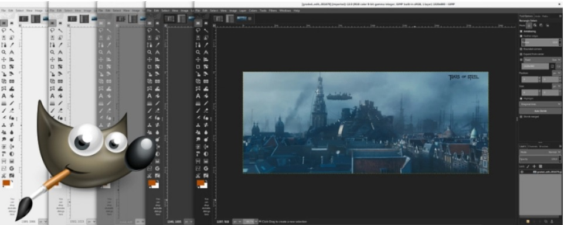
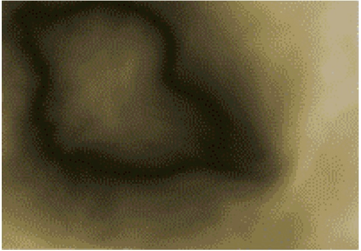
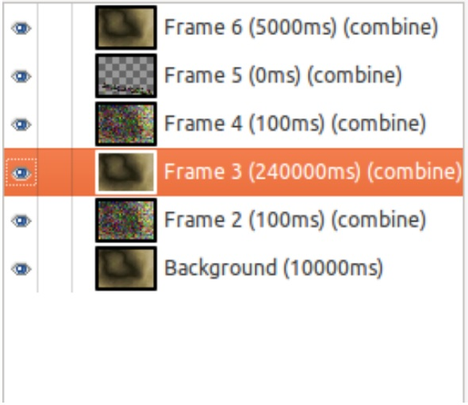

:slug: gimp-poderoso
:date: 2016-11-29
:category: retos
:tags: solucionar, reto, herramienta, ocultar
:Image: gimp-preview.png
:author: Alejandro Aguirre
:writer: alejoa
:name: Alejandro Aguirre Soto
:about1: Ingeniero mecatrónico, Escuela de Ingeniería de Antioquia, Maestría en Simulación de sistemas fluidos, Arts et Métiers Paristech, Francia, Java programming specialization, Duke University , USA
:about2: Apasionado por el conocimiento, el arte y la ciencia.

= Gimp es libre y poderoso

Cuando las computadoras empezaron a tener pantallas o monitores con gráficos 
por pixeles, llegaron las imágenes digitales y con la llegada de las imágenes 
digitales llegaron los editores de imágenes. Una imagen digital no es más que 
un bloque de información que es interpretado por un computador que genera un 
gráfico guiado por pixeles, cada pixel de la imagen es en sí un pedazo pequeño 
de datos que contiene información acerca de su ubicación, su color, etc. 
Algunos de los formatos más famosos implementados para interpretar las imágenes 
con sus extensiones son: BMP,PNG,GIF,JPEG.

Los editores de imágenes nacen con la intención de modificar en vivo la 
información que posee una imagen digital y mostrar esa modicación “al instante” 
al usuario, así pues una gran cantidad de funciones y de herramientas se han 
creado con diversos fines en estos editores para manipular las imágenes, 
dándole así el mayor gusto a los publicistas o diseñadores gráficos que 
trabajan en la edición digital.

.*_Programa de manipulación de imágenes de GNU – https://www.gimp.org/[GIMP]_*

Este artículo se concentrará en un famoso editor de imágenes llamado 
https://www.gimp.org/[GIMP]. GIMP no es más que un ambicioso proyecto de 
software libre que se puede descargar gratuitamente desde su sitio web. Con los 
años de desarrollo, el editor de imágenes GIMP ha crecido mucho, volviéndose un
software muy robusto que aguanta ediciones “pesadas” de imágenes, compitiendo 
así con software privados como los que desarrolla Adobe.

En otros https://fluid.la/site/posts/ocultar-informacion-en-imagenes/[artículos] 
se ha hablado ya del arte de esconder información en imágenes, esta vez nos 
enfocaremos en descubrir como hace una imagen para portar información o un 
mensaje sin necesidad de esconderlo, pero que a simple vista no se vea.

== Reto Hacker 88

En este reto nos dan una imagen en formato GIF y nos dicen que no pestañemos 
pues esta imagen nos mostrará la solución.

.*_Imagen del Reto – http://www.hacker.org/challenge/chal.php?id=88[Hacker.org]_*

Por la misma naturaleza del formato GIF que es un formato de imagen que permite 
que haya una sucesión de imágenes en una sola imagen, suponemos que este 
archivo contiene varias imágenes, para estudiarlo nos disponemos a abrirlo con 
el editor de imágenes GIMP.

.*_Frames del GIF, en uno se encuentra la solución_*

Con el editor de imágenes GIMP en la sección de capas, vemos efectivamente que 
el archivo contenía varias imágenes o “Frames” como se muestra en la figura
anterior. En el Frame 5 se encuentra la solución al reto. La imagen que 
contenía la solución tenía una duración de 0 segundos en la sucesión de 
imágenes del archivo GIF, por eso no podíamos verle así estuviera ahí todo este 
tiempo.

Gracias a los editores de imágenes y al desarrollo que han tenido los 
computadores, hoy por hoy podemos ver hermosas imágenes y pinturas, creadas y/o 
modicadas sólo digitalmente; es increíble ver que una imagen digital que no es 
más que un bloque de información interpretado cobre vida en la pantalla de un 
computador con sus formas y colores, también se siente aterrador saber que algo 
no está escondido pero que aun así nos es posible ver (como vimos en el reto), 
es una ausencia presente que nos hace vislumbrar la capacidad de abstracción que 
tienen los sistemas informáticos.
