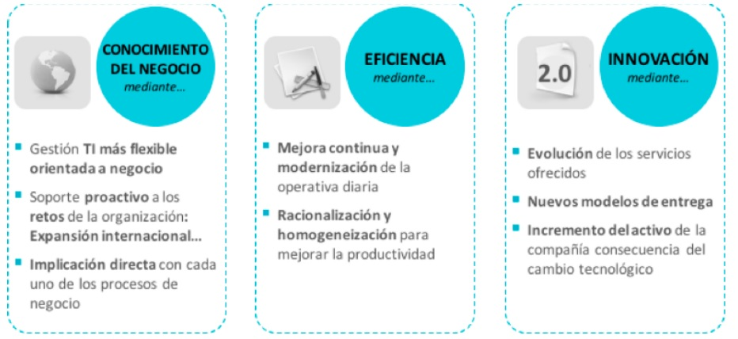

:slug: hablando-transformacion-digital/
:date: 2016-11-15
:category: general
:tags: transformar, evolucionar, digital
:Image: transformacion-digital.png
:author: Ivan Velez
:writer: ivanv
:name: Ivan Velez
:about1: Ingeniero de sistemas con mas de 25 años de experiencia, en estrategia, diseño y operación de TI.
:about2: Linkedin

= Hablando un poco de la transformación digital

Como gestores de TI, el negocio nos pide centrar nuestros esfuerzos en tres
líneas de visión permanente: la tecnología con temas de punta como el cloud, 
la analítica de negocios y la movilidad, el negocio con las expectativas del 
cliente, los modelos operativos, el permanente control de los costos y mirar el 
entorno, a nivel de competencia global, manejo de la incertidumbre y los marcos 
regulatorios. Todo lo anterior plantea un cambio total de nuestra mentalidad en 
TI.

Cuando revisamos que debemos hacer en TI, nos surgen puntos a tener en cuenta, 
tales como:

* Acompañar al negocio en sus retos con la mayor flexibilidad desde la 
internacionalización, la diversicación, la innovación hasta la convergencia, 
concentración o austeridad.
* Generar nuevas capacidades que supongan una diferenciación competitiva para 
el negocio.
* Ser cada día más eficiente, ganar en dinamismo y simplicación desde el 
conocimiento de los procesos de negocio.
* Contener el presupuesto de TI y distribuirlo de manera eficiente.
* Adelantarse a las demandas del negocio desde el conocimiento e innovación 
tecnológica.
* Facilitar en definitiva la cadena de valor de una organización como palanca 
para alcanzar los objetivos de negocio marcados.

Pero no es solo eso, también tenemos un rol, al interior de nuestras 
organizaciones, la alta dirección espera que las tecnologías de la información 
tengan un efecto en el negocio colaborando directamente en la estrategia 
mediante la aportación de soluciones que creen ventajas sostenibles en el 
tiempo. Por esta razón, desde el rol, nos piden tres objetivos principales:

.Cercanía al negocio.
.Búsqueda de la eficiencia.
.Innovación continua.

Ahora bien, el mundo viene hablando de transformación digital. Tomando la 
definición del TechTarget, que la define como:

[quote]
”La transformación digital es la reinvención de una organización a través de la 
utilización de la tecnología digital para mejorar la forma en que se la 
organización se desempeña y sirve a quienes la constituyen. Digital se refiere 
al uso de la tecnología que genera, almacena y procesa los datos”.

Esto más que una moda es una necesidad, en múltiples estudios realizados a los 
gestores de TI, tanto a nivel directivo/estratégico como a los operativos, 
todos coinciden en el alto grado de importancia que tienen en los negocios 
actuales y en su permanencia, el uso de las tecnologías, pero debemos ver un 
poco más allá.

El cambio de la mentalidad de los gestores de TI, donde pasan de ser los dueños 
de la infraestructura y los procesos inherentes a TI, a ser gestores de TI que 
alinean la parte técnica a las necesidades del negocio. ¿Miremos lo que ocurre 
con las nuevas empresas en la economía colaborativa tales como Uber o Airbnb, 
que se definen como empresas de tecnología que operan en un mercado específico,
cuántas de nuestras empresas pueden dar ese tipo de pasos?

El reto es redefinirse completamente desde la concepción y el uso de la
tecnología para este fin, conceptos como el TI flexible, la nube y sobre todo 
la seguridad de usar estos servicios se vuelven nuestro reto como gestores de 
TI.

Cambiar la mentalidad y pasar de ser meramente técnicos a ser estrategas, 
también genera un cambio en el rol de los departamentos de TI, pasando de ser 
transversales y de soporte, a ser estratégicos para el negocio.

Todo lo anterior nos llama a cambiar nuestra comunicación, y desde lo técnico 
aportar a la estrategia del negocio, para esto debemos aprender a comunicarnos 
con el negocio. No caigamos en la moda, y en las definiciones que hacen los 
fabricantes de este tema, seamos críticos de nuestro entorno y transformémonos 
como profesionales, ese es el reto de la verdadera transformación digital.
