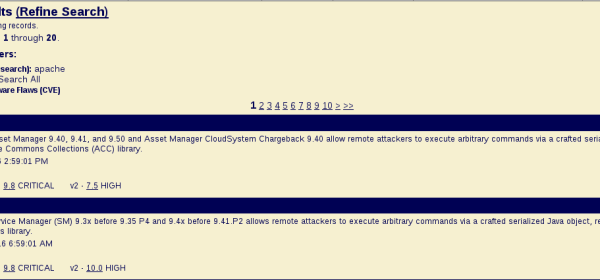
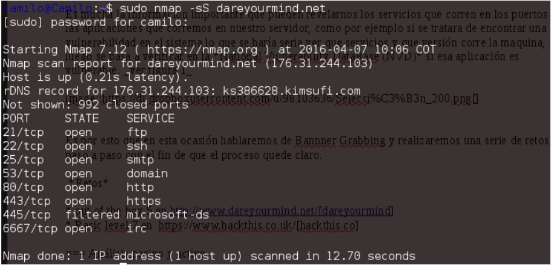
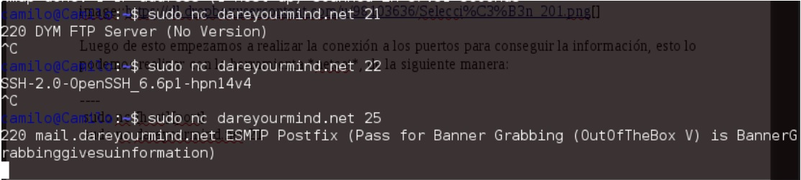

:slug: informacion-servicios-revelada/
:date: 2016-10-11
:category: retos
:subtitle: Solución a retos de dareyoumind y hackthis
:tags: información, herramienta, reto, solucionar
:image: banner.png
:alt: Página de resultados luego de hacer una búsqueda
:description: Banner grabbing es una técnica para recolectar información de un sistema a través del análisis de los servicios que corren en sus puertos. Ésto puede ser utilizado por un atacante para encontrar servicios vulnerables. A continuación se presenta un ejemplo de aplicación de banner grabbing.
:keywords: Seguridad, Banner Grabbing, Recolectar, Información, Web, Ataque.
:author: Camilo Cardona
:writer: camiloc
:name: Camilo Cardona
:about1: Ingeniero de sistemas y computación, OSCP, OSWP
:about2: "No tengo talentos especiales, pero sí soy profundamente curioso" Albert Einstein.

= Información de servicios revelada

+Banner grabbing+ es una técnica que se usa para recolectar información de un
sistema, esto se hace a través del análisis de los servicios que corren en los
puertos de la máquina, pero ésta no es la única forma, esto puede ser usado por
el administrador con el fin de reconocer y clasificar los dispositivos, pero
también puede ser usado por un atacante con el fin de encontrar servicios
vulnerables para su ataque.

En esta ocasión veremos como recolectar información de los sistemas usando
herramientas como +nmap+ y +netcat+, realizaremos un par de ejercicios prácticos
en plataformas como +dareyourmind+ y +hackthis+ y enseñaremos algunos controles
para mitigar la amenaza.

La información importante que puede revelarnos los servicios que corren en los
puertos o las aplicaciones que corremos en nuestro servidor, como por ejemplo
para encontrar una vulnerabilidad en el sistema se debe encontrar qué servicios
y qué versión corre la máquina, luego se pasa a verificar
en la +National Vulnerability DataBase+ (+NVD+) si esa aplicación es vulnerable.

En esta ocasión hablaremos de +Bannner Grabbing+ y realizaremos una serie de
retos paso a paso.

== Retos

* Out of the box 5 en link:http://www.dareyourmind.net/index.html[dareyourmind]
* Basic level 7 en link:https://www.hackthis.co.uk/[hackthis.co]

== Análisis pasivo y activo

Una herramienta muy completa para el análisis de puertos y la red es +nmap+,
además nos ayuda a identificar los servicios que corren en cada puerto, en este
par de ejercicios usaremos +nmap+, pero antes de seguir tenemos que dejar claro
que un puerto puede tener 3 estados que pueden ser:

[width="95%"]
|===
| +Open+ |El puerto esta abierto y corre un servicio en él.
| +Closed+ |El puerto no esta en uso por ningún servicio.
| +Filtered+ |El puerto esta filtrado ya sea por un +Firewall+
u otro dispositivo o
aplicación que se encarga de filtrar todos los paquetes.
|===

Ya sabiendo esto procedemos al análisis, usando el siguiente comando:

.example.sh
[source, bash, linenums]
----
% sudo nmap [options][url]
% sudo nmap -sS dareyourmind.net
----

Como se ve en la figura, son muchos los puertos abiertos.
podemos observar en la parte derecha los servicios que corre la maquina.

Luego de esto, empezamos a realizar la conexión a los puertos
para conseguir la información, esto lo podemos realizar
con la herramienta +Netcat+, de la siguiente manera:

[source, bash, linenums]
----
% sudo nc [host][port]
% sudo nc dareyourmind.net [port]
----

Como se ve en la siguiente figura,
podemos obtener la versión de +SSH+, +FTP+, +smtp+.

Para el segundo ejercicio es necesario analizar todos los puertos, ya que si
por alguna razón hay un puerto filtrado o abierto y el servicio que corre es
desconocido (+unknow+), +nmap+ lo puede omitir, es por eso que debemos analizar
todos los puertos que en total son 65535.

[source, shell, linenums]
----
sudo nmap -sS hackthis.co.uk -p0-65535 hackthis.co.uk
----

Lo ideal si esto fuera un caso real es analizar todos los puertos abiertos, ya
que en ocasiones las aplicaciones mal intencionadas corren en los puertos más
altos e inclusive analizar los que corren bajo +udp+, para esto usamos la opción
+-sU+.

Ahora vemos que existen muchos puertos que corren servicios desconocidos, estos
pueden ser +shells+ u otras aplicaciones. Luego de realizar el mismo proceso que
el ejercicio anterior nos damos cuenta que en el puerto 6776 corre un +banner+
especial.

En general existen muchas recomendaciones que pueden surgir frente a este tema,
pero entre las más importantes están:

* Configurar adecuadamente las directrices de cada aplicación,
por ejemplo, +Apache+ tiene la opción de configurar la información
que queremos mostrar si hay un error.
Lo ideal sería mostrar la menor información posible.
* Solo usar las aplicaciones y los puertos que sean necesarios. Actualizar los
paquetes y aplicaciones cada vez que salga una nueva versión estable de las
mismas.
* Si encontramos una anomalía en el sistema reportarlo, por ejemplo puertos con
servicios desconocidos, o trafico anómalo.
* Realizar periódicamente análisis de los sistemas, pero hay que tener en
cuenta que esto debe ser con consentimiento de la organización y siguiendo un
plan de seguridad.
