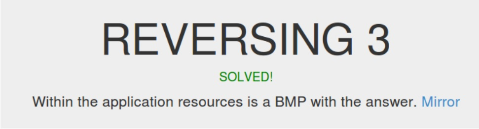
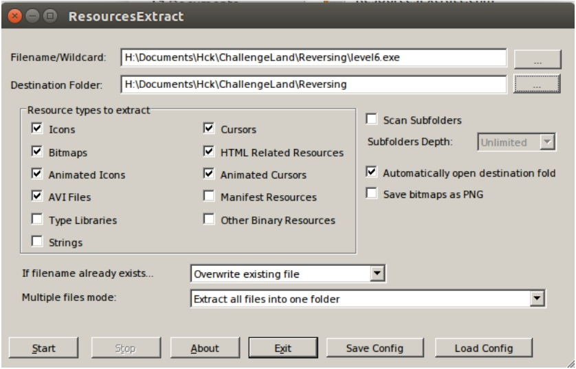

:slug: ingenieria-inversa/
:date: 2016-11-22
:category: retos
:tags: reto, revertir, ingeniería, solucionar
:Image: inversa.png
:alt: Pingüino de Linux visto a través de Rayos-X
:description: TODO
:keywords: TODO
:author: Alejandro Aguirre
:writer: alejoa
:name: Alejandro Aguirre Soto
:about1: Ingeniero mecatrónico, Escuela de Ingeniería de Antioquia, Maestría en Simulación de sistemas fluidos, Arts et Métiers Paristech, Francia, Java programming specialization, Duke University , USA
:about2: Apasionado por el conocimiento, el arte y la ciencia.

= Extracción de información a la inversa

La Ingeniería inversa es la encargada de tomar un producto tangible o 
intangible, y examinarlo por partes con el fin de responder a preguntas como: 
¿De qué está hecho? ¿Cómo funciona? ¿Cómo se fabricó?. En general trata de 
descubrir el funcionamiento integral de algo, se le llama así debido a que su 
proceso va en contravía con el proceso de diseño normal en ingeniería, tomando 
primero lo más visible del producto para llegar al final a lo más invisible 
(o lo no tan obvio) de este, y en el proceso ir descubriendo su funcionamiento 
y características.

Existen muchas empresas en el mundo que se encargan de hacer ingeniería 
inversa, esto con el fin de sacar al mercado un producto mejorado, o una copia 
de un producto original que cumple la misma labor con pequeñas modicaciones. En 
China es muy común ver este tipo de empresas funcionar, y esto ha originado una 
gran polémica en torno al uso de la ingeniería inversa debido a las posibles 
violaciones de propiedad intelectual.

== Informática a la inversa

En la informática ha existido una constante lucha que se origina desde el mismo 
momento en que se empezaron a comercializar los computadores, la lucha entre el 
software libre y el software privado. El software libre es aquel que busca que 
el código fuente de los programas sea público y modicable, mientras el privado 
hace lo contrario. Esto ha llevado a que muchas personas que desarrollan 
software libre opten por la ingeniería inversa al software privado y 
desarrollen aplicaciones “open source” (de código abierto) que compiten con las 
aplicaciones y programas privados, por ejemplo el software OpenOffice compite 
con el Microsoft Office, y el sistema operativo Linux compite con Windows.

.*_John Schreiner – https://illustrationonline.com/[IlustrationOnline]_*

La comunidad de software libre se ha transformado en todo un movimiento 
filosófico/ideológico que busca democratizar el software y la tecnología
informática para que el funcionamiento de un programa sea de conocimiento 
público y su uso sea modicable. Existen un sin número de desarrolladores 
voluntarios de software libre alrededor del mundo que trabajan conjuntamente, 
por eso normalmente el software libre se encuentra de manera gratuita en el 
mercado, siendo esto no siempre cierto, ya que al software libre también se le 
puede adjudicar un precio y ser vendido como el software privado.

La ingeniería inversa ha sido muy útil para encontrar vulnerabilidades de 
seguridad en software privado y “crackearlo” es decir, piratearlo, así pues las
personas que no pueden o no quieren pagar por un programa privado, lo piratean y
lo usan de manera no tan legal. Este es un gran problema que enfrentan las 
empresas como Microsoft que producen software privado, ya que existen muchos 
piratas informáticos cuya tarea ha sido “crackear” o hacer ingeniería inversa 
a muchos de sus programas.

== Reto Challengeland Reversing 6

En este reto nos proporcionan un Mirror o programa ejecutable (.EXE) el cual 
es un programa privado, al cual le debemos hacer ingeniería inversa para 
extraerle información. Nos indican que la contraseña para pasar de nivel está 
en una imagen BMP (imagen de mapa de bits) que se encuentra dentro del programa.

.*_Reto Reversing – http://challengeland.co/[Challengeland]_*

Vamos a utilizar un software gratuito que se encuentra en internet, el 
software se llama http://www.nirsoft.net/utils/resources_extract.html[Resource-Extract] 
y nos ayuda a sacarle a un ejecutable (.EXE) todos los recursos que tenga, 
como por ejemplo las imágenes, iconos, código binario, etc.

Abrimos este software, como se aprecia en la imagen de abajo, en el campo 
Filename/Wildcard ponemos nuestro ejecutable y en el campo Destination Folder, 
la carpeta donde queremos encontrar nuestros archivos extraídos, también es 
posible seleccionar también los recursos que deseamos extraer del ejecutable.

.*_Herramienta de ingeniería inversa – Resource-Extract_*

Pulsamos el botón Start y el software empezará a extraer todos los recursos que 
le hayamos indicado. Podemos ver una imagen BMP en la carpeta que destinamos 
como Destination folder, abrimos esta imagen y veremos la contraseña/solución 
de este reto.

La ingeniería inversa tiene su lado bueno y su lado oscuro. Su lado bueno ha
logrado crear muchos programas libres tan competitivos como los que existen 
privadamente, su lado oscuro, es que ha permitido piratear un sin fin de 
programas privados y violar la propiedad intelectual de estos, de manera que la 
ingeniería inversa no es siempre un término que se relacione con lo legal. Al 
software libre no se le puede hacer ingeniería inversa, ya que este tipo de 
software por naturaleza expone su funcionamiento de manera libre y pública.
