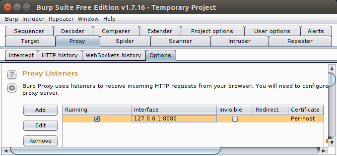
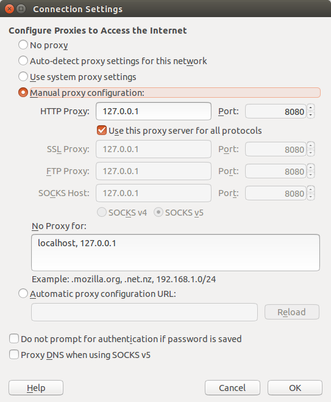
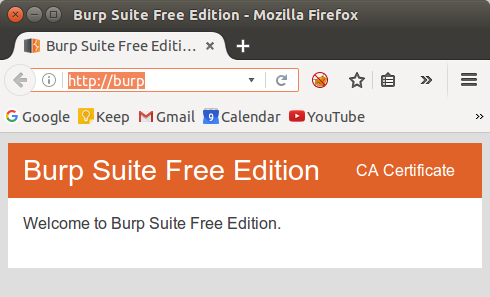
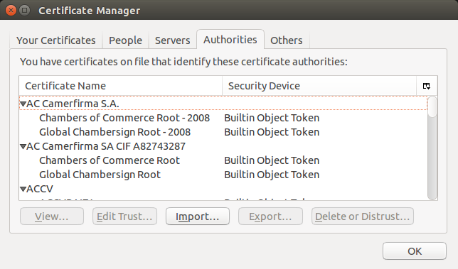
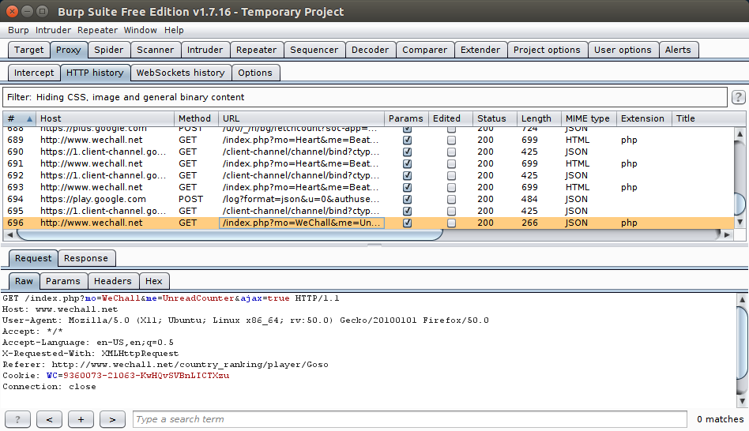

:slug: interceptando-burp/
:date: 2017-01-30
:category: ataques
:subtitle: Cómo alterar las peticiones entre servidor y navegador
:tags: herramienta, proxy, interceptar
:image: burp-intercept.png
:alt: Imagen de inicio del programa Burp
:description: BurpSuite es un software desarrollado para realizar Pruebas de penetración o Pentesting. Cuenta con una amplia variedad de herramientas y funcionalidades para encontrar vulnerabilidades. En este artículo utilizaremos burp para resolver un reto de hacking al interceptar tráfico de información.
:keywords: Seguridad, Software, BurpSuite, Interceptar, Tráfico, Servidor.
:author: Alejandro Aguirre
:writer: alejoa
:name: Alejandro Aguirre Soto
:about1: Ingeniero mecatrónico, Escuela de Ingeniería de Antioquia, Maestría en Simulación de sistemas fluidos, Arts et Métiers Paristech, Francia, Java programming specialization, Duke University , USA
:about2: Apasionado por el conocimiento, el arte y la ciencia.

= Interceptando con burp

Burp Suite es un software creado por la compañia
link:https://portswigger.net/burp/[PortSwigger] Web Security con el fin de proveer
herramientas para los test de penetración o Penetration testing en seguridad
informática. Es ampliamente usado entre la comunidad especializada en seguridad
ya que sus herramientas son bastante robustas y completas, además de que tiene
una versión totalmente gratuita aunque limitada en sus funcionalidades.

Entre sus herramientas se caracterizan el Proxy adecuado para interceptar
datos, el Scanner para escanear las vulnerabilidades de una aplicación web, el
Spider para encontrar directorios ocultos y el Comparer para comparar las
diferencias entre dos archivos.

.Burp Suite

En este artículo vamos a implementar la versión gratuita de Burp Suite para
interceptar el tráfico entre el servidor y el navegador, con el fin de
manipular la información enviada en cada petición.

== Configuración básica

Una vez descargada la versión gratuita, la instalamos según el sistema
operativo que tengamos y una vez instalada simplemente elegimos abrir un nuevo
proyecto temporal, y nos dirigimos a la sección Proxy luego a Options

.Configurando Burp

Como vemos en la imagen, nuestro proxy estará escuchando el tráfico de la red en
la ip 127.0.0.1 en el puerto 8080.

Ahora vamos a configurar nuestro navegador web:

En nuesro navegador debemos utilizar la opción del proxy con el fin de desviar
el tráfico web a Burp. En este caso se implementará el navegador mozilla
firefox:
Simplemente nos dirigimos a Preferences > Advanced > Network y debemos tener
la configuración que vemos en la siguiente im
agen:

.Configurando Mozilla

Luego debemos activar el certificado de seguridad para permitir que Burp
intercepte el tráfico. Simplemente nos dirigimos a
link:http://burp/[la página de +burp+] y descargamos
el certificado CA certificate ubicado en la esquina superior derecha:

.CA Certificate

Y lo importamos al navegador dirigiendonos a Preferences > Advanced >
Certificates > View Certificates > Authorities:

.importamos el certificado con Import

Hasta ahora ya hemos configurado Burp para que funcione conjuntamente con el
navegador mozilla firefox. Para saber si esta leyendo las peticiones que el
navegador hace, nos dirigimos a Burp > Proxy > HTTP history

Y todo lo que haga el navegador se mostrará por esta consola:

.Leyendo las peticiones

Como se puede apreciar en la imagen podemos ver la URL a la que se le hizo la
petición (Request), que tipo de petición se hizo (e.g GET, POST), el estado de
la petición del protocolo HTTP (200, 300, 404) y finalmente la respuesta
(Response).

Cabe destacar que con la configuración que tenemos en este momento todas el
tráfico que pase por el mozilla será leído por Burp.
