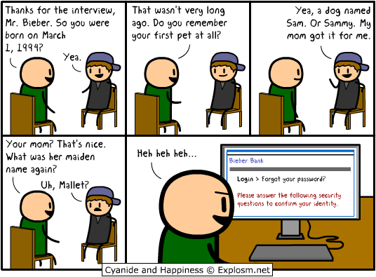

:slug: introduccion-ingenieria-social/
:date: 2017-05-16
:category: opiniones-de-seguridad
:tags: concientizar, ingeniería, social, amenaza
:Image: ingenieriasocial.png
:alt: Mano manejando una marioneta que está interactuando con otras marionetas
:author: Jhony Villa
:writer: jhony
:name: Jhony Arbey Villa Peña
:about1: Ingeniero en Sistemas.
:about2: Apasionado por las redes la música y la seguridad.

= Cadenas y eslabones: Inicio en la ingeniería social

[quote]
“Una cadena es tan fuerte como el más débil de sus eslabones”. Thomas Reid.

Hace más de doscientos años este filósofo escocés usó esta popular frase, en uno de sus ensayos, 
para explicar el uso del sentido común en la concepción y justificación del conocimiento. Y en el 
caso de la seguridad informática y la información, el eslabón más débil en cualquier sistema son 
las personas.

En el presente artículo pretendo dar una pequeña explicación de lo que es la ingeniería social. 
Además, voy a mencionar de manera corta, cuales son los objetivos principales que se persiguen con 
esta y cuáles son las técnicas más utilizadas para conseguirlos. Sin dejar a un lado algunos 
consejos básicos que se deberían seguir para evitar ser víctimas de este tipo de amenazas.

El empleo de técnicas psicológicas y tecnológicas como medio para lograr manipular a una o varias 
personas y conseguir que estas realicen actos que voluntariamente no harían o, en términos 
informáticos, hacer que revelen información que se supone no debe ser revelada, se conoce como 
ingeniería social.

.*_Ingeniería Social - http://explosm.net/comics/2919/[explosm.net]_* 

La ingeniería social es tan antigua como la misma humanidad. A través de la historia se ha usado 
para iniciar, mantener o terminar una guerra; como bien puede ser visto en el libro 
El Príncipe – Nicolás Maquiavelo. Incluso, aunque muchos no seamos conscientes de ello, constantemente 
hacemos uso de la ingeniería social para obtener beneficios tan simples como comerse el último 
chocolate de la caja de dulces, ganar una pequeña apuesta o tener una cita con alguien.

Pero en seguridad informática el uso de la ingeniería social tiene otros objetivos más complejos y 
peligrosos. Estos objetivos pueden ser:

* Robar la información financiera de las víctimas, números de cuenta, contraseñas, tarjetas de crédito.

* Obtener y suplantar la identidad de una persona, sea para venderla posteriormente y/o hacer uso de 
esta con fines chantajistas y amenazantes.

* Acceder a sistemas de información a los que, se supone, el atacante no debería tener acceso, con 
el fin de conseguir datos confidenciales de las organizaciones tanto gubernamentales como privadas 
para así poder divulgarlos o venderlos a la competencia.

En consecuencia, para alcanzar dichos objetivos, los atacantes se valen de técnicas como: engañar a 
una persona haciéndose pasar por el administrador de un sistema con el fin de que la víctima revele 
información confidencial al segundo. Un ejemplo de ello son los famosos correos electrónicos donde 
el remitente, haciéndose pasar por miembro del personal administrativo de una entidad bancaria, 
solicita al receptor el número y la contraseña de su cuenta de ahorros argumentando problemas con 
la misma.

Otra técnica bastante utilizada, llamada baiting, se basa en aprovechar la curiosidad y confianza 
de las personas. Consiste en dejar en determinado lugar por lo general un sitio frecuentado por 
los empleados de determinada organización, y previamente infectado con un software malicioso, algún 
dispositivo de almacenamiento extraíble con el fin de que la víctima lo encuentre y cuando haga uso 
de este insertándolo en su equipo, con ayuda del malware robar la información y obtener acceso al 
sistema.

.*_Social Engineering Attacks – http://socialnewsdaily.com/66048/social-engineering-attacks-how-to-protect-facebook-account/[socialnewsdaily]_*

También existe una técnica muy común que hace uso de las redes sociales y al igual que el baiting, 
la curiosidad inherente de las personas. En esta técnica los atacantes publican información falsa 
pero bastante llamativa en las redes sociales de tal manera que cuando las víctimas accedan a ella, 
engañarlas para que revelen sus datos, descarguen software malicioso para múltiples fines, o 
simplemente espiar sus hábitos de navegación. Un ejemplo de este ataque es la famosa aplicación 
para Facebook “¿A qué famoso te pareces?” que recopila la información de los perfiles de las 
personas que lo usan para después venderla a terceros.

Hay diversas técnicas de ingeniería social, algunas más usadas que otras, algunas con objetivos más 
concretos que otras, pero eso sí todas están en constante evolución para adaptarse a las exigencias 
y cambios constantes de la sociedad, y todas tienen la finalidad de engañar a las personas. El 
problema es que no hay ninguna forma de evitar los ataques de ingeniería social y esto se debe a la 
complejidad de las mismas personas, todas las personas somos distintas y por tanto actuamos de manera 
diferente. Lo máximo que se puede hacer es intentar crear una conciencia colectiva de esta 
problemática y sobre todo motivar a que las personas usen el sentido común, es decir, de que estén 
atentos a todo.

Sospechar cuando un mensaje de texto o correo electrónico les solicite información confidencial, o 
en su defecto tenga links que los dirijan a sitios sospechosos o falsos. Evitar acceder a noticias 
extrañas o falsas o simplemente desvincular las redes sociales de páginas que promulguen ese tipo 
de información, ser conscientes que nadie regala nada porque si y mucho menos a un desconocido, 
por ende esos mensajes de texto o correos electrónicos que nos hacen acreedores de un apartamento 
lujoso o herederos de una fortuna multimillonaria son falsos. Estar conscientes de que por 
políticas de seguridad, ningún miembro de ninguna organización financiera está autorizado a pedir 
información confidencial de las cuentas de ahorros o tarjetas de crédito de ninguna persona. Y que 
en caso de ser víctima, existe la posibilidad de acudir a las autoridades pertinentes.

En conclusión, la ingeniería social en sistemas informáticos no es más que una estafa bien elaborada. 
Y como buena estafa se basa en principios básicos de la condición humana; la necesidad de ayudar a 
otros y sentirse útiles, y querer ser reconocidos y alabados por los demás. Por eso, es muy 
importante estar siempre atentos a cualquier intento de manipulación que pueda jugar en nuestra 
contra y en ese sentido estar preparados y dispuestos a adoptar todas las medidas pertinentes tanto 
en lo personal como en lo profesional.
