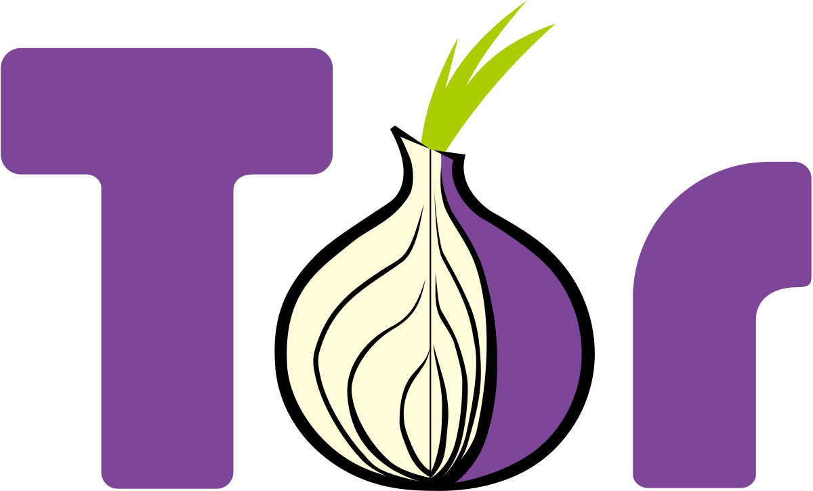
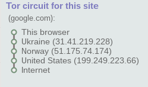
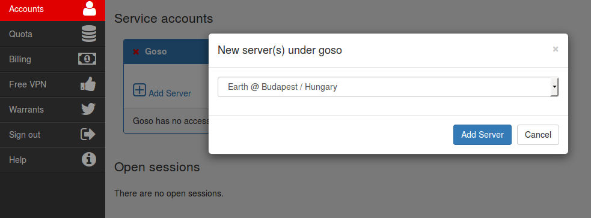

:slug: ip-otro-pais
:date: 2016-12-24
:category: retos
:tags: red, reto, solucionar, herramienta
:Image: ip.png
:author: Alejandro Aguirre
:writer: alejoa
:name: Alejandro Aguirre Soto
:about1: Ingeniero mecatrónico, Escuela de Ingeniería de Antioquia, Maestría en Simulación de sistemas fluidos, Arts et Métiers Paristech, Francia, Java programming specialization, Duke University , USA
:about2: Apasionado por el conocimiento, el arte y la ciencia.

= Quiero una IP de otro país

Una dirección IP es un número de identificación de red para dispositivos que 
están conectados a internet, tales como computadores, routers, servidores, 
teléfonos inteligentes, tablets, etc.. Análogamente como la dirección de un 
domicilio nos sirve para encontrar la ubicación de un lugar en una ciudad, la 
dirección IP nos sirve para encontrar en internet la ubicación de un 
dispositivo necesariamente conectado a la red.

La dirección IP puede ser de dos tipos: *IP dinámica* o *IP estática*. En el 
primer caso la dirección es asignada por el proveedor de servicios de internet 
y cambia con el tiempo. En el segundo caso la IP es fija y no cambia. 
Normalmente los servidores de páginas web y servidores en general son los 
dispositivos que nunca deben cambiar de IP en el tiempo, es decir su IP siempre 
debe ser fija o estática, ya que las personas que navegan por internet y se 
conectan a sitios web, en realidad se están conectando a un servidor cuya 
ubicación en la red debe ser siempre la misma, porque no sería nada óptimo que 
alguien quiera ir a un sitio que cambia de lugar cada cierto tiempo.

== Quiero conocer mi IP

Existen varias páginas web que nos proporcionan información sobre nuestra IP 
actual, se puede ingresar por ejemplo a www.cual-es-mi-ip.net, y no sólo nos 
dirán cual es nuestra dirección IP sino también el país en el cual nos estamos 
conectando, nuestro proveedor de servicios y también si nuestra ip es estática 
o dinámica. sólo con conocer nuestro país ya se estaría vulnerando un poco 
nuestra privacidad, pero esto no termina acá! también se puede conocer el nodo 
mas cercano al que estamos conectados, es decir, se puede saber desde que ciudad 
estamos conectados!

== IP y seguridad

Como la IP es una dirección pública, la seguridad informática cambia 
dependiendo de si la IP es estática o dinámica; por ejemplo para una IP 
estática de un sitio web, la seguridad es implementada en la buena programación 
y protección del servidor, pero para las IPs dinámicas (usuarios comunes) la 
seguridad esta basada en el anonimato, es decir, que no se sepa de donde se 
está conectando.

== Tor

or de las siglas "The Onion Router" es un proyecto cuyo objetivo principal es 
el desarrollo de una red de comunicaciones distribuida de baja latencia y 
superpuesta sobre internet (Ver Referencias). El navegador tor nos permite 
navegar en internet anonimamente haciendo un puente de IPs para cambiar de 
dirección IP y en consecuencia cambiar de país de conexión. Se puede descargar 
gratuitamente desde su página web: https://www.torproject.org/download/download[Tor browser]

Lo ejecutamos y cuando conectamos a www.google.com, podemos ver claramente en 
la Figura el puente de direccionamiento que se ha creado y el país en el cual 
estamos, internet piensa que estamos en otro país!

== Reto HaxTor Nivel 8

En este reto nos dicen que la contraseña se encuentra en la siguiente página 
web: https://hax.tor.hu/level8/the_password/index.jpg[password level 8] pero 
una vez ingresamos a esta página, nos muestra el siguiente mensaje: oops, 
directory needs .hu host to see. Es decir tenemos que ingresar desde un host 
ubicado en Hungría para poder ver la contraseña. Porque la extensión .hu es 
utilizada por sitios web ubicados en este país.

image::mensaje.png[]

Con el software Tor podemos cambiar nuestra ip y nuestro país por uno como 
Hungría, pero al parecer la página necesita que nuestro host sea propiamente de 
hungría, es decir con Tor, no lograremos solucionar este reto. Entonces se opta 
por utilizar el software OpenVPN basado en software libre, OpenVPN ofrece 
conectividad punto-a-punto con validación jerárquica de usuarios y host 
conectados remotamente a travez de la implementación de una red VPN (red 
privada virtual).

Creamos una cuenta en OpenVpn, y seguimos las instrucciones de instalación 
según el sistema operativo que usemos. Ahora para cambiar nuestro Host nos 
dirigimos a Accounts→ Add Server → Earth @ Budapest/Hungary.

Una vez agregado el host, lo ponemos en funcionamiento en nuestro computador 
siguiendo las instrucciones brindadas por OpenVpn (el funcionamiento cambia 
según nuestro sistema operativo) ingresamos a la página del reto HaxTor que 
escondía la contraseña, y si la red privada virtual se ha creado bien, la 
página nos revelará la contraseña!

Para concluir el anonimato en internet es sumamente importante para los 
usuarios de internet, porque a pesar de que internet es una herramienta útil 
para realizar un sin fin de tareas, hay muchos atacantes que buscan violar la 
privacidad de las personas y robar su información, por eso es bueno conocer 
como podemos esconder, al menos nuestra ubicación en la red.

Cabe resaltar que la navegación segura siempre es responsabilidad del buen 
usuario de internet, que no deja sus datos personales a la deriva, en el confín 
digital del internet.