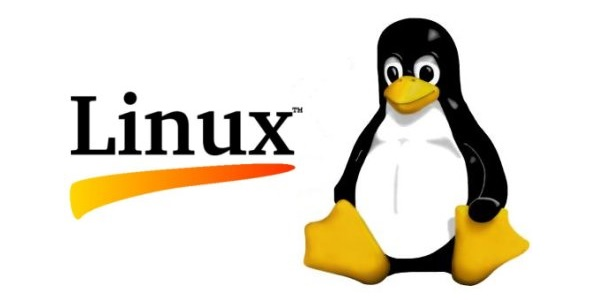
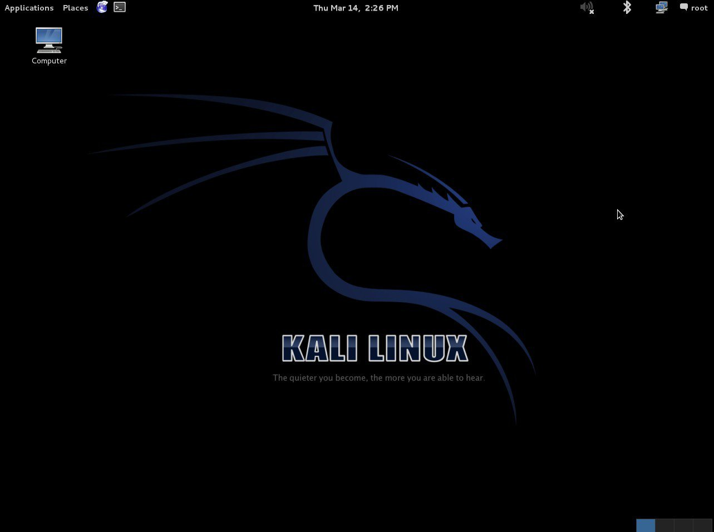
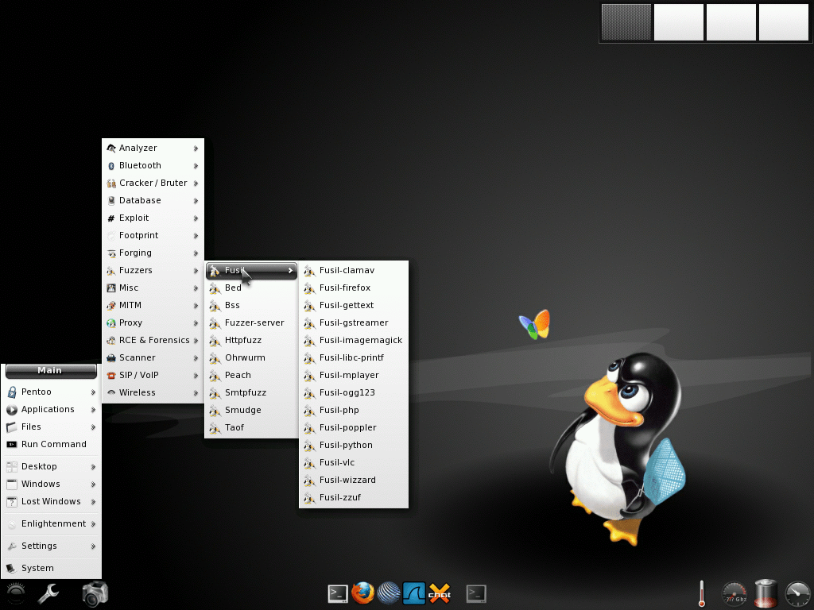
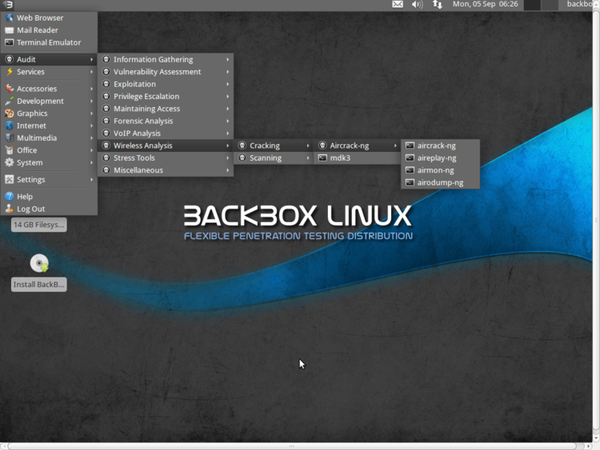
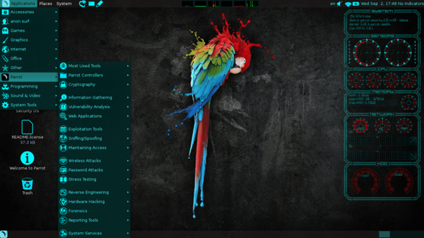

:slug: linux-aliado/
:date: 2017-03-07
:category: opiniones
:tags: linux, probar, versión
:image: linux.png
:alt: Tarjeta electrónica con un botón central con el símbolo de Linux
:description: Los profesionales y aficionados al pentesting requieren de herramientas que faciliten sus tareas, y la elección de un sistema operativo adecuado es una decisión primordial. En este artículo presentamos varias versiones de Linux pensadas para pentesting que te pueden resultar útiles.
:keywords: Seguridad, Versión, Linux, Pentesting, SO, Distribución.
:author: Francisco Bernal
:writer: pacho
:name: Francisco Bernal Baquero
:about1: Ingeniero Electrónico.
:about2: Programador en Python y Ruby, siempre dispuesto a aprender.

= Linux de nuestro lado

Linux es un sistema operativo muy maleable y es que al ser un sistema operativo
basado en licencia link:https://opensource.com/resources/what-open-source[_open source_]
hay distribuciones; prácticamente para cada aspecto profesional que se le
ocurra, desde una distribución link:http://blog.desdelinux.net/aperture-linux-la-distribucion-para-fotografos/[especializada para fotógrafos]
hasta:: herramientas para prueba de penetración _pentest_ y seguridad informática
y es que Linux se ha convirtiendo en la mejor opción para hallar
vulnerabilidades:: en un sistema, un pentest es un ataque a un sistema
informático con el fin de encontrar brechas de seguridad en las que se podría
tener acceso a ella::, a su información o incluso controlar al sistema
remotamente, todos las problemas de seguridad hallados a través de un pentest
deben ser notificados:: al propietario del sistema afectado, con los resultados
de estos pentest se evalúan los potenciales impactos a la seguridad e
integridad de la:: información y sugerir medidas para contrarrestar los ataques.

.Logo de Linux footnote:[Imagen tomada de link:http://www.unixforum.co.uk/[Foro UNIX]]

== ¿Por qué usar Linux?

Los profesionales en _pentesting_ cuentan con herramientas indispensables para poder ejecutar sus proyectos.

Las herramientas y sistemas operativos preferidos por los hackers éticos están basados exclusivamente en Linux.

La reputación de Linux como sistema operativo seguro se ha mantenido desde sus inicios, y siempre las vulnerabilidades y fallos de seguridad son menos desastrosos que los que aparecen en Windows.

* Linux es uno de los sistemas operativos más robustos y estables.
* La comunidad está siempre en constante desarrollo y mejora de herramientas.
* La forma de manejo de la memoria en Linux evita que un error en la ejecución de una aplicación detenga el núcleo de Linux.
* Linux desde sus inicios ha sido multitarea y multiusuario concepto que Windows tardo más de dos décadas en implementar.

== link:https://www.kali.org/[Kali Linux]

.Escritorio de Kali

Kali Linux es derivado de las distribuciones Debian, actualmente está siendo
mantenida por link:https://www.offensive-security.com/[_Offensive Security Ltd_].
Fue desarrollada por Mati Aharoni y Devon Kearns, es la versión actualizada de
BackTrack. Es una de las distros más completas con una suite de
link:http://tools.kali.org/tools-listing[aplicaciones especializadas] desde análisis
forense hasta análisis de vulnerabilidades.

Requisitos de instalación::
* Un mínimo de 8 GB de espacio en disco para la instalación de Kali Linux.
* Para las arquitecturas i386 y amd64, un mínimo de 512 MB de RAM.
* Lectora de CD/DVD / Soporte para iniciar desde una memoria USB

== link:http://www.pentoo.ch/[Pentoo]

.Escritorio de pentoo footnote:[Imagen tomada de link:https://bytescode.wordpress.com/[BytesCode]]

Pentoo es un Live CD y Live USB diseñada para pentest y evaluación de
seguridad. Se basa en link:https://www.gentoo.org/[Linux Gentoo], pentoo está
disponible en LiveCD de 32 y 64 bits, Pentoo está también disponible como una
superposición de una instalación existente de Gentoo, se destacan de Pentoo sus
paquetes de inyección Wifi y un sinfín de herramientas para pentest.

Pentoo es en palabras simples una instalación de gentoo con herramientas
personalizadas, kernel personalizado, y características como:

. Kernel endurecido con parches link:http://www.thegeekstuff.com/2013/05/linux-aufs/[aufs]
. link:https://www.xfce.org/[XFCE4]
. Soporte de _cracking_ de link:https://www.exploit-db.com/docs/24909.pdf[Cuda] /
link:https://developer.nvidia.com/opencl[OPENCL] con herramientas de desarrollo

== link:https://backbox.org/[BackBox Linux]

.Escritorio de BackBox footnote:[Imagen tomada de link:http://www.subhashdasyam.com[SubHashDasyam]]

BackBox está basado en link:https://www.ubuntu.com[Ubuntu] y diseñado para realizar
pentest, respuesta a incidentes e informática forense. El objetivo principal de
BackBox es proveer una alternativa altamente modificable y un buen desempeño de
sistema.

Este sistema incluye las herramientas de seguridad y análisis más usadas en el
ambiente de Linux. Abarcando una amplia gama de aplicaciones, desde análisis de
aplicaciones web hasta análisis de red.

Parte de su atractivo viene de su repositorio, el cual constantemente es
actualizado a la última versión estable de las herramientas más conocidas para
realizar ethical hacking.

Requisitos de instalación::
* Un mínimo de 4.4 GB de espacio en disco para la instalación de BackBox.
* Para las arquitecturas i386 y amd64, un mínimo de 512 MB de RAM.
* Lectora de CD/DVD / Soporte para iniciar desde una memoria USB

== link:https://www.parrotsec.org/[Parrot Security OS]

.Escritorio de Parrot footnote:[Imagen tomada de link:http://linux.softwsp.com[Softwsp]]

Es un sistema operativo basado en la nube para realizar pentest, informática
forense, Ingeniería Inversa, Hackeo, cloud pentest, privacidad/anonimato y
criptografía. Basado en Debian y desarrollado por Frozenbox Network.
Parrot es un sistema operativo diseñado para los profesionales y novatos en
pentesting, viene provisto de las herramientas más profesionales combinadas con
una forma fácil de uso en un entorno ligero y rápido para el pentest y una
ventaja es que este sistema operativo está adaptado también para el uso diario.

== link:https://blackarch.org/[BlackArch Linux]

.Escritorio BlackArch footnote:[Imagen tomada de link:http://lamiradadelreplicante.com/[LaMiradaDelReplicante]]
image::blackarchlinux-image2.png[blackarch]

BlackArch es una expansión ligera de Arch Linux para pentesters e
investigadores de seguridad. El repositorio cuenta con aproximadamente 1080
herramientas. Que se pueden instalar individualmente o en grupo. BlackArch es
pensado solo para profesionales con mucha experiencia en sistemas Linux
específicamente en Arch y seguridad, si alguien sin conocimientos los instala
es muy probable que durante el proceso de instalación se pierda.

Requisitos de instalación::
* Un mínimo de 800 MB de espacio en disco para la instalación de BlackArch.
* Para las arquitecturas i386 y amd64, un mínimo de 256 MB de RAM.
* Lectora de CD/DVD / Soporte para iniciar desde una memoria USB.

== link:http://bugtraq-team.com/[Bugtraq]

.Escritorio Bugtraq footnote:[Imagen tomada de link:http://lamiradadelreplicante.com/[LaMiradaDelReplicante]]
image::blackarchlinux-image2.png[blackarch-2]

Disponible en Debian, se dedica exclusivamente a la seguridad informática. Su comunidad se centra en temas que traten sobre discusiones de vulnerabilidad, anuncios de seguridad, métodos de explotación, etc... Bugtraq lo conforma hackers experimentados y desarrolladores que ofrecen servicios para la ética y las pruebas de intrusión.

Las herramientas de Bugtraq van desde herramientas móviles forenses, herramientas de pruebas de malware y programas desarrollados por la comunidad.

Requisitos de instalación::
* Procesador x86 a 1 GHz.
* 512 MB de memoria de sistema (RAM).
* 15 GB de espacio en disco para la instalación.
* Tarjeta grafica capaz de lograr una resolución de 800×600.
* DVD-ROM o puerto USB.

Estas son solo algunas de las herramientas que nos ofrece Linux para suplir
necesidades en seguridad, estos sistemas operativos son el mejor compañero; de
un hacker, ya que les ayuda a descubrir las debilidades de los sistemas
informáticos o en redes de ordenadores, la filosofía que abarcan estas:: distros
es siempre utilizarlo con fines educativos y éticos con los que se pueda
explorar debilidades en la seguridad y así poder construir un Internet:: más
seguro para todos.

== Referencias

. [[r1]] link:http://www.itproportal.com/2016/02/02/the-top-10-linux-security-distros/[ITProPortal].
. [[r2]] link:http://www.techradar.com/news/10-best-linux-distros-for-privacy-fiends-and-security-buffs[TechRadar].
