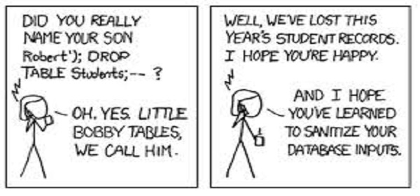
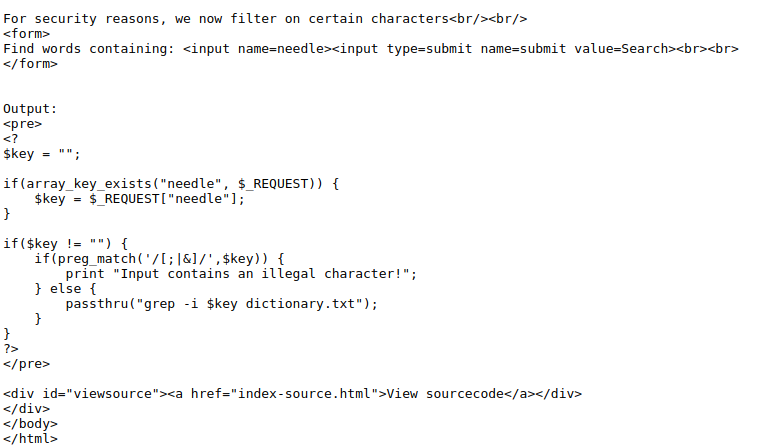
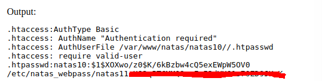

:slug: mandamiento-desarrollo-validar-entradas/
:date: 2016-07-25
:category: opiniones
:tags: programar, validar, software, seguridad
:Image: validar-datos.png
:alt: Caricatura acerca de validar las entradas a bases de datos
:description: TODO
:keywords: TODO
:author: Camilo Cardona
:writer: camiloc
:name: Camilo Cardona
:about1: Ingeniero de sistemas y computación, OSCP, OSWP
:about2: "No tengo talentos especiales, pero sí soy profundamente curioso" Albert Einstein
:figure-caption: Imagen

= Mandamiento #1 del desarrollo: validar entradas

La tarea de un programador consiste en desarrollar diariamente módulos o 
funciones con el fin de garantizar el cumplimiento del calendario asignado en 
un proyecto, estos módulos pueden ir desde simples CRUDS hasta el diseño de 
algoritmos complejos, ¡es todo un arte el desarrollo de software! pero en 
ocasiones el equipo de desarrollo deja fallos de seguridad que pueden 
comprometer los activos de la organización, es por esto que en esta ocasión 
hablaremos de uno de los *“pecados”* más comunes de los programadores y es no 
validar los datos de entrada.

Los datos de entrada es todo aquello que recibe la aplicación por parte de un 
usuario u otra aplicación, esto se hace a través de campos, estos los 
encontramos normalmente en funciones de registro, consultas, transacciones y 
muchos otro, pero el problema que suele ocurrir con estos es que también son 
uno de los escenario preferidos de usuarios mal intencionados o atacantes, para 
tratar de vulnerar la seguridad de la aplicación.

Lo que hacen estas personas es enviar consultas mal formadas para conseguir un 
error de la aplicación o peor aún, realizar un ataque del tipo “Inyección”, a 
lo largo de este post veremos ejemplos prácticos de como funcionan, como son 
explotados y como solucionar este tipo de amenazas en nuestras aplicaciones.

== El reto

Para demostrar el paso a paso de esta falla y que sea más claro para el lector, 
resolveremos un ejercicio practico.

natas 10 en http://overthewire.org/wargames/[overthewire.org]

En la siguiente figura tenemos el código fuente de la aplicación, la cual busca 
palabras claves en un archivo.

.Código Fuente de la aplicación

De la figura anterior podemos deducir rápidamente que es un código PHP que usa 
un archivo llamado *“dictionary.txt”*, tal vez no parezca nada fuera de lo 
común, pero la verdad es que tiene *“dos errores graves”*.

. El primero es que se esta usando una función que hace un llamado directo al 
sistema (passthru()), en este caso llama la función *grep* propia de los 
sistemas GNU/Linux.
. El segundo error y que complementa el primero, es que no se validaron los 
datos de entrada del usuario ($key) y se concateno directamente la consulta.

Esto irremediablemente puede terminar en un fallo grave, que probablemente se 
pudo mitigar desde la fase de diseño en el SDLC, ahora todo queda en manos del 
usuario mal intencionado para aprovecharlo y conseguir lograr su objetivo.

Ya sabiendo que el S.O es una versión de GNU/Linux la tarea es más sencilla,
solo se necesita saber como concatenar comandos. Ver figura2

.Múltiples comandos
image::comandos.png[comando]

Y así es como demostramos como un fallo en el diseño e implementación al 
momento de desarrollar una aplicación puede ser de alto impacto en los 
activos de la organización. Esta vulnerabilidad es conocida como *“Inyección
de comandos”*.

.Inyección de comandos

== Mitigando las amenazas

La seguridad es una de los procesos más importantes que se deben tener en 
cuenta al momento de desarrollar software, debe partir desde la fase de 
planeación, y lo que hacen muchos Project Managers es agregarla en la fase de 
validación, lo que hace que todos los fallos de seguridad sean acarreados hasta 
la ultima fase del SDLC.

En segundo lugar uno de los principios del diseño de software robusto es 
validar todas las entradas y excepciones para mitigar las amenazas que se 
puedan tener desde a fuera. Lo que vimos en este post fue un ejemplo básico de 
como un fallo puede convertirse en una amenaza de alto impacto y la importacia 
de validar los datos de entrada.
