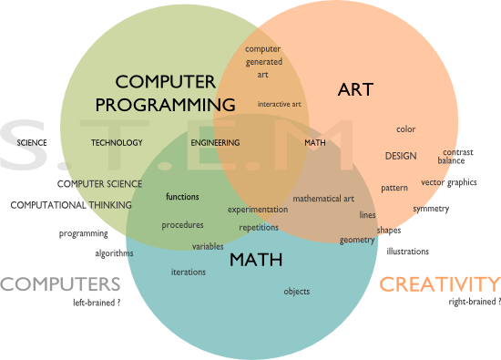

:slug: matematica-amiga/
:date: 2016-12-24
:category: retos
:tags: matemática, solucionar, programar, reto
:Image: maths-friend.png
:alt: Fórmulas trigonométricas
:description: Para incursionar en el mundo de la seguridad informática el saber programar es una habilidad esencial y gran parte de la programación se basa en la lógica matemática. En este artículo hablaremos de las matemáticas, los modelos matemáticos y su importancia en la seguridad informática.
:keywords: Programación, Matemática, Algoritmo, Modelos, Optimización, Modelos.
:author: Camilo Cardona
:writer: camiloc
:name: Camilo Cardona
:about1: Ingeniero de sistemas y computación, OSCP, OSWP
:about2: "No tengo talentos especiales, pero sí soy profundamente curioso" Albert Einstein

= Las matemáticas son mis amigas.

Es un hecho muy real en el mundo de la seguridad información que no se llega a 
ser un buen hacker  si no se es un buen programador y no se es un buen 
programador si no se es un buen matemático. Esto es muy fácil de explicar ya 
que un buen hacker debe saber como funciona una aplicación, además debe ser 
capaz de programar sus propios scripts ya que cada situación en particular 
necesita sus particulares herramientas, estas son unas de las pocas razones de 
porque es importante la programación, y de esto esta claro que la optimización 
de algoritmos, la lógica de la programación nacen de aprender y conocer modelos 
matemáticos.

.Relación Programación, Matemáticas y creatividad

Estos modelos están en muchos de los algoritmos que usan nuestras aplicaciones 
y juegos, como por ejemplo para el movimiento en un auto se usa la formula de 
velocidad y aceleración, para la colisión de dos objetos la ecuación de 
distancia entre dos puntos, para hallar la ruta más corta se usa el algoritmo 
de dijkstra, la manera más óptima de hallar el MCD y MCM es usando el algoritmo 
de Euclides. Estos son pocos ejemplos y los más mínimos de porque son 
importante el uso de modelos matemáticos para crear y optimizar algoritmos.

Es por esto que en esta ocasión vamos a hablar de mathchall una plataforma 
donde podemos encontrar todo tipo de retos matemáticos y lógica, desde básicos 
hasta avanzados, algunos de estos ejercicios pueden resolverse a calculadora y 
lápiz y otros a través de scripts que realicen las complejas operaciones 
rápidamente, como en el siguiente código: 

.test.py
[source, python,linenums]
.mcm_mcd.py
----
def gcd(a,b):
    """
    Euclidean algorithm
    """
    if b == 0:
        return a
    else:
        return gcd(b, a % b)
def lcm(a,b):
    """
    Euclidean algorithm
    """
    if b == 0:
        return a
    else:
        return (a * b)/ gcd(a,b)

#print lcm(7854,4746)

con = 1
while True:
    if gcd(16,con) == 8 and lcm(16,con) == 48:
        print con
        break
    con +=1
----

Como se ve en el ejercicio anterior si usamos un modelo matemático el tiempo de 
ejecución va a hacer menor a si usamos este segundo código y si la entrada es 
muy grande, los recursos usados en el segundo ejercicio van a ser muy 
significativos en comparación con el primero.

[source, python,linenums]
.mcm.py
----
def gcd(a, b):
    """
    naive algorithm
    """
    maxi = []
    for n in range(1, a):
        if a % n == 0 and b % n == 0:
            maxi.append(n)
    print max(maxi)
gcd(7854, 4746)
----

Para terminar, quiero dejar una pequeña reflexión sobre las importancia de los 
modelos matemáticos en el diseño de algoritmos y como en ocasiones un "naive 
algorithm" puede ser la solución más fácil pero no la mejor.
