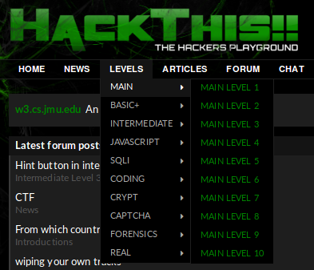
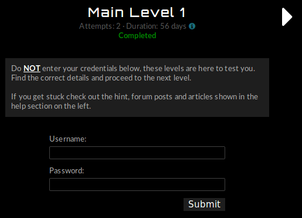
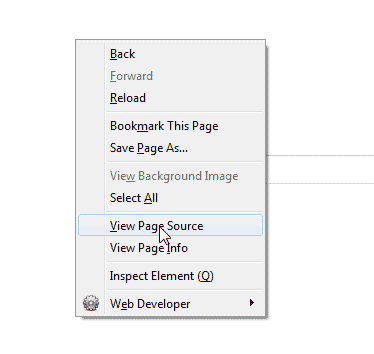
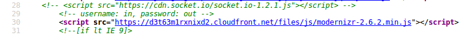

:slug: navegador-amigo/
:date: 2017-12-18
:category: retos
:subtitle: Solución al reto Main 1 de Hackthis
:description: El navegador web o browser, aquella herramienta que nos permite surfear en la red, tiene algunas otras funcionalidades que nos conviene conocer. En este artículo resolveremos un reto de hacking, haciendo uso únicamente de nuestro navegador web de preferencia.
:keywords: Navegador, Web, Browser, Solución, Reto, Hacking.
:author: Luis Arteaga
:tags: solucionar, browser, reto
:image: viewhtml.png
:alt: Dedo índice señalando un snippet de código HTML
:writer: stiwar
:name: Luis Arteaga
:about1: Ingeniero en Electrónica y Telecomunicaciones.
:about2: Apasionado por el desarrollo de aplicaciones web/móviles, la seguridad informática y los videojuegos.
:figure-caption: Imagen

= Mi Amigo El Browser

Seguramente ya sabrás lo que es un navegador web
(o +browser+ para los que están en un nivel un poco más avanzado).
Sí, ese pequeño programa en el que solíamos pasar horas y horas
en la computadora por allá en la primer y parte de la segunda década
del siglo XXI, cuando los teléfonos inteligentes
aún no dominaban el mercado (y nuestras vidas).
Sin embargo en la actualidad, continúan siendo una herramienta importante
para el desarrollo de las distintas actividades del ser humano.
Esto debido a que permiten desarrollar acciones como: juegos y pagos en línea,
ver peĺículas, estudiar, chatear, compartir contenido en las redes sociales,
trasnmitir voz y video en vivo, entre otra infinidad de opciones.

Es por ello que en esta ocasión, y en futuras entregas,
mediante un ejemplo pŕactico de seguridad informática,
hablaremos un poco sobre algunas de las herramientas predeterminadas,
o mejor dicho, preinstaladas con las que cualquier navegador moderno
(y decente) cuenta.
Si eres profesional o estudiante en carreras ligadas a la tecnología,
o simplemente eres un curioso de la informática,
entonces este artículo es para ti.

== Herramientas y Complementos (Plugins)

Si bien es cierto que existen infinidad de herramientas y +plugins+
(archivos o extensiones desarrolladas por programadores,
los cuales permiten aumentar las funcionalidades o servicios
brindados por un determinado programa) para los navegadores web,
en la actualidad, las más comunes son las que permiten
ejecutar funcionalidades como:

* Edición de etiquetas +HTML+ y de estilos +CSS+.
* Ver el código fuente de una página.
* Ejecución de sentencias +JavaScript+.

Aunque también existen herramientas algo avanzadas
para usuarios con un poco más de conocimientos en informática,
como por ejemplo las que permiten modificar
el valor de las +cookies+ para un sitio web,
interceptar una petición a un servidor web,
modificar cabeceras +HTTP+, etc... +
Si no entiendes ninguno de los términos expuestos anteriormente,
no te preocupes, en esta y en futuras entregas trataré
de ir explicando la mayoría de ellas.
De lo contrario, si ya los entiendes, dentro de este blog podrás encontrar
una gran variedad de artículos interesantes que de seguro te serán muy útiles.

== ¿ Por qué debería usar las herramientas incluidas en el navegador ?

Pueden ser varios los motivos por los cuales podrías preferir
hacer uso de las herramientas incluidas por defecto en tu navegador,
en lugar de usar sofisticados paquetes de +software+ como, por ejemplo,
link:https://goo.gl/LDcRk4[+Burp Suite+].
Sin embargo, en mi opinión, las principales razones por las que deberías usarlas
(sobretodo si tienes un equipo limitado) son las siguientes:

* Permiten ahorrar recursos de tu máquina como espacio de
almacenamiento, uso innecesario de memoria +RAM+ y de +CPU+.
* Simplemente porque cumplen perfectamente con la función o tarea
que necesitas realizar.

== Ejemplo Práctico

Con el fin de dar a conocer uno de los tantos usos
que se le pueden dar a las herramientas incluidas en un navegador web,
en esta oportunidad daremos solución al *reto 1* de la categoría _MAIN_
del sitio web *link:https://www.hackthis.co.uk/[+hackthis+]*,
el cual permite validar tus habilidades
para superar controles de seguridad en diferentes categorías.
Una vez registrados en +hackthis+,
podremos acceder a todos los retos disponibles:

.hackthis: los 10 niveles de la categoría _MAIN_

== Reto: Main Level 1

.hackthis: nivel 1 de la categoría _MAIN_

Como se aprecia en la anterior imagen, este reto
solicita credenciales de acceso válidas, tanto para el usuario,
como su contraseña.
Para este nivel básico, usaré link:https://www.mozilla.org/en-US/firefox/new/[+Firefox+],
ya que me siento más cómodo trabajando en él.
Pero tú puedes usar el que más te guste, para los usuarios de +Windows+,
además de +Firefox+ existen alternativas como link:https://goo.gl/hbFNXs[+Google Chrome+]
y +Microsoft Edge+ (el sucesor de +Internet Explorer+), y,
para los usuarios de +MAC+ existe link:https://goo.gl/goCaqK[+Safari+].

Existen diversas formas de resolver este reto,
pero en esta ocasión lo haremos mediante el uso
del *visualizador de código fuente*.
El código fuente de un sitio web es un conjunto de etiquetas conocidas como
*etiquetas link:https://www.w3schools.com/html/[+HTML+]*,
*hojas de estilos en cascada (link:https://www.w3schools.com/css/[+CSS+] -
Cascading Stylesheets*) y, algunas veces, segmentos de código
denominados *scripts de link:https://www.w3schools.com/js/[+JavaScript+]*.
Podemos acceder a dicha herramienta pulsando el atajo `Ctrl+U`,
o haciendo click derecho en el navegador
y seleccionando la opción +*_View Page Source_*+
(en algunos casos puede aparecer distinto, dependiendo del navegador utilizado
y del idioma en el que está configurado tu sistema operativo),
tal como se muestra en la siguiente imagen:

.uso de la herramienta +View Page Source+

Una vez realizada dicha acción, se despliega una nueva pestaña en el navegador
donde podrás ver todo el +HTML+, +CSS+ y +JS+ que componen la página web.
La línea que nos interesa es la *29*.
En esta, podemos observar un comentario +HTML+
(los comentarios en +HTML+ van entre las etiquetas +<!--+ y +-\->+,
y no son desplegados o mostrados por el navegador)
el cual contiene las credenciales de acceso válidas para el reto:

.hackthis: solución al reto MAIN 1

Con esto, sólo basta ingresar las credenciales *in* y *out*
en los campos +Username+ y +Password+, respectivamente, para resolver el reto.
Si bien hemos utilizado el visualizador de código fuente
para resolver un ejercicio de seguridad informática,
el uso que se le puede dar a éste varía
de acuerdo a las necesidades de un proyecto,
o a los intereses en los cuales estés trabajando.

En resumen, el conocimiento y buen uso de las distintas herramientas
con las que cuenta un navegador web, puede marcar la diferencia
al momento de realizar las tareas más comunes
con las cuales se enfrenta un profesional en su día a día. +
También resaltar que, sin importar que seas programador o diseñador web,
*NO* es una buena práctica almacenar credenciales de acceso
al interior del código fuente de una página.

Hasta aquí este artículo, sin embargo, en una próxima entrega,
hablaremos sobre algunas otras herramientas útiles
que todo profesional +TI+ debería conocer.
