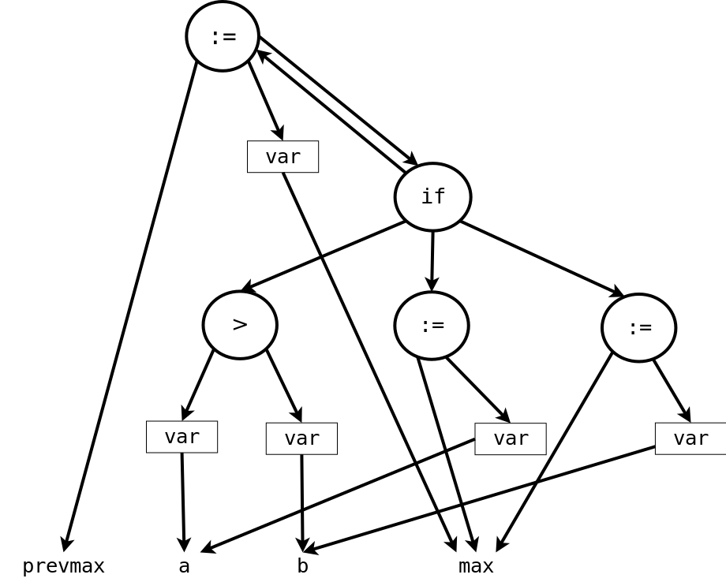
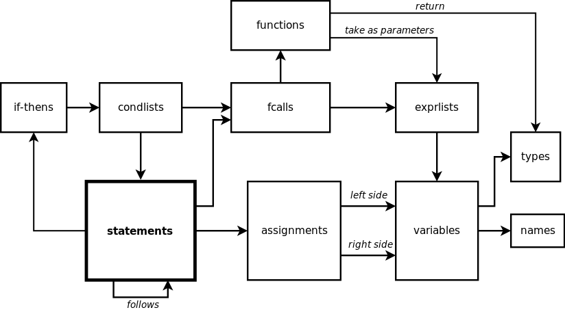

:slug: oraculo-codigo/
:date: 2018-03-02
:subtitle: Acerca del código como datos
:category: ataques
:tags: prueba, aplicación, detectar
:image: cover.png
:alt: Oráculo de Delphi
:description: Una descripción del enfoque de código como datos para realizar un análisis de código fuente. El método consiste en realizar una base de datos a partir del código de una aplicación, utilizando un lenguaje de consulta especial para detectar vulnerabilidades y errores en el código.
:keywords: Pruebas, Bases de datos, Código, Lenguaje de consulta, Semmle, Datos
:author: Rafael Ballestas
:writer: raballestasr
:name: Rafael Ballestas
:about1: Matemático
:about2: con interés por CS
:source-highlighter: pygments

= El Oráculo del Código

"La mayoría de programas son demasiado extensos
para entenderlos por completo".
Ésto fue en escrito en los años +80+. <<r1, ^[1]^>>
Imagina la situación hoy en día.
De ahí surge la necesidad de herramientas automatizadas
para ayudar en el proceso de análisis de código.
La solución, de acuerdo a
link:https://lgtm.com/blog/code_as_data[Oege de Moor]
de link:https://semmle.com/[Semmle] es obvia:
Tratar el código 'como datos'.

Esta idea no es realmente nueva:
Ya en 1983, Mark Linton discutía
acerca de que los programadores seleccionaban 'vistas'
para entender algunos 'aspectos' del código base.
Esto ya es una charla de bases de datos.
Fue sólo cuestión de tiempo proponer una base de datos
a partir de la estructura del programa
para preguntarse acerca del comportamiento del mismo.

El mero análisis de texto no es suficiente
para entender la forma en que las variables son utilizadas,
los idiomas e idiosincrasias del lenguaje de programación,
la eficiencia y complejidad de tu código, etc.
En otras palabras, queremos entender la 'semántica' de tu programa,
así como su 'estructura', no sólo la sintaxis.

La forma más común para representar datos estructurados
y relacionados entre sí es a través de una 'base de datos relacional'.
Éstas son consultadas normalmente utilizando el lenguaje +SQL+,
el cual presenta consultas simples, casi como en inglés plano,
pero es muy limitado.
Como veremos más adelante,
la base de datos para el código fuente del programa,
estará incluso más limitada.
De esta forma, el sistema de consultas debe ser avanzado,
pero no tanto como para afectar su desempeño.

== Bases de datos a partir de programas

Los lenguajes como +lisp+
tienen un mantra inherente de 'código como datos':
cada línea de código es una pieza de datos manipulable  y viceversa.
Los lenguajes de marcado como +XML+
tienen su propia "base de datos" de tipos:
el +DOM+ el cual puede ser consultado a través de +XPath+.

Pero ¿Qué pasa con los lenguajes utilizados comúnmente,
como +Java+ y +Python+ ?
Para cada programa podemos asociar un árbol,
llamado 'árbol de sintaxis abstracto' (+AST+)
el cual muestra la estructura sintáctica del código.
Consideremos esta porción de código +Ada+ de la tesis de Linton: <<r1, ^[1]^ >>

.Muestra de código +Ada+.
[source,ada,numbered]
----
prevmax := max;
if a > b then
    max := a;
else
    max := b;
end if;
----

Bastante simple, sin embargo lo mismo no aplica para su +AST+.
Tenemos +3+ asignaciones (+:=+),
un condicional +if-then-else+ y +5+ variables,
todas relacionadas entre sí,
y todo lo anterior debe ser mostrado en el árbol.
El +AST+ se vería así:

.Adaptado del link:https://www2.eecs.berkeley.edu/Pubs/TechRpts/1983/CSD-83-164.pdf#page=31[diagrama original de Linton.]

Ahora, ¿Cómo hacemos una base de datos a partir de esto?
Ni +Semmle+ ni otros jugadores en el campo de la 'inteligencia artificial',
tales como link:http://www.castsoftware.com/[+CAST+] y link:http://modernsystems.com/[+Modern Systems+]
nos dicen mucho respecto al proceso,
ya que obviamente la magia tras sus productos debe estar ahí,
pero intentemos aprender nosotros mismos de las ideas de Linton.

Para los propósitos de este artículo,
es suficiente pensar en las bases de datos
como un conjunto de entidades unidas por relaciones.
Ahora, las entidades relevantes para el análisis de código fuente,
serían, como es de esperar,
variables, condicionales, funciones,
pero también declaraciones, expresiones y asignaciones.
Es más, algunos bits de código,
en realidad pueden ser de distintos tipos al mismo tiempo.
Por lo que puedes hacerte una idea de la complejidad de dicha base de datos.

Para el fragmento de código anterior,
Linton muestra las link:https://www2.eecs.berkeley.edu/Pubs/TechRpts/1983/CSD-83-164.pdf#page=32[tablas reales]
y las relaciones recortadas a las partes más relevantes.
Intentaré simplificarlo aún más al reducirlo a un
link:https://en.wikipedia.org/wiki/Entity%E2%80%93relationship_model[diagrama entidad-relación] informal.
Aquí puedes leer las relaciones
sin etiquetas como 'tiene' o 'es' (relaciones genéricas)

.Diagrama ER para una porción de código sencillo

La entidad más básica es la declaración (+statement+)
la cual es esencialmente cada una de las líneas de código.
Puede ser un condicional (+conditional+),
una asignación (+assignment+), o quizás el llamado a una función (+fcalls+).
Una asignación, a su vez,
fija el valor del lado izquierdo de la variable al lado derecho.
Las variables (+variables+) están relacionadas al tipo (+type+) de entidad
(por ejemplo +int+, +String+, etc) y su nombre (+name+).

Este es solo un subconjunto
de nuestro modelo ya reducido de la base de datos.
Y, apenas ahora que empieza a compararse con la base de datos real.

Un programa típico del siglo +21+ en +Java+,
requiere de alrededor de +77+ tablas (!),
de acuerdo a Oege de Moor.
Esto justifica nuestra afirmación anterior
de que es necesario  un lenguaje de consultas poderoso
para trabajar con dicha base de datos.
Los chicos en +Semmle+ se propusieron a hacerlo,
y eso es justamente lo que los diferencia de su competencia.

== Un lenguaje de consultas para gobernarlos a todos

El lenguaje de consultas debe ser simple como +SQL+,
pero más poderoso,
incluyendo constructores de Programación Orientada a Objetos (+POO+)
y capaz de componer consultas  utilizando conectores lógicos y cuantificadores,
al igual que el lenguaje de programación lógico link:http://www.learnprolognow.org/[+Prolog+].
Sin embargo, esto agregaría muchos costos generales,
por lo que un subconjunto más pequeño llamado link:http://www.learndatalogtoday.org/[+Datalog+]
fue elegido como la base para el lenguaje personalizado +QL+.

Este lenguaje de consulta puede ser utilizado
para localizar defectos en el código.
Por ejemplo en +POO+ cuando se define la noción de igualdad en una clase,
usualmente es necesario definir una función +hash+,
debido a que la igualdad de objetos debería implicar una igualdad de +hash+.
Asi que, busquemos las clases que declaran un método +equals()+
pero no un método +hashCode()+ utilizando +QL+

.Ejemplo de +QL+ de <<r2, [2]>>.
[source,sql,numbered]
----
from Class c
where c.declaresMethod("equals") and
    not( c.declaresMethod("hashCode") ) and
    c.fromSource()
select c.getPackage(), c
----

Las cláusulas son similares a las de +SQL+,
pero hay constructores similares a los utilizados en +POO+ (+Class c+)
los cuales tienen sus propios métodos (+c.declaresMethod()+)
y los conectores lógicos funcionan un poco diferente a +SQL+
y tienen un alcance mayor.
En +QL+ es posible:

* Definir y utilizar 'predicados' en consultas
(expresiones que pueden ser verdaderas o falsas dependiendo de los parámetros).

* Usar cuantificadores lógicos (+for all+, +exists+)
para simplificar la agregación y la agrupación
(Encontrar el número de líneas de código en un determinado paquete),
lo cual es complicado en +SQL+.

* Definir consultas genéricas
que pueden ser heredadas y sobrescritas, al igual que en +POO+.

No podemos profundizar más en los detalles de +QL+ aquí,
en cambio, enfoquémonos en lo que podemos hacer con él.

== Aplicaciones

Cuando le preguntas acerca de tu código a un oráculo omnisciente,
puedes utilizar la "edad de los datos" en tu flujo de desarrollo.

Puedes utilizar el enfoque de 'código como datos' para:

* Incrementar la productividad al calcular métricas
del proceso de desarrollo.

* Asegurar el seguimiento de los estándares de código
y el modelo de desarrollo que tu equipo ha elegido.

* Determinar objetivamente la calidad del código.

* Encontrar fallos y vulnerabilidades de seguridad.

Esto es lo que nos interesa más.
+Semmle+ mantiene un link:https://github.com/lgtmhq/lgtm-queries[repositorio] de consultas públicas
y un sitio web con link:https://help.semmle.com/wiki/display/SD/Semmle+standard+rules['reglas'] generales
que deben seguirse para algunos de los lenguajes soportados,
por ejemplo +Java+, +C+ , +Python+ y algunos de sus derivados
(visita la sección de link:https://help.semmle.com/wiki/pages/viewpage.action?pageId=6848559[+FAQ de Semmle+]
para más detalles).
También incluyen algunas guías de seguridad con su correspondiente +CWE+.
Por ejemplo, podemos detectar vulnerabilidades +XSS+ en +Java+
utilizando esta consulta:

.Consulta de detección de +XSS+ en +Java+
[source,sql,numbered]
----
import semmle.code.java.security.XSS
from XssSink sink, RemoteUserInput source
where source.flowsTo(sink)
select sink, "Cross-site scripting vulnerability due to $@.",
source, "user-provided value"
----

La cual detectaría este tipo de código vulnerable,
el cual no valida adecuadamente la entrada del usuario:

.Código +Java+ vulnerable a +XSS+. Tomado de link:https://help.semmle.com/wiki/pages/viewpage.action?pageId=1607941[Semmle]
[source,java,numbered]
----
public class XSS extends HttpServlet {
    protected void doGet(HttpServletRequest request, HttpServletResponse response)
    throws ServletException, IOException {
        // BAD: a request parameter is written directly to an error response page
        response.sendError(HttpServletResponse.SC_NOT_FOUND,
                "The page \"" + request.getParameter("page") + "\" was not found.");
    }
}
----

No hay una consulta para la vulnerabilidad que estas probando?
Justo para eso es el lenguaje +QL+.
Solo escribe tu propia consulta.

Para concluir con ejemplos más espectaculares,
he aquí una consulta para encontrar vulnerabilidades link:http://heartbleed.com/[+Heartbleed+]:

.+QL+ para detectar +Heartbleed+
[source,sql,numbered]
----
from FunctionCall memcpy, Struct s, Field f, Field g, float perc
where f = s.getAField() and g = s.getAField() and
      memcpy(memcpy, f) and
      memcpy_usually_guarded(f, g, perc) and
      not guarded_memcpy(memcpy, f, g) and
      forall (Field gg, float pperc | memcpy_usually_guarded(f, gg, pperc) | pperc <= perc)
select memcpy, "memcpy from " + s.toString() + "::" + f +
               " is guarded by comparison against " + s.toString() + "::" + g +
               " in " + perc + "% of all cases, but not here."
----

Note el cuantificador universal (+forall+)
que mencionamos anteriormente,
además, no es la consulta completa,
ya que está basada en predicados que deben ser definidos para esto,
además de los predefinidos.
Puedes mirar la consulta completa y la discusión en
link:https://semmle.com/developing-a-custom-analysis-to-find-heartbleed-like-security-vulnerabilities/[+Semmle+].

La vulnerabilidad +Apache Struts+ link:https://nvd.nist.gov/vuln/detail/CVE-2017-9805[+CVE-2017-9805+],
la cual se relaciona pero no debe ser confundida con link:https://nvd.nist.gov/vuln/detail/CVE-2017-5638[+CVE-2017-5638+]
fue explotada en el link:https://www.equifaxsecurity2017.com/[ataque] a +Equifax+,
y link:https://lgtm.com/blog/apache_struts_CVE-2017-9805_announcement[encontrada]
y anunciada por link:https://lgtm.com/[+lgtm+].
A través de este servicio +FOSS+
los proyectos pueden aprovechar las tecnologías de +Semmle+
en la inteligencia de aplicaciones.
Siempre y cuando su repositorio permanezca abierto en +GitHub+.

La idea básica es bastante simple:
Buscar la deserialización de datos no confiables
(por ejemplo, controlados por el usuario).
En este caso particular,
estamos interesado en el flujo de datos de un +ContentTypeHandler+
el cual obtiene la entrada a un método de deserialización inseguro.
El texto de la consulta refleja justo esa idea:

Visita link:https://lgtm.com/blog/finding_unsafe_deserialization_with_ql[Cómo encontrar deserializaciones inseguras con QL]
para más información.

[source,sql,numbered]
----
from ContentTypeHandlerInput source, UnsafeDeserializationSink sink
where source.flowsTo(sink)
select source, sink
----

De nuevo, esta no es la consulta completa.
revisa la entrada del link:https://lgtm.com/blog/apache_struts_CVE-2017-9805[blog de +lgtm+]
acerca de este descubrimiento.

''''

De esta manera, +Semmle+ ha hecho realidad lo que se consideraba imposible
una y otra vez durante +30+ años:
Combinar técnicas de análisis de datos y análisis de código.
Esta poderosa combinación ya ha sido utilizada
por usuarios como la +NASA+ y +Google+,
así como por innumerables proyectos +FOSS+.
Solo la link:http://dante.udallas.edu/hutchison/Mythology/Other/pythia.htm[Pythia]
conoce el futuro que traerá el enfoque de código como datos.

== References

. [[r1]] link:https://www2.eecs.berkeley.edu/Pubs/TechRpts/1983/CSD-83-164.pdf[Mark Linton (1983). 'Queries and views of programs
using a relational database system'. PhD thesis, UC Berkeley.]

. [[r2]] link:https://semmle.com/wp-content/uploads/2007/01/scam07.pdf[Oege de Moor et al. (2007). 'QL for source code analysis'.
Keynote address. Source Code Analysis and Manipulation.]
