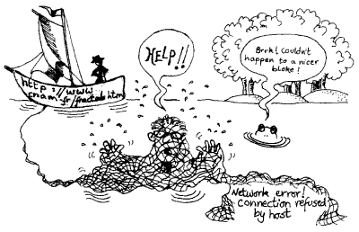
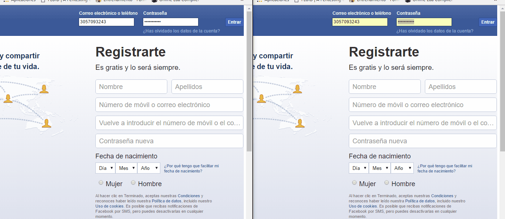
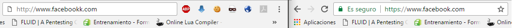
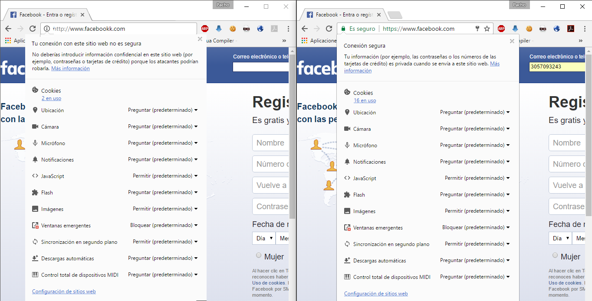
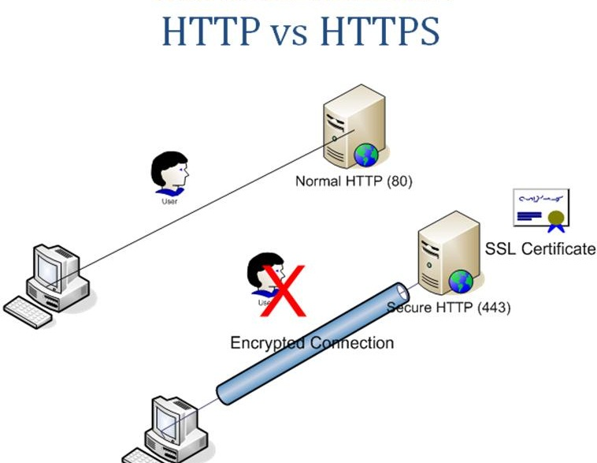
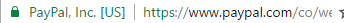
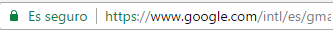
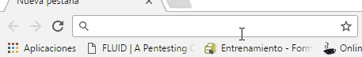

:slug: pagina-queria-ingresar/
:date: 2017-03-08
:category: opiniones
:subtitle: Cómo reconocer y evitar páginas fraudulentas
:tags: web, seguridad, información
:image: pagina.png
:alt: Teclado con una letra roja que dice GET ME OUT OF HERE
:description: Los delincuentes informáticos a menudo se aprovechan del afán de los usuarios por utilizar un servicio para crear clones de las páginas a las que buscan ingresar con URLs similares con el fin de robar sus credenciales. A continuación explicamos una forma de detectar y evitar esta práctica.
:keywords: Seguridad, HTML, Página, Web, Amenaza, HTTPS.
:author: Francisco Bernal
:writer: pacho
:name: Francisco Bernal Baquero
:about1: Ingeniero Electrónico.
:about2: Programador en Python y Ruby, siempre dispuesto a aprender.

= ¿Sí era la página que quería?

+HTML+ (*_HyperText Markup Language_*) se basa en el lenguaje +SGML+
(*_Standard Generalized Markup Language_*) y es el formato de los documentos
de la +World Wide Web+.
Su origen fue como intercambiador de documentos científicos y técnicos.
Con la creación de los +links+ se facilitó su intercambio
y las compañías fueron creando navegadores
(el +software+ necesario para interpretar un documento en +HTML+).

Con el afán de abarcar el terreno lo más rápido posible,
los desarrolladores de navegadores dieron inicio
a la denominada *Guerra de los navegadores*,
lo cual fue un beneficio para el consumidor final.
Consistía en ver qué navegador implementaba más características
en comparación a su competidor.
También empezaron a inventar elementos +HTML+
que solo fueran reconocidas por sus propios navegadores,
como ejemplo están +<marquee>desplazamiento de texto</marquee>+,
que inicialmente solo funcionaba para +Internet Explorer+;
o +<blink>texto intermitente</blink>+, que solo funciona
con navegadores basados en +Gecko+.
Un lado negativo de esta "guerra" fue que +HTML+ se empezó a fragmentar,
y los programadores se daban cuenta de que sus páginas
se veían bien en un navegador, pero en otro algunos elementos no funcionaban,
y así nace la +W3C+ (*_World Wide Web Consortium_*),
la cual buscaba estandarizar +HTML+.
En 1990, varias recomendaciones fueron publicadas por +W3C+,
las cuales fueron referentes para los programadores web,
así nació +HTML 2.0+ en 1995, +HTML 3.2+ en 1997, +HTML 4.01+ en 1999,
y link:https://www.w3.org/TR/html5/[+HTML5+] en 2008
(para validar si su página web está estandarizada,
puede revisar [button]#link:https://validator.w3.org/[aquí]# ).

+HTML+ no permite definir la apariencia de una página,
aunque se utiliza también como un leguaje de presentacion.
Los archivos de navegador se visualizan en un navegador web.
La presentación de la página es muy dependiente del navegador,
ya que el mismo documento no produce el mismo resultado en la pantalla
si se visualiza con un +browser+ o con otro.
En pocas palabras, +HTML+ se limita a describir la estructura
y el contenido de un documento, y no el formato de su pagina ni su apariencia.

.Imagen tomada de link:https://www.w3.org/[W3]

== El peligro de no revisar

La mayoría de robos a cuentas, ya sean de +Facebook+, o peor,
de cuentas bancarias, ocurren por no fijarse
en la dirección a la que se requiere entrar.

.+Facebook+ falso vs +Facebook+ real

La mayoría de ataques que se centran en robos de cuentas
se basan en el afán del usuario.
Como podemos ver en la _Figura 2_ ,las paginas son exactamente las mismas,
la única diferencia visible se encuentra en la URL.
La original tiene la dirección normal de +Facebook+,
la falsa, al no estar alojada en un servidor, tiene la dirección local, pero,
¿qué pasaría si estuviera alojada en un servidor?
La respuesta a esta pregunta es, el atacante se centra
en ubicar direcciones web con un nombre similar a la página a atacar.
Un ejemplo podría ser +\www.facebookk.com\+
(es de recordar que +Facebook+ re-direcciona algunas páginas al original
para evitar este tipo de ataque, como con +\www.facebok.com\+),
pero entonces, ¿cómo podemos estar seguros de que la pagina a la que entré
es la verdadera página?
La mayoría de páginas que requieren un inicio de sesión
tienen un protocolo +HTTPS+.

.+HTTP+ vs. +HTTPS+

.+HTTP+ vs. +HTTPS+

== ¿Qué es HTTP y HTTPS?

+HTTP+ (+*_Hyper Text Transport Protocol_*+) es el protocolo
encargado de definir el intercambio que llevan a cabo
distintos equipos que conforman una red.
En otras palabras, es el protocolo encargado
de asegurarse de que los datos lleguen bien.
Este protocolo es del tipo ``petición-respuesta'',
lo que quiere decir que debe haber un cliente que solicite información
y un servidor que le responda.

=== Diferencia HTTP y HTTPS

.Diferencia en +HTTP+ y +HTTPS+ (Imagen tomada de link:http://www.wordpressmagazine.es[+WordPress+])

El protocolo +HTTPS+ (+*_Hypertext Transfer Protocol Secure)_*+,
se basa en la combinación de dos protocolos, el +HTTPS+ y el +SSL/TLS+
(+*_Secure Sockets Layer/Transport Layer Security_*+).
Ésta es la manera más segura de acceder a los contenidos en Internet,
porque todo dato ingresado va cifrado, lo que garantiza que la información
solo será visible entre el cliente y el servidor.

.+HTTPS+ +PayPal+

.+HTTPS+ +Gmail+

Como podemos ver en los ejemplos, +HTTPS+ es fundamental
para cualquier actividad que haga uso de datos personales,
como cuentas bancarias, contraseñas, números de tarjetas de crédito, etc… +
Para que este sistema funcione, se debe aplicar el esquema de certificado,
que debe estar debidamente firmado por una autoridad.

Una de las desventajas que posee +HTTPS+ es su velocidad,
ya que es reducida a comparación de una conexión +HTTP+.
Ésto se debe al cifrado y descifrado que se tiene que hacer con los datos,
ya que genera un mayor consumo de banda y, por ende, una mayor lentitud.
Pero este inconveniente no debe opacar la seguridad que nos ofrece +HTTPS+,
ya que es un método de verificación fiable frente a un usuario final.

== ¿Qué es un certificado SSL?

La función de un certificado +SSL+ es darle la seguridad
a un visitante de una página web, una forma de decirle
que el sitio es auténtico, real, y seguro para ingresar datos personales.
+SSL+ es un protocolo de seguridad que se encarga de que los datos ingresados
viajen de manera segura, pues la transmisión de datos
entre un cliente y un servidor es cifrada.
Que los datos vayan cifrados quiere decir que se emplean algunos algoritmos
y un sistema de claves que solo conocen el servidor y el cliente.
En ese momento nos podemos asegurar de que nadie tiene acceso a la información
que viaja en ese canal.
En pocas palabras, la tecnología detrás de un +SSL+
es la transmisión segura de información a través de la red,
y así confirmar que está irreconocible para personas no deseadas.
Para poder implementar este tipo de certificado,
el servidor debe tener soporte +SSL+.

Como se pudo observar, para poder evitar esta vulnerabilidad
solo se debe ser cuidadoso al momento de digitar una página web,
siempre revisar su protocolo, si es +HTTP+ o +HTTPS+.
Los navegadores son una gran ayuda, ya que tienen esta información a la mano
para que sea más fácil para el usuario reconocer
si está en una página auténtica o no.
Una forma para estar seguro de la autenticidad de la página
es ingresando la dirección +IP+ de la página en vez del nombre de dominio,
por ejemplo, la dirección +IP+ de +Facebook+ es _31.13.65.36_

.Entrando por +IP+

