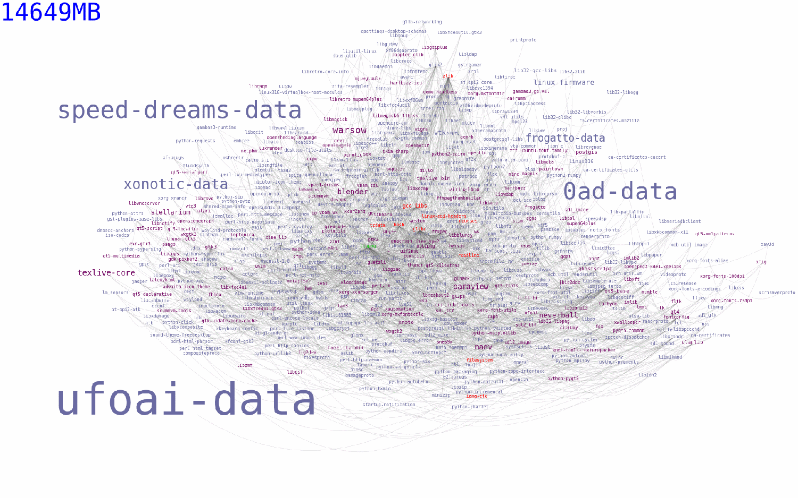
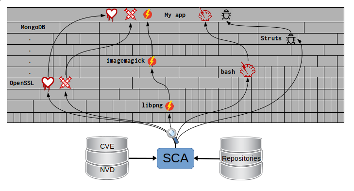
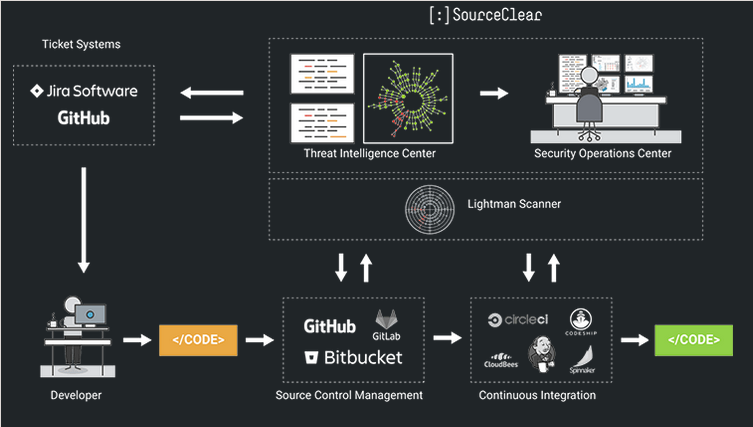

:slug: pararse-hombros-gigantes/
:date: 2018-02-14
:category: ataques
:subtitle: Acerca del análisis de composición de software
:tags: prueba, dependencia, vulnerabilidad
:image: cover.png
:alt: Orion cargando a Cedalion
:description: Una discusión sobre el top 10 - A9 de OWASP: Utilizando componentes con vulnerabilidades conocidas. En particular librerías gratuitas y software abierto. Una comparación con el Análisis de Composición de Software buzzword del mercado. Un estudio sobre herramientas libres para hacerlo tu mismo.
:keywords: Composición de Software, Análisis, Dependencia, Vulnerabilidad, Linux, Foss.
:author: Rafael Ballestas
:writer: raballestasr
:name: Rafael Ballestas
:about1: Matemático
:about2: Con interés por CS
:translate: stand-shoulders-giants/

= Pararse en los hombros de gigantes

En nuestro link:../../../en/blog/infinite-monkey-fuzzer[último post],
fuimos capaces de reproducir el hallazgo
de una vulnerabilidad en +libpng+.
Pero esa es solo una pequeña librería,
podrías decir que tiene un alcance muy limitado,
y solo pesa +556 KiB+.

Sin embargo, muchos paquetes dependen de ella.
Para conocer cuántos paquetes
en el repositorio Arch Linux dependen de +libpng+,
podemos utilizar +pacgraph+
de link:http://kmkeen.com/pacgraph/[Kylee Keen]:

.Dependencias inversas de +libpng+ en +Arch Linux+ (link:libpng-pacgraph.png[click] para mirar más grande)

Más de +14 GiB+ de software dependen de +libpng+ !
Y eso es sólo en los repositorios +Arch Linux+,
la cual difícilmente es la distribución de +Linux+ más popular.
También, es la librería de referencia oficial de +PNG+
y es multiplataforma,
así que ciertamente, muchos otros paquetes
en otros sistemas operativos dependen de ella.

Ahora, de regreso al 2015,
cuando +libpng+ aún no había arreglado el +bug+ de la paleta,
todos los programas y librerías anteriores,
eran también vulnerables automáticamente al mismo problema.
Actualmente esto es lo que le ha pasado a +Equifax+
con una vulnerabilidad +Apache Struts+.
De la misma forma que a muchos servicios +web+
que utilizan +OpenSLL+ con +Heartbleed+.

Si esto le puede pasar a programas reconocidos
como link:https://www.gnu.org/software/bash/[+bash+],
link:https://www.qt.io/[+qt+],
link:https://services.math.duke.edu/computing/tex/latex.html[+TeX+],
y link:https://xfce.org/[+xfce+],
le puede pasar a su organización.
De hecho, este es un problema tan común
que es parte del top 10 de vulnerabilidades +OWASP+ del 2017:
Ellos lo llaman
"A9: Utilizando componentes con vulnerabilidades conocidas".

Dada la rápida adopción del software libre y de código abierto (+FOSS+)
por parte de grandes compañías,
una vulnerabilidad relacionada con las dependencias,
que surge repentinamente
puede parecer un link:https://en.wikipedia.org/wiki/Dependency_hell[infierno].
O como a los ejecutivos lo llaman,
una "oportunidad de negocios" ?

Muchos proveedores del llamado
"Análisis de composición de software" (+SCA+)
(No lo busques en Google)
han aparecido desde entonces en el campo de la seguridad.
Algunos de ellos son respaldados por grandes compañías;
pero la mayoría no.
De hecho, este negocio ha ganado tal impulso,
que se espera un crecimiento mayor al +20%+ cada año
desde ahora, hasta el
link:https://www.prnewswire.com/news-releases/the-software-composition-analysis-market-is-expected-to-grow-from-usd-1540-million-in-2017-to-usd-3984-million-by-2022-at-a-compound-annual-growth-rate-cagr-of-209-300595028.html[2022].

Lo que es peor, hace que el +FOSS+,
que utilizan todas esas compañías,
parezca malo.
Su adopción aún no disminuye,
y como trataremos de explicar aquí,
no es su culpa, sino más bien
de las dependencias de la aplicación;
también es necesario aclarar que no es una cuestión de +FOSS+ ,
sino un esfuerzo de +marketing+ que apunta hacia él.

Las aplicaciones actuales utilizan en promedio
más de +30+ librerías, las cuales representan
más del +80%+ del código <<r2, [2]>>.
Piensa en ello como si tu código,
fuera una delgada capa sobre una construcción de cajas,
algunas pequeñas y otras más grandes.
Lo que el +SCA+ hace es buscar vulnerabilidades dentro de esas cajas
las cuales se convierten también en vulnerabilidades de tu propia aplicación
con la ayuda de la información de bases de datos externas:

.+SCA+ escanea todos los bloques en la construcción de tu aplicación

En lugar de ir desde la supuesta solución
hasta la raiz del problema,
hagámoslo de forma inversa.

== Lo malo

El +FOSS+ es desarrollado y utilizado
por miles de personas y compañías alrededor del mundo.
Esto puede ser una espada de doble filo:
Por una parte, de acuerdo a la "Ley de Linus"
encontrar +bugs+ y arreglar errores
debería ser más sencillo,
si se involucran más ojos.

Por otra parte,
la falta de una guía centralizada,
da lugar a +bugs+.
Sin embargo, esto ocurre también
en todo tipo de software.

La diferencia con el software propietario es que,
debido a todas las restricciones,
es menos probable que sus +bugs+
se vuelvan públicos tan pronto como se detectan,
como en el caso de los software abiertos
por lo que se espera que todas las vulnerabilidades
sean +zero day+.

Así que, si la fuente del problema no es el +FOSS+,
entonces ¿Cuál es?
Las principales razones por las que tantas compañías
sufren problemas de +A9+ son:

* No conocen las dependencias utilizadas.
* Ignoran sus vulnerabilidades.
* No hay una búsqueda continua de +bugs+.
* No hacen pruebas de compatibilidad.
* Errores de configuración de componentes.

En esencia, todo se condensa a la falta de comunicación
entre el usuario y el código de los componentes.

== Lo bueno

Así que, qué puedes hacer?
+OWASP+ recomienda las siguientes guías para prevenir el +A9+ <<r1, ^[1]^>>:

* Recortar dependencias, componentes y características innecesarias.
* Monitorear continuamente los componentes,
en busca de actualizaciones y reportes de vulnerabilidades.
* Obtener componentes únicamente de fuentes confiables.
* Aplicar estas guías a la política de la compañía.

Estas son herramientas específicas para este propósito:
Compara la versión de la dependencia que estás utilizando
tanto con repositorios remotos (para buscar actualizaciones)
como con bases de datos de vulnerabilidades
(para saber si alguna de las dependencias que estas usando
tiene vulnerabilidades reportadas que aún no se han arreglado).

* Para +JavaScrip+ puedes utilizar link:https://github.com/retirejs/retire.js/[+retire.js+].
* Los usuarios de +Java+ tienen el +plugin+ link:http://www.mojohaus.org/versions-maven-plugin/[+Versions+] para +Maven+.
* Para +Java+ y +.NET+ puedes utilizar la herramienta
de link:https://www.owasp.org/index.php/OWASP_Dependency_Check[Chequeo de dependencias de +OWASP+].
* También hay un +plugin+ de link:https://github.com/stevespringett/dependency-check-sonar-plugin/tree/master/examples/single-module-maven[chequeo de dependencias] de +SonarQube+.

Cabe resaltar que las herramientas específicas de un lenguaje
deben ser integradas con el administrador de paquetes apropiado,
+npm+ o +yarn+ con +retire+.

En el siguiente diagrama tomado de +Source:Clear+,
se presenta una vista general de cómo debería integrarse el proceso de +SCA+
con tu flujo de desarrollo.

.Integrando +SCA+ en tu flujo de desarrollo. De link:https://www.sourceclear.com/product/[+Source:Clear+].

Vemos que cada vez que se añade código,
el sistema completo es escaneado
en busca de vulnerabilidades en software de terceras partes
y otros problemas fácilmente identificables
por el Análisis Estático cuando el código no esta disponible.
Esto es realizado por el siguiente procedimiento:

. El +SCA+ identifica las dependencias
en las que tu software está basado.

. Detecta las versiones de esas dependencias.

. Verifica el repositorio maestro
de la dependencia en busca de actualizaciones.

. Verifica una o varias bases de datos de vulnerabilidades,
como link:https://cve.mitre.org/[CVE] y link:https://nvd.nist.gov/[NVD]
o similares.

. Reporta los hallazgos.

Es un proceso simple, realmente.

Note que la integración no es completamente automática,
y no debería serlo,
ya que estas herramientas podrían (y usualmente lo hacen)
reportar falsas alarmas, así que son revisadas
por profesionales expertos en seguridad.

Internamente, el proceso de búsqueda de software de terceras partes
es el mismo tanto para el propietario como para el software +FOSS+,
y es una simple cuestión de consultar las bases de datos de vulnerabilidades
como se describió anteriormente.

Hablando de integración,
puede que te preguntes:
¿Y si mi aplicación es desplegada dentro de un +container+?
"El +30%+ de las imágenes oficiales en +Docker Hub+
contienen vulnerabilidades de seguridad de alta prioridad",
de acuerdo a link:http://pentestit.com/[Pentestit].
Afortunadamente, existen herramientas
las cuales entran a tu +container+ y ejecutan el +SCA+
dentro de él (y más), como
link:http://pentestit.com/anchore-open-source-container-inspection-analysis-system/[Anchore] y
link:http://pentestit.com/dockerscan-docker-security-analysis-suite/[Dockerscan].

== Lo feo

Sé que buscaste "Análisis de Composición de Software"
cuando te sugerí que no lo hicieras.
Se que lo hiciste.
Si no lo hiciste,
¡Que bien!
Aquí está lo que te perdiste:

.Proveedores de "Análisis de Composición de Software"

Todos estos líderes en la industria, ganadores de premios,
creadores de rupturas, oráculos del futuro de la tecnología,
quieren venderte una única cosa:
análisis de código estático
con las herramientas que discutimos anteriormente.

Mientras que el análisis estático es una herramienta válida,
es sólo una herramienta.
Puede escanear código y detectar vulnerabilidades
y prácticas poco saludables,
pero también fomenta la detección tardía
y produce muchos falsos positivos.

Podrías intentar contratar ese servicio,
y quizás incluso tratar de complementarlo
con herramientas de análisis dinámico,
como link:../../../en/blog/infinite-monkey-fuzzer[+fuzzing+] y +debuggers+,
pero éstos tienen sus propios problemas.

Todo esto no reemplaza la revisión de código manual tradicional.
Al menos no por el momento, de acuerdo a <<r3, [3]>>.

[quote]

La única forma de tratar con el riesgo de vulnerabilidades desconocidas
en librerías es tener a alguien que entienda de seguridad
para que analice el código.
El análisis estático de librerías es mejor pensado
si se proveen pistas acerca de dónde podrían estar las vulnerabilidades
en el código, y no como un reemplazo de los expertos.

En el futuro, podríamos ver cosas
como pruebas de seguridad distribuidas _en demanda_
y algoritmos de +machine learning+
utilizando máquinas de vectores de soporte
para intentar predecir qué cambios
podrían abrir vulnerabilidades,
pero mientras tanto,
nos apegamos a los métodos ya probados y funcionales.

== Referencias

. [[r1]] link:https://www.owasp.org/index.php/Top_10-2017_A9-Using_Components_with_Known_Vulnerabilities[OWASP Top 10-2017. Using Components with Known Vulnerabilities.]
. [[r2]] link:https://pure.qub.ac.uk/portal/en/publications/vulnerability-detection-in-open-source-software-the-cure-and-the-cause(94ec148c-80e4-448e-a267-c9ffb992b285).html[Millar, S. (2017). Vulnerability Detection in Open Source Software:
The Cure and the Cause. Queen's University Belfast.]
. [[r3]] link:https://www.contrastsecurity.com/the-unfortunate-reality-of-insecure-libraries[Williams, J. and Dabirsiaghi, A. (2014).
The Unfortunate Reality of Insecure Libraries. Aspect Security.]
