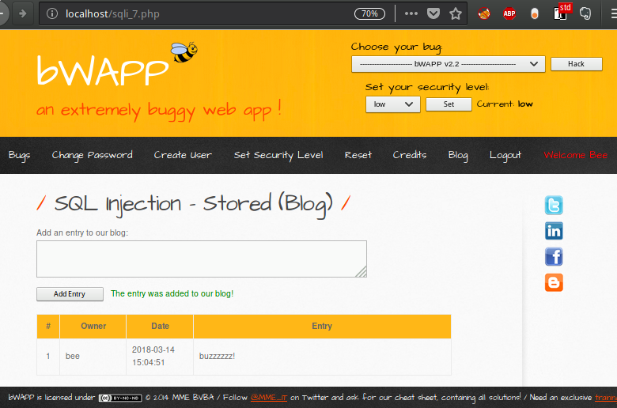
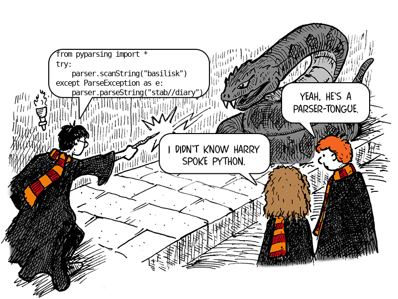

:slug: pars-orationis-secura/
:date: 2018-03-22
:subtitle: Utilizando intérpretes para detectar fallas
:category: ataques
:tags: detectar, inyección, escáner
:image: cover.png
:alt: Serpiente leyendo un documento
:description: Cómo usar Python y pyparsing para analizar el código de la aplicación para encontrar inyecciones de SQL en bWAPP. Una inyección SQL se define como una consulta SQL con concatenaciones. El intérprete detecta la mayoría de las inyecciones de SQL pese a de sus limitaciones y no tiene falsos positivos.
:keywords: Prueba, Detección, Intérprete, Python, Inyección, BWAPP
:author: Rafael Ballestas
:writer: raballestasr
:name: Rafael Ballestas
:about1: Matemático
:about2: con interés por CS
:source-highlighter: pygments
:translate: pars-orationis-secura/

= Pars orationis non est secura

¡Nos gusta link:http://itsecgames.com/[+bWAPP+] por aquí,
porque es muy defectuoso!.
Hemos mostrado cómo encontrar y explotar vulnerabilidades como
link:../importancia-pentesting/[inyecciones]
link:../fuzzy-bugs-online/#comparacion-con-la-inyeccion-manual[+SQL+],
link:../gherkin-esteroides/#deteccion-y-explotacion-dinamica[recorrido de directorios],
link:../xml-exploitable-markup-language/#inyectando-xpath-en-una-aplicacion-vulnerable[inyección +XPath+],
e
link:../app-aprieto/#documentando-vectores-de-ataque[inyección de comandos +UNIX+].
Todas ellas tienen una cosa en común, a saber:
podrían haberse evitado con un poco de
link:https://www.owasp.org/index.php/Data_Validation[validación de entradas].
En +PHP+ esto podría haberse hecho
con funciones como +fgetss+,
link:../app-aprieto/[+str_replace+] o
link:../gherkin-esteroides/[+strpos+].

Tomando algunas ideas del
link:../pararse-hombros-gigantes/[análisis de código estático]
y el enfoque de
link:../oraculo-codigo/['código como datos'],
¿qué tal si pudiéramos utilizar algún tipo de código
o herramienta de análisis sintáctico para obtener información
acerca de dónde se encuentran las debilidades de las aplicaciones?
Para eso están los intérpretes (+'parsers'+).

== Detección manual

Consideremos por ejemplo,
este sitio en nuestra aplicación vulnerable favorita:

.Añadiendo una entrada al "blog"

Cada vez que cargamos la página las entradas actuales en el blog
son _seleccionadas_ desde una base de datos +MySQL+.

La página en sí es bastante sencilla:
una cabecera, un menú, una barra lateral y un pie de página,
los cuales se mantienen uniformes en todo el sitio,
con la información importante dentro de su propio +
+.
El código fuente de dicha página luce así:

.Adaptado de +bWAPP+. Quitamos muchos corchetes y líneas.
[source,php,numbered]
----
include::/web/content/blog-en/pars-orationis-secura/redux-sqli-7.php[]
----

Por supuesto, estamos interesados principalmente en el +PHP+ y el +HTML+
mezclados en el +
+,
lo cual es justo lo que recortamos aquí,
porque es donde está el +SQL+.
Mirando unos pocos códigos fuentes adicionales,
notamos que siempre explotamos la misma vulnerabilidad.

Una petición +SQL+ es realizada al concatenar valores literales,
llamados a funciones +PHP+
y variables +PHP+ como +$entry+, mostrada anteriormente.
Esa variable viene de una petición +POST+
y es enviada a la función de desinfección +SQLi+.
Luego de concatenar y construir la petición,
es enviada a la base de datos para ser procesada.

De esta manera, podríamos escribir

[source,sql]
----
a','b'; drop table blog;--
----

En el campo de entrada
para convertir la petición en una peligrosa, una que elimine el blog.

Para detectar exitosamente estas inyecciones +SQL+
necesitamos buscar cadenas que contengan código +SQL+
así como utilizar la concatenación +PHP+ (+first . last+).
Esto no es suficiente,
pues también necesitamos relacionar la variable concatenada
con la entrada o parámetro
donde vamos a inyectar el +SQL+ malicioso.

Para cazar las inyecciones +SQL+ en +bWAPP+,
nuestra herramienta elegida será un conjunto de intérpretes,
es decir, una pieza de software usada para escanear una cadena o archivo,
en busca de partes que sigan un conjunto específico de reglas.

== Especificando los objetivos

Antes de continuar con los problemas del análisis y la gramática,
reflexionemos sobre lo que queremos encontrar.
Queremos detectar fragmentos de texto en el código,
los cuales siguen la sintaxis de una sentencia +SQL+ +SELECT+ o +INSERT+.
Pero también deben tener concatenaciones,
pues una sentencia sencilla como

[source,sql]
----
SELECT * FROM blog;
----

es perfectamente segura. ¿Dónde podríamos inyectar algo?

Por lo tanto, necesitamos sentencias +SELECT+ o +INSERT+ con concatenaciones.
También queremos que nuestra herramienta sea capaz de identificar:

* qué variable está en riesgo,

* dónde y cómo está definida,

* si está o no protegida por alguna función, y

* cualquier otra información que podamos encontrar.

La sintaxis de +INSERT+, de acuerdo a
link:https://dev.mysql.com/doc/refman/5.7/en/insert.html[+MySQL+],
se muestra a continuación:

[source,sql]
----
INSERT [LOW_PRIORITY | DELAYED | HIGH_PRIORITY] [IGNORE]
    [INTO] tbl_name
    [PARTITION (partition_name [, partition_name] ...)]
    [(col_name [, col_name] ...)]
    {VALUES | VALUE} (value_list) [, (value_list)] ...
    [ON DUPLICATE KEY UPDATE assignment_list]
----

Ésto sirve de excusa para introducir
la notación para sintaxis de lenguaje llamada
link:https://en.wikipedia.org/wiki/Backus%E2%80%93Naur_form#Example['forma de Backus-Naur'] (+BNF+)
Esencialmente, todo lo contenido dentro de los corchetes es [opcional],
la barra vertical (+|+) representa una disyunción (+ó+),
las llaves representan sentencias +{obligatorias}+
y los +...+ representa una repetición opcional.

Para nuestros propósitos, la sentencia +INSERT+ tiene la siguiente forma:

[source,sql]
----
INSERT INTO tbl_name [column-names] VALUES (value-list)
----

Utilizaremos sub-intérpretes para definir el significado de cada elemento.
Por ejemplo +tbl_name+ es cualquier identificador +SQL+,
el cual consiste de símbolos alfanuméricos y guiones bajos (+_+).
Y +value-list+ se compone de un valor único
o una lista de valores separados por comas.

Pero ¿qué es un valor? Aquí es donde se pone interesante.
Consideremos este ejemplo:

[source,sql]
----
INSERT INTO table VALUES ('1', NOW(), '" . $var1 . "','" . clean($var2, 1) . "'
----

Entonces, un valor puede ser:

* un número o cadena fija,

* una función de +MySQL+ como +NOW()+,

* una concatenación de una cadena o número obtenido de:

** una variable +PHP+ (+$var1+),

** una función (+clean()+), la cual también puede tomar argumentos.

Aquí es donde los intérpretes muestran su potencial
y el enfoque alternativo de
link:https://en.wikipedia.org/wiki/Regular_expression[expresiones regulares], falla.
Imagina tratar de escribir un +regex+
para una sentencia +INSERT+ con concatenaciones.
Sería enorme, además de muy difícil de entender.
Otras desventajas de las expresiones regulares
son que tienen que tratar con los espacios en blanco de forma explícita
y son difíciles de mantener
cuando hay algún cambio en la sintaxis del lenguaje.
Como dice el famoso refrán:

[quote,Jamie Zawinski]
Algunas personas, al confrontar un problema, piensan
"Ya sé, utilizaré expresiones regulares."
Ahora tienen dos problemas.

== Aprendiendo la lengua pársel

Ahora que hemos excluído las expresiones regulares,
tenemos que elegir un intérprete.
Aparentemente el estándar por un tiempo solía ser la combinación de
link:http://dinosaur.compilertools.net/[+lex+ and +yacc+],
la cual era bastate complicada.
Hoy en día tenemos dos elecciones sólidas:
link:http://www.antlr.org/[+ANTLR+] para los amantes de +Java+
y link:http://pyparsing.wikispaces.com/[+pyparsing+] para nosotros.

.¡No necesitas ser un mago para utilizar +pyparsing+!

Algunas características geniales de +pyparsing+ son:

* Utiliza una sintaxis simple que hace la gramática transparente.

* Se ajusta bien a tu código en +Python+.

* Utiliza constructores de clases estándar
y lenguaje plano en lugar de extraños símbolos crípticos.

* Es tolerante a los cambios y fácil de adaptar
a las diferentes entradas u objetivos a encontrar.

* Incluye algunas funciones de ayuda bastante útiles,
como acciones de conversión (v.g. convertir una cadena de dígitos a un entero).

En +pyparsing+ el intérprete más externo
para la sentencia +INSERT+ se escribe:

[source,python]
----
sql_insert = CaselessKeyword("INSERT INTO") + sql_identifier + Optional(column_names)
       + CaselessKeyword("VALUES") + values
----

Las funciones en +SentenceCase+ son provistas por +pyparsing+,
y sus nombres son bastantes ilustrativos.
El operador +++ es sobrecargado para interpretarse como "seguido por"
y es insensitivo a los espacios en blanco.
Los identificadores +snake_case+ sólo son identificadores
y tenemos que definirlos:

[source,python]
----
sql_identifier = Word(alphanums + "_")
values = Group( Literal("(") + delimitedList(value) + Literal(")") ).setResultsName("values")
----

Aquí +Word+ significa
cualquier combinación de los caracteres dados.
De esta forma +sql_identifier+
es simplemente una combinación de caracteres alfanuméricos y el guión bajo.
Los +values+ son una lista delimitada por comas,
encerrada entre paréntesis.
Agrupamos esa lista en una sola entidad
de tal forma que después podamos referirnos a ella por su nombre.

Los identificadores +PHP+ son como los nombres +SQL+,
pero deben empezar con el símbolo +$+.
También definimos los llamados a funciones:

[source,python]
----
php_identifier = Combine( Literal("$") + sql_identifier ).setResultsName("php identifier")
php_funcall = Combine( sql_identifier + Literal("(") +
             + Optional(delimitedList(php_identifier)) + Literal(")") )
----

A diferencia de +Group+, +Combine+ integra
todos los +tokens+ encontrados en uno solo.
Hacemos eso ya que en realidad no nos interesa
cada una de las partes del llamado de función,
sino únicamente los +identificadores_php+ en su interior,
a los que podemos acceder utilizando el nombre
que le dimos anteriormente.
Nótese que, a pesar que los +identificadores_sql+
no pertenecen aquí lógicamente,
tienen la misma sintaxis que los nombres de funciones
y las colas de los identificadores,
por lo que podemos de igual manera reutilizar ese intérprete.

Finalmente, llegamos al centro del problema:
un +valor+ a insertar es o bien una palabra o un número, o
el resultado de una función, o una *concatenación peligrosa*:

[source,python]
----
value = varchar ^ php_funcall ^ danger_concat
danger = ( ... + (php_identifier ^ php_funcall) + ... ).setResultsName("danger identifier")
----

Aquí el símbolo +^+ es la disyuntiva +ó+
y hemos omitido algunos intérpretes
por todas las comillas y puntos.
Por cierto, nótese que todas las partes nombradas de nuestro gran intérprete
también son intérpretes
y podemos usarlas por separado.

Una forma de utilizar un intérprete es utilizando el método +parseString+.
Éste retornará la estructura de +tokens+ si hay una coincidencia,
o arroja una +ParseException+ en caso contrario.

----
>>> print(test_values)
('1', now(), '" . $var1 "')
>>> result = values.parseString(test_values)
>>> print(result)
[['1', 'now()', '$var', '3']]
>>> print(result["values"]["danger identifier"])
['$var']
>>> print(values.parseString("not a list of values")
...
pyparsing.ParseException: Expected "(" (at char 0), (line:1, col:1)
----

Nótese cómo nos referimos a la lista de valores retornados
como +result["values"]+,
y de ahí podemos obtener los identificadores
que hacen parte de la concatenación peligrosa.

La función +scanString+ busca subcadenas que responden a la gramática.
Bastante útil. Además te dice dónde se encontraron las subcadenas.
La usamos para informar al usuario acerca de la línea y columna
en donde la posible inyección +SQL+ fue encontrada.

.Uso de +pyparsing.scanString+.
[source,python,numbered]
----
for tokens, start, end in sql_injection.scanString(content):
    sqli_line = line(start, content)
    print("In file {0}, line {1}, col {2}:\n{3:^}"
          .format(path.split("/")[-1], lineno(start,content),
          col(start,content), sqli_line.strip() ))
----

Éstas son algunas de las funciones de ayuda
de +pyparsing+ mencionadas anteriormente:
+scanString+ retorna un iterador que genera +tokens+,
al igual que +parseString()+,
que además da los caracteres iniciales y finales.
Para convertirlos a números de línea y columna,
utilizamos las funciones +lineno()+ y +colno()+, respectivamente.

Hasta ahora, esto no es nada fuera de este mundo:
nada que no podríamos haber hecho
con +grep+ o expresiones regulares de +Python+.
Donde los intérpretes realmente superan a las expresiones regulares
es en la extracción de información y estructura del texto,
como hicimos antes para identificar los valores insertados
y, de éstos, cuáles son las variables donde podemos inyectar +SQL+.
Para eso, lamentablemente, tenemos que volver a intepretar
porque no sabemos de antemano si el valor insertado es un llamado a función
o un identificador de +PHP+:

[source,python]
----
injectable_variables = tokens["values"]
for injectable_variable in injectable_variables:
    res = (php_identifier ^ php_funcall).parseString(injectable_variable)
    injectable_variable = res["phpvar"]
    print(" Injectable variable {0}. Other ocurrences:".format(injectable_variable))
----

Recuerde que necesitamos detectar líneas con consultas +SQL+
que contengan variables concatenadas peligrosamente,
pero también _dónde_ estas variables son tomadas de la entrada del usuario
y si están o no protegidas.
Pero, ya que tenemos la "variable inyectable" en forma de cadena normal,
podemos crear otro intérprete sobre la marcha
para encontrar las líneas donde la variable es mencionada.
Ésta es sencilla:

[source,python]
----
tpar = Literal(injectable_variable)
for tokens, start, end in tpar.scanString(content):
    print("  L{0:<3} {1}".format(lineno(start2, content),
                                 line(start2,content).strip()))
----

En cualquier punto, si se arroja una +ParseException+ o un +KeyError+,
eso sólo significa que un +parseString+ falló,
o que tratamos de acceder a un elemento
que no ha sido previamente interpretado.
Mejor dicho,
significa que esa petición en realidad no era peligrosa.

Finalmente, corremos este código para cada archivo +PHP+
en la raíz del servidor +bWAPP+.
La salida que obtenemos es muy larga
(ver el link:results.txt[reporte completo])
He aquí una parte:

----
In file sqli_4.php, line 131, col 17:
$sql = "SELECT * FROM movies WHERE title = '" . sqli($title) . "'";
 Injectable variable $title. Other ocurrences:
  L129 $title = $_REQUEST["title"];
  L131 $sql = "SELECT * FROM movies WHERE title = '" . sqli($title) . "'";
Found 1 SQL injection in bWAPP/sqli_4.php.
...
In file sqli_1.php, line 143, col 13:
$sql = "SELECT * FROM movies WHERE title LIKE '%" . sqli($title) . "%'";
 Injectable variable $title. Other ocurrences:
  L141 $title = $_GET["title"];
  L143 $sql = "SELECT * FROM movies WHERE title LIKE '%" . sqli($title) . "%'";
Found 1 SQL injection in bWAPP/sqli_1.php.
...
In file xss_stored_1.php, line 253, col 31:
$sql = "SELECT * FROM blog WHERE owner = '" . $_SESSION["login"] . "'";
 No dangerous concatenations in this query.
...
Total SQL injections found: 56
----

¡Son muchas inyecciones SQL!
Sin embargo, no esperamos que cada una de ellas
sea de hecho una inyecciones +SQL+ real ('falsos positivos')
y puede que algunos archivos contengan inyecciones +SQL+ efectivas
que han 'escapado' de nuestro escrutinio.

Para encontrar la tasa de vulnerabilidades descubiertas
respecto a las existentes ('rendimiento')
tomamos el link:http://www.mmebvba.com/sites/default/files/downloads/bWAPP_sample_report.pdf[reporte Netsparker de bWAPP]
como referencia.
Este reporte relaciona +57+ inyecciones +SQL+.
Comparado a nuestras +56+, eso nos da un 'rendimiento' del +98%+.
Nada mal para nuestro sencillo intérprete.
Por lo tanto las 'fugas', es decir,
la tasa de las vulnerabilidades no encontradas sobre el total existente
es +2%+ en este caso.

Estos números deben ser tomados con cautela,
debido a que algunas de estas vulnerabilidades
pueden ser clasificadas como +XSS+ o +CSRF+ dependiendo de la fuente.
A pesar de ello, nuestro criterio es claro:
todas las vulnerabilidades que encontramos
son peticiones +SQL+ con concatenaciones,
y todas ellas pueden ser inyectadas,
ya sea fácil o difícili hacerlo.

Por supuesto, es probable que existan algunos falsos positivos.
Sin embargo, dado el diseño del intérprete,
y revisando la salida del +script+
vemos que sólo las concatenaciones realmente peligrosas son reportadas.
Algunas de estas pueden ser protegidas
a través de buenos validadores de entradas,
como +mysqli_real_escape_+ pero ninguna es inexpugnable.

Así, podemos decir con una confianza estadística del +95%+
que nuestro +pyparsing+ reporta las vulnerabilidades

[quote]
sin falsos positivos.

== Referencias

* McGuire, Paul (2008). 'Getting started with pyparsing'. O'Reilly shortcuts.

== Apéndice: Intérprete SQLi completo

Descarga el link:./sqli-parser.py[código]
y los link:./test-cases.lst[casos de prueba].
Correr desde la raíz del servidor +PHP+ probado.

.+sqli_parser.py+
[source,python,numbered]
----
include::/web/content/blog-en/pars-orationis-secura/sqli-parser.py[]
----
