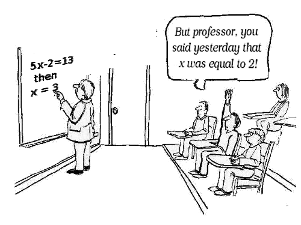

:slug: por-que-somos-funcionales/
:date: 2018-07-24
:category: programación
:subtitle: Funcional vs Imperativo
:tags: aplicación, funcional, imperativo, sin estado
:image: cover.png
:alt: Rubber ducks depicting Karl Marx
:description: Un análisis de por qué es necesario programar de manera funcional incluso con lenguajes no funcionales. Beneficios de la programación funcional. Un comparativo entre lo imperativo y lo funcional. Cómo Fluid Attacks migró de imperativo a funcional de manera no traumática.
:keywords: Paradigma funcional, Orientado a objetos, Sin estado, Aplicación multiparadigma, Laziness, Revolución del código.
:author: Oswaldo Parada
:writer: oparada
:name: Oswaldo José Parada Cuadros
:about1: Ingeniero Mecánico
:about2: Familia, amigos y pequeños detalles. Ahí está la respuesta.
:translate: why-we-go-functional/

= Por qué somos funcionales?

En 1848, Karl Marx lanza a la opinión pública,
un polémico escrito llamado El Manifiesto Comunista.
Desde entonces hasta hoy, para bien o para mal,
este documento ha influenciado la sociedad.
Si alguna vez has pensado que el gobierno no hace bien su trabajo,
que te están drenando la vida en impuestos o que el estado no debería existir,
probablemente debas leer ese manifiesto.
Pero mi querido camarada,
este artículo no es una declaración comunista, todo lo contrario.
Solo queremos rescatar una idea:
_El estado no debería existir_.<<r1 ,^[1]^>>

Con el ánimo de desarrollar una revolución en programación (y no una social),
el paradigma funcional cada vez viene tomando más fuerza
tanto en las comunidades de desarrolladores
como en las grandes empresas de tecnología.
Por supuesto, Fluid Attacks no es la excepción.

.Tu cara hasta este punto.
image::weird-look.png["Niña juzgando con su mirada"]

Es probable que te estés preguntado de qué estamos hablando,
¿Qué es funcional?.
No desesperes.
En pocas palabras, la programación funcional pretende resolver la pregunta
¿Que estoy haciendo? en comparación con la programación orientada a objetos
que responde a la pregunta ¿Cómo lo estoy haciendo?.
Para esto, la programación funcional tiene una característica especial,
es sin estado, es decir,
no guarda ni comparte información por medio de estructuras de datos,
restringiendo a que las funciones no puedan modificar esa información.
Las funciones únicamente usan los datos de entrada
para crear nueva información a la salida.
A continuación, se muestra un ejemplo
para entender mejor la diferencia entre funcional e imperativo:

.Función de Javascript para multiplicar 2 enteros, una aproximación imperativa y funcional.
[source, javascript]
----
// Función imperativa para multiplicar.
class Integer {
  constructor (number = 0) {
    this.number = number;
  }
  multiply (x) {
    this.number = this.number * x;
  }
}
const myInteger = new Integer (2);
myInteger.multiply (6);
console.log (myInteger.number); //12

// Función funcional para multiplicar.
const multiply = a => b => a * b;
console.log (multiply (2) (6)); // 12
----

== Más beneficios, menos problemas.

En la oficinas de Fluid Attacks investigamos,
desempolvamos libros viejos
y volteamos algunas piedras para descubrir
que los verdaderos beneficios de la programación funcional
se encuentran donde la programación imperativa tiene falencias.
La primera ventaja es la posibilidad de usar +lazy evaluation+,
la cual permite retrasar la ejecución de una expresión lo más posible,
generalmente hasta que el resultado de dicha función sea requerido.
Esto saca a relucir otra ventaja importante.
Los comandos dejan de ser imperativos,
ahora el +runtime+ tiene más control sobre lo que ejecuta
y en qué momento lo ejecuta, por lo que,
al igual que la electricidad en un circuito,
siempre va a tomar el camino más corto.

Si a lo largo de tu vida has programado en lenguaje C,
recordarás que para cada variable,
había que asignarle el número de bytes que iba a ocupar
a través de la función +malloc+.
Esto era un completo dolor de cabeza,
porque es rebajarse a programar casi al nivel de la máquina.
El lenguaje funcional busca desligar al desarrollador
de todas estas trivialidades de ejecución
para que pueda concentrarse completamente en resolver el problema.

Para nosotros, la joya de la corona declarativa
es la mejora en la lectura del código.
Ahora cualquier nuevo desarrollador que se una a nuestro equipo,
podrá entender más fácil que se está haciendo.
Esto es una gran ahorro de tiempo
tanto para analizar como para corregir errores en el código.

Otro beneficio importante tiene que ver a la correlación
entre el estado mutable y los tests:
más de lo primero, requiere más de lo último.
El estado mutable trae consigo efectos secundarios
que generalmente no se esperaban,
desembocando en la necesidad de crear más tests para evitar sorpresas,
así que, podemos inferir que un código funcional permite generar
menos tests para cubrir más funcionalidades.

Un mundo sin estado también otorga
el beneficio de la transparencia referencial,
definido como la capacidad de reemplazar una operación por su valor
y lograr el mismo efecto.
Esto se logra únicamente si la operación es determinista
(para un mismo valor de entrada siempre se obtendrá el mismo resultado),
no depende de nada fuera de su estructura
y lógicamente, ser sin estado.

.El mayor problema de los lenguajes imperativos.

== ¿Por qué ahora?

El paradigma funcional no es un tema nuevo,
de hecho, tiene sus orígenes en teorías
sobre funciones lambda y recursividad desarrolladas en 1930.
Para los años cincuenta, nace LISP,
el primer lenguaje con características funcionales,
de ahí en adelante empiezan a surgir lenguajes
como Clojure, Haskell, Scala, etc. <<r2 ,^[2]^>>
Pero ¿por qué apenas en los últimos años
es que este paradigma está resonando tanto?.

El paradigma funcional fue opacado por la existencia de lenguajes orientados
a objetos como Java y Python, que proponen un mayor facilidad para programar.
Durante el siglo pasado, los lenguajes funcionales
se ejecutaban más lento que los orientados a objetos,
un tema relacionado a la capacidad de los procesadores de aquel entonces.

.Probablemente la situación de todos los lenguajes funcionales durante los años 90.
image::haskell-back-then.png["Dos personas hablando sobre lenguajes funcionales"]

Hoy en día, la barrera del hardware fue superada.
La mayor motivación para usar funcional,
es que actualmente las aplicaciones son demasiado complejas
y de tamaños inmensos, con flujos de usuarios
que superan los millones por hora, por lo que funciones deficientes,
que no permiten flexibilidad, concurrencia
y paralelismo en su ejecución dejan de ser rentables.
Una aproximación funcional nos aporta
una gran escalabilidad, un mantenimiento rápido
y expresiones robustas, capaces de perdurar en el tiempo.

== Por qué nosotros?

¿Por qué una empresa que se dedica a la seguridad
de la información le preocupa ser funcional?.
La respuesta es sencilla: Queremos hacerlo bien a la primera,
queremos que nuestro código sea un reflejo de la calidad
y las buenas prácticas en las que se basa Fluid Attacks.
Estamos seguros que el código será excelente
desde el inicio porque pensamos de manera funcional,
no hay espacio para la ambigüedad,
no hay espacios para efectos secundarios.
Algo hace lo que dice y nada mas, punto final.
Todo esto en un código limpio
y entendible hasta para los no iniciados
en las profundas aguas de la programación.
¿No nos crees? Compruebalo tu mismo
con uno de nuestros productos insignia:
[button]#link:https://fluidsignal.gitlab.io/asserts/[Asserts]#.

== Funcional para no funcionales

Quizás estás pensando que los beneficios son muy buenos,
pero eres un OOO (Obsesionado por la Orientación a Objetos)
y todo tu código está en un lenguaje imperativo.
Es normal, esta bien ser un poco reacio pero no te preocupes.
Aquí en Fluid Attacks somos como tú, usamos lenguajes orientados a objetos
y eso no nos impidió ser funcionales.
Todos los lenguajes pueden ser funcionales.
De hecho, la gran mayoría de lenguajes están tendiendo a lo funcional
a través de librerías con métodos
que reproducen comportamientos declarativos bastante bien.
En general hay ciertas claves que debes seguir
para ser funcional en un lenguaje no funcional:

. Evitar el uso de clases y sus atributos.
Usar clases sólo si es estrictamente necesario (En asuntos de vida o muerte).
. Crear funciones granulares que solo hagan UNA cosa.
. Las funciones deben ser deterministas (ya sabes que es determinista).
. Minimizar la cantidad de estructuras de datos.
. Pensar en listas como el “primer elemento”
y el “resto de la lista” y no como valores indexados.
. Almacenar para después.
Es preferible revisar si una lista no está vacía
a tener que realizar una operación nuevamente.
. Pensar en recursividad y funciones primitivas antes que en ciclos iterativos.
. NO usar variables globales (La reina de los estados mutables).

== Cambia tu manera de pensar antes que tu sintaxis!

Realizar el salto de imperativo a funcional no es fácil.
Puede que veas y analices miles de líneas de código funcional
y aún seguir sin entender, no es porque la sintaxis sea más difícil,
es porque simplemente sigues pensando en una solución imperativa!.
Antes de siquiera pensar en leer la documentación del módulo funcional
de tu lenguaje de programación, primero deja de ir directamente a aplicar
una implementación específica para un problema particular,
mejor tómate el tiempo de aprender donde se pueden aplicar
abstracciones de alto nivel en tu problema. <<r3 ,^[3]^>>
Aquí es necesario pensar fuera de la caja,
categorizar los problemas de manera diferente,
viendo los puntos en común de nuestra implementación.

== Conclusión

Aparte de descubrir que Karl Marx
hubiese sido un genio de la programación funcional,
ahora sabemos que la programación funcional no es un asunto de moda,
es un asunto de supervivencia:

[quote,Charles Darwin]
No es la especie más fuerte la que sobrevive,
tampoco la más inteligente sobrevive.
Es aquella con mayor capacidad de adaptarse al cambio.

Seguramente estás pensando que es mucho tiempo pensando
y poco tiempo en el teclado, que tienes un jefe presionando,
que hay fechas límites que cumplir,
sin embargo, ¿En cuanto tiempo tu código imperativo se oxidará?.
Probablemente empezarás a tener problemas de rendimiento
gracias a la interminable maraña de métodos y clases,
finalmente el código se pudrirá
y terminará siendo devorado por los carroñeros.
Piensa a futuro, se funcional.

== Referencias

. [[r1]] link:https://en.wikipedia.org/wiki/Marx%27s_theory_of_the_state[Teoría sobre el estado según Marx]
. [[r2]] link:https://en.wikipedia.org/wiki/Functional_programming[Programación Funcional]
. [[r3]] _Functional Thinking: paradigm over syntax_, Neal Ford, book, 2014
