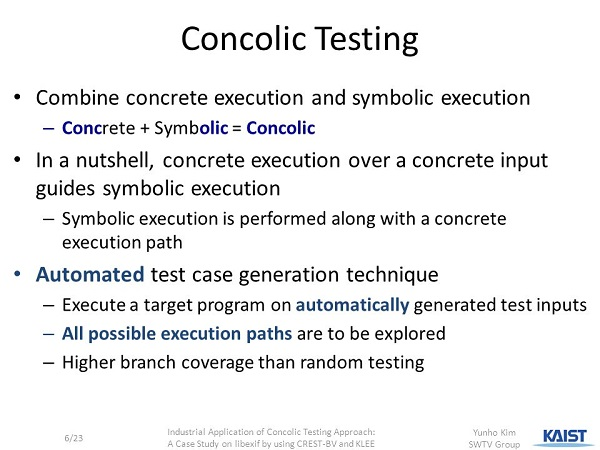
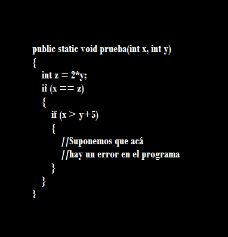

:slug: probar-software/
:date: 2017-05-17
:category: ataques
:subtitle: Acerca de la ejecución simbólica y concólica
:tags: probar, software, funcionalidad
:image: disculpe-senor.png
:alt: Lupa buscando insectos(bugs) en un monitor
:description: Las pruebas de software se realizan cuando se busca verificar la funcionalidad de la aplicación, se pueden realizar pruebas de seguridad donde se busca encontrar fallos que pueden comprometer la integridad del sistema. A continuación detallaremos algunas formas de probar un software.
:keywords: Seguridad, Pruebas, Software, Testing, Funcionalidad, Ejecución.
:author: Jhony Villa
:writer: jhony
:name: Jhony Arbey Villa Peña
:about1: Ingeniero en Sistemas.
:about2: Apasionado por las redes la música y la seguridad.

= No sé cómo probar un software

En un mundo globalizado que está en constante expansión,
surge la necesidad de transmitir y tratar todo tipo de información
de manera constante, ágil y segura.
Teniendo en cuenta esa dinámica de globalización y expansionismo,
y para suplir la necesidad anteriormente descrita,
se crearon los equipos de cómputo, y con la respectiva revolución tecnológica
que ellos trajeron, aparecieron múltiples aplicaciones informáticas,
o +software+, tan diversos y enfocados a tantas áreas del conocimiento,
que concebir el día a día sin éstas, resulta imposible.

A partir de ese punto floreció una nueva exigencia,
procurar que cada producto de +software+ desarrollado
cumpla con unos requisitos mínimos en cuanto a la misma construcción,
implementación, cumplimiento y medidas de seguridad pertinentes
para proteger la información tratada por él.
En  ese orden de ideas, surgieron las pruebas de +software+ o +testing+.

Las pruebas de +software+ son un conjunto, como su nombre lo dice,
de pruebas que verifican el comportamiento de un programa
con el fin de comprobar si éste realiza o no lo que es esperado.

En cuanto a la seguridad informática, estas pruebas son fundamentales,
puesto que permiten encontrar posibles vulnerabilidades que, de ser explotadas,
comprometerían el buen funcionamiento del +software+,
y eso sin mencionar que podría verse comprometida toda la información
utilizada por el programa para su desempeño.

.+Concolic Execution+: tomado de kaist.edu

Una de esas pruebas se conoce como +Concolic Execution+ o +Concolic Testing+.
Esta prueba de verificación de +software+ analiza
el funcionamiento de los programas,
tratando a las variables como variables simbólicas
a lo largo de una ejecución concreta.
En sí, esto quiere decir que +Concolic+ combina dos tipos de +testing+:
+concrete execution+ o ejecución concreta
y +symbolic execution+ o ejecución simbólica.

Las pruebas de *_ejecución concreta_* son aquellas que toman una sola ruta
determinada para los valores de entrada, es decir,
a las variables de inicio de un programa les asigna un único valor
y la prueba la realiza siguiendo el camino que el +software+ toma,
 a partir de los valores dado.

Veamos un ejemplo. Tomemos el siguiente fragmento de código +Java+.

.Código de ejemplo

En él, se tienen tres variables *_X_*, *_Y_* y *_Z_*,
cuyo valor es la multiplicación de *_Y_* por *_2_*.
Además, hay dos condiciones, pero como se ve,
en la segunda existe un error que podría afectar
el buen funcionamiento del programa.

Cuando se realiza una prueba concreta, ésta le asigna un valor aleatorio
a las variables que así lo requieran, en este caso *_X_* y *_Y_*.
Bien, supongamos que los valores asignados son *_X=2_* y *_Y=3_*,
por tanto *_Z_* será igual a *_6_*.

La primera condición requiere que *_X_* sea igual a *_Z_*,
como *_2_* no es igual a *_6_*, la condición no se cumple,
y por tanto la ejecución del programa termina.
Entonces, la prueba de ejecución concreta termina,
y como nunca llegó al bloque de código que genera el error,
ésta concluye que el +software+ trabaja normalmente.

Por otra parte, las pruebas de *_ejecución simbólica_*
determinan los posibles valores que pueden tomar
las variables de inicio de un programa, asignándole un valor simbólico
a cada una de ellas.

Tomando el código del ejemplo anterior, las dos variables toman
un valor simbólico, en este caso *_X=A_*, *_Y=B_* y, por tanto, *_Z=2B_*.
Cuando llega a la condición, y como los valores son simbólicos,
el test toma los dos caminos posibles para continuar, es decir,
*_X!=Z_* o *_X=Z_*, y los evalúa.
Como el +software+ no realiza ninguna acción con *_X!=Z_*,
este camino es descartado, y procede a examinar *_X=Z_* que, en el código,
lleva a otra condición.
En este punto, la prueba vuelve a tomar los dos posibles caminos
de la condición que *_X<=Y+5_*, o *_X>Y+5_*.
Y, nuevamente, como la primera opción no lleva a ninguna parte, la descarta,
y continúa examinando las instrucciones derivadas de la segunda opción que,
en este caso, llevan al error que tiene el programa.

Si bien la ejecución simbólica es una de las pruebas de +software+
más competentes y acertadas que hay,
debido a que examina todos los posibles caminos de ejecución de un programa,
el uso de este método para evaluar +software+ demasiado grandes
resulta en una sobrecarga de rutas, es decir,
la ejecución del programa genera demasiadas rutas que, al final,
la evaluación de todas resulta demasiado complicado.
Además, en caso de que el programa caiga en un ciclo infinito,
la prueba de verificación nunca terminaría.

Así que, como la ejecución concreta y la ejecución simbólica
tienen varios problemas, +Concolic Execution+ surge como la fusión de las dos,
con el fin de eliminar los problemas subyacentes en ambas
y tomar lo mejor de cada una, a la hora de realizar +testing+.

Entonces, tomando el código ya propuesto
para explicar el funcionamiento de +Concolic+,
empezaríamos por decir que la prueba comienza asignándole un valor determinado
a cada variable.
Al igual que lo explicado en la ejecución concreta,
diremos que *_X=2_*, *_Y=3_* y *_Z=6_*.
El recorrido del programa inicia mientras que +Concolic+ realiza un seguimiento
del camino tomado por la prueba.
Cuando se llega a la condición, y debido a que esta no se cumple,
se fuerza una ejecución simbólica, es decir,
a las variables se les asigna valores simbólicos (*_X=A_*, *_Y=B_*, *_Z=2B_*),
y ésta es forzada a tomar el camino trazado por el +test+ anterior.
Además, a medida que avanza, analiza todas las condiciones
que deben cumplir las variables para poder continuar con el programa.
Y, una vez tiene todas estas restricciones,
+Concolic Execution+ genera los valores reales que deben tomar las variables.

En pocas palabras, cuando la ejecución simbólica llega a la primera condición,
+Concolic+ sabe que, para que *_X=Z_*, *_X_* puede ser *_2_* y *_Y=1_*.
De esta forma, *_Z=2_*, y la condición se cumple.
Por tanto, el programa puede pasar a evaluar la siguiente condición.

Cuando los valores son generados,
se vuelve a realizar una prueba de ejecución concreta
con los valores previamente generados.
Así, los pasos anteriores se repiten
hasta que todas las instrucciones del programa son evaluadas,
o se encuentra algún error en el mismo.

Para terminar el ejemplo,
la ejecución concreta encuentra que los valores asignados
no cumplen la segunda condición,
por tanto, se realiza una ejecución simbólica
para analizar las restricciones,
y que +Concolic+ pueda determinar que los valores adecuados
para continuar con el programa y, en este caso, hallar el error,
son *_X=12_* y *_Y=6_*.

Para concluir, la creciente demanda en la producción de +software+
y la complejidad cada vez más elevada de éstos,
hacen de +Concolic Execution+ una herramienta óptima
a la hora de probar la calidad y seguridad de un +software+.
Sin embargo, es necesario destacar que, para comprenderlo de una manera óptima,
es necesario aprender los fundamentos básicos requeridos
en el área de desarrollo de +software+,
puesto que lo expuesto en el presente artículo
es tan sólo una pequeña aproximación a la magnitud y complejidad
de este tipo de pruebas.
