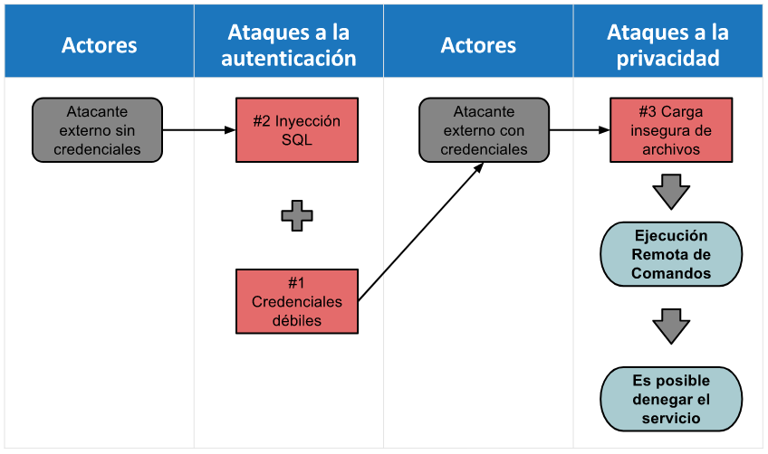

:slug: proteger-organizacion-hacker-lamer/
:date: 2017-12-18
:category: opiniones
:tags: seguridad, proteger, información
:Image: lamers.png
:alt: Manos tecleando en un editor de texto
:description: TODO
:keywords: TODO
:author: Felipe Gómez
:writer: fgomez
:name: Felipe Gomez Arango
:about1: Account Manager de FLUID, Administrador de Empresas
:about2: Apasionado por la tecnología y la seguridad

= Proteja su organización de los Hackers, no de Lamers

Sin lugar a dudas, los recientes eventos en términos de vulneración de 
privacidad como los robos de información personal a celebridades, hackeos a 
empresas como Sony, Target, Equifax y secuestro de información por medio de 
Ransomware a Telefónica, nos hacen reflexionar sobre cómo las organizaciones 
protegen su información.

Esto sumado a una economía volcada a lo digital, donde las plataformas 
tecnológicas cada vez están más inmersas en el core del negocio, y donde los 
cambios o el llamado time to market tiene que ser cada vez más ágil, 
incrementa los riesgos a los que la organización se expone, mas aún, cuando 
busca protegerse solo por cumplir y no porque realmente tenga una conciencia de 
lo que está pasando.

Es en este afán de las organizaciones de sentirse seguras a un muy bajo costo, 
donde incurren en riesgos al ejecutar “pruebas de seguridad” con lo cual se 
pueda demostrar que están “seguros”, que pueden cumplir con las 
necesidades del negocio y es apropiado salir a producción y exponer su 
información.

Es acá donde entran los llamados “Lamers”, quienes no son más que 
personas u organizaciones que presumen de tener unos conocimientos o 
habilidades técnicas que no poseen y que además, no están dispuestos a 
aprender. Unas corrientes puristas de la tecnología van más allá y los 
tildan de incompetentes. En términos más sencillos, un Lamer es aquella 
persona que tiene un conocimiento promedio bajo, algunas herramientas a su 
alcance y lo más esencial, sabe hacer consultas en google.

Pero, ¿qué tiene que ver un Lamer con la sensación de seguridad de su 
compañía?

Entre los procesos y controles implementados por las empresas para protegerse 
se encuentran las Pruebas de Seguridad. Las organizaciones consideran que 
cumplen con este control al incluir un software de uso específico (Appliance) 
para realizar el escaneo de vulnerabilidades, con el fin de dar cumplimiento a 
lo que las áreas de seguridad exigen a producción o desarrollo para poder 
salir en vivo. Sin embargo, no tener clara la diferencia entre un análisis de 
vulnerabilidades y un Ethical Hacking (Pentesting) puede generar una falsa 
sensación de seguridad, lo que pone indudablemente en riesgo a la 
organización.

Un análisis de vulnerabilidades es un práctica realizada a través de una 
herramienta para verificar si un ToE (Target Of Evaluation) tiene 
vulnerabilidades reportadas en bases de datos como CVE (Common Vulnerabilities 
and Exposures). Esto implica que un Análisis de Vulnerabilidades no está en 
la capacidad de encontrar por sí mismo vulnerabilidades ZERO DAY, por ejemplo. 
Cualquier persona está en la capacidad de correr la herramienta (Lamer) y el 
trabajo más arduo se da en el análisis de la información y el descarte de 
los falsos positivos (Cerca del 35% de lo reportado).

Con un Análisis de Vulnerabilidades normalmente se identifican servicios 
expuestos sin contraseña, claves por defecto, software desactualizado, 
ausencia de parches, etc.

Una prueba de seguridad basada en herramientas (Análisis de Vulnerabilidades 
con explotación selectiva), no permite por parte del atacante la 
identificación de errores en el diseño e implementación de la arquitectura 
de una solución específica. Si bien existen proveedores que explotan 
vulnerabilidades, esta explotación se realiza con base en los resultados 
obtenidos a través de una herramienta, más no por la malicia y la capacidad 
de interpretación del entorno por parte del atacante.

image::animacion-de-explotacion.gif[injection]
.*_Explotación de SQL injection por acuberos@fluid.la_*

A diferencia de un análisis de vulnerabilidades, un Pentesting (Ethical 
Hacking), busca simular un escenario y procedimientos que un atacante real 
desarrollaría para llegar a comprometer la información de la compañía. Las 
pruebas de seguridad buscan evaluar la efectividad de los controles 
implementados en una tecnología específica, ya sea a nivel de infraestructura 
o aplicación. Adicionalmente, este tipo de pruebas permiten realizar una 
correlación de vulnerabilidades, que no es más que la forma como un atacante 
real busca generar el mayor daño posible a las compañías.

.*_Ejemplo de mapa de hallazgos (Correlación de vulnerabilidades)_*

Uno de los factores más críticos que todo Pentesting busca evitar es el 
llamado Yield o Fuga de vulnerabilidades. Esto básicamente se puede disminuir, 
cuando se ejecuta un Ethical Hacking con 100% de cobertura, es decir, que se 
evalúe el 100% de la tecnología que es objeto de prueba.

La única forma bajo la cual se puede determinar esta cobertura, es 
dimensionando de forma adecuada la prueba que desea realizar. Hay que buscar 
tener una medida estándar para esto, por lo cual nosotros proponemos que 
siempre los Pentesting sean dimensionados por medio de un alcance establecido.

La forma de lograr esto es normalizando los drivers bajo los cuales se 
dimensionan las pruebas. Cuando se trata de una prueba de seguridad que 
evaluará una Aplicación, se deben dimensionar la cantidad de campos que tiene 
el sistema. Por su parte, cuando es una prueba a una Infraestructura, se deben 
conocer la cantidad de puertos que están expuestos. Finalmente, cuándo se va 
a realizar un Análisis de Código Fuente, se deben dimensionar la cantidad de 
líneas de código.

Al tener claro estos alcances, se puede tener la tranquilidad de que se 
revisará todo lo que está en esa tecnología, al contrario de los 
dimensionamientos basados en tiempo de ejecución, con herramientas 
automatizadas y que solamente explotan un porcentaje de las vulnerabilidades 
reportadas por estas herramientas.

A continuación un cuadro que nos permite sintetizar lo descrito anteriormente:

|===
| Aspecto | Pentesting (FLUID) | Análisis de Vulnerabilidades (Otros)
| Método de revisión | Híbrido (Herramientas + revisión manual experta) | Estático (Solo herramientas)
| Modelo | RedTeam | Análisis de vulnerabilidades con explotación selectiva
| Cobertura | Cobertura Variable | Cobertura Variable
| Definición de Alcance | Basada en puertos abiertos TCP y campos de entrada de formularios, visibles, invisibles y cabeceras en Aplicaciones | Basada en IP/Host a probar y urls
| Perfil Profesionales | OSCP, OSWP, CEH | CEH
| Retest | Si | No
| Explotación | 100% | Variable
| Falsos Positivos | No | Si (~20%)
| Generación Exploits propios | Si | No
| Vulnerabilidades ZERO DAY | Si | No
| Tipo de Hallazgos | De impacto específicos del negocio Prácticas inseguras de programación Alineación a estándares y regulaciones de seguridad | Basado en firmas.
Sintácticos
| Fugas (Yield) | 0% sobre el objetivo de prueba | ~65% sobre el objetivo de prueba
| Tipo de Evidencia | Imagenes, GIF o video corto | Salidas de Herramienta, Imágenes
| Entregables | Evidencias de explotación Recomendación general | Informe resumen
|===
._*Tabla comparativa Pentesting Vs Análisis de Vulnerabilidades*_

Afortunadamente, cuando se realiza un Pentesting con FLUID, nuestros ingenieros 
están en la capacidad de generar sus propios exploits, pues tienen un enfoque 
de desarrolladores, lo que les permite en muchas ocasiones explotar 
vulnerabilidades ZERO DAY y reportarlas lo más pronto posible, de forma que 
las compañías puedan implementar los controles a tiempo.

De ahora en adelante, cuando vaya a realizar una prueba de seguridad porque la 
organización o regulaciones se lo exigen, pregúntese, ¿Quiero protegerme de un 
Lamer o de un Hacker?
