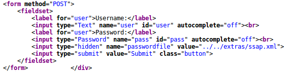
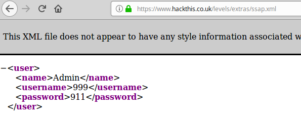
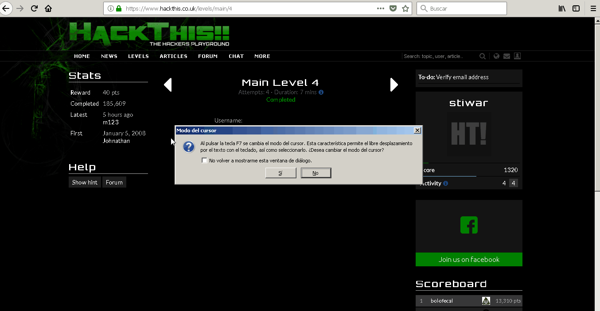

:slug: que-ruta-mas-insegura/
:date: 2017-12-21
:category: opiniones-de-seguridad
:author: Luis Arteaga
:tags: solucionar, web, reto
:Image: road.png
:writer: stiwar
:name: Luis Arteaga
:about1: Ingeniero en Electrónica y Telecomunicaciones.
:about2: Apasionado por el desarrollo de aplicaciones web/móviles, la seguridad informática y los videojuegos.
:figure-caption: Imagen

= ¡Qué ruta mas insegura!

En el mundo de la web, es habitual encontrar sitios con enlaces que redireccionan
tanto a páginas o recursos dentro del mismo, como a páginas que se encuentran
fuera de él. Los primeros se conocen como _enlaces internos_ y los segundos como
_enlaces externos_.

En cuanto a los enlaces internos, estos pueden ser referenciados mediante rutas
absolutas o relativas. De lo cual hablaremos más adelante en secciones
posteriores.
No hay duda alguna que los sitios web actuales hacen uso de estas rutas
relativas, sin embargo, existen desarrolladores web novatos (y otros no tan
novatos) que hacen mal uso de este recurso; facilitando así, el trabajo de un
hacker que fácilmente puede aprovecharse de esta vulnerabilidad y, en el peor de
los casos, anular completamente dicho servicio.

Por lo tanto hoy, continuando con nuestras sesiones sobre soluciones a retos de
https://www.hackthis.co.uk[hackthis], daremos solución a un reto en el cual
debemos interpretar una ruta relativa.

== Rutas Relativas y Absolutas

Antes de resolver el reto, debemos conocer un poco sobre cómo trabajan las rutas
relativas y absolutas en una url:

.sistema de archivos de ejemplo
image::folders.png[]

Todo servidor al igual que nuestra computadora, organiza los archivos y carpetas
en un sistema denominado sistema de archivos. Imaginemos que tenemos un sitio web
cuyo dominio o dirección es: *https://www.mipagina.com* y que contiene los
directorios mostrados en la anterior imagen.

Por ejemplo, las páginas _pagina2.html_ y _pagina3.html_ se encuentran a un
mismo nivel dado que ámbas se encuentran en el directorio _a2_.
En este caso, si pagina2.html dentro de su contenido referencia mediante un
enlace a pagina3.html, las url absoluta y relativa (respecto a pagina2.html) para
pagina3.html quedarían de la siguiente manera:

 url absoluta: https://www.mipagina.com/a/a2/pagina3.html
 url relativa: pagina3.html

Como podemos ver, para este caso, fue mucho más sencillo definir una ruta
relativa para pagina3.html que una absoluta.

Veamos otro ejemplo, si observamos los archivos _pagina1.html_ y _pagina4.html_,
estos se encuentran en los directorios _a_ y _c_ respectivamente. Sin embargo,
si queremos referenciar a pagina4.html desde pagina1.html mediante una ruta
relativa, debemos indicar en la url que debemos subir un nivel en la jerarquía
de carpetas y luego acceder a la carpeta _c_ dado que ahí se encuentra el
archivo pagina4.html. Para hacer esto, debemos utilizar el siguiente conjunto de
caracteres dentro la url relativa: *../* .

Por lo tanto, las url absoluta y relativa (respecto a pagina1.html) para
pagina4.html quedarían de la siguiente manera:

 url absoluta: https://www.mipagina.com/c/pagina4.html
 url relativa: ../c/pagina4.html

Podemos subir los niveles que queramos en la jerarquía de carpetas, simplemente
anidando expresiones *../* . El siguiente ejemplo aclara esta situación:

Supongamos que deseamos enlazar a _pagina4.html_ desde _pagina2.html_ . En este
caso, la url absoluta y relativa (respecto a pagina2.html) para pagina4.html
quedarían así:

 url absoluta: https://www.mipagina.com/c/pagina4.html
 url relativa: ../../c/pagina4.html

== Reto: Main Level 4

Ahora que ya conocemos un poco sobre rutas absolutas y relativas en las url,
podemos solucionar el reto 4 de la categoría _Main_ del sitio hackthis. Para ello
presionamos la siguiente combinación de teclas: _ctrl+U_ en tu navegador. Una vez
desplegado el código fuente del reto, debemos buscar el siguiente formulario
html:

De la anterior imagen podemos ver que el formulario contiene una etiqueta de
tipo _hidden_ (un tipo de etiqueta cuyo contenido no es desplegado por el
navegador pero que sin embargo podemos ver desde su código fuente). En la
propiedad _value_ de dicha etiqueta tenemos la siguiente información:
*../../extras/ssap.xml* .

Al analizar dicha información podemos intuir de que se trata de una url relativa
tal y como vimos en la sección anterior. Si nos fijamos al inicio de dicha ruta,
podemos ver que sube dos niveles y luego accede a la carpeta _extras_ donde se
encuentra un archivo llamado _ssap.xml_ . Por lo tanto, si la ruta del reto es
_https://www.hackthis.co.uk/levels/main/4_ al aplicar la ruta relativa debemos
subir desde las carpetas "4" y "main" hasta la carpeta "levels". Una vez estando
ahí, podemos completar la ruta de la siguiente manera:
 https://www.hackthis.co.uk/levels/extras/ssap.xml

Accedemos a dicha url para obtener:

.HackThis: solución al reto 4 de la categoría Main

De la anterior imagen podemos ver que las credenciales de acceso son: 999 y 911
para el usuario y contraseña respectivamente. Ingresamos dichas credenciales y
el reto es resuelto.

A continuación dejo una animación resumiendo el proceso anterior:

.hackthis: animación y solución al reto MAIN 4

Como podemos ver, tampoco es recomendable (y de hecho, nunca se debe hacer)
almacenar credenciales de acceso mediante rutas ocultas, y sobre todo, con
permisos para que cualquier usuario pueda visualizar su contenido. Dado que
estas pueden ser descubiertas por personas con intenciones maliciosas.