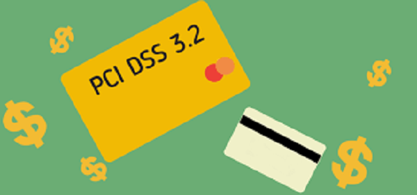

:slug: requerimiento-pci/
:date: 2016-10-18
:category: opiniones-de-seguridad
:tags: protocolo, proteger, seguridad
:Image: pci.png
:alt: Tarjetas de crédito con la palabra PCI DSS 3.2
:description: TODO
:keywords: TODO
:author: Juan Jaramillo
:writer: juanj
:name: Juan Jaramillo
:about1: Profesional experto en diversos temas de seguridad de la información, seguridad de redes y sistemas operativos
:about2: Conocimientos en seguridad informática, modelos, estándares en seguridad de la información e informática forense.

= Recordando los requerimientos PCI 3.2

El pasado 28 de abril del presente año, el Consejo de Estándares de Seguridad 
de la Industria de Pago con Tarjeta (PCI DSS), publicó la nueva versión de su 
estándar industrial el cual los negocios usan para salvaguardar los datos 
durante y después de la compra. Este fue actualizado con el objetivo de atender 
las crecientes necesidades de protección de lainformación de los clientes.

Uno de los cambios más notables del estándar es implementar evaluaciones de 
seguridad para procesar los pagos, con el objetivo de dar cumplimiento a la 
protección. Una compañía debe procesar sus tarjetas de crédito por internet de 
dos maneras, sea mediante una evaluación de vulnerabilidades de una página web 
o mediante el uso de un Web Application Firewall (WAF), el cual PCI define 
como:

[quote]
“Un punto de refuerzo a la política de seguridad ubicada entre una aplicación 
Web y el cliente. Esta funcionalidad puede ser implementada mediante un 
software o un hardware, corriendo en un dispositivo o aplicativo, o simplemente 
un servidor corriendo un sistema operativo común. También puede ser un equipo 
en solitario o en conjunto con varios dispositivos de red”

En esencia un WAF protege las aplicaciones web a la manera tradicional en la 
que lo hace un cortafuegos de redes. Controla las entradas y las salidas, así 
como el acceso hacia y desde lo que está protegiendo. Sin embargo, los 
cortafuegos de redes tradicionales, e incluso los sistemas de detección de 
intrusos (IDS) o los de prevención (IPS), evalúan los paquetes de IP o los 
protocolos sin estar al tanto de la carga que tienen los aplicativos que 
protegen a nivel de la capa de aplicaciones; por lo que el rol de los WAF es 
bastante importante ya que este tipo de soluciones permiten hacer una revisión 
del código y realizar pruebas de vulnerabilidad ya que constantemente están 
protegiendo las aplicaciones web contra agentes de amenaza usando patrones de 
reconocimiento para detectar y erradicar amenazas de día cero y otras en 
transformación, incluso la protección de las sesiones ayuda a prevenir la 
suplantación y la base de conocimiento de firmas bloquea tanto vulnerabilidades 
conocidas como atacantes.

Un estudio de Gartner indica que el 75% de los ataques ocurren precisamente en 
la capa de aplicación, y más aún con el creciente incremento de aplicaciones 
Web como Oceffice 365 o Google Docs, hará que la balanza de los incidentes se 
pueda incrementar potencialmente por lo que el fortalecimiento y uso masivo de 
los WAF es ampliamente recomendable.

Uno de los cambios más importantes dentro del estándar PCI DSS 3.2 consiste 
precisamente en que se hace una ampliación de los requerimientos que ayudan a 
la organización a identificar los controles de seguridad necesarios para que 
hagan parte de su proceso de monitoreo constante. El PCI DSS 3.2 enfatiza en 
que las organizaciones deben enfocarse en las personas, los procesos y las 
políticas mientras que la tecnología hace un papel importante en la reducción 
de la información que dejan los dueños de las tarjetas a la deriva.
