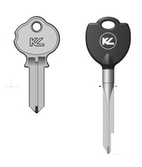

:slug: requiem-password/
:date: 2018-03-07
:subtitle: Porqué las contraseñas tipo frase son mejores
:category: identidad
:tags: password, credenciales, seguridad
:image: cover.png
:alt: Candado de bicicleta con palabras
:description: Una comparación entre utilizar varias contraseñas tipo palabra que expiran periódicamente y una sola y robusta contraseña tipo frase. Discutimos también sobre la facilidad de memorizar palabras complicadas contra las frases generadas aleatoriamente con Diceware.
:keywords: Frase, Palabra, Seguridad, Contraseña, Descrifrar, Diceware.
:author: Rafael Ballestas
:writer: raballestasr
:name: Rafael Ballestas
:about1: Matemático
:about2: con interés por CS
:translate: requiem-password/

= Réquiem por un p455w0rD

Qué preferirías tener para la puerta de tu casa:
Una sencilla y débil llave que necesita ser cambiada cada dos semanas?
o una única llave cruciforme de última generación,
virtualmente imposible de forzar?

.Comparación de llaves de link:http://www.locksmithledger.com/article/10837014/locksmithing-etc-jan-2013[Locksmith Ledger].

Esa es justo la diferencia
entre cambiar periódicamente contraseñas cortas tipo palabra,
y tener una buena contraseña tipo frase:
La primera puede ser conveniente y fácil de implementar
y reemplazar en caso de perderse,
mientras que la última puede ser difícil de utilizar al principio,
pero una vez te acostumbras se convierte en una defensa irrompible.

Ahora, las contraseñas no están muertas,
como algunos chicos de
link:https://news.microsoft.com/features/whats-solution-growing-problem-passwords-says-microsoft/[Microsoft]
dicen, para favorecer otros tipos de autenticación.
Una contraseña tipo palabra con una mezcla adecuada de mayúsculas, minúsculas
y símbolos especiales aún es bastante difícil de adivinar o descifrar.
Pero son difíciles de recordar,
lo cual conlleva a un frecuente olvido y restablecimiento de contraseñas.
Así, la mayoría de las personas tienden a inclinarse
por contraseñas cortas y fáciles de descifrar.
Observa por ejemplo las
link:https://13639-presscdn-0-80-pagely.netdna-ssl.com/wp-content/uploads/2017/12/Top-100-Worst-Passwords-of-2017a.pdf[+100+ peores contraseñas del 2017 recopiladas por +Splash Data+ (+PDF+)]
para darte cuenta del problema.
Estas son vulnerables a
link:https://en.wikipedia.org/wiki/Brute-force_attack[fuerza bruta],
link:https://en.wikipedia.org/wiki/Dictionary_attack[ataques de diccionario],
y link:../../../en/blog/storing-password-safely[+rainbow tables+],
por mencionar algunas de las formas en las que pueden ser descifradas.

Para evitar éstas situaciones,
algunas organizaciones eligen implementar políticas de contraseña
que requiere que los usuarios incluyan símbolos especiales,
o que cambien su contraseña frecuentemente.
Sin embargo, eso no está exento de problemas,
debido a que <<r1, ^[1]^ >>: los usuarios
tienden a eludir estas imposiciones de diferentes formas, por ejemplo:

* Reemplazando letras por números similares
(+hola+ -> +h0l4+, +pass+ -> +p455+)
* Revirtiendo su antigua contraseña (+qwerty+ -> +ytrewq+)
* Cambiando entre contraseñas simples (+pass+ -> +word+)
* Alterando una contraseña estándar (+password+ -> +password1+ -> ...)
* No lo evitan, obteniendo así una contraseña muy complicada,
pero la mantienen escrita en un trozo de papel (peligro!).

Además, con el auge de los servicios distribuidos,
no es de extrañar que una persona
tenga que ocuparse de docenas de contraseñas,
llevando a la reutilización de las mismas contraseñas débiles,
lo cual hace la situación aún peor.

Las posibles soluciones al problema con las cuentas son
los link:../../../en/blog/multiple-credentials-begone/[Servicios de autenticación única]
y los administradores de contraseñas, tales como link:https://keepass.info/[Keepass].
Pero éstos a veces son inviables,
por ejemplo para ingresar a tu computadora,
ya que no puedes correr ningún software antes.
Y si utilizas un administrador de contraseñas,
la contraseña principal para desbloquearlo debe ser muy robusta,
porque si es vulnerada, también lo serán todas las demás.
El mismo argumento va para los archivos cifrados, o discos e emails.
En estos casos críticos, lo que buscas es una contraseña tipo frase.

Como el nombre lo sugiere,
una 'frase' es una oración que usas para autenticarte
al igual que una contraseña tipo palabra.
Como usualmente son mucho más largas que una palabra,
su simple número es considerablemente mayor,
Haciéndolas más difíciles de adivinar o descifrar.
Es tan simple como eso.

¿Porqué? Considere esta pregunta:
¿Cuántas palabras hay para escoger?
De un alfabeto con +26+ letras,
y permitiendo palabras desde +2+ hasta +6+ letras,
podemos construir más de +12+ millones de palabras.
Sin embargo, algunas de ellas no tendrían sentido,
como +zzy+ o +edls+,
así que los diccionarios de palabras, como el anterior,
las evita, y sólo toma palabras reales en español
conteniendo sólo alrededor de
link:https://elpais.com/diario/2010/11/27/babelia/1290820336_850215.html[+80,000+] palabras.

Pero eso es suficiente cuando las combinas.
Existen +80,000+^2^ frases de dos palabras, y la lista continúa.
Así con apenas +5+ palabras tendríamos
+80,000+^5^,
lo cual es alrededor de +3+ septillones (+3+ y +24+ ceros) de frases.
Asumiendo un trillón (1 y 12 ceros) de intentos por segundo,
dicha frase tardaría más de +100.000+ años en descifrarse.
Agregue +3+ ceros por cada palabra extra, siendo conservador,
de esta forma una frase de +7+ palabras
tardaría +600+ trillones de años en resolverse.

Puedes decir que ya tienes una contraseña lo suficientemente larga.
Pero ¿Tiene algún sentido como 'palabra'?
¿Qué tan aleatoria es para protegerse contra ataques de predicción?
¿Es fácil de recordar?
Lo más probable es que no,
que no guarde relación con la palabra.
En contraste, las frases son construidas a partir de palabras regulares,
las cuales puedes recordar al enlazarlas de algún modo.
Este cómic de +xkcd+ lo resume:

.Frases contra contraseñas. Adaptado del original en link:https://xkcd.com/936/[xkcd].
image::xkcdpw.png["Un cómic sobre frases contra contraseñas"]

Como puedes ver, puedes usar técnicas mnemotécnicas
para recordar tu contraseña tipo frase,
incluso si parece absurdo al inicio.
Intenta hacerlo con símbolos extraños.
Las investigaciones indican que incluso códigos de +56-bit+
pueden ser aprendidos en +36+ intentos <<r2, ^[2]^>>
utilizando una técnica llamada 'repetición espaciada'.
Esto también ilustra el problema
con las políticas de contraseñas difíciles de satisfacer:
Obligan a las personas a crear contraseñas absurdas,
difíciles de recordar y con una combinación sin sentido de números y letras.

Para este punto puede que estés convencido
de que las contraseñas tipo frase son la respuesta.
Pero no es tan simple como elegir +4+ palabras cualesquiera.
Para impedirle a los atacantes que utilicen diccionarios
y ataques de fuerza bruta,
debes buscar que tus frases sean tan aleatorias como sea posible,
es decir, deben tener una alta 'entropía'.
Incluso si eliges algunas palabras que crees son aleatorias,
la estructura inherente del lenguaje y de nuestros cerebros
indica que implícitamente nos estaríamos engañando a nosotros mismos,
y la frase elegida no es tan aleatoria como podría parecer.

Así que, ¿Cómo creo una frase verdaderamente aleatoria y robusta?
Busca la verdadera aleatoriedad de palabras.
La forma más fácil sería tirar un dado muchas veces,
anotando los resultados, y transformarlos en palabras
utilizando un diccionario que convierta dichas secuencias
en palabras reales.
Para el caso del idioma inglés contamos con el
diccionario link:http://world.std.com/~reinhold/dicewarewordlist.pdf[+Diceware+].

.Algunas palabras del diccionario link:http://world.std.com/~reinhold/dicewarewordlist.pdf[+Diceware+].
----
26114 -> fluid
32236 -> hack
52416 -> rule
52133 -> risk
----

Así, si primero sacas un +2+, luego un +6+, ... y un +4+,
la primera palabra de tu frase será +fluid+.
Repite esto +7+ veces y tu contraseña será bastante fuerte.
¿No tienes tiempo para jugar a los dados? No hay problema.
Existen muchas soluciones +FOSS+ para generar frases largas
y de alta entropía en link:https://github.com/search?p=2&q=diceware&type=Repositories&utf8=%3F[GitHub]
y algunas and link:https://getapassphrase.com/[otras]
disponibles link:http://preshing.com/20110811/xkcd-password-generator/[en línea].

¿Qué tan frecuentemente deben ser cambiadas?
Las frases generadas de forma verdaderamente aleatoria
son virtualmente a prueba de predicciones.
Así que únicamente las tienes que proteger
contra intercambios no autorizados o robos.

En ese caso, podemos extender, el típico periodo de renovación de un mes,
a digamos, +3+ a +6+ meses.
Utilizando frases generadas aleatoriamente
eliminamos los problemas del reciclaje de contraseñas,
alteraciones menores, palabras comunes y predicción,
siendo éstas más seguras y fáciles de recordar.

Para ilustrar esto,
comparemos algunas políticas de autenticación comunes:

.Comparación de políticas de autenticación
[cols=5, options="header"]
|====
| Tipo
| Longitud mínima
| Variedad
| Ejemplo mínimo
| Tiempo para descifrar por fuerza bruta

| Palabra
| 8 caracteres
| mayusculas minúsculas números caracteres especiales
| +Pas$w0rd+
| 9 horas

| Palabra
| 14 characters
| mayusculas minúsculas números caracteres especiales
| +Pas$w0rddddddd+
| 204 millones (+e6+) de años

| Frase
| 4 palabras de 4 letras
| no aleatorio minúsculas
| +fluid hacks rule risk+
| 41 quadrillones (+e15+) de años

| Frase
| 4 palabras de 5 letras
| aleatoria minúscula
| +debased heron passes native+
| 343 septillones (+e24+) de años
|====

Sólo el tiempo requerido para descifrar por fuerza bruta,
nos da una idea de la fuerza relativa de estas políticas de contraseña:
La primera es esencialmente inservible
ya que un usuario descuidado puede establecer contraseñas muy fáciles.
+14+ caracteres combinados no esta mal, pero puede ser
obtenida a través de ataques de diccionario
o predicción utilizando la información del usuario.
Incluso una frase no aleatoria relativamente corta,
es literalmente, un billón (+e9+) de veces mejor,
pero aún así, puede ser adivinada.
Y una frase corta, pero con alta entropía,
es un billón de veces mejor que la última

''''

Nuestra recomendación concreta es:
Una frase de 44 bits generada aleatoriamente
(La configuración más baja en
link:https://getapassphrase.com/generate/[getapassphrase.com]
es decir, +4+ o +5+ palabras de +3+ a +8+ letras de longitud)
es mejor que cualquier complicada política de contraseña
y es más fácil de recordar.
Cámbiala cada +3+ a +6+ meses según tu juicio
y lo que haga más felices a tus usuarios.

Ten en cuenta que mientras las frases tienen la ventaja
de ser más difíciles de descifrar y más fáciles de recordar
que  contraseñas complejas, no necesitas utilizarlas para todo.
Por lo general, incluso las contraseñas fáciles aún tienen su sitio,
y contrario a la creencia popular,
pueden ser recicladas y reutilizadas de acuerdo a <<r3, ^[3]^>>.
Existe mucho debate y aún no se ha llegado a un consenso
sobre cuales constituyen las mejores prácticas,
pero ahora que conoces las dos caras de la moneda,
puedes escoger cual es la más apropiada para cada situación.

== Referencias

. [[r1]] link:https://queue.acm.org/detail.cfm?id=2422416[Cheswick, William (2012). 'ACM Queue' 10 (12).]

. [[r2]] link:https://www.usenix.org/system/files/conference/usenixsecurity14/sec14-paper-bonneau.pdf[Bonneau, J. and Schechter, S. (2014) Towards reliable storage
of 56-bit secretes in human memory.
'Proceedings of the 23^rd^ USENIX Security Symposium'.]

. [[r3]] link:https://www.microsoft.com/en-us/research/wp-content/uploads/2016/02/passwordPortfolios.pdf[Florencio, D et al. (2014). Password portfolios and the finite-effort user:
Sustainably managing large numbers of accounts.
'USENIX Security', August 20-22.]
