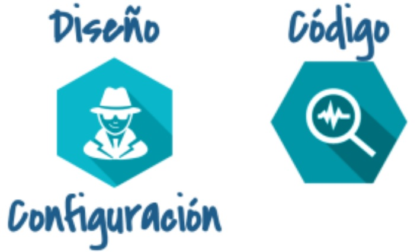
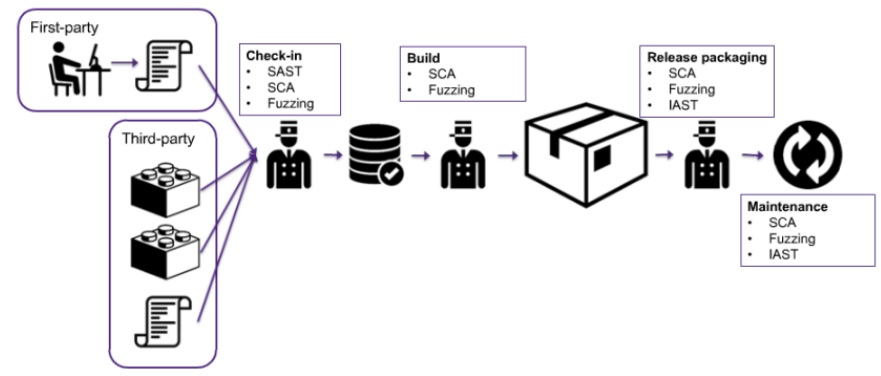

:slug: riesgos-terceros-propiedad/
:date: 2016-12-20
:category: opiniones-de-seguridad
:tags: sdlc, software, seguridad
:Image: risks-third-parties.png
:alt: Empresario con un holograma de servicios de red protegidos
:description: TODO
:keywords: TODO
:author: Paula Velez
:writer: paulav
:name: Paula Velez
:about1: Ingeniera en informatica
:about2: Viajar para correr es un mundo de posibilidades

= Riesgos de terceros en tu propiedad

A la hora de desarrollar o adquirir una nueva herramienta hay que evaluar el
riesgo que representan para la organización ya que no importa si es un producto 
propio o de un tercero si involucra código son una vulnerabilidad potencial 
para el producto en sí o para sus usuarios y si a esto le agregamos que en la 
actualidad el software no se desarrolla desde cero, sino que se ensambla 
utilizando partes de terceros para reducir signicativamente el tiempo de 
desarrollo, porque la idea no es reinventar la rueda es utilizar lo que ya está 
disponible y adaptarlo a necesidades específicas.El problema de esta práctica 
es que se introducen riesgos de terceros al desarrollo propio.

En general nadie se salva de tener este tipo de riesgos, ya que no importa la
finalidad de tu negocio, de alguna forma se van introducir tecnologías para
administrar o mejorar tus procesos y cualquier desarrollo conlleva por defecto 
vulnerabilidades conocidas o desconocidas, estas últimas son las que afectan a 
todo producto porque no son conscientes que existen por mas que se le hagan 
millones de pruebas antes de sacarlo al mercado, en algún momento van a ser 
víctimas de un ataque y es por esto que se debe tener un sistema de respuesta 
ante este tipo de situaciones.

Ahora que podemos hacer para identificar vulnerabilidades tanto en desarrollos 
si eres un proveedor o en adquisición de software si eres un comprador. En 
general para problemas de seguridad en etapas de diseño y configuración siempre 
va a ser necesario cazadores humanos (human hunters) pero para problemas en el 
código se puede recurrir a herramientas especializadas (robot army) en detectar 
posibles errores que representan una amenaza.

[quote]
¿Qué hacer para aprobar el software desarrollado antes de sacarlo al mercado o 
introducirlos a la organización?

. Introducir la seguridad en el https://fluid.la/site/posts/sdlc-security/[SDLC]
(Systems Development Life Cycle)
. Detectar la mayor cantidad de vulnerabilidades posibles antes de sacarlo al 
mercado
. Establecer políticas para la toma de decisiones que representan un riesgo, es 
decir definir procesos y líneas bases para cuando se va a decidir utilizar un 
componente de un tercero y/o adquirir un software de un tercero (tipo de 
licencia, vulnerabilidades conocidas, tiempos de actualización, soporte, etc)
. Utilizar técnicas que ayuden a detectar vulnerabilidades en el desarrollo 
tanto antes de liberarlo como en el proceso de adquisición.

.*_Secure Software Requires the Right Tools – https://onlinexperiences.com[Jonathan Knudsen]_*

Las herramientas que pueden hacer parte del robot army están separadas por el 
tipo de análisis que realizan y de acuerdo a esto se utilizan en diferentes 
puntos de la cadena de abastecimiento del software, como se muestra en la 
figura anterior, todas estas herramientas las puede usar tanto una fábrica de 
desarrollo como el usuario final que va adquirir un producto.

* *SAST* (Static Application Security Testing): El análisis estático se centra 
en la evaluación del código fuente de una aplicación, este se encarga de 
entender el código e identificar posibles errores en el desarrollo. Realizar 
SAST durante todo el SDLC te ayuda identicar errores en etapas tempranas del  
desarrollo minimizando de esta forma pérdidas en el futuro.
** Este tipo de análisis siempre debe ir de la mano con un human hunter que te 
ayude a validar falsos positivos.
* *SCA* (Software Composition Analysis): Este tipo de análisis debe estar 
presente en toda la cadena de abastecimiento de software, ya que este será el 
encargado de identicar, monitorear y crear un inventario de todos los 
componentes de terceros en el software con el fin de responder adecuadamente 
cuando se detecten vulnerabilidades en dichos componentes. 
* *Fuzzing*: Es una técnica utilizada para encontrar vulnerabilidades 
desconocidas ya que esta busca encontrar comportamientos inesperados en un 
sistema proporcionando datos mal formados, inesperados o aleatorios a las 
entradas de la aplicación. Es la técnica más popular entre los atacantes para 
cazar vulnerabilidades, ya que la mayoría de las veces los fabricantes no 
tienen forma de conocer todos los posibles comportamientos del sistema ante 
eventos inesperados. 
* *IAST* (Interactive Application Security Testing): IAST es una combinación
entre las técnicas de los análisis estáticos y dinámicos (SAST + DAST) 
generando un análisis global de todo el sistema.

Al final del día lo que va a importar es el mantenimiento y monitoreo del 
software que aunque parece una tarea sencilla muchas veces se deja de lado, 
pero es esta la que va a detectar vulnerabilidades en el software que un 
principio era seguro pero como todos los días se están detectando 
vulnerabilidades desconocidas, llegará el día que un producto deja de ser 
seguro y se debe tener un proceso que detecte todos estos cambios. 

[quote]
44% of applications contain critical vulnerabilities third-party components. 
Applications have an average of 46 components, and knowing which ones you are 
using is necessary to defend yourself when major vulnerabilities are announced. 
This is why several compliance regulations require inventories of third-party 
code so that you can address risks. – https://www.veracode.com/products/software-composition-analysis[Veracode]

Como fábrica o usuario final siempre se debe velar por minimizar al 100 el 
riesgo en un producto o dentro de la organización ya que ningún software es 
inmune a las vulnerabilidades. Ten en cuenta que cualquiera puede desarrollar 
pero no todos pueden crear código genial y por genial me refiero a seguros y 
robustos. Hasta en las mejores familias se descubren problemas.
