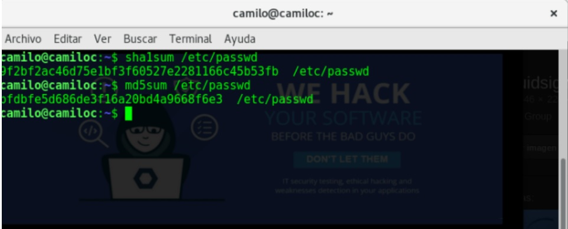

:slug: rompe-codigos/
:date: 2016-08-30
:category: retos
:tags: cifrar, criptografía, reto, solucionar
:image: rompe-codigos.png
:alt: Llave con un set de datos hexadecimales detrás de ella
:description: La Criptografía tiene una gran relevancia en el mundo de la seguridad informática. El cifrar información sensible para que no sea accesible es un paso obligatorio para proteger su integridad. En este artículo presentamos una introducción al mundo de la criptografía solucionando un reto de hacking.
:keywords: Seguridad, Criptografía, Códigos, Sustitución, Hash, Cifrar.
:author: Camilo Cardona
:writer: camiloc
:name: Camilo Cardona
:about1: Ingeniero de sistemas y computación, OSCP, OSWP
:about2: "No tengo talentos especiales, pero sí soy profundamente curioso" Albert Einstein
:figure-caption: Imagen

= Los rompe códigos - parte I

Desde tiempos inmemoriales y también en el antiguo arte de la guerra,
trasportar mensajes indescifrables para el enemigo o tan solo para terceros se
ha vuelto una necesidad. Han existido múltiples sistemas y algoritmos de
cifrados época tras época, que se han considerado infranqueables en sus tiempos
como lo fue caesar cipher, enigma, DES entre muchos otros. Pero igualmente han
existido los bad guys, que se han encargado de demostrar que estos algoritmos
no son tan fiables como lo parecen, es por eso que en esta oportunidad vamos a
hablar de algunas técnicas para romper algunos algoritmos de cifrado,
herramientas y realizaremos ejercicios prácticos para demostrar paso a paso
como funcionan estas técnicas.

== En el principio: Cifrados por sustitución

Los cifrados por sustitución son la base de los algoritmos modernos, fueron
muy usados durante la guerra, e indescifrables en su época, pero hoy en día
muy fáciles de romper, solo sabiendo
link:https://es.wikipedia.org/wiki/Frecuencia_de_aparici%C3%B3n_de_letras[El principio de frecuencia del uso de letras],
por ejemplo:

En el lenguaje español como en el ingles las letras que más se repiten es la
“e” y en segundo lugar la “a”, entonces si tenemos un texto cifrado bajo este
algoritmo y si la letra que mayor se repite es la “k” lo más probable es que la
“k” halla sido sustituida por la “e”. Veamos la teoría en un ejercicio practico
y así sucesivamente.

=== Ejercicio

* Crypt level 4 de link:https://www.hackthis.co.uk/[hackthis.co.uk]

[quote]
Dc, gdcl cl h lcrcshn ckqh gz sqwqs guz. Gdcl gcrq qhyd sqggqn cl hllcomqk h
ljqycacqk nqshgczmldcj ucgd hmzgdqn sqggqn. Jhll: cdhwqancqmkl

Como lo vemos, la letra que más se repite es la “Q” seguida de la “C”, lo que
posiblemente podría ser la “E” y la “A”, así sucesivamente hasta descifrar el
mensaje, donde la última frase del mensaje es:

[quote]
pass: ihavefriends

Esta es la manera de romper los cifrados de sustitución, que en su época se
creían indescifrables, pero en realidad hoy en día solo se usan para el
aprendizaje como lo hacemos ahora (es muy importante entender el concepto para
adentrarnos en los algoritmos de cifrado moderno).

== Cuando todo va mal

llevan más de dos décadas presentando problemas de seguridad, estamos hablando
de algoritmos de Digest como *MD5* y *SHA1*, existiendo módulos como *crypto++*
que  nos permite implementar algoritmos más robustos para proteger nuestra
información. Todos los retos donde encontremos datos cifrados con algoritmos
como MD5, SHA1 y *NTLM* (algoritmo de cifrado de Windows), los podemos descifrar
rápidamente con herramientas como link:https://hashkiller.co.uk/[hashkiller.co.uk].

En realidad MD5 y SHA1 son una buena idea, pero no para cifrar información como
contraseñas como lo hacen muchos en sus bases de datos, si no para verificar la
integridad de los datos que enviamos o recibimos, es decir que si la suma MD5
de un archivo es diferente del que recibe el mensaje al que lo envía fue porque
dicho archivo fue modicado.

.Validación de integridad del archivo

== Herramientas para descifrar datos

Existen muchas herramientas para descifrar archivos pero entre las más
populares tenemos:

* John the ripper
* ophcrack

Estas dos herramientas son importantes para tratar de descifrar archivos, la
primera funciona a través de *fuerza bruta* y la segunda a través de *Rainbow
tables*, pero son temas para otros post.

Lo que hemos visto acá es una pequeña introducción a la criptografía, pero la
verdad de esta es que cada algoritmo está basado en complejos modelos
matemáticos, y tanto su implementación como su intento por romperlos puede ser
una tarea tediosa o fácil dependiendo del uso que se les den. Algunos
estándares de programación recomiendan usar *Rijndael*, *PBKDF2*, *RSA*,
*SHA-3* o mayor e implementar funciones *salt*. Es así como termina este post.
En una próxima oportunidad veremos otros algoritmos de cifrado y veremos como el
cifrado perfecto si existe.
