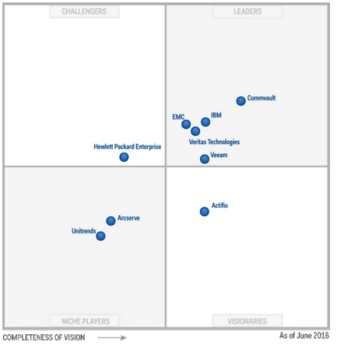

:slug: rto-rpo-cero/
:date: 2016-09-06
:category: opiniones
:tags: rto, rpo, proteger
:image: rto-rpo.png
:alt: Línea de tiempo entre la transición RTO a RPO luego de incidente
:description: Las copias de seguridad son una medida que debe estar presente en todas las empresas, debido a que permiten recuperar la información ante una pérdida o daño. Sin embargo es posible darles otro uso, más que solo respaldos de información. ¿Quieres saber más? continua leyendo este artículo.
:keywords: Respaldo, Copia, Seguridad, Software, RTO, RPO.
:author: Ivan Velez
:writer: ivanv
:name: Ivan Velez
:about1: Ingeniero de sistemas con mas de 25 años de experiencia, en estrategia, diseño y operación de TI.
:about2: Linkedin

= Rto y Rpo a cero

El resguardo de la información plantea grandes retos a las organizaciones, la
línea entre el cumplimiento y la capacidad de recuperación se hace difusa con
las tecnologías actuales, y nos plantea nuevas posibilidades a los
profesionales de TI. Leyendo el informe del cuadrante de Gartner referente al
software de backup y restauración
(ID: link:https://www.gartner.com/doc/3337721/magic-quadrant-data-center-backup[G00280391]),
comprendí que lo que nos  espera en temas de copias de seguridad es amplio y
sera todo un reto para las áreas de tecnología en las organizaciones.

En el informe de Gartner se plantean las siguientes predicciones:

* Para 2020, el 30% de las organizaciones aprovechará de copia de seguridad
para algo más que la recuperación operacional (por ejemplo,recuperación de
desastres, desarrollo / pruebas, DevOps, etc.), frente a menos del 10% a
principios de 2016.
* Para 2020, más del 40% de las organizaciones cambiará la copia de seguridad a
largo plazo por sistemas de archivo – frente al 20% en 2015.
* En 2020, el 10% de los sistemas de almacenamiento será de autoprotección,
evitando la necesidad de aplicaciones de copia de seguridad, frente a menos del
2% en la actualidad.
* En 2019, el 30% de las medianas empresas aprovechará IaaS de nube pública
para la copia de seguridad, por encima del 5% en la actualidad. Para el 2018,
el 70% de los sistemas aplicativos para negocios tendrá un mayor autocontrol
sobre sus servicios de protección de datos, frente al 30% actual.
* Para el 2018, el 50% de las organizaciones contará con productos adicionales
o reemplazará su aplicación de copia de seguridad actual con otra solución, en
comparación con lo que desplegaron a principios de 2015.
* En el año 2018, más del 50% de los clientes de almacenamiento de la empresa
considerará las ofertas de los proveedores de almacenamiento que han estado en
el negocio menos de cinco años, frente a menos del 30% en la actualidad.
* Para el 2018, el número de empresas que utilizan la nube como un destino de
copia de seguridad se duplicará, frente al 11% a principios de 2016.

Bajo estas premisas y revisando el cuadrante, estamos ante un punto importante
a tener en cuenta en las organizaciones… y es como protegernos y ante que
protegernos. Por lo que debemos revisar los siguientes enfoques:

.Fuente: Gartner,June 2016

. *Realizar backups por cumplimiento*: Según el tipo de compañía se deben
cumplir con parámetros legales de almacenamiento de los datos de los sistemas
contables, administrativos y otros según sea el caso, en este punto, esta data
la mayoría de las veces no es usada más adelante, pero si se requiere su
almacenamiento y disponibilización en periodos de tiempo largo, esto es un
gran reto para el personal de IT, solo imaginemos un caso donde nos requieran
disponibilizar la información almacenada durante 9 años para una auditoría, que
tareas y que tipo de tecnología se requeriría para poder realizar esta
actividad. Este tipo de backups normalmente se llevan a sistemas de cintas, con
la tecnología que contamos en el momento, y se almacenan en lugares externos
dispuestos para este fin. Estas copias no se usan normalmente para recuperarnos
de un desastre, son lentas en el proceso de restauración y si ha pasado tiempo
desde la copia, nos adicionan inconvenientes a nivel de compatibilidad,
requerimientos técnicos y de seguridad que son importantes.
. *Copias para auditoría:* Este es un enfoque que pocas compañías utilizan, y
básicamente es la data que generan algunos sistemas de la organización a nivel
de logs, y manipulación de los datos para ser analizados por sistemas de
auditoría para la generación de alertas tempranas, o lo que tomamos desde las
plataformas de seguridad para ser analizados por sistemas tipo SIEM, estos
datos contienen gran cantidad de información crítica del negocio y muchas
organizaciones los tratan como simples archivos de texto, los copian a medios
inseguros y/o los mantienen poco tiempo disponibles.
. *RTO y RPO a cero*: Este es el punto que desea toda organización (y no
hablemos de lo que deseamos los que estamos en el mundo del IT), y consiste
básicamente en podernos recuperar de un desastre en un periodo de tiempo muy
corto -RTO: Recovery Time Objective(normalmente apoyados en la automatización
del proceso) y sin perder en lo posible ninguna transacción -RPO: Recovery
Point Objective-.

Cada visión de las copias de seguridad, tiene sus retos, y sobre todo sus
costos, en la actualidad muchas organizaciones adicional a lo anterior,
plantean retos adicionales como poder recuperar en el tiempo componentes
específicos de información, como por ejemplo, el estado de una cuenta de un
usuario del directorio activo o de un sistema de correos en un punto del tiempo
específico, o el estado de una base de datos, esto amplía el nivel de
omplejidad y sobre todo los costos. A esto adicionamos que ya tenemos datos por
fuera de nuestro control como por ejemplo lo que tenemos en la nube, ya sea en
sistemas propios o en soluciones SaaS. El reto de los departamentos de IT se
vuelve exponencial si además de los requerimientos nos llenamos de diferentes
herramientas para lograr el cometido que nos plantea el negocio.

Menos mal ya existen compañías que plantean la solución de manera disruptiva,
y se apoyan en la capa de virtualización para esta tarea, ya sea a nivel del
almacenamiento (más complejo) o tomando el control del dato desde la capa de
virtualización, la cual a mi forma de ver es completamente disruptiva y mucho
más fácil de gestionar. Esto nos plantea el reto a los profesionales de IT de
recomendarle a nuestras organizaciones el cambio de mentalidad y plantear
escenarios donde el reemplazo total de los sistemas de backup y recuperación
es la mejor alternativa.
