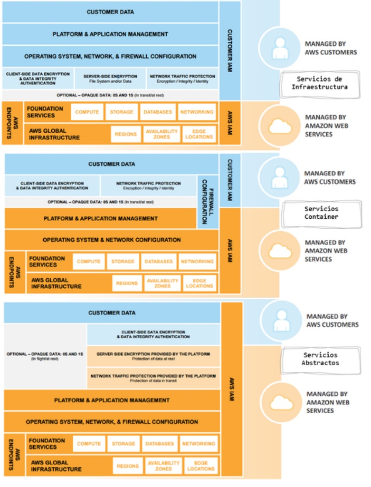

:slug: seguridad-compartida-nube/
:date: 2016-09-10
:category: opiniones-de-seguridad
:tags: cloud, aws, seguridad, tercerizar
:Image: shared-security-cloud.png
:author: Paula Velez
:writer: paulav
:name: Paula Velez
:about1: Ingeniera en informatica
:about2: Viajar para correr es un mundo de posibilidades
:figure-caption: Imagen

= Seguridad compartida: un concepto de la nube

En la actualidad los servicios y administración de tecnología están pasando a
manos de terceros, principalmente por reducción de costos y manejo de ciclos 
de vida de la infraestructura. De esta tendencia nacen los productos como un 
servicio (SaaS, IaaS, PaaS) entregándoles a las organizaciones una opción para 
liberarse de varios procesos de la administración de tecnología que pueden 
llegar a ser un dolor de cabeza.

¿Pero qué pasa con la confidencialidad y disponibilidad de los datos? ¿Quién es 
el encargado de la seguridad de mi infraestructura? ¿Quién responde ante un 
incidente?

Todas estas preguntas nacen cuando vas más allá de solo pensar en la reducción 
de costos dentro de la organización. Para esto existen diversidad de 
proveedores y soluciones que se pueden ajustar al contexto del negocio.

Analizando los servicios de Amazon Web Services (AWS) ellos han cubierto 
brechas de seguridad con la unión de muchos de sus servicios y consiguiendo 
certicaciones como PCI DSS v3.2 que responden a muchas necesidades de los 
clientes. Una de sus soluciones más curiosas es el concepto de seguridad 
compartida que en resumen, es diferenciar dependiendo del servicio de que es 
responsable cada una de las partes, es decir, AWS se encarga del trabajo pesado 
(Manejo de la infraestructura, gestión de hardware, seguridad física y 
operación) y el cliente queda encargado de todo el tema de capa 6 y 7, es 
decir, el control de acceso a las API de los recursos de AWS y las aplicaciones 
que van a utilizar. Al final del día AWS te entrega la “bóveda” y el cliente es 
quien controla las visitas.

.Quién es responsable de que dentro de los servicios de AWS – https://media.amazonwebservices.com/AWS_Security_Best_Practices.pdf[Referencia]

== Funcionalidades de Seguridad

* Acceso seguro con un protocolo TLS desarrollado por AWS (TLS -> API)
** S2N: https://github.com/awslabs/s2n[]
* Firewall Integrado – Grupos de seguridad
** Estan distribuidos para cada uno de los accesos a los recursos en AWS
** Cerrados por defecto, es el cliente el que define las políticas de acceso a 
cada uno de los recursos y define quién tiene acceso a que dentro de la nube.

[quote]
Si no está explícitamente permitido está prohibido.

* RBAC, AWS permite a sus clientes de forma gratuita manejar los permisos de 
forma granular estableciendo una matriz de acceso basado en roles para asignar 
usuarios y responsabilidades dentro de los recursos de AWS.
* Redes virtuales privadas, segmentación de la red de forma virtual para 
definir esquemas personalizados de acceso y establecer accesos por VPN o Direct 
Conect a los recursos de la nube.
* Gestión de identidades, AWS ofrece los recursos necesarios para definir, hacer 
cumplir y gestionar las políticas de acceso de los usuarios en los servicios.
** AWS Identity and Access Management (IAM) permite definir cuentas de usuarios 
individuales con permisos en los recursos de AWS
** AWS Multi-Factor Authentication es para cuentas con privilegios e incluye 
opciones para autenticadores basados en hardware o software.
** AWS Directory Service permite integrarse y federarse con directorios 
corporativos para reducir la sobrecarga administrativa y mejorar la experiencia 
del usuario final.
* Y para todo el tema de gobierno y cumplimiento proporciona herramientas y 
características que permiten ver exactamente lo que sucede en la nube, con 
opciones de agregación de logs que facilitan las investigaciones y los informes 
de conformidad.

Al final de cuentas el usuario es el dueño de toda su información y es el 
encargado de gestionar cómo y quién accede a ella y AWS le entrega todos los 
medios necesarios para implementar los controles de seguridad y garantizar la 
confidencialidad y disponibilidad de la información dentro de su nube.
