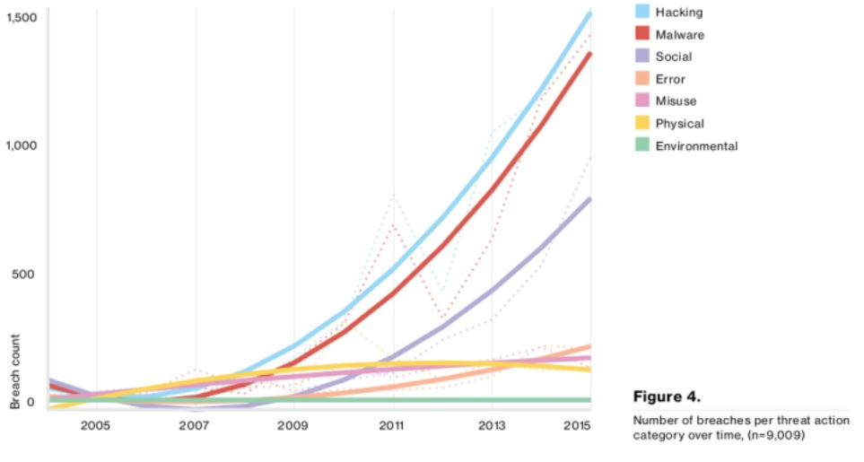
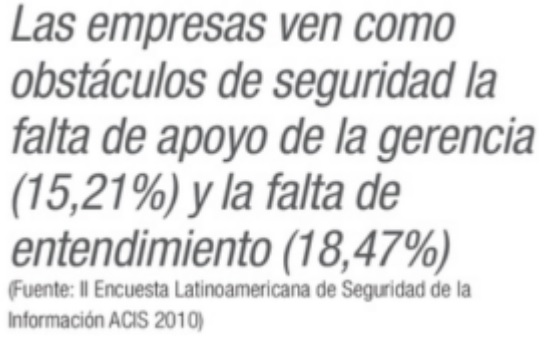

:slug: seguridad-informacion-gasto-inversion
:date: 2016-08-23
:category: opiniones-de-seguridad
:tags: invertir, seguridad, información
:Image: information-security-expense-investment.png
:author: Camilo Cardona
:writer: camiloc
:name: Camilo Cardona
:about1: Ingeniero de sistemas y computación, OSCP, OSWP
:about2: "No tengo talentos especiales, pero sí soy profundamente curioso" Albert Einstein

= Seguridad de la información ¿Gasto o inversión?

Un informe del 2014 hecho por el censo Londinense demostró que un 90% de las 
empresas que tienen pérdidas significativas de información se retiran del 
mercado a los dos años siguientes, estas estadísticas son el tema de apertura 
de este post y que nos ayudara a replantear la pregunta de si la seguridad de 
la información es un *gasto o una inversión*.

Para nadie es un secreto que actualmente los sistemas de información son 
vitales para optimizar la productividad y el crecimiento de un negocio, los
necesitamos para trasmitir o almacenar información, para comunicarnos con 
nuestros clientes al otro lado del mundo o para cualquier otra tarea que nos
imaginemos, *¡Ohhh la edad de oro de la información!* Pero a la vez, debemos 
plantearnos interrogantes sobre el costo/beneficio del uso de nuevas 
tecnologías y procesos y ver que siempre hay un riesgo asociado que debemos 
mitigar.

.*_Figura 1: Estadísticas de amenazas a la seguridad según Verizon en el 2016_*

Imaginemos por un segundo que un día llegáramos a nuestro trabajo y nos 
encontráramos con la noticia de que parte de la información de la empresa, de 
los clientes o de los procesos se han perdido, y no estamos hablando de un 
panorama post-apocalíptico o de una escena de una serie de televisión, con las 
amenazas actuales como *ransomware*, el incremento de malware en dispositivos 
móviles y las noticias de cyber espionaje o cyber sabotaje que también van a 
la alza, se pueden tener altas probabilidades de sufrir de incidentes de 
seguridad. Pero tampoco hay que alarmarse, la intención de este árticulo no es 
intentar asustar o persuadir a nadie, realmente es el de incentivar a las 
organizaciones a hacer un uso adecuado de los sistemas de información y que 
puedan garantizar la continuidad del negocio a través de buenas prácticas de 
protección y seguridad de la información, de entender que siempre hay un 
costo/beneficio y que la seguridad de la información debe ser visto como un 
proceso, de los muchos procesos que pueden manejar una empresa y no un gasto 
como algunos lo ven.

.*_Figura 2: Seguridad en latinoamerica Rescatado de http://www.portantier.com_*

Obviamente un sistema de seguridad de la información debe estar limitado por un 
alcance y por el ROSI (Return On Security Investment), es decir que dependiendo 
del nivel de amenaza y el nivel de importancia de como se clasifique la 
información se dictaminaran los controles más adecuados de seguridad y de dichos 
controles se evaluara que no sea mayor sus costos de mantenimiento a la 
información que protegen

== Conclusiones

Un programa de seguridad siempre debe tener el apoyo de la alta gerencia, debe 
ser flexible y debe estar siempre actualizado frente a las nuevas amenazas, se 
debe vericar el ROI y el análisis costo/benecio y nunca se debe de ver como un 
gasto, pues pensémoslo de esta manera; si lasoperaciones de nuestra empresa se 
vieran detenidas por un fallo de seguridad en los sistemas, probablemente no 
seria mayor las perdidas por el fallo que los costos de un sistema de seguridad 
(ROSI), la seguridad depende de todos nosotros.
