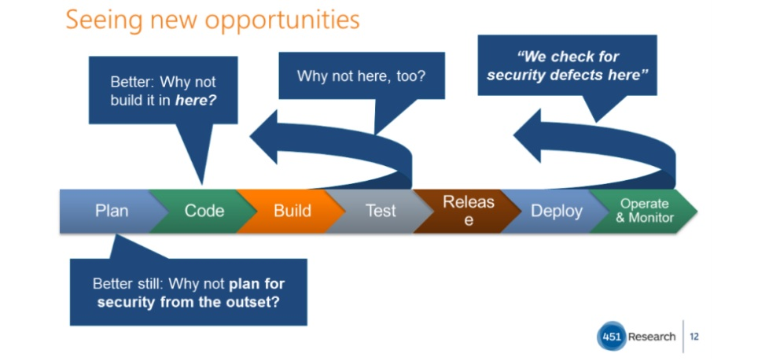
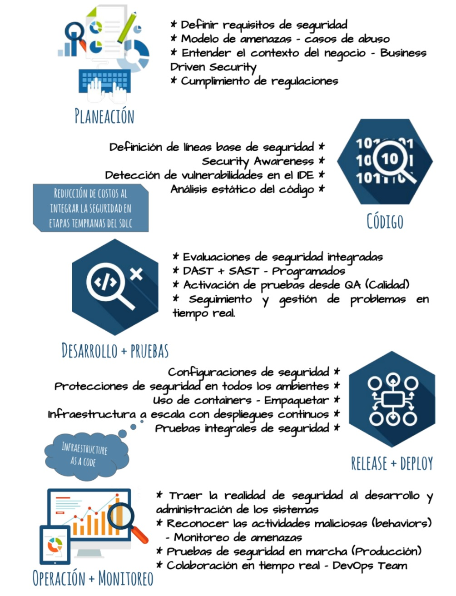

:slug: seguridad-sdlc/
:date: 2016-12-06
:category: opiniones
:tags: devops, sdlc, programar
:image: sdlc.png
:alt: Flechas con las diferentes etapas del SDLC formando un círculo
:description: La seguridad no debe verse como un valor agregado sino como un pilar alrededor del cual se debe desarrollar. En este artículo profundizamos ésta filosofía detallando cómo integrar la seguridad en el proceso de desarrollo de software para evitar pérdidas causadas por ataques informáticos. 
:keywords: Seguridad, Ciclo de Vida, Información, Software, DevOps, Desarrollo.
:author: Paula Velez
:writer: paulav
:name: Paula Velez
:about1: Ingeniera en informatica
:about2: Viajar para correr es un mundo de posibilidades

=  ¿Dónde está la seguridad en el ciclo de vida?

La cultura DevOps (Desarrollo + Operaciones) es una tendencia que está 
rompiendo muchos paradigmas con todo el tema de la transformación digital, y 
aunque se escucha desde mediados del 2008 a tenido varios cambios y se ha 
empezado adoptar en muchas industrias, principalmente porque se entendió que no 
era solo una cultura y que no solo incluye al equipo de desarrollo y 
operaciones. DevOps es un tema integral, todos son un solo equipo que se 
integra para garantizar un despliegue continuo, donde la construcción, prueba y 
liberación de software sea más rápido y eficiente. Como todos hacen parte del 
equipo ¿En que momento debemos llamar al equipo de seguridad?

.Getting the Sec into DevSecOps – Whose Job is it Really? by 
link:https://info.whitehatsec.com/1116-Webinar-451SecuringDevOps-LP.html[WhiteHat Secuity]

Para empezar dejemos claro a qué nos referimos con DevOps porque conceptos y 
filosofías existen muchas, lo importante es tener claro que no solo es un tema 
de cultura, sino que también incluye automatización de procesos y mediciones 
constantes con el fin de que el desarrollo sea más flexible, con mayor calidad, 
se reduzcan los costos y con una altísima frecuencia de releases.

[quote]
DevOps es una metodología de desarrollo con un conjunto de prácticas destinadas 
a reducir la brecha entre Desarrollo y Operaciones, enfatizando comunicación y 
colaboración, integración continua, garantía de calidad y entrega con 
Despliegue automatizado – link:https://dl.acm.org/citation.cfm?id=2962707[Jabbari, Ramtin]

Utilizando DevOps tenemos muchos puntos claros, pero hablemos especícamente de 
tres y como logrando estos nos aumenta el tiempo para incluir la seguridad en 
el SDLC (Systems Development Life Cycle)

. Limitar el trabajo en progreso: al limitar el trabajo en progreso aumenta el 
tiempo para enfocarse en mejorar la seguridad en puntos claves del ciclo de 
vida.
. Aumentar la retroalimentación: La evolución en TI es exponencial al igual que 
los problemas de seguridad, las nuevas vulnerabilidades y amenazas deben ser 
identificadas y resueltas constantemente.
. Limitar o eliminar el re-trabajo: Cerrar las brechas de seguridad desde 
etapas tempranas del SDLC reduce el impacto operacional, el riesgo de 
explotación y el costo asociado.

A partir del SDLC evaluemos las oportunidades y los puntos claves donde debemos 
incluir temas de seguridad.

Al final de cuentas lo importante es entender que la seguridad no es un valor 
agregado es un pilar del desarrollo de cualquier sistema, no se debe pensar al 
final sino que debe estar integrado durante todo el proceso y de esta forma 
reducir el costo del desarrollo y las probabilidades de un ataque en el futuro 
que puede generar millones de pérdidas no solo financieras sino también de 
reputación.

*Nota:* Un punto clave de DevOps es automatizar y para esto lo mejor es saber 
que herramientas usar y a partir del contexto de nuestro sistema priorizar y 
elegir la que mejor se acomode, una buena guía para elegir es evaluar la tabla 
periódica de link:https://xebialabs.com/periodic-table-of-devops-tools/[DevOps] v2 
(Actualizada a Julio-2016)
