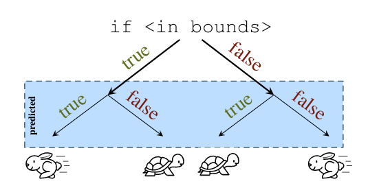
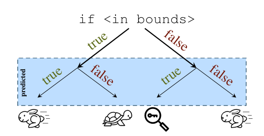

:slug: spectre/
:date: 2018-12-27
:category: ataques
:subtitle: Qué es Spectre, y ¿deberíamos preocuparnos?
:tags: spectre, meltdown, procesador, vulnerabilidad, hardware, exploit
:image: cover.png
:alt: Fantasma en la máquina
:description: Si estás interesado en la seguridad informática muy probablemente hayas oído hablar de Meltdown y Spectre a lo largo de éste año. En este artículo daremos una mirada a Spectre: qué es, cómo funciona cómo nos afecta y qué podemos hacer para protegernos de él.
:keywords: Spectre, Vulnerabilidad, Procesador, Hardware, Diseño, Exploit
:author: Simon Gomez
:writer: sgomezatfluid
:name: Simon Gomez Uribe
:about1: Ingeniero de Sistemas, Universidad EAFIT
:about2: Desarrollo, seguridad, videojuegos y música.

= El Fantasma en la máquina

A comienzos de 2018
se dio a conocer públicamente
el descubrimiento de una familia de vulnerabilidades
bautizadas +Spectre+ y +Meltdown+.
La noticia causó gran revuelo y hasta pánico
entre la comunidad tecnológica en general;
pues no solo son fallas de seguridad graves
por su naturaleza,
sino que además afectan
a la mayoría de equipos de cómputo
de los últimos 20 años.
En ésta ocasión veremos
qué es Spectre,
y qué podemos hacer
para protegernos de él.

.Spectre

== ¿De qué hablamos?

+Spectre+ y +Meltdown+ no son
dos vulnerabilidades únicas,
son una familia de fallas
en el sistema de ejecución especulativa
utilizado en el grueso de procesadores modernos.
Éstas pueden ser usadas
de diversas formas
para exfiltrar datos protegidos
sin necesidad de obtener permisos extra
en el sistema
o explotar +bugs+
en aplicaciones para afectarlas.

+Spectre+ rompe el aislamiento entre
aplicaciones y permite a un atacante
exfiltrar datos
del espacio de memoria de una aplicación
sin errores.
De hecho, los chequeos de seguridad sugeridos
por buenas prácticas
pueden hacer una aplicación
aún más susceptible.
Ésta vulnerabilidad pone en riesgo
datos protegidos
como contraseñas, historiales de navegación,
mensajes de correo o +IM+,
o archivos abiertos.

== ¿Cómo funciona?

Para comprender en qué consiste
ésta falla,
es necesario saber un poco acerca del
sistema de ejecución especulativa
presente en las +CPU+ actuales
para optimizar los tiempos
en los que es posible correr
un programa.

En el flujo normal de un programa
es necesario tomar decisiones
que llevan a correr
uno u otro camino en el código (ramas).
Pero a veces la información necesaria
para tomar la decisión
no está inmediatamente disponible
en la caché del +CPU+;
por lo que mientras se trae
ésta información de la memoria
se utilizan algoritmos predictivos
para adivinar qué camino
es más probable que se tome,
y así ir corriendo el código
en éste camino para que,
cuando llegue el resultado en espera,
siga la ejecución del programa
desde ahí si la predicción fue acertada,
o se restablezca el estado de la +CPU+
hasta donde se tomó la decisión
y se siga la ejecución normalmente
en caso de una fallida.

.Ejecución especulativa

El problema viene en que
cuando una predicción falla
los datos utilizados
en la ejecución de la rama predecida
no son eliminados por completo
de la caché.
Dejando abierta la posibilidad
de acceder a éstos
mediante canales alternos.

+Spectre+ se aprovecha de éste sistema
entrenándolo con varias pasadas de datos válidos
que fuercen a predecir un resultado positivo
en la pasada de ataque,
para luego forzar la ejecución
de una rama equivocada
que cargue datos protegidos de la memoria
y luego, mediante un canal alterno,
extraerlos de la caché
antes de ser sobreescritos
con datos de la ejecución
de la rama correcta.

.Ejecución especulativa con Spectre

== ¿Qué tan grave es?

A diferencia de la mayoría de vulnerabilidades
que salen a la luz diariamente,
+Spectre+ es una falla de diseño de hardware.
Ésto implica no solo que está presente
independientemente del sistema operativo
o software utilizado,
sino que no puede ser parchada por completo
más que con un cambio en el diseño
de los procesadores en sí.
Y para mitigarla es necesario
desactivar o modificar desde el sistema operativo
el uso de ciertas características del +CPU+
que conllevan a reducciones
en el rendimiento general del sistema,
y en algunos casos a inestabilidad,
necesidad de reinicios periódicos,
entre otros efectos secundarios indeseables
que dependiendo de las circunstancias
pueden hacer inviable el parcheo.

Han sido confirmados como vulnerables a +Spectre+
generaciones enteras de procesadores
+Intel+, +AMD+, +IBM POWER+, y +ARM+
utilizados en los
PCs, servidores, smartphones, microcontroladores y sistemas embebidos
que hacen el mundo moderno girar.

Así que, realísticamente, casi todos
los +CPU+ contenidos
en equipos de cómputo
en la actualidad y el futuro cercano
son vulnerables y así permanecerán.

Pero no todo es tan trágico como suena.
La misma naturaleza
que hace a éste ataque tan peligroso
lo hace difícil de explotar.
Y si bien es imposible saber
si hay variantes descubiertas
por hackers malos ahí fuera
siendo usadas en la actualidad,
hay ejércitos de investigadores
revolviendo el interior de sus +CPU+
para encontrar nuevas formas
de abusar de ésta falla
y poder distribuir mitigaciones
antes de que manos mal intencionadas
se posen sobre ellas.

== ¿Qué puedo hacer para protegerme?

Hasta el día de hoy se han encontrado
siete variantes diferentes de +Spectre+,
y contando.
La buena noticia es que los
fabricantes de procesadores
y sistemas operativos
han sacado actualizaciones
para todos los S/O actuales que,
si bien con algunos efectos secundarios,
mitigan el peligro que éstas representan.

Lo mejor que se puede hacer como usuario
para evitar ser víctima de +Spectre+
es mantener
los sistemas operativos de tus equipos
siempre actualizados
con los últimos parches disponibles.

== Conclusión

+Spectre+ es una amenaza seria
que puede comprometer datos delicados
y debe ser tomada muy en serio.
Sin embargo no hace falta entrar en pánico,
basta con tomar precauciones
para evitar caer víctima de ésta...
y esperar que salgan al mercado
nuevos chips que no contengan éstas fallas.

Esto es todo por ésta vez,
¡nos leeremos próximamente
para aprender acerca de +Meltdown+!

== Referencias

. [[r1]] link:https://www.techrepublic.com/article/a-year-after-spectre-and-meltdown-how-well-do-patches-work/[A year after Spectre and Meltdown, how well do patches work?]
. [[r2]] link:https://spectreattack.com/[Meltdown and Spectre]
. [[r3]] link:https://www.databreachtoday.com/blogs/spectre-next-generation-p-2626[Spectre: The Next Generation]
. [[r4]] link:https://www.bankinfosecurity.com/spectre-meltdown-flaws-two-more-variants-discovered-a-11021[Spectre and Meltdown Flaws: Two More Variants Discovered]
