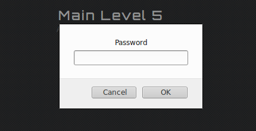
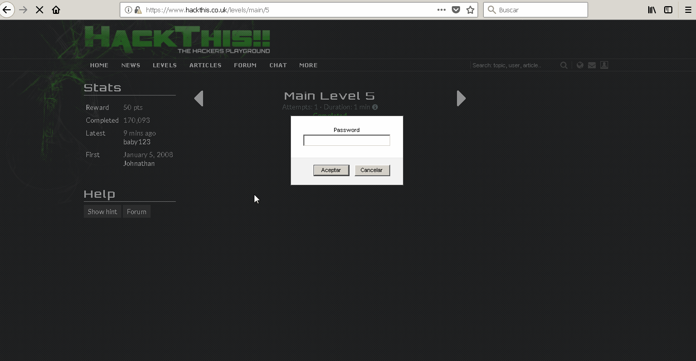
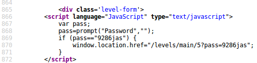
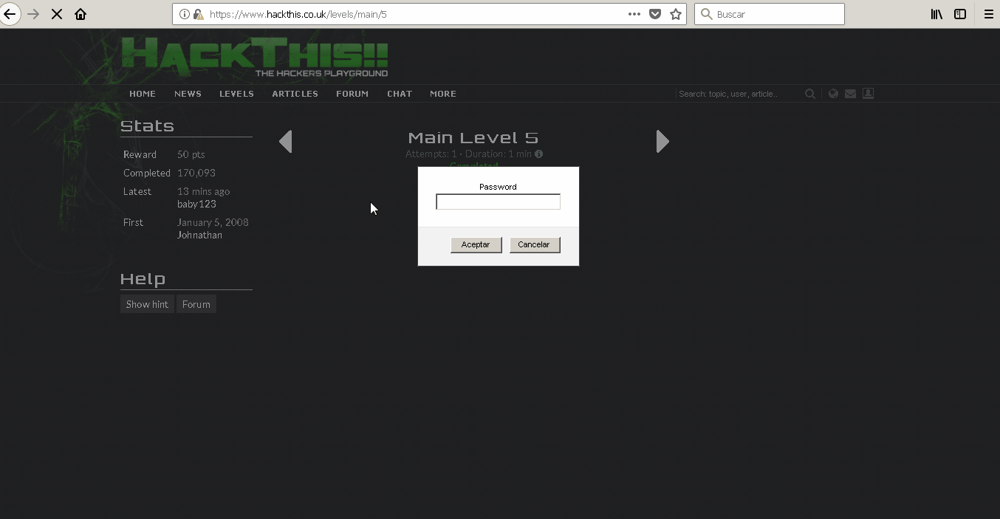
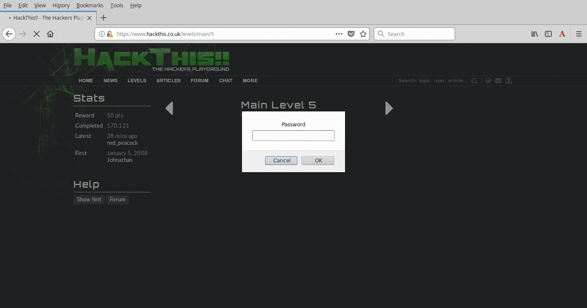

:slug: una-alerta-a-la-espera/
:date: 2017-12-22
:category: opiniones
:description: TODO
:keywords: TODO
:author: Luis Arteaga
:tags: solucionar, javascript, reto
:Image: js.png
:alt: Lupa encontrando la contraseña en un set de datos binarios
:writer: stiwar
:name: Luis Arteaga
:about1: Ingeniero en Electrónica y Telecomunicaciones.
:about2: Apasionado por el desarrollo de aplicaciones web/móviles, la seguridad informática y los videojuegos.
:figure-caption: Imagen

= JS: Una alerta a la espera

No hay duda de que las actividades en el día a día del hombre moderno dependen
del uso de internet, actividades que no serían para nada fácil sin el uso del
mismo, o por lo menos no con las comodidades que nos brinda hoy en día. Si bien
esto nos ha facilitado la vida, también es cierto que ha traido algunos problemas
de privacidad y seguridad sobre todo sino sabemos usarlo adecuadamente. Por otra
parte, para los desarrolladores además de un buen desarrollo, también es
primordial proteger la información de posibles hackers. Es por ello que en este
artículo, continuamos con soluciones a retos de seguridad informática del sitio
web hackthis. En especial, a un reto que involucra análisis de código JavaScript.

== Reto: Main Level 5

En esta ocasión y continuando con el análisis de scripts de JavaScript, daremos
solución al reto 5 de la categoría _Main_ del sitio 
http://hackthis.co.uk/[hackthis]:

.hackthis: nivel 5 de la categoría MAIN

Si deseas conocer la solución a anteriores retos, puedes ingresar al
https://fluid.la[blog de FLUID] donde encontrarás este y otros artículos
interesantes sobre seguridad informática.

Como se aprecia en la anterior imagen, este reto despliega una ventana emergente
en la cual se nos solicita sólo un password secreto. Para este reto, vamos a
hacer uso nuevamente de la herramienta _View Page Source_ que viene integrada en
los navegadores modernos, pero accediendo a ella *únicamente* con el atajo ctrl+U
(sin dar click derecho y luego en _View Page Source_).

Lo anterior debido a que el mensaje de alerta del reto, no nos permite acceder
al código fuente de la página dando click derecho y seleccionar la respectiva
opción. Por otra parte, en google chrome y chromium (para los amantes de Linux)
este atajo funciona sin ningún inconveniente, pero para los usuarios de Firefox
debemos tener la siguiente recomendación:

Para que este atajo funcione sin ningún problema (si es que existe) en Firefox,
debemos dar un click en alguna parte del mensaje de alerta y seguido a ello
presionar Ctrl+U, tal y como lo ilustra la siguiente animación:

En caso de que no funcione, intenta recargar la página. Una última alternativa
sería pulsar en cualquiera de los dos botones de la ventana de alerta y acceder
al código fuente mediante el atajo descrito anteriormente.

Una vez desplegado el código fuente del reto, debemos prestar especial atención
al siguiente bloque de código JavaScript (JS en adelante):

.hackthis: código JS para el reto 5 de la categoría MAIN

En terminos sencillos, el anterior script delimitado por las etiquetas
** funciona de la siguiente manera:

En primer lugar se declara una variable nombrada _pass_. Posterior a ello, se
ejecuta el método _prompt_, el cual consiste de una ventana emergente desplegada
en el navegador, y cuyos parámetros opcionales para este caso son los siguientes:
el primero consiste de un texto que se despliega como título de la ventana
emergente, cuyo fin es orientar al usuario sobre qué acción tomar. El segundo es
un valor por defecto que será desplegado (en este caso una cadena vacía).

El texto ingresado por el usuario en la ventana emergente, se almacena en la
variable _pass_ definida previamente. Posterior a ello, dicha variable se
compara con la cadena de texto "9286jas". Si coinciden, el usuario es
redireccionado mediante la siguiente ruta relativa:
 _/levels/main/5?pass=9286jas_ y por lo tanto, el reto es resuelto.

A continuación, una animación ilustrando todo el proceso descrito anteriormente:

.hackthis: animación y solución al reto MAIN 5

== Soluciones alternativas

Existe una segunda y tercer forma de solucionar el reto 5. La segunda consiste
en usar la herramienta _console_ (o consola si tu sistema operativo está
en español), que forma parte del paquete de herramientas para desarrolladores
en los navegadores web modernos. Para esta ocasión, usaré Firefox debido a que
por defecto, tanto Google Chrome como Chromium bloquean la ejecución de código
JS desde la consola.

En Firefox podemos acceder a dicha herramienta dando click derecho y luego en
Inspect Element (o presionando la tecla _f12_) y buscar la pestaña _Console_.
Una vez activa la consola del navegador, debemos ejecutar el siguiente script:

 window.location.href="/levels/main/5?pass=9286jas";

El anterior script fue tomado del código fuente de la página como vimos
anteriormente. La siguiente animación resume este proceso:

.hackthis: animación y solución al reto MAIN 5 (segunda solución)
image::main5-2.gif[solucion-2]

La tercer forma requiere el uso de la herramienta _Scratchpad_, la cual es
exclusiva de Firefox. Para los usuarios de Google Chrome y Chromium existen
alternativas como https://goo.gl/Ebgfse[Scratch JS]. Podemos acceder a ella
mediante el atajo _shift+F4_ o pulsando en _tools\->Web Developer\->Scratchpad_ .

Una vez desplegada la herramienta, debemos escribir el siguiente script de JS:

 javascript:void(window.location.href="/levels/main/5?pass=9286jas");

O también simplemente podemos escribir:

 window.location.href="/levels/main/5?pass=9286jas";

Y por último pulsamos en el botón _Run_ para ver los cambios directamente en el
navegador. La siguiente animación muestra el uso de Scratchpad para solucionar
el reto en cuestión:

.hackthis: animación y solución al reto MAIN 5 (tercer solución)

Estas son todas las soluciones que conozco hasta el momento sin utilizar algún
plugin o programa externo como https://goo.gl/h4Mvdr[Tamper Data] o
https://goo.gl/GT6GZC[Burp Suite] respectivamente.

Para terminar y tal como lo mencioné en una entrada anterior, en ningún caso
debemos almacenar credenciales de usuario o información restringida en el código
de la página web, sin importar si esta contiene código JS o html puro. Ya que, 
como vimos, el cliente puede manipular el código fuente del sitio desde un
navegador.
