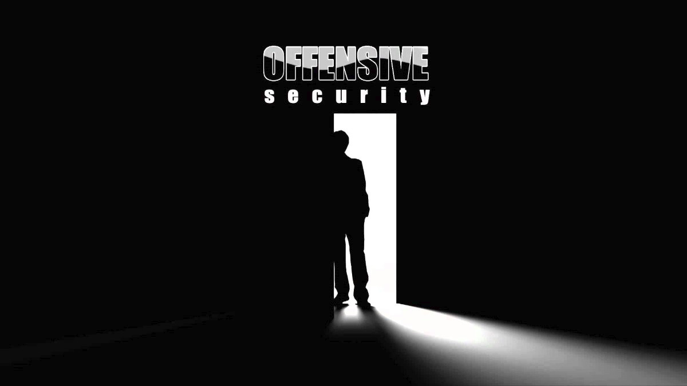

:slug: una-dosis-de-offsec-oscp/
:date: 2018-02-12
:category: certificaciones
:tags: red team, pentesting, certificaciones, offensive, examenes, seguridad
:image: oscp-exam.png
:alt: logo OSCP, certificación
:description: OSCP es una de las certificaciones más queridas y reconocidas en el mundo de la seguridad informática, creada por offensive security. Este es el viaje a través del camino de Try Harder, mi experiencia, conclusiones, lo bueno y lo malo, y algunos consejos que considero apropiados
:keywords: certificaciones, oscp, offensive, seguridad, red team, explotación
:author: Camilo Cardona
:writer: camiloc
:name: Camilo Cardona Hernandez
:about1: Ingeniero de sistemas y computación, OSCP, OSWP
:about2: "No tengo talentos especiales, pero sí soy profundamente curioso" Albert Einstein

= Una dosis de Offsec: OSCP

En el mundo de la seguridad informática existen toda clase de certificaciones,
para todas las áreas, sea cual sea tu enfoque,
**+Red team+** o **+Blue team+**.
Certificaciones que evalúan tus conocimientos de forma teórica como
+CEH+ o +GIAC GPEN+ y otras que evalúan tus habilidades bajo la
práctica tales como lo son +OSCP+ u +OSCE+.
A lo largo de este artículo describiré cual fue mi experiencia realizando
mi primera certificación, por qué la elegí y algunos consejos para el examen.
Desde un terreno menos técnico ya que desde este enfoque existen muchos
artículos que se detallan y extienden mejor.

Esta es mi representación de lo que pasó a lo largo del camino de
*+Try Harder+*, para al final llegar a las puertas de lo que denominé como
"la gran batalla".

== En el principio: La elección y el ROI

Al momento de elegir una certificación se debe tener en cuenta muchos factores,
pero el más importante a considerar es el +ROI+ (el retorno de la inversión).
El +ROI+ de una certificación se basa en
dos variables fundamentales _(desde mi punto de vista)_, que son
**_el nivel de aprendizaje que se adquiere_** y
**_el nivel de reconocimiento de la misma_**.
Teniendo en cuenta lo anterior he optado por
**+Offensive Security Certified Professional+** *(+OSCP+)* como mi primera
certificación.

+OSCP+ es una certificación diseñada con la finalidad de que las personas que
la consigan tengan verdaderas habilidades de miembros de un Red Team,
explotando vulnerabilidades a través de diferentes metodologías y
técnicas y no solo limitandose a usar herramientas de escaneo.
Para aprobar es necesario conseguir 70 puntos en un tiempo de 24 horas, se
cuenta también con un laboratorio de 30, 60 ó 90 días,
depende de la elección que se haga.

== El camino

Desde un principio tenía claro que no era tarea fácil, ni mucho menos algo para
tomarse a la ligera, se cubren varios temas a lo largo del curso, las máquinas
son diferentes unas de otras, y existen diferentes niveles de dificultad.
En algunos retos deberás usar el principio
+KISS+ *+(Keep It Simple, Stupid!)+*,
en otras recurrir a recursos más complejos.
La clave del examen es invertir todo el tiempo posible
al laboratorio, investigar es fundamental, al igual que usar la documentación
que nos ofrecen al inicio como base de aprendizaje.

== La gran batalla:  Yo, el examen, y el baile del root

Aunque no es posible para mi entrar en detalles sobre el examen,
ciertamente fue una batalla ardua y difícil,
no puedo decir que se presentó como algo fácil para mí.
Programé el examen 15 días después de terminar mis 30 días de laboratorio,
tiempo que usé para reforzar habilidades y
técnicas que sabía podría ser mi punto débil,
como escalamiento de privilegios y Buffer overflow.

Veinticuatro horas te dan para realizar el examen
y veinticuatro horas fueron necesarias para alcanzar *_"El baile de root"_* y
al menos otras cuatro para documentarlo, esto segundo es igual de importante,
debe ser claro y específico sobre las técnicas y pasos realizadas.

== El día después del final

Tan solo un día después de realizar el reporte he recibido un correo por parte
de Offensive Security notificando que había pasado el examen y que me enviarían
mi certificado.
*¡Felicidad!*

image::hombre-feliz-aplaudiendo.gif[Pelicula en busca de la felicidad]

== Consejos para realizar la certificación

=== La frustración: El primer elemento a dominar

A lo largo del laboratorio y el examen la frustración es una *_¡constante!_*.
Una constante que debes aprender a manejar. Puede que pases más de 12 horas en
una sola máquina, puede que incluso debas irte a la cama sin terminar un
reto o que dormir más de 5 horas solo sea un deseo. Debes aprender
a dominar el instinto a desistir y desarrollar una habilidad para buscar
enfoques diferentes cuando llegue la frustración.

=== El todo por el todo o desiste antes de empezar

Una verdad absoluta es que las certificaciones de Offensive security no son
fáciles, es necesario invertir todo el tiempo posible a los laboratorios,
de nada sirve que pagues por los 90 días si solo vas a entrenar una
vez o dos por semana. Tomarse el laboratorio a la ligera puede ser el
principio del desastre.

=== Evita los agujeros de conejo: Usa el pensamiento lateral

En los laboratorios como en el examen es muy fácil caer en agujeros de conejo,
quedarte horas y horas tratando de resolver un problema, en estos casos es
necesario dar un paso atrás y ver el entorno completo, buscar otro camino.
Debes ser como el mejor de los detectives que no pasa por alto ningún detalle.

[quote]
 *_Los pequeños detalles siempre son los mas importantes_*
                                                            - Sherlock Holmes

=== Tomar descansos

Uno de mis errores en el examen fue que no tome ningun descanso, es bueno hacer
pausas para refrescar nuestra mente y buscar enfoques nuevos si estamos en un
agujero de conejo.

=== Si no fue a la primera es un deber volver a intentarlo.

En mi caso ya sea por preparación o por fortuna lo he logrado al primer
intento, pero esto significa poco, es fácil caer en un agujero de conejo,
o que el cansancio nos nuble el pensamiento,
si es el caso de no poder pasarlo a la primera y si este hubiera sido mi caso,
hubiera sido un deber volverlo a intentar.
*¡Volver a la batalla!*

[quote]
   *_Es difícil vencer a una persona que nunca se rinde_*
                                                         - Babe Ruth

== Enseñanza final

Al final y luego de 45 días de _“sufrimiento”_ todo ha valido 100% la pena, el
conocimiento que se adquiere luego del curso y el examen es exponencial,
eso fue lo más importante para mi, y por supuesto obtener la certificación.
La verdad el examen es difícil pero no  imposible, y  si se pierde a la primera
o a la segunda, es mejor que digan que los que se caen siempre se levantan.

Luego de esta he hecho otra certificación con Offensive Security y
ha sido más de lo esperado.
Los materiales son de mucha ayuda y muy claros, *_pero hay que
tener en cuenta que estos no están diseñados para solo quedarse allí y
apoyarse tan solo en ellos, es necesario investigar e indagar por recursos
adicionales y ser muy autodidactas y proactivos_*.

El reto ha terminado. Aunque no es final, es simplemente el
comienzo, el comienzo del aprendizaje, aún existe mucho por aprender y otras
batallas por sortear para ser un miembro real y destacado de un +Red Team+.
