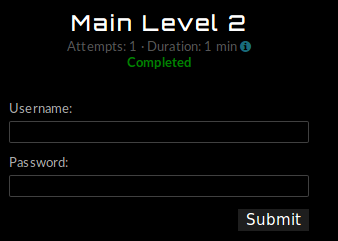
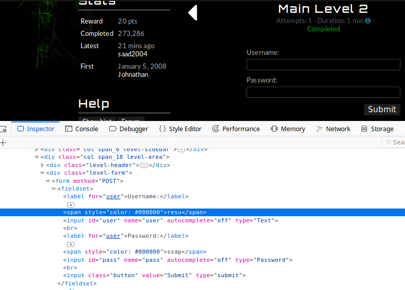
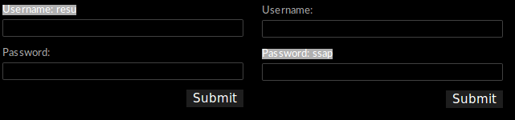
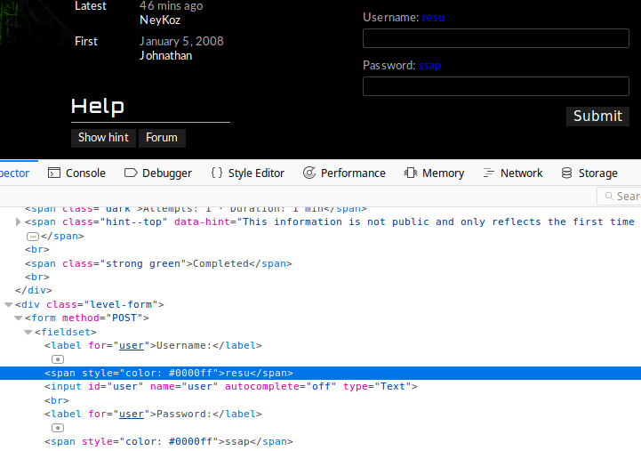
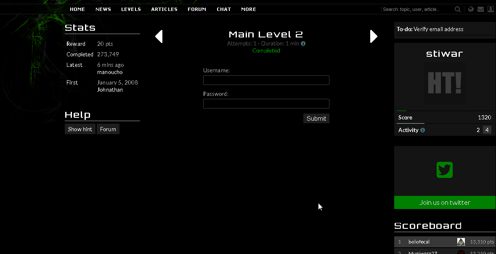

:slug: veo-no-veo
:date: 2017-12-19
:category: opiniones-de-seguridad
:author: Luis Arteaga
:tags: solucionar, browser, reto
:Image: html-search.png
:writer: stiwar
:name: Luis Arteaga
:about1: Ingeniero en Electrónica y Telecomunicaciones.
:about2: Apasionado por el desarrollo de aplicaciones web/móviles, la seguridad informática y los videojuegos.
:figure-caption: Imagen

= Te Veo No Te Veo

El mundo del desarrollo web ha crecido a pasos agigantados debido a la evolución
de internet y a la aparición de la denominada web 2.0 en los últimos años. Sin
embargo, esto ha acarreado consigo grandes desafíos y responsabilidades para los
desarrolladores y diseñadores tanto web como móvil, que día a día deben innovar
en sus creaciones para sobresalir en un mundo virtual completamente competitivo.
Es por esta razón que para dichos actores es importante valerse de herramientas
que les facilite sus actividades diarias, de tal manera que puedan ser más
eficientes y productivos.

Lo anterior, permite dar continuación a una serie de artículos en donde hemos
hablado sobre algunas de las herramientas más utilizadas e incorporadas en los
navegadores web modernos. En esta ocasión, daremos lugar a otro tipo de
herramienta la cual, nos permite inspeccionar cualquier elemento de una página
web _en vivo_. Es decir, a medida que editas el código fuente de la página,
podrás ver los cambios realizados y reflejados de manera inmediata a través de
tu navegador.

== Reto: Main Level 2

Para ilustrar el uso de esta nueva funcionalidad, en esta oportunidad daremos
solución al reto 2 de la categoría _MAIN_ del sitio web
*https://www.hackthis.co.uk/[hackthis]*, tal y como hicimos en una publicación
anterior para el reto 1 de la misma categoría:

.hackthis: nivel 2 de la categoría MAIN

Al igual que el https://goo.gl/NRxUPF[reto 1], en este se solicita ingresar
credenciales válidas para un determinado usuario. Solo que esta vez haremos uso
de una nueva herramienta incorporada en los navegadores web:
_"Inspect Element"_ (o inspeccionar elemento si tu sistema operativo está en
español). Podemos acceder a esta funcionalidad presionando click derecho y buscar
la opción con dicho nombre, o también puedes hacer uso del atajo al presionar la
tecla _f12_. Una vez desplegada la herramienta, busca el siguiente bloque de
etiquetas dentro del html:

.hackthis: solución al reto MAIN 2

Aquí debemos prestar especial atención al contenido entre las dos etiquetas
** y **. Como se aprecia en la imagen, la primera contiene el valor:
_resu_ y la segunda: _ssap_. Una vez ingresadas dichas credenciales, el reto es
resuelto.

En realidad, existe una tercer y cuarta manera de resolver este ejercicio además
de la descrita anteriormente y en el primer reto. La tercera, simplemente
consiste en resaltar el texto oculto a la derecha de las palabras "Username" y
"Password" tal como se aprecia a continuación:

.hackthis: solución al reto MAIN 2 (tercer solución)

== Editando el html en vivo

Una de las cualidades que resalta en la herramienta _"Inspect Element"_, es la de
poder editar etiquetas html, css, inyectar código JavaScript, etc y ver
reflejados los cambios de manera instantánea dentro del navegador, sin importar
si estas usando Firefox, Google Chrome, Safari o cualquier otro navegador
reconocido que exista en el mercado.
La cuarta y última forma (que conozco) para resolver el reto 2, consiste en el
uso de esta característica. A través de esta, podremos cambiar el valor #*000000*
(que corresponde al color negro en RGB-Red, Green, Blue) de las dos etiquetas
span por un valor visible en pantalla, por ejemplo #*0000ff*.

Al hacer esto, podemos ver que los cambios se reflejan de manera instantánea en
el navegador:

.hackthis: solución al reto MAIN 2 (cuarta solución)

Puedes leer sobre el formato de colores RGB y probar con otros en
https://goo.gl/cjpNSu[este enlace].

Por último, y una vez explicado el paso a paso con las distintas formas de
resolver un mismo reto, se incluye una pequeña animación, la cual, muestra todo
el proceso para ejecutar la cuarta solución al reto 2:

.hackthis: animación y solución al reto MAIN 2 (cuarta solución)

Para terminar, y en mi opinión, antes de agregar un nuevo complemento o plugin
a tu navegador, verifica que este no cuente ya con una herramienta que cumpla con
una tarea específica. Ya que entre menos complementos tengas instalados, el
navegador se ejecutará y responderá a una mayor velocidad.

Por otro lado, resaltar que existen herramientas y complementos maliciosos que
pueden perjudicar el rendimiento de tu equipo, por lo anterior, y en lo posible,
al descargar una nueva herramienta o funcionalidad, asegúrate de que provenga de
una fuente confiable.
[quote,Craig Bruce]
"El hardware es lo que hace a una máquina rápida; el software es lo que hace que
una máquina rápida se vuelva lenta"
