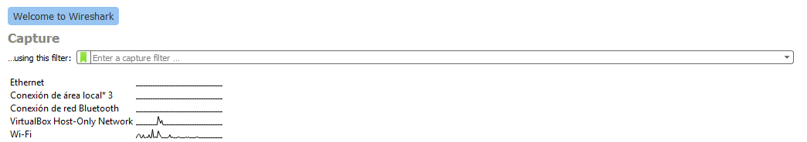
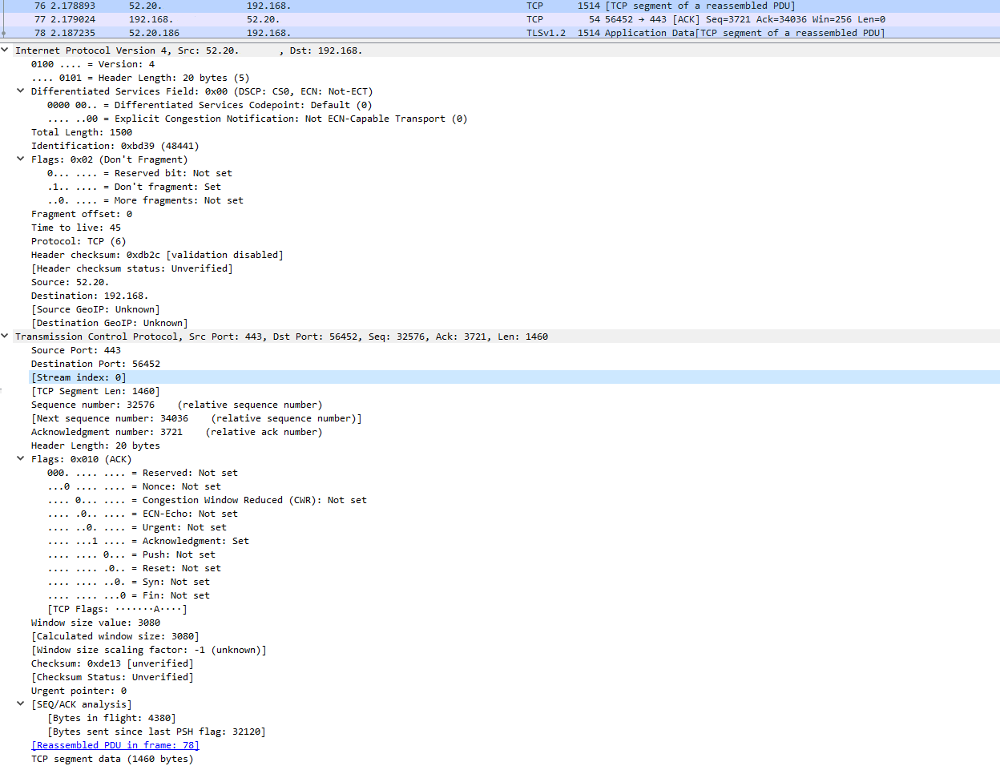
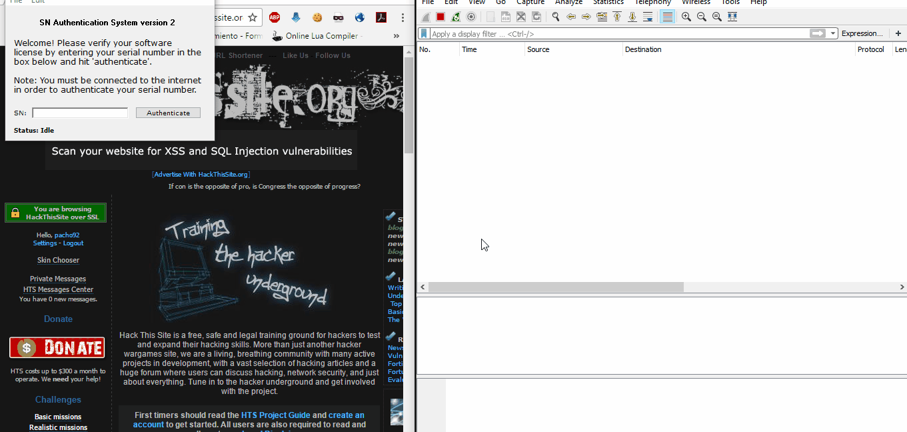
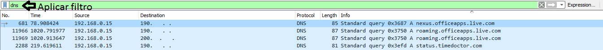
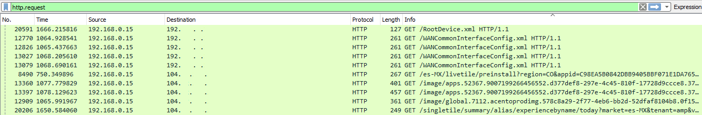

:slug: wireshark-cuida/
:date: 2017-03-08
:category: ataques
:subtitle: Cómo monitorear y analizar el tráfico de la red
:tags: seguridad, monitorear, red, herramienta
:image: wireshark-representative.png
:alt: Una señal que se combina con el símbolo de Wireshark
:description: Wireshark es un potente sniffer que cuenta con una gran cantidad de funcionalidades que nos pueden resultar útiles. En este artículo utilizaremos Wireshark para analizar los cambios en el tráfico de nuestra conexión y detectar posibles ataques externos o equipos infectados.
:keywords: Seguridad, Wireshark, Sniffer, Protección, Monitorear, Tráfico.
:author: Francisco Bernal
:writer: pacho
:name: Francisco Bernal Baquero
:about1: Ingeniero Electrónico.
:about2: Programador en Python y Ruby, siempre dispuesto a aprender.

= Wireshark nos cuida

En una empresa, las redes son los principales elementos
para poder prestar un servicio.
Es por esto que se debe tener un especial cuidado con ellas para
que el servicio no falle, y así evitar que un servicio se suspenda.
En pocas palabras, si la red de la empresa falla,
el servicio se deja de prestar a los clientes.
Debido a esto, es muy importante tener un permanente y excelente monitoreo
de la red, para que esta funcione perfecto todo el tiempo.
Una gran ayuda para esta labor son las herramientas de monitoreo de red.
Éstas nos permiten detectar problemas
que nos puedan provocar un colapso en las redes o la caída de la misma.

Es muy importante saber que un monitoreo de red
no es lo mismo que la gestión de red.
El monitoreo de red es mostrar información sobre la conexión
que se efectúa entre un ordenador y la red, que puede ser interna o externa.
En otras palabras, saber qué ordenadores están conectados, qué +IP+ usan,
la cantidad de datos que entran y salen, y las conexiones realizadas en la red
(link:https://hipertextual.com/archivo/2013/07/monitores-de-red-windows-os-x/[Hipertextual]).
La gestión de una red son las tareas de ``despliegue, integración
y coordinación del +hardware+, +software+, y los elementos humanos;
para monitorizar, probar, sondear, configurar, analizar, evaluar,
y controlar los recursos de una red;
y conseguir niveles de trabajo y de servicio
adecuados a los objetivos de una instalación y de una organización''
(link:https://www.funiber.org/gestion-de-redes/[funiber]).
Teniendo claro esto, una herramienta de monitoreo de red es +Wireshark+.

.Logo de wireshark (link:https://es.wikipedia.org/[Wikipedia])

== ¿Qué es wireshark?

Es un potente link:http://culturacion.com/que-es-un-sniffer/[+sniffer+] de red,
además de +software+ libre.
Muchas distribuciones +Linux+ enfocadas en +Ethical Hacking+
tienen preinstalado este +software+.
Nos permite capturar y monitorizar los paquetes
que pasan por nuestra conexión, ya sean de nuestro equipo o no,
simplemente seleccionando la interfaz por la que estamos conectados a la red o,
si simplemente queremos analizar el tráfico de un solo equipo,
configurando el programa en modo promiscuo.
Esto quiere decir que solo capture el tráfico que pasa por él.

.Interfaces en +Wireshark+

Como se observa en la _Imagen 2_, +Wireshark+ detecta automáticamente
a qué interfaz está conectado el sistema,
y las demás interfaces que tiene disponible.
En este caso el sistema está conectado a la red +Wifi+.
Con la información que ofrece este programa,
podemos analizar el tráfico que pasa por la red
a la que está conectado el sistema, y así prevenir problemas
que puedan surgir derivado de ello.
Por ejemplo, si la conexión no es estable, se podría verificar
qué equipo está generando un tráfico no deseado
y, observando su protocolo, poder determinar si es un ataque externo
o una máquina de la red infectada con algún troyano.
También es perfecto para el aprendizaje de los protocolos de red,
nos da la oportunidad de observar los diferentes protocolos de red
y desglosarlos para poder comprender su utilidad y su función.

.Protocolo +TCP+ desglosado por +Wireshark+

Otra posibilidad, que aunque no está en la filosofía de +Wireshark+,
es usarlo de forma delictiva.
Por ejemplo, robando una contraseña +Wifi+ protegida por cifrado +WEP+
(+*_Wired Equivalent Privacy_*+),
o incluso robando seriales de alguna aplicación
que utilice verificación en línea.

.Rompiendo la verificacion online

Los pasos para poder saltar este tipo de seguridad fueron los siguientes.
Al ser +Wireshark+ un monitor de red, el programa captura todos los paquetes
que están siendo enviados y recibidos de todas las maquinas
que están conectadas a la misma red.
Esta información es bastante extensa y nos sería muy difícil
saber qué buscar, por lo cual filtramos solo los paquetes enviados y recibidos
por nuestra dirección +IP+,
con el siguiente código +ip.addr == <dirección IP>+.
Después de filtrar el tráfico, lo que hacemos es revisar el protocolo +HTTP+
y buscar a qué dirección redirige las peticiones de la aplicación,
para revisar los seriales.

== ¿Para qué sirve?

La información detallada que nos ofrece +Wireshark+
nos da la posibilidad de analizar el tráfico que pasa por una red,
y así solucionar o prevenir los problemas que puedan surgir.
Por ejemplo, si una red va con una conexión lenta,
se podría revisar qué está generando tráfico no deseado.

Las anomalías encontradas en +Wireshark+ generalmente son indicios
de que algo en la red no está funcionando como queremos,
y nos da un punto de partida por el cual empezar a descartar
o filtrar problemas a ataques a una red o a un equipo

== ¿Cómo puede Wireshark prevenir ataques?

Una vez iniciada una captura,
se deben reconocer qué servidores se conectan a través de peticiones +DNS+.
Para hacer esto, es recomendable hacer un filtro escribiendo +DNS+
y aplicando el filtro.
Una vez aplicado, serán visibles únicamente los protocolos +DNS+,
en caso de un +malware+, permite revisar a qué servidor se conecta.

.Filtro +DNS+

Otro aspecto para tener cuidado son las peticiones realizadas.
Con el filtro +http.request+ se obtienen todos los +GET+ y +POST+
que han sido capturados.
Generalmente, estas peticiones son muy utilizadas por aplicaciones maliciosas
para enviar información sobre un servidor infectado.

.Filtro +HTTP Request+

Estos filtros no son los únicos que nos pueden ayudar a la seguridad de una red,
existe una gran variedad de filtros para aplicar
dependiendo de cada necesidad.
Por ejemplo, link:http://www.serversmtp.com/es/que-es-servidor-smtp[+SMTP+]
(+*_Simple Mail Transfer Protocol_*+) para filtrar los correos,
además que pueden ser concatenados con operaciones lógicas,
para tener un filtro más exacto de lo que se requiere.
En la _Imagen 7_, por ejemplo, se están filtrando todas las peticiones
que sean de la +IP+ *192.168.0.15*.

.Concatenación de elementos

+Wireshark+ es una herramienta extremadamente poderosa.
En este artículo simplemente se habló, en una menor medida,
de lo que realmente es capaz de hacer.
Las aplicaciones van desde depurar las implementaciones de protocolos de red,
examinar problemas de seguridad, inspeccionar protocolos internos de red,
tener un control más amplio de nuestra red, etc...

== Referencias

. [[r1]] link:https://www.howtogeek.com/104278/how-to-use-wireshark-to-capture-filter-and-inspect-packets/[HowToGeek]
