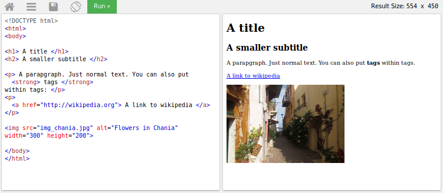
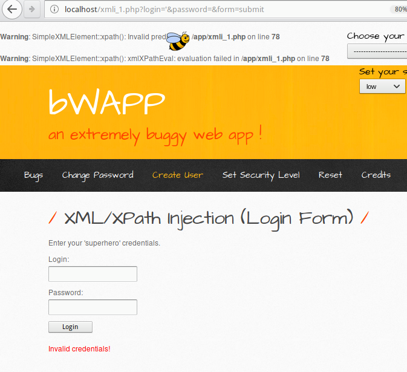

:slug: xml-exploitable-markup-language/
:date: 2018-02-16
:category: ataques
:subtitle: Inyección XPath en archivos XML
:tags: xml, xpath, inyección
:image: cover.png
:alt: Portada del libro de XML de O'Reilly
:description: Cómo realizar inyecciones XPath básicas en archivos XML utilizados para autenticación. Un estudio de lenguajes de marcado, introducción a HTML a lo largo del ML extensible. Una pequeña introducción a XPaths y cómo utilizarlos para atacar sitios vulnerables como bWAPP.
:keywords: Inyección XPath, XML, Ataque, Vulnerabilidad, Seguridad, Lenguaje de marcado
:author: Rafael Ballestas
:writer: raballestasr
:name: Rafael Ballestas
:about1: Matemático
:about2: Con interés por CS
:source-highlighter: pygments
:translate: xml-exploitable-markup-language/

= XML: eXploitable Markup Language

Los lenguajes de marcado son
"sistemas para estructurar un documento
de tal forma que sea distinguible del texto." <<r1, ^[1]^>>
¿Qué significa eso realmente?
Considero que este concepto se entendería mejor a través de ejemplos.
Pero antes de empezar, una advertencia:
Si utilizas algún lenguaje de marcado para almacenar información sensible,
debes ser muy cuidadoso en como son manipulados.

Quizás el mejor ejemplo es el popular +HTML+,
el lenguaje de la internet.
Cuando visitas una página web, descargas un archivo con texto plano,
mezclado con unos cuantos +tags+
los cuales hacen que el texto se la página se vea de la forma en que lo hace
cuando se renderiza en un navegador.
Los +tags+ son utilizados para definir:

* La estructura de la página, como la división en secciones.

* El formato del texto.

* El estilo general de la página.

* La inclusión de medios audiovisuales en la página
(imágenes, videos, etc)

Un +tag+ luce algo así:
+<h1>Texto grande</h1>+
y sería renderizado como un título en tu navegador.
Si estás interesado en aprender más +HTML+
visita link:https://www.w3schools.com/html/default.asp[+W3Schools+]:

.Algunos +tags+ y sus resultados.

Existen otros lenguajes de marcado enfocados en diferentes propósitos, como:

* link:http://www.troff.org/[+troff+] de +UNIX+,
el cual es utilizado para renderizar las páginas link:https://linux.die.net/man/1/intro[+man+]

* El link:https://en.wikipedia.org/wiki/TeX[+TeX+] de link:https://www-cs-faculty.stanford.edu/~knuth/[Don Knuth]
el cual es la única forma
de compilar adecuadamente la matemática en un computador.

* link:https://daringfireball.net/projects/markdown/[+Markdown+] y link:http://asciidoc.org/[+AsciiDoc+]
(con el cual este artículo fue escrito), los cuales son utilizados generalmente
para la documentación de programas.

Un rasgo de todos estos lenguajes de marcado es que su principal objetivo
debería ser declarar explícitamente el estado y jerarquía de un documento,
separando el contenido de la apariencia.

== Cuando un lenguaje de marcado no es suficiente

Ahora, a algunos chicos listos les gustó la idea de los +tags+ y su estructura.
Pero no tanto el limitado conjunto de +tags+ en +HTML+
o los propósitos específicos de los demás.
Así que decidieron diseñar ellos mismos
un lenguaje de marcado que pueda ser usado para 'todo'.
Y así nació el "e**X**tensible **M**arkup ** L**anguage" (+XML+).

En verdad lo puedes usar para todo.
Por ejemplo:

* Las suites ofimáticas como +LibreOffice+ las utilizan
en los formatos de sus documentos.

* Imágenes vectoriales (Aquellas que puedes acercar indefinidamente
sin que se pixelen)

* +RSS+ y +Atom+ los cuales son formas de matenerse actualizado
con un sitio web sin visitarlo y ambos son basados en +XML+.

Pero también puedes usarlos para tu propio formato personalizado temporal
o protocolo de intercambio de información.
Por ejemplo, si quisieras intercambiar la información de una persona
con alguien más, podrías hacerlo así:

....
H James Wyatt 65789 37498 1101 1014 W Broadway
....

Pero entonces ¿Qué es qué?
Entre todos esos números,
¿Cuál es el código postal?
¿Cuál la dirección?
y ¿Cuál el número de teléfono?

OK, podrías decir que simplemente podemos llegar a un acuerdo
respecto al orden de las columnas.
Y funcionaría por un tiempo,
pero sería difícil de mantener,
sin mencionar muy desordenado.

¿Qué tal si pudiéramos hacerlo como en +HTML+,
con algunos +tags+ nuevos?

.Ejemplo XML
[source,XML]
----
<people>
  <person>
    <name> Wyatt  </name>
    <initial> H </initial>
    <last> James </last>
    <home> 37498 </home>
    <mobile> 65789 </mobile>
    <address type="US">
      <street> W Broadway </street>
      <number> 1101 </number>
      <postcode> 1014 </postcode>
    </address>
  </person>
<person>
....
</person>
</people>
----

Quizás esto resulte un poco engorroso,
pero tiene una estructura,
es legible incluso por una persona que no conozca el formato,
y tiene la ventaja de ser legible por máquinas.
Tu sitio web puede leer fácilmente archivos +XML+
con algunas pocas lineas extra de +JavaScript+.
Así, +XML+ se ha vuelto rápidamente un estándar web,
e incluso una recomendación de +W3C+
gracias a su facilidad para compartir datos de forma estructurada.

Dada una estructura como la anterior,
puedes pensar en un documento de +XML+
como un 'árbol' conformado por 'nodos'.
Una de las formas en que un programa puede leer de un +XML+
es utilizando esta estructura de árbol para navegar en él.

Supongamos que tenemos dos personas más en nuestro archivo.
Podrías acceder a las direcciones de sus casas al decir

----
/people/person/address/street
----

Estas "consultas", las cuales no son diferentes a las de +SQL+
forman parte del lenguaje +XPath+.
Lo que devuelven es una lista ordenada
en la cual puedes acceder a las direcciones individuales
según su posición o al hacer preguntas sobre ellas
(selecciona a las personas que viven en +Broadway+).
Éstos son llamadas 'predicados', por ejemplo:

----
/people/person/address[number>1000]/street
----

selecciona todas los direcciones de las personas
cuyo número de dirección es mayor de +1000+.

Puedes incluso operar con los resultados de tus consultas.
Puedes mezclar y hacer coincidir consultas con operadores lógicos,
e incluso puedes usar comodines y referirte a los nodos
según su posición relativa a otros nodos en el árbol.

Y se pone aún mejor:
No necesitas saber de +JavaScript+ para hacer estas consultas.
Este tipo de consultas pueden hacerse, al igual que en +SQL+,
desde casi cualquier lenguaje de programación.
Pero a pesar de su aparente neutralidad,
tiene su lado oscuro:
ser independiente a la implementación
también implica que los ataques pueden ser automatizados.

¿Qué?¿Ataques?
Al igual que las bases de datos, los archivos +XML+
pueden ser una herramienta útil para almacenar y compartir datos,
pero también pueden convertirse en una superficie de ataque,
por parte de usuarios maliciosos.
Ellos se aprovechan de un sitio web que utilice +XPath+
para inyectar consultas maliciosas,
las cuales pueden hacer algo tan inofensivo como listar el archivo completo
o tan dañino como eliminar todos los archivos
e incluso elevar los privilegios en el sitio.
Las inyecciones +XPath+ son especialmente peligrosas
cuando los archivos +XML+ son utilizados para almacenar contraseñas,
credenciales de autenticación,
u otra información sensible.

== Inyectando XPath en una aplicación vulnerable

¿Recuerdas a link:http://www.itsecgames.com/[+bWAPP+]?
Es vulnerable también a inyecciones +XPath+!
Aquí tenemos un sitio donde solo los superhéroes pueden ingresar.
Asumiendo que no sabemos que esta autenticación utiliza +XML+.
Si intentamos ingresar texto normal o campos vacíos,
solo obtenemos el mensaje de "credenciales inválidas" como respuesta.
Pero sabemos que el sitio es basado en lenguaje +PHP+,
y en ese lenguaje las cadenas pueden ser
de comillas simples (+'+) o dobles (+"+).
Si intentamos eso, obtenemos la siguiente respuesta:

.formulario de respuesta de autenticación a consulta de prueba

Lo verdaderamente importante es lo que se esconde tras la abeja:

....
Warning: SimpleXMLElement::xpath(): Invalid predicate in /app/xmli_1.php
on line 78
Warning: SimpleXMLElement::xpath(): xmlXPathEval: evaluation failed in
/app/xmli_1.php on line 78
....

Así que ahora sabemos que están utilizando la función +xpath()+ de +PHP+
para correr una consulta +XPath+ en datos +XML+.
Como no conocemos la estructura del archivo,
quizás nunca sepamos el +XPath+ exacto,
pero podemos suponer que termina así:

....
login='<input1>' and password='<input2>'
....

De esta manera, si ingresamos algo como +x'+ cerrando las comillas
y añadimos +or ´a´ = ´a+, entonces la expresión lo evalúa a +true+.
Hagamos esto para los campos de +login+ y +password+,
de esta forma la expresión se convierte en:

....
login='x' or 'a'='a' and password='x' or 'a'='a'
....

Entonces ambas expresiones +or+ son evaluadas a +true+,
ya que la sentencia +´a´=´a´+ es verdadera,
y de esta forma la expresión externa +and+ también será verdadera.
En ese caso el +XPath+ seleccionará todas las entradas en el árbol.
Sin embargo la página está diseñada para dar esta respuesta
a un ingreso exitoso:

....
Welcome Neo, how are you today?
Your secret: Oh why didn't I took that BLACK pill?
....

Así que *Neo* debe ser el primer nodo en el árbol
del archivo de autenticación +XML+.
Ahora sabemos que están utilizando +XML+ para la autenticación
gracias a las dos inyecciones: la buena y la mala.

=== La fuente del problema

Esta es la línea que corre el +XPath+:

[source,php]
----
$result = $xml->xpath("/heroes/hero[login='" . $login . "' and password='" . $password . "']");
----

Y, en efecto, el archivo +XML+ tiene una estructura como esta:

[source,xml]
----
<heroes>
  <hero>
    <id>1</id>
    <login>neo</login>
    <password>trinity</password>
    <secret>Oh why didn't I took that BLACK pill?</secret>
    <movie>The Matrix</movie>
    <genre>action sci-fi</genre>
  </hero>
  <hero>
    ...
  </hero>
</heroes>
----

'''

Por lo general no es una buena idea almacenar usuarios y contraseñas
(y en este caso "secretos") en archivos de texto plano,
ni siquiera con la estructura +XML+.

Y es aún peor utilizarlos para verificar las autenticaciones,
especialmente con archivos +XML+, ya que,
como acabamos de mostrar, pueden ser vulnerables
a ataques de inyección +XPath+

Todo esto apunta a mostrar una vez más
la importancia de la *validación de entradas*:
nunca tomar una entrada del usuario tal como es,
porque estás abriendo una ventana,
con la que los atacantes intentarán entrar.

== Referencias

. [[r1]] link:https://en.wikipedia.org/wiki/Markup_language#XML[Wikipedia - Markup Language]
. [[r2]] link:https://www.owasp.org/index.php/XPATH_Injection[OWASP - XPATH Injection]
