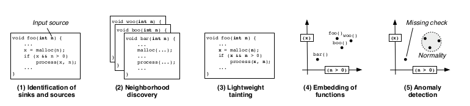
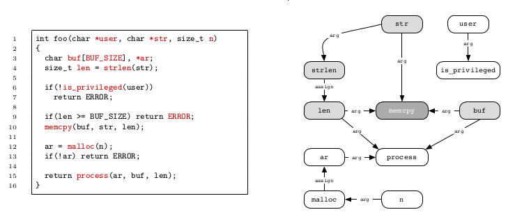
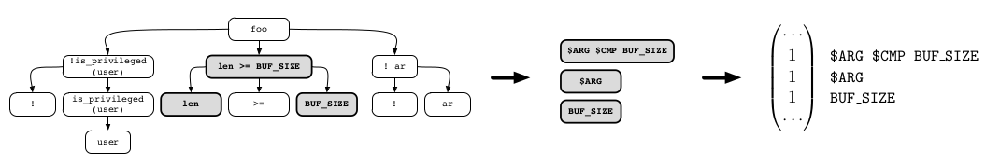
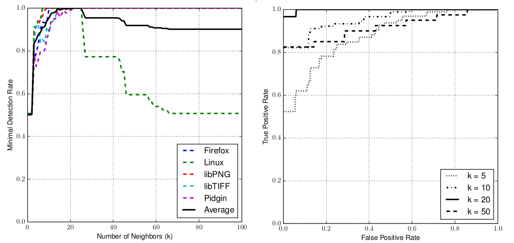

:slug: anomaly-serial-killer-doll/
:date: 2018-12-05
:subtitle: Hunting missing checks with anomaly detection
:category: machine-learning
:tags: machine learning, vulnerability, discovery
:image: cover.png
:alt: Chucky the actual serial killer doll
:description: In this article, we describe the system, Chucky, which applies basic machine learning and natural language processing techniques in order to find missing-check related security vulnerabilities. The system is able to find 12 zero-day vulnerabilities in open source software.
:keywords: Machine learning, Vulnerability, Anomaly detection, Nearest Neighbors, Missing Check, Security
:author: Rafael Ballestas
:writer: raballestasr
:name: Rafael Ballestas
:about1: Mathematician
:about2: with an itch for CS
:source-highlighter: pygments

= The anomaly serial killer doll

In our [inner]#link:../exploit-code-graph/[previous article]#
we focused on _taint-style_ vulnerabilites, i.e.,
those that are essentially due to the lack of input sanitization
which allows _tainted_, user-controlled data
to reach sensitive functions.
Some of these arise due to _missing checks_ in code, such as:

* failure to check authentication, authorization or
  other conditions related to the security logic of the application,
* insecure `API` usage, like not checking the buffer size,
  leaving files open, not freeing memory after allocating, etc.

In production-grade systems, however,
these checks are routinely performed since
experienced developers are used to them.
Still, taint-style vulnerabilities happen,
as was the case with a +Java 7 runtime+
vulnerability (link:https://cve.mitre.org/cgi-bin/cvename.cgi?name=CVE-2013-0422[CVE-2013-0422])
which allowed arbitrary classes to be uploaded,
leading to a massive distribution of malware.
But when taint-style vulnerabilities do occur, they are certainly _anomalies_.
Thus, searching for this kind of situation
(in mature software systems) is a problem
for which [inner]#link:../machine-learning-hack/#anomaly-detection-approaches[anomaly detection]#
[inner]#link:../crash-course-machine-learning/#anomaly-detection-via-k-nearest-neighbors[machine learning]# algorithms
lend themselves well.

Given a function,
`Chucky` finds all the sources and sinks referenced by it.
If you've been following our [inner]#link:../tags/machine-learning/[latest articles]#,
it should come as no surprise that the first step in the procedure
is to perform a _robust_ [inner]#link:../pars-orationis-secura/[parsing]#.

Notice the use of the word _robust_ above:
as opposed to the strict parsing done by linters and compilers,
which fails at the first mistake,
this type of parsing requires
neither a proper build environment
nor even complete or correct code.
//details?

Next, for each source or sink detected in the previous steps,
the following steps are performed:

. Neighborhood discovery: identify the element's context.
. Lightweight tainting: analyze the flow of data in the program.
. Embed the functions into a vector space.
  Needed to apply any machine learning algorithm.
. Perform anomaly detection via a simple score when
  comparing to the _k_ nearest neighbors.

.Overview of the anomaly detection process. Taken from <<r1 ,[1]>>

In order to determine functions similar to the current one,
the _bag of words_ approach from the field of
link:https://en.wikipedia.org/wiki/Natural_language_processing[natural language processing]
is used.
A coarse way to represent a document is by just counting word frequencies,
and forgetting about all structure, syntax, etc.
In this fashion,
this and other articles in this blog
would have high frequencies for words like "security" and "vulnerability",
but low ones for "coffee" and "recipe".
This is a (perhaps too) simple, yet effective, way
to distinguish security blogs from coffee-lovers blogs,
but maybe it wouldn't be able to distinguish
sites which sell coffee from those who grow it.

In order to avoid a situation where
very common words with little significance like "a", "in", etc,
rank too high, the _inverse document frequency_ is used.
Multiplying the relative term frequency by the inverse document frequency
gives a lower ranking to words like the above and
higher ranks to the rare ones, so as to strike a balance.

The result of applying this, to every function in the code to analyze,
is that every function is represented as a vector.
Thus, distances between them can be computed,
and its [inner]#link:../crash-course-machine-learning/#anomaly-detection-via-k-nearest-neighbors[_k_ nearest neighbors]#
chosen as that function’s neighborhood.
Intuitively, this should couple every function
with the _k_ most similar functions in terms of the +API+ symbols they use.
Thus, functions that use a lot of memory allocations would be put together,
a method that has many return points
would be paired with functions that also have many return points, etc.

Other than knowing which functions are similar to the one under scrutiny,
we also need to know which checks or conditionals
are really security-relevant, and which ones are just noise.
This, however, is not so easy since we need to take into account
the flow of data between variables,
which sounds more like a job for [inner]#link:../symbolic-execution-mortals[symbolic execution]#
and taint analysis, which is in fact what +Chucky+ uses.

.Tainted dependency graph (right) for the snippet to the left

This graph is then traversed both in the source-to-sink
and sink-to-source direction to determine tainted identifiers,
highlighted in gray above.

Next we need to represent the function as a vector.
Again, the authors use a bag-of-words-like approach,
where instead of the term frequency or inverse document frequency,
a simple _indicator_ function is used:
+1+ if a term is contained and +0+ if not.
Furthermore, the _"words"_ are taken from the abstract syntax tree
and later normalized since we don’t care about particular operations
(+<+, +>+ are all treated as comparisons),
particular numbers used or particular identifier names.
Thus, from the snippet above,
we would obtain a vector representation such as this one:

.AST, normalization and embedding of the above snippet

Now we can extract a model of "normality"
for every source or sink of interest in every function.
This is defined as the center of mass (essentially an average)
of all the vector representations
taken over the set of neighbors of the function
that contains the source or sink of interest.
This is still a vector, and each of its components
tells us the fraction of neighbors that contain a particular check.

Subtracting the vector representation of a function
from this model of normality also gives us some insight.
Negative entries in this difference vector
correspond to expressions checked in this function,
but not so much in its neighbors,
while positive entries show the opposite:
checks that are commonly performed by syntactically similar functions
but are _missing_ in this particular function,
i.e. the _missing checks_ that we sought from the beginning.
An anomaly score can be given to each function
as the maximum element in the vector,
given that functions which are mostly similar to their neighbors,
except for one missing check,
are more likely to contain security vulnerabilities
than functions which are just altogether different from their neighbors.

+Chucky+ was originally tested on five popular open-source projects,
versions of which contained published missing-check +CVEs+.
Also, the code was modified to introduce artificial vulnerabilites.
This, of course, depends on the number of neighbors
that should be taken into account.
The results of this experiment to determine its capability
to find known vulnerabilities are summarized below:

.Artificial test results for `Chucky`

Notice that with 25 neighbors the results are perfect, i.e.
no false positives and complete recall.
For other reasonable values of _k_ the results are also good.

But can it help in finding _previously unknown_ vulnerabilites,
as was set in the authors objectives?
Indeed, +Chucky+ was able to find 12 zero-day vulnerabilites
in +LibTIFF+ and +Pidgin+.
One of them is particularly easy to exploit.
In the function +msn_message_parse_payload+,
+Chucky+ reports a failure to check the value passed to +strchr+.
An attacker can thus trigger this vulnerability
by sending the message +Content-Type\n\n+,
thus making one of the sensitive sinks on the victim side +null+,
leading to an application crash.

''''
+Chucky+ has shown us how relatively simple,
but "intellectually transparent" machine learning models
can tell us a lot about where to look for vulnerabilities.
However, let us remember that this approach
is not free of false positives and also
that it doesn't pretend to replace human auditing,
only to accelerate it
by aiding us in not having to review code that is most likely safe.

== References

. [[r1]] F. Yamaguchi, C. Wressneger, H. Gascon, K. Rieck (2013).
link:https://user.informatik.uni-goettingen.de/~krieck/docs/2013-ccs.pdf[
_Chucky: exposing missing checks in source code for vulnerability discovery_].
20th ACM conference on computer and communications security.
