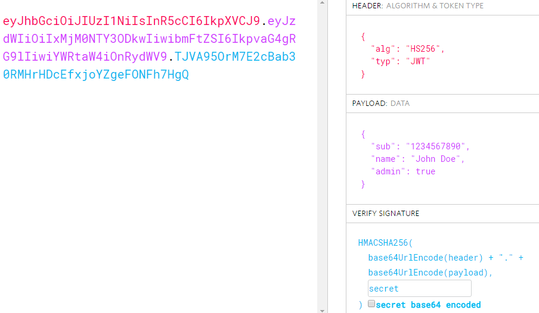
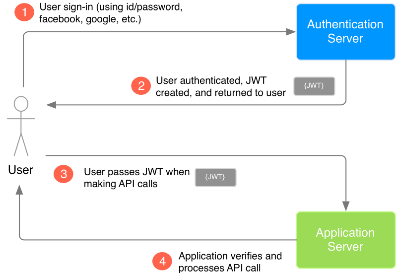

:slug: another-proud-son-json/
:date: 2017-05-04
:subtitle: Using JSON Web Token to send data
:category: identity
:tags: security, information, jwt
:image: cover.png
:alt: Text editor with code highlighting
:description: In this article we introduce JSON Web Token (JWT). JWT is a simple, quick way to send secured, digital signed data from one part to another via URL using a base64 algorithm to encode. This data can be signed using different encryption methods, such as public/private  RSA key, HMAC or SHA256.
:keywords: JSON, Security, Digital signature, Web token, JWT , Information.
:author: Juan Aguirre
:writer: juanes
:name: Juan Esteban Aguirre González
:about1: Computer Engineer
:about2: Netflix and hack.
:figure-caption: Figure
:source: https://unsplash.com/photos/OqtafYT5kTw

= Another proud son of JSON

Today everything is connected, and thus, everything is communicated.
Security has become a major issue in the complex world
of web applications and their communications.

.JSON Web Token JWT

== JSON Web Token

A JSON Web Token (JWT) is a URL safe way to represent a set of information
between two parties. The information shared between the parties can be
referred to as claims. It is a safe way to transfer information because it can
be signed using a secret or using a public or private key. The token is a
base64 encoded string which due to its short length is meant for space
constrained environments.

There are two basic scenarios in which the use of a JWT is recommended.

1. Once a user is authenticated in an application and wishes to make subsequent
requests, each one of those request should include a JWT to make sure that the
user has access to certain routes, services or resources.
2. To exchange information in a secure manner making use of the signature. The
signature is calculated based on the body and the payload of the JWT which
allows a party to know if the message has been tampered with (Auth0, 2015).

.JWT Structure example - link:https://jwt.io/[JWT]

The JWT is made up of three parts that are separated by a single dot. Remember
all the values are base64 encoded (header.payload.signature).

1. Header
  a. Algorithm
     This refers to the algorithm used to sign the token.
   Usually HMAC SHA256 or RSA.
  b. Type
     Refers to the type of token. In this case "JWT".
2. Payload:
  a. Claims (Names are only 3 characters long)
     Statements about the user/entity and any additional metadata.
   Types of claims:
     i)   Reserved: Predefined but not mandatory.
   ii)  Public  : Defined by the user. Should be defined in a collision
                  resistant namespace.
   iii) Private : Custom created to share information between parties.
3. Signature:
  This is made by taking the encoded header, payload and secret/key and using
  the algorithm specified in the header to sign it.

=== How it works

.JWT Flow

As we can see in the image above, we have three entities. The user, the
authentication server and the application server. Here we have four steps.

1. Initial Authentication
   The user first signs in  to the authentication server. If we are talking
   about a company this could be the active directory.
2. JWT Generation
   The JWT is created by the authentication server and sent to the user to be
   used in further request.
3. User Request
   The user then makes an API call. In a company this could be a query made in
   the company's billing system. The JWT is added to the original request and
   sent to the application server.
4. JWT Verification
   The application server, billing system in our example, makes sure the call
   is coming from an authenticated user by checking the JWT and then returns a
   response to the user.

=== JWT Security

Remember the data in the JWT is encoded and signed but not encrypted. The data
is encoded to transform the data structure and allow transportation following a
standard definition. The data is signed to verify authenticity which lets me
know if a message has been tampered with but it does not prevent it.

Here is a great article on how to link:https://stormpath.com/blog/jwt-the-right-way[
Use JWT The Right Way!]

Other alternatives like SAML (Security Assertion Mark-up Language) imply larger
XML documents. JWTs are great when we have space constrained environments and
are looking to guarantee the authenticity of the data being transported.

== References

. [[r1]] link:https://jwt.io/introduction/[Auth0. (2015, January 1).
Introduction to JSON Web Tokens. Retrieved May 3, 2017]

. [[r2]] link:https://tools.ietf.org/html/rfc7519[Internet Engineering Task Force IETF.
(2015, May 1). RFC 7519. Retrieved May 3, 2017]

. [[r3]] link:https://medium.com/vandium-software/5-easy-steps-to-understanding-json-web-tokens-jwt-1164c0adfcec[Stecky, M. (2016, May 16). 5 Easy Steps
.to Understanding JSON Web Tokens. Retrieved May 3, 2017]
