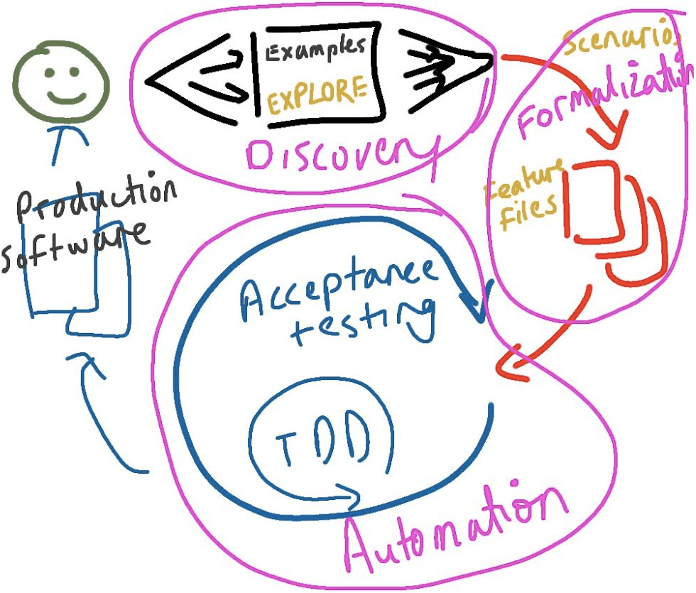
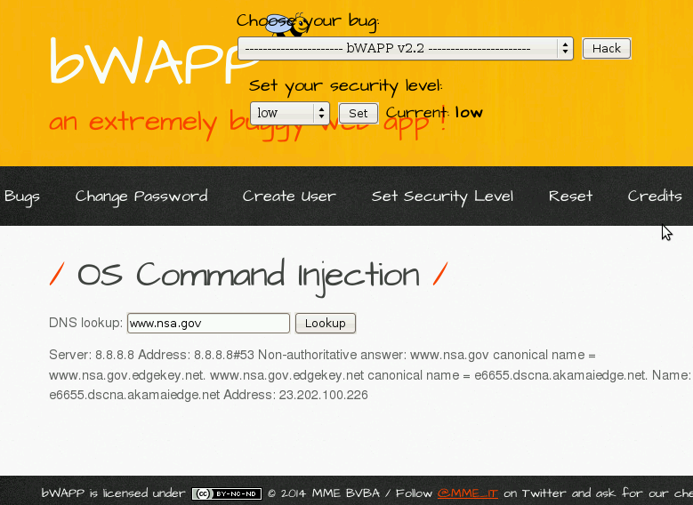

:slug: app-pickle/
:date: 2018-02-08
:subtitle: Documenting vulnerabilities with gherkin
:category: documentation
:tags: documentation, vector, software
:image: cover.png
:alt: Cucumber slices
:description: How to use Gherkin to document attack vectors in vulnerable applications. Gherkin is a language that can be used for documentation and automated testing, but here we focus on how we can use it to show how a given website can be attacked and give a tutorial on the basics of Gherkin.
:keywords: Gherkin, Attack vector, Documentation, Report, Injection, Vulnerability.
:author: Rafael Ballestas
:writer: raballestasr
:name: Rafael Ballestas
:about1: Mathematician
:about2: with an itch for CS
:source-highlighter: pygments
:source: https://unsplash.com/photos/uMNjdMtx1qU

= Is your app in a pickle?

+link:https://github.com/cucumber/cucumber/wiki/Gherkin[Gherkin]+
is a simple language that
can be used for software documentation and testing.
It can be thought of as a tool for
communication between stakeholders and developers which
helps minimize misunderstandings and regressions
through precision in the definition of use-case scenarios.

.Behaviour-driven development by link:http://thepaulrayner.com/about/[Paul Rayner] via link:https://cucumber.io/[cucumber]

But +Gherkin+ can be used for more than just
software specification and documentation.
In fact, it could be used to
specify any kind of procedure,
from scientific experiments to
how to sew a button.

Here we will focus on
how we can use the Gherkin language to
document attack vectors, or
the way a vulnerability in a system
can be found and exploited.

== Gherkin basics

Most of +Gherkin+ is natural language
describing a procedure.
Gherkin supports more than 60 of those.
What gives structure to it are,
at the core level,
the keywords +When+ and +Then+, which
are used to specify an event and
its expected outcome. For example:

.A single +Gherkin+ 'step'
[source,gherkin]
----
When I plug my phone into the AC outlet
Then it starts charging
----

Such combinations are
the building blocks of a +Gherkin+ file.
The complete file is called a 'feature',
since they are normally used to
describe a single capability
of a piece of software.
But a given feature can have many use cases:
Gherkin calls them 'scenarios'.
In turn, a scenario is made up of
a (preferably small) number of steps.

[source,gherkin]
----
include::/web/content/blog/app-pickle/coffee-example.feature[]
----

As seen above,
the keyword +And+
can be used to replace +When+ or +Then+
so as not to have too many of the latter.

Other keywords works as you expect:
they mean
what their natural language counterparts do.
For example,
+Given+ is for pre-conditions and
+Background+ is used
to apply +Given+
to several scenarios.

Also, as seen above,
you can write in plain language
after a section beginning.
This is useful to explain
what is not expressed by steps and scenarios.
We can also use comments (with +#+),
but only sparingly,
since we're trying to be
as explicit as possible
about how the feature should work.

== Documenting attack vectors

Now that we have the basics of +Gherkin+ under our belts,
let's see how we can use it
to explain how we can attack and
exploit a vulnerability in a system.

Consider the following website from
+link:http://itsecgames.com/[bWAPP]+,
a very buggy web app.

.+bWAPP+ DNS lookup site

It has a very simple function:
give it a valid +URL+ and
it prints details about the domain name,
such as its +IP+ address.
We can write this up in +Gherkin+ as follows:

[source,gherkin]
----
Scenario: Normal use case
  Given I am at the page bWAPP/commandi.php
  When I type a valid URL
  Then the IP address of that URL is printed
  When I type any text that is not a URL
  Then there is no output
----

Very simple, yet concrete.
It specifies the expected
behavior of the site
in detail and,
more importantly,
without ambiguities.
Also, this helps avoid support calls,
since the feature file works
as a kind of manual and
troubleshooting guide.

However, we're here to break that app,
so let's document that as well.

Let's see...
how can the app get all those details?
Actually, the output looks
like that of an +UNIX+ command.
If user input is not properly validated,
we could take advantage of that to
execute some other commands in the server.
If, as we expect,
the server executes a *+command+*
with +user_input+ as argument,
it's as if we did this at a terminal:

[source,bash]
----
$ command user_input
----

In +UNIX+-like operating systems,
we can use "+;+" to execute one command after another.
For example, we can say

[source,bash]
----
$ echo "first line"; echo "second line"
first line
second line
----

and so we have executed two commands in one go.

Thus, if we append
+; another_command arguments+
in the input,
the command executed by the app
would become this:

[source,bash]
----
$ command user_input; another_command arguments
----

Let's see if that works with
the simple command +ls -aR /+, which
**l**i**s**ts **a**ll files **R**ecursively in **/**,
i.e. all files in the server:

.+UNIX+ command injection in the same site

It does!
If we can ``inject'' that command,
a malicious user could definitely
inject more harmful commands.

We can document this entire procedure
(minus the explanations,
which are for the reader's benefit)
like this:

[source,gherkin]
----
Scenario: Dynamic detection and exploitation
  When I type ";ls -aR /" in the field
  Then all files in / are listed recursively
----

We have given this scenario the epithet ``dynamic'' since
we found and exploited this vulnerability
by 'dynamically' interacting with the app.
This is in contrast with 'static' detection,
where we find and exploit the bug
by looking into the app's code,
which is what we'll do next.

The website is written in +PHP+,
but as long as you can understand any code,
you're good to go.
Let's look at the file +commandi.php+.
The lines that execute the command go like this:

[source,php]
----
$input = $_POST["target"]
echo shell_exec("nslookup " . $input);
----

So we were right!
+PHP+ asks the server's shell to
run the command +nslookup+.
The user +$input+ is not validated or
changed at all.
That's why we could exploit
the vulnerability the way we did.

A simple input validation or sanitization
can prevent this
from happening to your app.
If +bWAPP+ had added just three lines
to clean the control operators +;+, +&+ and +|+:

[source,php]
----
$input = str_replace("&", "", $data);
$input = str_replace(";", "", $input);
$input = str_replace("|", "", $input);
----

this vulnerability would have been
a lot harder to exploit, or
just wouldn't exist.

Combining all the steps above,
we get the full documentation
for this vulnerability
in +Gherkin+:

[source,gherkin]
----
include::/web/content/blog/app-pickle/command-injection.feature[]
----

We wrap long lines
(especially code)
in +Python+-like docstrings (+"""+).
This feature includes the keywords
+Scenario Outline+ which is like
having variables in scenarios
in order to avoid repetition.
We use it to show
the output produced by
different commands or trials.

If you're interested,
see link:https://cucumber.io/docs/reference[Cucumber docs]
for a more thorough,
but still nice and short,
introduction to +Gherkin+.

'''
As we've seen,
while +Gherkin+
was not exactly designed
with hacking documentation in mind,
we can still make it into a useful tool
for this purpose.
It enables us to write
unambiguous, reproducible and
-- given the right configuration and environment --
executable documentation that
also simplifies testing.
