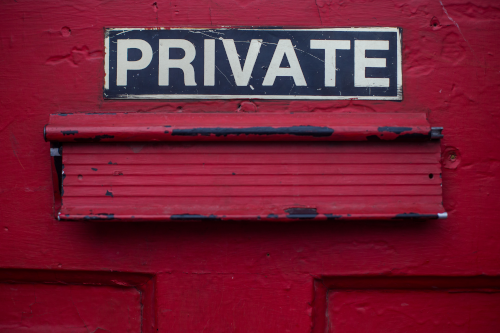

:slug: attacking-weakest-link/
:date: 2019-06-04
:category: social-engineering
:subtitle: Attacking without borders.
:tags: social, password, information, social engineering
:image: cover.png
:alt: People manipulation
:description: Humans are and always will be the weakest link in security. Learn how to deal with these kinds of holes and how to patch them. Secure your information by adding an extra layer of security to your own people, giving them everything they need to securely achieve their work goal.
:keywords: Information, Security, Protection, Hacking, Bussiness, Social Engineering
:author: Mateo Gutiérrez Gómez
:writer: mgutierrez
:about1: Systems engineering undergrad student.
:about2: Psychology and cyber security enthusiast.

= Attacking the weakest link

Companies invest millions of dollars on +IT+ infrastructure and cybersecurity
to keep their information protected.
But when it comes to training their employees the investment is barely enough.
Employees that daily manipulate, organize, create or update a company’s main
data are the main link between +IT+ infrastructure and
the data that resides in it.
Under the reality that absolute security is impossible,
let me ask you:
what would you think if I told you there’s a way to get information
that does not need any Internet connection, server or computer?
There are many types of social engineering attacks
but we will mainly focus on the one that does not need any machine
nor Internet connection to be successful.

[quote]
If my systems are secure my data is also secure. +

This phrase is usually affirmative,
but we have to remember that humans are also an important part
of a company’s security.
If we don’t consider the human factor
the state of security discussed becomes partial
and a hacker with malicious intentions could use this weak link
to compromise a system or steal sensitive information.

Usually, an intrusion begins by scanning the exposed perimeter
that you want to strike.
This will display all the exposed, badly protected or open ports
and services to vulnerate.
They become the entry point of everyone intending to breach a system.
But what happens when no service is exposed or highly secured?
An attacker must make a decision, force a way in and put himself at risk,
or search for a weaker link. This is where social engineering comes into play.

Within the hacker jargon, there’s an attack called the "secretary attack".
This assault not only affects secretaries, it's just the given name.
The assault is executed by leaving a +USB+ near or at the victim's workplace.
The attacker only needs to wait for the victim to plug the device
in their computer, giving an entry point and allowing to breach the network.
Another way to work over this vulnerability is to ask someone
to print out a document from an infected +USB+.
It’s common for the attacker to cut ties with the victim
once the attack took place, making this type of assault difficult to trace.

The attack mentioned above is widely used
no matter if the target is a big or small company.
It will be executed when there is no possibility
to have direct access to the network devices of a company
using a common vulnerability.
If this intrusion is successful it will not leave any trace
and will allow the aggressor to obtain any wanted information
that eventually will be used to penetrate a company's system,
and potentially, risk critical infrastructure.
The consequences are not only economical but there is an impact on productivity
and credibility within the stakeholders of the organization.

.Private Information

A cybercriminal can also use this kind of attack to steal information
from individuals.
The purpose can be to expand a contact's network
and get more information which will allow the thief to become someone else.
This situation is known as identity theft,
which points us to a new vulnerability called phishing.
It allows the attacker to move from one of the victim’s social circle
to another and collect more information for later use.

In phishing, an attacker can supplant a company or person using emails,
Facebook or other social media.
Around 2017, there was an outbreak of phishing attacks coming from Apple.
The scammer asked people to login into a fake Apple support page,
which asked sensitive data like full name, credit card information,
email, and address. The information provided by the victims
was used to shop online.
Another common example is the “Nigerian Prince”,
who will give the victim a considerable amount of money
in exchange of a small amount.
Usually, USD20-50 will be asked and in return,
the fake prince will transfer the victim millions of dollars.

.Trusting People

How can a company prevent social engineering attacks?
Giving only the exact information a worker needs to fulfill its duties.
This must be complemented with good employee training
and clear regulations on information disclosure, manipulation or secrecy.
By the end of the training, an employee must be able to know
what information can be public, and therefore can be shared,
or what information is private and should have restained access.
This must apply all the time,
no matter if they're outside the company buildings.

The same rule applies to individuals.
They should know what information can be public
and which should always be private.
It is always good to check the sender's information in every email received
to prevent phishing mail targeted to you.
Avoid answering unknown emails where they ask you for sensitive
or private information such as date of birth, passwords, addresses, phone,
credit card or account number, and some other related data.
If we "install" a "mental antivirus" of distrusting people or organizations
who ask details that should not be widely known we could prevent
information leaks, money losses, time waste and headaches
that are usually obtained with these kinds of attacks.
