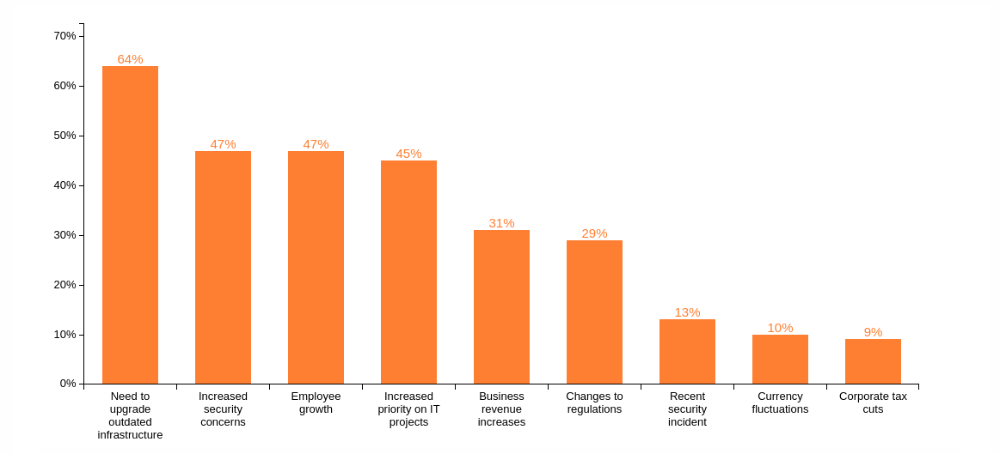
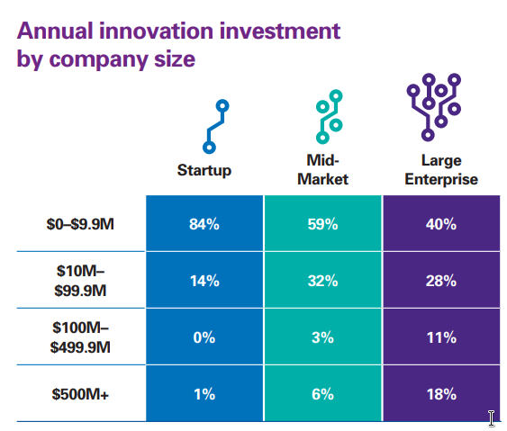
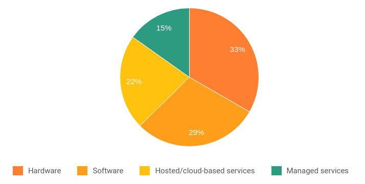
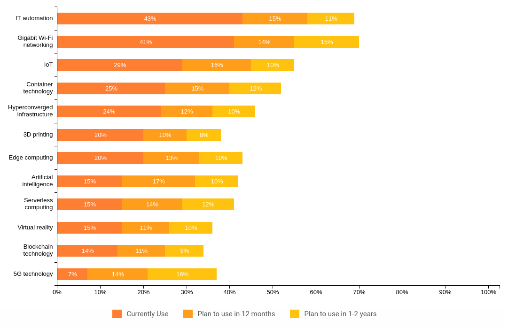
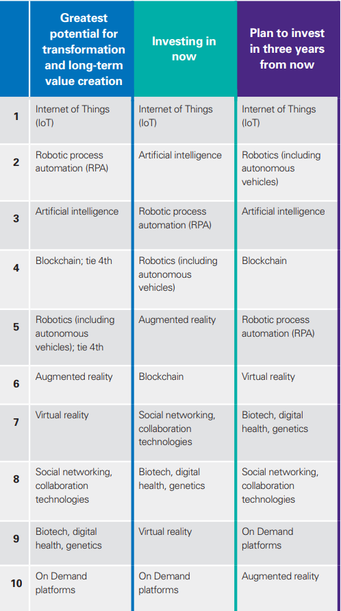

:slug: battle-tendency/
:date: 2019-10-25
:subtitle: Most relevant IT investments on 2019
:category: documentation
:tags: technology, investment, trends
:image: cover.png
:alt: Mobile showing statistics. Photo by Austin Distel on Unsplash: https://unsplash.com/photos/EMPZ7yRZoGw
:description: On this article we make a small research about the investment and budget related to information technologies in 2019 and upcoming years. By analyzing the data we discuss about the most relevant investments for IT on 2019 as well as the most demanding areas on IT to invest for companies.
:keywords: Technology, Innovation, Trends, IT, Investment, Budget
:author: Oscar Prado
:writer: oprado
:name: Oscar Prado
:about1: Industrial Automation Engineer
:about2: Fluid Attacks Developer, Hacker Wannabe

= Battle Tendency

In our [inner]#link:../security-trends[last article]#
we talked about the cybersecurity risks
that the most popular technology trends may carry out.
You can see this entry as the _second part_ of that article.
However, this time our topic will be slightly different,
we will focus on the main +IT+ investments
for 2019 and the expected changes and trends for upcoming years.

== Budget Growth

+IT+ is gaining more relevance in recent years,
and this can be reflected in the increasing +IT+ budget.
According to +Spiceworks+, on its _State of IT report_ <<r1, ^[1]^>>,
in 2020 *44%* of the companies plan to increase and keep increasing
their technology budget in upcoming years.
The reasons to increase the +IT+ budget are diverse,
the most concerning factor to the companies
is to replace outdated technologies
and seek to maintain competitive in the market.
The whole list of factors are shown below:

.Top factors leading to IT budget increases in 2020. Source: <<r1, [1]>>.

The company size is also an aspect to take into account
regarding technologies and money.
The larger the company, the higher the budget destined to +IT+,
as we see in the following comparative table <<r2, ^[2]^>>:

.IT Budget Comparison of different companies size. Source: <<r2, [2]>>.

However, a large investment in +IT+
does not necessarily translate
into high performance or competence.
A *_smart_* investment is way more profitable.
Focusing on real solutions
instead of proprietary tools
that do not solve the root of the issues,
mask the real troubles,
or promise solutions to nonexistent problems.

As it was previously mentioned,
the most common reason to invest in new technologies for companies
is to keep pace with the current state of the art,
but security also plays an important role in this field,
since is the second most relevant factor
to invest on +IT+:

.Source:<<r1, [1]>>
[quote]
"One in four enterprises (1,000+ employees)
are increasing 2020 IT spend due to a recent security incident."

Companies seem to learn _the hard way_,
it requires a security breach to happen
in order to increase or even define appropriate
security policies regarding +IT+.
Again, a higher investment does not guarantee
the protection of the company assets.
All the investments must be complemented with good security practices
and procedures for the worst scenarios,
guaranteeing the safest and best use of every asset.
We are aware of this logic,
for this reason, we've created [inner]#link:../../rules/[Rules]#,
a summary of security practices and recommendations
based on several international security standards
mainly in software,
but also taking into account hardware and physical security measures.
Give it a check, it's free,
and I'm sure you'll find an inspiration
to enhance the security policies of your company.

== So, Where is all this budget going?

Now that we've clarified that companies
are interested on improving their technologies,
and there's budget to support these changes,
we should identify where is this budget going?
This may be a tricky question.
Of course, it depends on the long term vision,
as well as the company size
but we can search for some patterns,
if we take a look at the budget allocation tendency for +IT+ in 2020:

.IT budget allocation in 2020. Source <<r1, [1]>>.

Hardware, software and cloud based services
are the main interests for companies to invest in 2020.
+Spiceworks+ <<r1, ^[1]^>> has made a terrific research,
by gathering all these information
of +1,005+ European and North American companies,
so let's take a look at the results
to make our own conclusions.

The idea here is not to dive deeper on every aspect
of the +IT+ budget allocation,
what interest us the most
is the +IT+ technologies where the companies are venturing.
These technologies are most likely to become
the industry tendencies in the next years.
+Spiceworks+ can help us again to get a better insight
about the hot topics in the technology field:

.Adoption of technology trends according to Spiceworks. Source: <<r1, [1]>>.

We can also take a glance at the +KPMG+ report <<r2, ^[2]^>>
which offer us a similar panorama for +IT+ investments
on +740+ technology companies from 12 countries:

.Investment Rankings in 2019 according to KPMG. Source: <<r2, [2]>>.

We may start glimpsing some patterns now:
Internet of Things (+IoT+),
+IT+ automation,
Artificial Intelligence,
Virtual reality and
Blockchain technologies
are the most adopted technologies for several companies.
We can mention some trends that we have discussed before,
such as serverless computing,
container technologies and hyperconverged infrastructure,
which are technologies that we often use at +Fluid Attacks+.
We're dabbing into [inner]#link:../categories/machine-learning/[artificial intelligence]#
in a cybersecurity approach
for vulnerabilities [inner]#link:../triage-hacker/[classification]#,
and we already [inner]#link:../../products/asserts/[automate]#
the vulnerabilities closures
on our customers pipelines (+CI/CD+)
with our [inner]#link:../../services/continuous-hacking/[continuous hacking service]#.
We are aware of the potential of some of these techniques,
not only for cybersecurity and overall hardening
but also for development and operations.
We seek to apply some of these technologies
in our products in a close future.

''''

== Conclusion

Technology is constantly evolving,
whether we are ready or not.
A company must not battle against the tendencies,
but embrace them and adapt to them
since often those changes
are intended to ease our work.
Technology companies with outdated
hardware, software, infrastructure or policies
are destined to fail in the long term.
Increasing the awareness of the +IT+ current state of the art
as well as the emerging technologies is a must
to avoid entering in deprecation.

== References

. [[r1]] link:https://www.spiceworks.com/marketing/state-of-it/report/[The 2020 State of IT - Spiceworks].
. [[r2]] link:https://assets.kpmg/content/dam/kpmg/us/pdf/2019/06/investment-in-technology-innovation-2019.pdf[Investment on technology innovation - KPMG]
