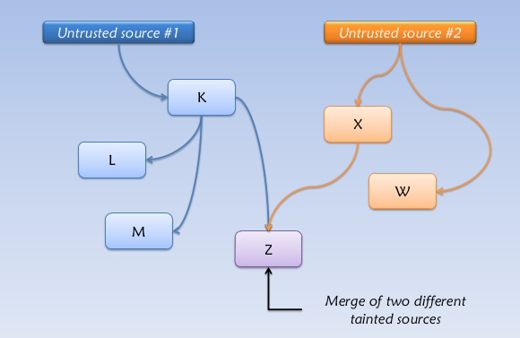
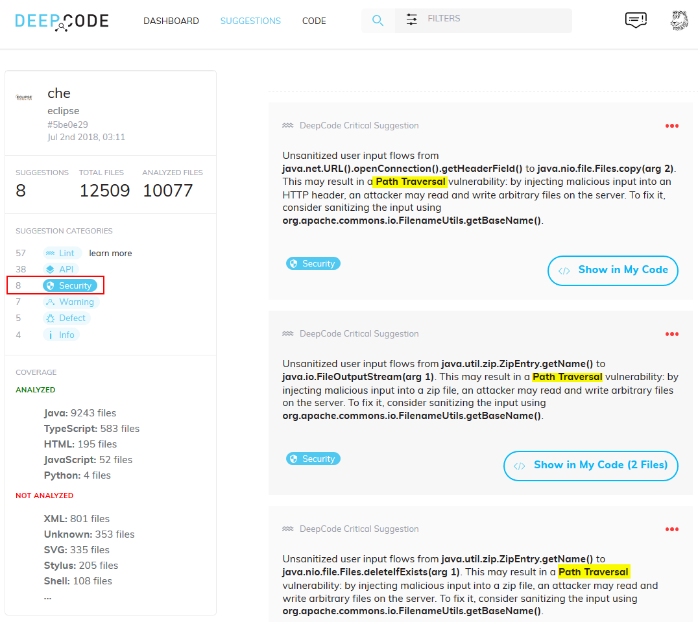
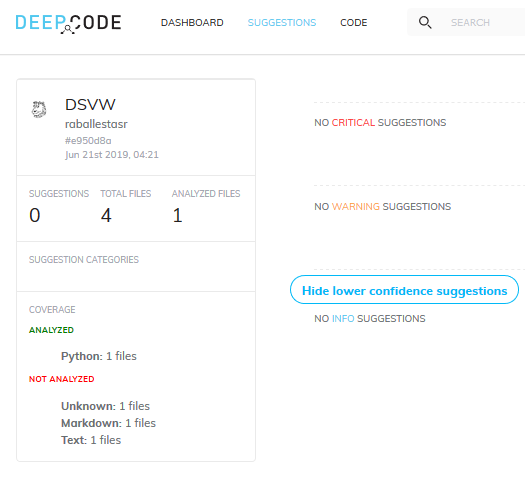

:slug: big-code/
:date: 2019-08-02
:subtitle: Learning from open source
:category: attacks
:tags: machine learning, vulnerability, code
:image: cover.png
:alt: Git. Photo by Yancy Min on Unsplash: https://unsplash.com/photos/842ofHC6MaI/
:description: Deepcode is a new player in the machine learning for vulnerability discovery field, with a lot of potential to find bugs in your code by learning from the abundant sources of high quality code available in Github. Let us see how it works and if it delivers.
:keywords: Machine learning, Vulnerability, Open Source, Deep learning, Lint, Bug
:author: Rafael Ballestas
:writer: raballestasr
:name: Rafael Ballestas
:about1: Mathematician
:about2: with an itch for CS
:source-highlighter: pygments

= Big Code

In our
link:../tags/machine-learning[Machine Learning (+ML+) for secure code series]
the _mantra_ has always been the same:
to figure out how to leverage the power of +ML+
to detect security vulnerabilities in source code,
regardless of the link:../crash-course-machine-learning[technique],
be it link:../deep-hacking[deep learning],
link:../exploit-code-graph[graph mining],
link:../natural-code[natural language processing], or
link:../anomaly-serial-killer-doll[anomaly detection].

In this article we present a new player in the field:
link:https://www.deepcode.ai/[DeepCode],
a system that has exactly this purpose,
combining +ML+ with data flow analysis,
namely in the form of taint analysis.

Taint analysis can come in dynamic and static flavors,
and be performed at the source and binary levels,
but either way the goal is the same.
Start by looking at where input comes from and
is controlled by the user,
e.g. a web app field to perform a search.
These are named _sources_ in this context.
Then, continue to follow the thread to
where it gets used by the system
in a security-critical fashion,
e.g. using that info to query a database,
to continue with the previous example.
These points are called _sinks_.

.Taint analysis diagram via link:http://web.cs.iastate.edu/~weile/cs513x/5.TaintAnalysis1.pdf[Coseinc].

Along the way,
data should face a serious dose
of input sanitization or validation,
in the case of a secure application.
These are called _sanitizers_ in the taint analysis context.
However, it is frequent to see that it does not,
and thus vulnerabilities arise.

Traditional taint analysis tools,
however, usually present high false positive rates,
as is the case with
link:https://github.com/openstack/bandit[Bandit] and
link:https://github.com/python-security/pyt[Pyt]
(see some criticism
link:https://smarketshq.com/avoiding-injection-with-taint-analysis-1e55429e207b[here]).

+DeepCode+ aims to iron out the wrinkles
in these taint analysis tools by learning from
the vast amounts of freely available,
high-quality code that lives in open repositories
such as link:https://github.com/[Github],
a situation dubbed "Big Code".
The tool is easy to use and free for open-source projects,
which has the added advantage of also learning
from the user's code,
the suggestions made by the tool,
and the user's feedback as well
(accepting or not the suggestion,
_how_ they fix them, etc).

Another problem with taint analysis is that
sources, sinks and sanitizers need to be specified by hand,
which is obviously impractical for large scale projects.
This is another area where +ML+ helps +DeepCode+,
but, of course, the secret sauce is not available
for further peeking.

+DeepCode+ has been called
link:https://app.grammarly.com/[Grammarly] for code,
claims to achieve 90% precision,
understand the _intent_ behind the code,
find twice as many issues as other tools,
and critical issues at that,
like +XSS+, +SQL+ injection and path traversal,
which typical static analysis tools do not.
Also, it claims to be easy to use,
requiring no configuration at all.

The tool is certainly friendly.
You need only point it to your repository
and give the appropriate permissions,
and then it will show you a dashboard
with all the issues found.
Here is one for link:https://github.com/eclipse/che[Eclipse Che Cloud IDE]:

.Security issues dashboard for Eclipse Che, adapted from link:https://www.deepcode.ai/app/gh/eclipse/che/5be0e29f11fdef73ed4a3da5fe61e3cc0eb3e875/_/dashboard/[DeepCode demo].

Here we can see three instances of a possible
path traversal vulnerability.
In the full dashboard,
we can also see how they also report
an insecure +HTTPS+ channel,
a Server Side Request Forgery (+SSRF+),
a Cross Site Scripting (+XSS+) vulnerability,
an a header that leaks technical information
(+X-Powered-By+).
And that's only the issues tagged as "security".
There are also +API+ misuse issues,
v.g. using `Thread.run()` instead of `Thread.start()`,
general bugs or defects,
and now they even throw lint tools results,
which deal with formatting and presentation issues.
Oh, yes, and every issue comes with a possible fix
you might implement right away.

Quite nice, from the point of view of
contributing a new vulnerability report to a project,
with no false positives.
However when the aim is to find _all_ vulnerabilities,
one cannot help but raise the question: is that all?
Are these _all_ the security vulnerabilities
in a project with more than
link:https://api.codetabs.com/v1/loc?github=eclipse/che[300,000]
lines of code?

Let us try something different.
Let us take one of the many
Vulnerable by Design (+VbD+) applications
we use for training purposes in our
link:https://gitlab.com/fluidattacks/writeups[Writeups],
and see how many vulnerabilities come up
by running +DeepCode+ on them.
By the way, they currently support
+Javascript+, +TypeScript+ and +Java+,
besides the original +Python+.
That leaves us with two apps to try:
the link:https://github.com/appsecco/dvna[Damn Vulnerable +NodeJS+ Application]
(+DVNA+) and
link:https://github.com/stamparm/DSVW[Damn Small Vulnerable Web]
(+DSVW+),
since most +VbD+ apps are built with +PHP+.

I forked both of these on +Github+,
signed up for a +DeepCode+ account,
and let it run.
For +DSVW+, which is a single +Python+ file
under 100 lines of code,
but still ridden with vulnerabilities,
+DeepCode+ reports zero issues.
Perhaps it does not work as well in such tiny projects.

.Zero issues in DSVW.

This is, to say the least, disappointing,
since that +DSVW+ has no less than 26 different
_kinds_ of vulnerabilities, as per its +README+.
In link:https://gitlab.com/fluidattacks/writeups/tree/master/vbd/dsvw/[Writeups]
three of those have been manually explored and exploited.

Maybe it's a problem with having so few lines of code,
maybe it's a +Python+ thing,
so let's try the other one:
+DVNA+, built with +NodeJS+ with the
specific purpose of demonstrating the
link:https://www.owasp.org/index.php/Top_10-2017_Top_10[+OWASP+ Top 10 vulnerabilities].

This time around,
+DeepCode+ found 9 issues.
Out of those, take 3 which come from +ESLint+,
and let us consider the other 6.
2 +API+ misuses, which are basically "use arrows instead of functions".
4 are security vulnerabilities,
and pretty serious ones at that:

* Code Injection via +eval+ function in calculator module.
  Not the same one as in the authors' security guide.
  Also not yet reported in
  link:https://gitlab.com/fluidattacks/writeups/tree/master/vbd/dvna/[Writeups]
  This should be researched further.

* +SQL+ injection. As detailed in the
  link:https://appsecco.com/books/dvna-developers-security-guide/solution/a1-injection.html[security guide]
  and link:https://gitlab.com/fluidattacks/writeups/blob/master/vbd/dvna/0564-sql-injection/jicardona.feature[Writeups].

* Open Redirect. Also in the
  link:https://appsecco.com/books/dvna-developers-security-guide/solution/ax-unvalidated-redirects-and-forwards.html[security guide]
  and
  link:https://gitlab.com/fluidattacks/writeups/blob/master/vbd/dvna/0601-unvalidated-redirects/simongomez95.feature[Writeups].

* A minor technical information leak via
  the +X-Powered-By+ header, as in +Che+.

So, altogether, 3 noteworthy security vulnerabilities,
in a +NodeJS+ application with more than 7,500 lines of code.
In link:https://gitlab.com/fluidattacks/writeups[Writeups],
at least 29 different vulnerabilities have been reported in +DVNA+.
You can see a
link:https://gitlab.com/fluidattacks/writeups/blob/master/vbd/dvna/results-toe.md[report]
on manual testing vs the +LGTM+
link:../oracle-code[code-as-data] tool in there, too,
where it is quite clear that tool misses most of the vulnerabilities as well.

''''

Once again, this confirms the other _mantra_
we have held in this
link:../tags/machine-learning[Machine Learning (+ML+) series],
but also
link:../replaced-machines/[elsewhere]
link:../../services/differentiators/#method[in the]
link:../importance-pentesting/[site].
Automated tools,
even +ML+-powered ones,
while they might have the potential to do
what a human could not in a thousand years
in terms of repetitions and scalability,
do not have, as of yet, the malice and creativity
which we do to find critical and interesting
security vulnerabilities.

== References

. [[r1]] V. Raychev. 2018.
link:https://medium.com/deepcode-ai/deepcode-releases-the-first-practical-anomaly-bug-detector-32bebc8cdf57[DeepCode releases the first practical anomaly bug detector].

. [[r2]] V. Chibotaru. 2019.
Meet the tool that automatically infers security vulnerabilities in Python code.
link:https://tinyurl.com/y6tpoxzj[Hackernoon]
