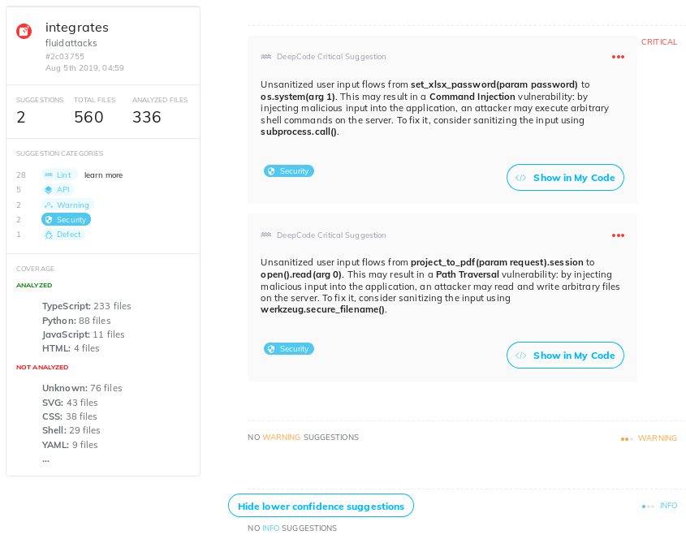
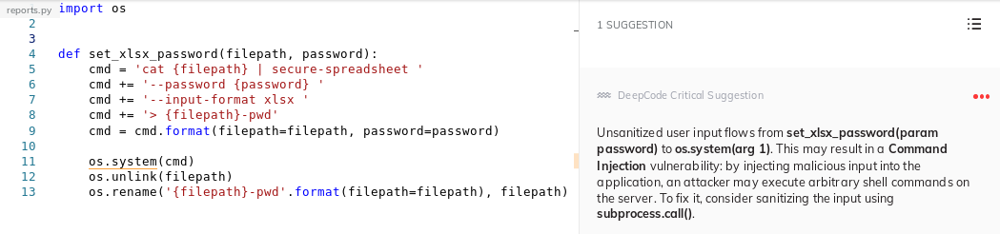
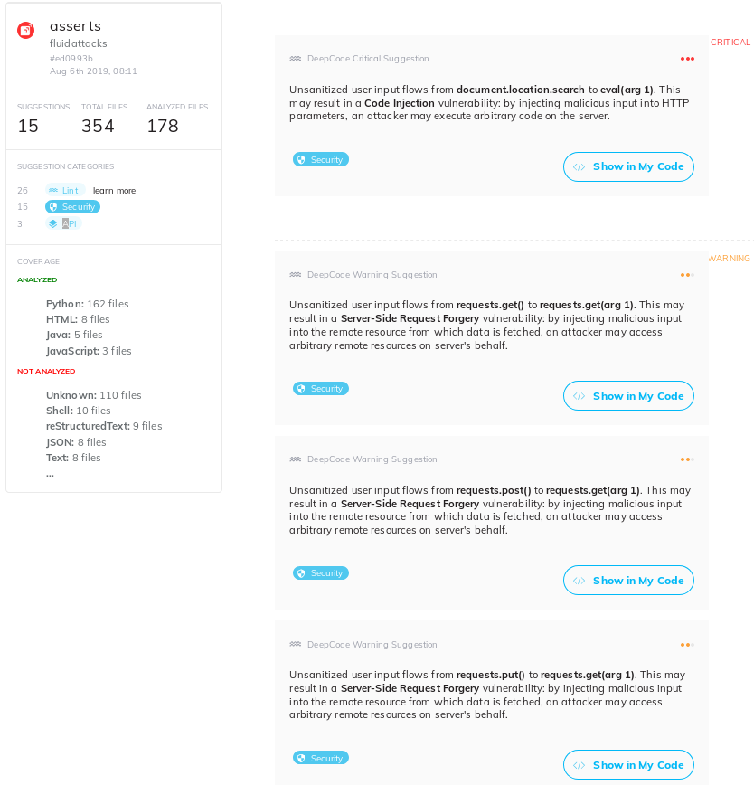

:slug: big-code/
:date: 2019-08-02
:subtitle: Learning from open source
:category: machine-learning
:tags: machine learning, vulnerability, code
:image: cover.png
:alt: Git. Photo by Yancy Min on Unsplash: https://unsplash.com/photos/842ofHC6MaI/
:description: In the field of vulnerability discovery, Deepcode is a new player in machine learning. It has a lot of potential for success in identifying bugs in your code by learning from the abundant sources of high-quality code available in Github. In this blog, we'll see how it works and if it delivers.
:keywords: Machine learning, Vulnerability, Open Source, Deep learning, Lint, Bug
:author: Rafael Ballestas
:writer: raballestasr
:name: Rafael Ballestas
:about1: Mathematician
:about2: with an itch for CS
:source-highlighter: pygments
:source: https://unsplash.com/photos/842ofHC6MaI/

= Big Code

In our
[inner]#link:../tags/machine-learning[Machine Learning (`ML`) for secure code series]#
the _mantra_ has always been the same:
to figure out how to leverage the power of `ML`
to detect security vulnerabilities in source code,
regardless of the [inner]#link:../crash-course-machine-learning[technique]#,
be it [inner]#link:../deep-hacking[deep learning]#,
[inner]#link:../exploit-code-graph[graph mining]#,
[inner]#link:../natural-code[natural language processing]#, or
[inner]#link:../anomaly-serial-killer-doll[anomaly detection]#.

In this article we present a new player in the field,
link:https://www.deepcode.ai/[DeepCode],
a system that has exactly this purpose,
combining `ML` with data flow analysis,
namely in the form of taint analysis.

Taint analysis can come in dynamic and static forms
and can be performed at the source and binary levels,
but either way, the goal is the same.
Start by looking at where input comes from and
is controlled by the user,
for example, a web app search field.
These are named _sources_ in this context.
Then, continue to follow the thread to
where it gets used by the system
in a security-critical fashion,
as in using that info to query a database,
to continue with the previous example.
These points are called _sinks_.

.Taint analysis diagram via link:http://web.cs.iastate.edu/~weile/cs513x/5.TaintAnalysis1.pdf[Coseinc].

Along the way in the case of a secure application,
data should encounter significant input sanitization or validation.
These are called _sanitizers_ in the taint analysis context.
However, frequently this does not happen,
and thus vulnerabilities arise.

Traditional taint analysis tools,
however, usually present high false positive rates,
as is the case with
link:https://github.com/openstack/bandit[Bandit] and
link:https://github.com/python-security/pyt[Pyt]
(see some critique
link:https://smarketshq.com/avoiding-injection-with-taint-analysis-1e55429e207b[here]).

`DeepCode's` purpose is to
remove minor difficulties these taint analysis tools may have.
`DeepCode` does this by learning from the vast quantity
of freely-available, high-quality code in open repositories
such as link:https://github.com/[Github],
a circumstance then dubbed "Big Code".
The tool is easy and free to use.
This provides the added advantage
of also learning from the user’s code,
the suggestions made by the tool, and the user’s feedback
(accepting suggestions,
_how_ to fix them, etc).

Another problem with taint analysis is that
sources, sinks, and sanitizers need to be specified by hand,
which is extremely impractical for large-scale projects.
This is another area where `ML` helps `DeepCode`,
but how is that done?

`DeepCode` has been called
link:https://app.grammarly.com/[Grammarly] for code.
It claims to be 90% accurate,
and that it understands the _intent_ behind the code.
It also claims to find twice as many issues as other tools,
even some critical ones
(`XSS`, `SQL` injection and path traversal, etc.)
which is something typical static analysis tools do not.
Moreover, it claims to be easy to use,
requiring no configuration.

The tool is friendly.
You need only point it to your repository
and give the appropriate permissions,
and then it will show a dashboard
with the issues found.
Here is one for link:https://github.com/eclipse/che[Eclipse Che Cloud IDE]:

.Security issues dashboard for Eclipse Che, adapted from link:https://www.deepcode.ai/app/gh/eclipse/che/5be0e29f11fdef73ed4a3da5fe61e3cc0eb3e875/_/dashboard/[DeepCode demo].

Here we see three instances of a possible
path traversal vulnerability.
In the full dashboard,
we also see how they report
an insecure `HTTPS` channel,
a Server Side Request Forgery (`SSRF`),
a Cross Site Scripting (`XSS`) vulnerability,
and a header that leaks technical information
(`X-Powered-By`).
And that's only the issues tagged as "security".
There are also `API` misuse issues,
v.g. using `Thread.run()` instead of `Thread.start()`,
general bugs or defects,
and now they even throw lint tools results,
which deal with formatting and presentation issues.
Oh, yes, and every issue comes with a possible fix
you might implement right away.

Quite nice, from the point of view of
contributing a new vulnerability report to a project,
with no false positives.
However when the aim is to find _all_ vulnerabilities,
one cannot help but raise the question: is that all?
Are these _all_ the security vulnerabilities
in a project with more than
link:https://api.codetabs.com/v1/loc?github=eclipse/che[300,000]
lines of code?

Let us take one of the many
Vulnerable by Design (`VbD`) applications
we use for training purposes in
link:https://gitlab.com/fluidattacks/writeups[Writeups],
and see how many vulnerabilities come up
by running `DeepCode` on them.
By the way, they currently support
`Javascript`, `TypeScript` and `Java`,
besides the original `Python`.
That leaves us with two apps to try:
the link:https://github.com/appsecco/dvna[Damn Vulnerable `NodeJS` Application]
(`DVNA`) and
link:https://github.com/stamparm/DSVW[Damn Small Vulnerable Web]
(`DSVW`),
since most `VbD` apps are built with `PHP`.

I forked both of these on `Github`,
signed up for a `DeepCode` account,
and let it run.
For `DSVW`, which is a single `Python` file
under 100 lines of code,
but still ridden with vulnerabilities,
`DeepCode` reports zero issues.
Perhaps it does not work as well on such tiny projects.

.Zero issues in DSVW.

This is, to say the least, disappointing,
since that `DSVW` has no less than 26 different
_kinds_ of vulnerabilities, as per its `README`.
In link:https://gitlab.com/fluidattacks/writeups/tree/master/vbd/dsvw/[Writeups],
three of those have been manually explored and exploited.

Maybe it's a problem with having so few lines of code,
maybe it's a `Python` thing,
so let's try the other one:
`DVNA`, built with `NodeJS` with the
specific purpose of demonstrating the
link:https://www.owasp.org/index.php/Top_10-2017_Top_10[`OWASP` Top 10 vulnerabilities].

This time around,
`DeepCode` found 9 issues.
Of those, take out the 3 which come from `ESLint`,
and let's consider the other 6;
2 are `API` misuses, which are basically "use arrows instead of functions"
and 4 are security vulnerabilities,
and pretty serious ones at that:

* Code Injection via `eval` function in calculator module.
  Not the same one as in the authors' security guide.
  Also not yet reported in
  link:https://gitlab.com/fluidattacks/writeups/tree/master/vbd/dvna/[Writeups]
  This should be researched further.

* `SQL` injection. As per
  link:https://appsecco.com/books/dvna-developers-security-guide/solution/a1-injection.html[security guide]
  and link:https://gitlab.com/fluidattacks/writeups/blob/master/vbd/dvna/0564-sql-injection/jicardona.feature[Writeups].

* Open Redirect. Also in
  link:https://appsecco.com/books/dvna-developers-security-guide/solution/ax-unvalidated-redirects-and-forwards.html[the security guide]
  and
  link:https://gitlab.com/fluidattacks/writeups/blob/master/vbd/dvna/0601-unvalidated-redirects/simongomez95.feature[Writeups].

* Technical information leakage via
  the `X-Powered-By` header, as in `Che`.

So, altogether, 3 noteworthy security vulnerabilities,
in a `NodeJS` application with more than 7,500 lines of code.
In link:https://gitlab.com/fluidattacks/writeups[Writeups],
at least 29 different vulnerabilities have been reported in `DVNA`.
You can see a
link:https://gitlab.com/fluidattacks/writeups/blob/master/vbd/dvna/results-toe.md[report]
on manual testing vs the `LGTM`
[inner]#link:../oracle-code[code-as-data]# tool in there, too,
where it is quite clear that tool misses most of the vulnerabilities as well.

Now for a more realistic test,
let's try running `DeepCode` on some of our own repos, namely,
[inner]#link:../../products/integrates[Integrates]#,
our platform for vulnerability centralization and management and
[inner]#link:../../products/asserts[Asserts]#,
our vulnerability automation framework.
Both are
link:https://gitlab.com/fluidattacks[open-source],
written in `Python`, and actively developed.
As before, the vast majority of issues found by `DeepCode`
are of the `lint` and `API` usage kind.

.Integrates Dashboard

In `Integrates` we see a possible
command injection in the spreadsheet report generation function.
However, this input is not controllable by the user,
so this does not pose a real threat at the moment:

.Command Injection in Integrates?

However, the suggestion to sanitize the input
via `subprocess.call()` is not bad.
Who knows if `Integrates`
will later have user-configurable passwords for reports,
or a _different_ vulnerability enables an attacker
to change this parameter.

The other security issue
is in the `PDF` report generation,
this time identified as `Path traversal`.
Again, probably difficult to exploit,
but should be sanitized anyway.

.Asserts Dashboard

In `Asserts`, however, the 15 issues
found by `DeepCode` are less worrisome, for two reasons:

* `Asserts` is not a client-server application,
but an `API` that runs locally.

* Most of the 15 issues are several instances of `SSRF`,
when `Asserts` makes `HTTP` requests via
link:https://2.python-requests.org/en/master/[Requests],
generally to client's `ToEs` as one would in a browser.

Of course, all the issues detected by `DeepCode`
will be taken care of.

''''

Once again, this confirms our other _mantra_
we have held in this
[inner]#link:../tags/machine-learning[Machine Learning (`ML`) series]#
and also
[inner]#link:../replaced-machines/[elsewhere]#
[inner]#link:../../services/differentiators/#method[on our]#
[inner]#link:../importance-pentesting/[website]#.
While automated tools,
even `ML`-powered ones,
may have the potential to do
what a human could not do
in terms of repetitions and scalability,
as of yet, they do not have the malice or creativity
which humans have in finding critical and interesting
security vulnerabilities.

== References

. [[r1]] V. Raychev. 2018.
link:https://medium.com/deepcode-ai/deepcode-releases-the-first-practical-anomaly-bug-detector-32bebc8cdf57[DeepCode releases the first practical anomaly bug detector].

. [[r2]] V. Chibotaru. 2019.
Meet the tool that automatically infers security vulnerabilities in Python code.
link:https://tinyurl.com/y6tpoxzj[Hackernoon]
