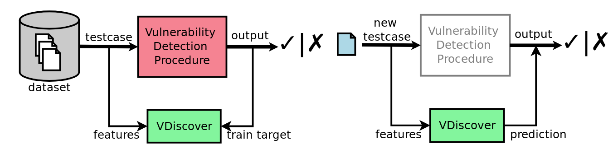

:slug: binary-learning/
:date: 2019-01-25
:subtitle: Learning to exploit binaries
:category: machine-learning
:tags: machine learning, vulnerability, exploit
:image: cover.png
:alt: Binary machine learning. Credits: https://unsplash.com/photos/h3sAF1cVURw
:description: In this article, we describe a system named VDiscover, created from the ground up to learn vulnerabilities in binary code without access to source. Their aims are to be scalable and lightweight so it would be applicable at the operating system level.
:keywords: Machine learning, Vulnerability, Exploit, Dynamic detection, Static detection, Security
:author: Rafael Ballestas
:writer: raballestasr
:name: Rafael Ballestas
:about1: Mathematician
:about2: with an itch for CS
:source: https://unsplash.com/photos/h3sAF1cVURw

= Binary learning

While our main focus, as stated
[inner]#link:../machine-learning-hack/[previously]#,
is to apply machine learning (`ML`) techniques to
the discovery of vulnerabilities in source code,
that is,
a _white-box_ approach to `ML`-guided hacking,
we've come across an interesting approach called
link:http://www.vdiscover.org/[`VDiscover`],
which is radically different in the following sense:

* Works on binaries. No source code required.
* Mixes dynamic and static detection.
* Guides [inner]#link:../infinite-monkey-fuzzer/[fuzzing campagins]#.
* Looks primarily for memory corruption.
* Is very lightweight, hence scalable.

But perhaps the most distiguishing design feature of `VDiscover`
is that it is trained and validated with test cases working on the same program,
unlike other approaches which
need to be trained with labeled samples of vulnerable code.
In a nutshell, you tell `VDiscover`
what happens when you fuzz the program with a certain input,
you tell it that it crashes with some other input,
and hundreds more inputs with their outputs,
to complete its _training_ phase,
and later it will be able to predict
which test cases are more likely to produce vulnerabilities
in the _recall_ phase.
This process can be depicted as follows:

.Training (left) and recall (right) phases of `VDiscover`. Taken from link:http://www.vdiscover.org/[their site].

In this diagram, _vulnerability discovery procedure_
means any of the [button]#link:../categories/attacks/[tests]#
we use daily to find security flaws, but especially
black-box [inner]#link:../infinite-monkey-fuzzer[fuzzing]# of binaries,
concrete [inner]#link:../symbolic-execution-mortals[symbolic ("concolic") testing]#
and [inner]#link:../pars-orationis-secura/[static]#
[inner]#link:../importance-pentesting/[analysis]#
[inner]#link:../replaced-machines/[tools]# which, while
prone to false positives,
can still be useful to generate test cases or
guide processes like this one.

Why use this tool if
I still need to run my tool of choice to
generate the test cases?
Running these tools is expensive,
in time, computating resources, human resources,
all of which translates to money as well.
Also it doesn't scale well to huge projects
like entire operating systems which
consist of tens of thousands of packaged binaries.
Why not just execute your test only on
a thousand of them and let
`VDiscover` predict the rest,
to later focus only on the ones which are more likely
to contain vulnerabilites?
Sounds like a good deal to me!

Such a _modus operandi_ is what makes `VDiscover` stand out
among its peers, besides the fact that it is a proper,
relatively mature open-source project,
while other `ML`-guided vulnerability detectors
are still in development or provide proof-of-concept programs.

Hence, in order to test `VDiscover`,
we need to choose:

  . A particular kind of vulnerability.
    They choose heap and stack memory corruptions.

  . A special vulnerability detection procedure.
    They chose simple, one `byte` at a time,
    [inner]#link:../infinite-monkey-fuzzer/[fuzzing]# of inputs.

  . A dataset. They chose one made up from 1039 taken from the
    link:https://security-tracker.debian.org/tracker/[Debian Bug Tracker].

  . The particular machine learning models to
    apply to the dataset, since `VDiscover` is designed to
    work with more than one of those.

This particular combination of vulnerability and detection procedure
has several advantages:

  . Both implicit and explicit hints to determine whether
    the vulnerability was triggered,
    like the stack protections provided by the
    link:https://www.gnu.org/software/libc/[`GNU` `C` library]
    which abort the execution, or the usage
    of functions like `strcpy` and `fread`.

  . It is an important kind of vulnerability unto itself,
    since they might allow the attacker to execute arbitrary code
    in the host machine.

However, in order to be able to recognize the hints
to memory corruption mentioned above,
first some features need to be extracted from the target of evaluation.
Dynamic features are taken from the execution of test cases,
while static features are extracted from the binary code itself.
This is extra information to enrich the dataset, to
"provide a redundant and robust similarity measure that
a machine learning model can employ to predict whether
a test case will be flagged as vulnerable or not"<<r1, ^[1]^>>.

They avoid building
[inner]#link:../exploit-code-graph/[graph representations of code]# altogether,
and instead settle on reading the
[inner]#link:../reversing-mortals[disassembly of the code]#
at *random*, but many times,
thus ensuring capturing pretty much all possible
sequences of standard `C` library calls.
On the other hand,
dynamic features is simply a set consisting of
a function call to the `C` standard library,
with its arguments, and the final state of the process
which may be exit, crash, abort, or timeout.

Onward to training the machines!
They used three different models: a
[inner]#link:../crash-course-machine-learning/#decision-trees-and-forests[random forest]#,
a link:https://en.wikipedia.org/wiki/Logistic_regression[logistic regression model],
which can be thought of a particular case of their third model, the
[inner]#link:../crash-course-machine-learning/#artificial-neural-networks-and-deep-learning[multilayer perceptron]#
The dataset was divided into three disjoint sets
for training, validation and testing,
preprocessed with a combination of [inner]#link:../natural-code[n-grams]#
and `word2vec` encoding,
and adjusted the training to compensate for
_class imbalance_ (an issue with data where
the interesting cases are too scarce amongst regular ones).

The concrete implementation was done in `Python`
using the
link:https://scikit-learn.org/[scikit-learn] and
link:https://github.com/lisa-lab/pylearn2/[pylearn2] libraries.
The most accurate classifier was
the random forest trained with the dynamical features only,
with a prediction error of 31%.
This high error, while not critical,
shows that there is plenty of room for improvement.
Still, these are good results for what is
apparently the only (up to its moment)
`ML`-guided tool for vulnerability research in binaries.
On the other hand, the results are not as spectacular
in terms of producing previously unknown vulnerabilities.
They merely tell us about possible memory corruptions
in particular pieces of code and
how likely they are to be exploitable.

Probable paths that the authors would have liked to follow
were to implement convolutional neural networks,
try different vulnerability discovery procedures,
and, perhaps more likely to be promising,
using tress representing the possible sequences of library calls,
the part that was done randomly in this study.
However, as was their purpose, they managed to show
that it is actually feasible to learn to search for
vulnerabilities in binaries at the operating sytem scale.

== References

. [[r1]] G. Grieco, G. Grinblat, L. Uzal, S. Rawat, J. Feist, L. Mounier (2015).
_Toward large-scale vulnerability discovery using machine learning_.
link:http://www.vdiscover.org/report.pdf[Technical Report].
The Free International Center of Information Sciences and Systems (`CIFASIS`),
National Council for Science and Technology of Argentina (`CONICET`).
